# To Do:
- [x] italicize all instances of i.e.
- [x] change I to 1 where appropriate
- [x] add to Github
- [x] insert rough copies of all images
- [ ] insert cleaned copies of all images

# Book
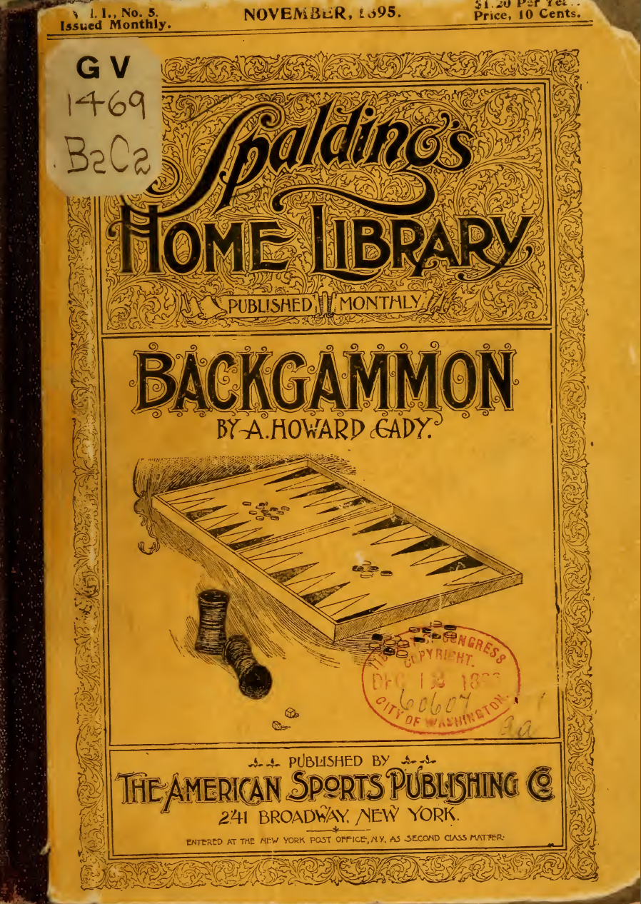

Spalding's
Home Library

Published Monthly

Backgammon
by A HOWARD CADY

Published By
The American Sports Publishing CO
241 Broadway, New York

Entered at the New York Post Office, NY. As Second Class Matter

# Backgammon.

A GLANCE INTO THE EARLY HISTORY AND DESCRIPTIONS OF
THE PASTIME, IN ITS VARIED AND PRIMITIVE
FORMS, AND A TREATISE OF THE
GAME AS IT IS PLAYED
TO-DAY.

BY
A. HOWARD CADY

BLACK.
Black's Inner Tabl. Black's Outer Table.

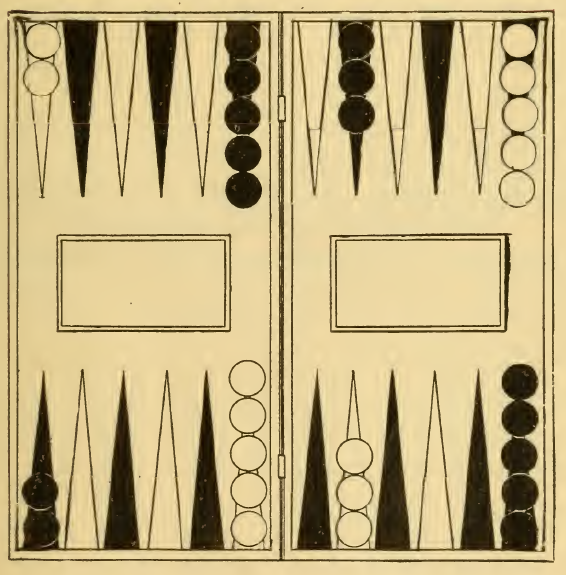

White’s Inner Table. White’s Outer Table.
WHITE.

WITH ILLUSTRATIONS.
PUBLISHED BY THE
AMERICAN SPORTS PUBLISHING COMPANY
241 BROADWAY, NEW YORK.

Entered according to Act of Congress, in the year 1895, by
The American Sports Publishing Co.,
In the office of the Librarian of Congress, at Washington.

## Table of Contents

- [Table of Contents](#table-of-contents)
- [Preface](#preface)
- [BACKGAMMON.](#backgammon-1)
  - [PART I.](#part-i)
  - [PART II.](#part-ii)
    - [ENGLISH BACKGAMMON.](#english-backgammon)
    - [LAWS OF BACKGAMMON.](#laws-of-backgammon)
    - [PROBLEMS ILLUSTRATING THE GAME.](#problems-illustrating-the-game)
    - [RUSSIAN BACKGAMMON.](#russian-backgammon)
    - [TURKISH BACKGAMMON.](#turkish-backgammon)
    - [OPINIONS AND AXIOMS.](#opinions-and-axioms)

## Preface

That "there is nothing new under the sun" is evidenced in
innumerable ways, and seems to be a more and more generally-
accepted fact, as each new epoch—I had almost said day—
brings to our notice some time-worn subject decked out in
fresh garb, but bearing, all the same, the mystical imprint of
past ages.

The new dress is not put on with the intent, much less effort,
to deceive us, but rather, let us assume, to revive our interest
in what we have become wonted to regard as hackneyed and
dull: hence, of no importance in this age of rushing progress.

Among the good old things which, according to tradition
and history, have existed almost since the world began is backgammon.

Of this famous pastime may be truly said:

> "Age cannot wither, nor custom stale
> Its infinite variety."

From the period of its invention, which many authors have
tried to trace back to the dark ages, it has held sway over
myriads of people of all nations and through different centuries, 
who have known it in its various and primitive stages, until
this present day, when, also, it is very generally played by its
modern votaries.

In this little volume it will be impossible to discourse a
length upon the numerous phases of the game as it first came
into existence, much less to explain just through what course
of evolution it attained its present status, for that seems to be
beyond human ken.

I shall try simply to give a brief synopsis of the origin and
progressive stages of this very fascinating pastime in its primitive
state, which, I trust, will interest the reader sufficiently to
arouse in him a desire for further investigation of the subject,
and also give the necessary treatise on the modern game.

Backgammon is so essentially a household game that it needs
neither introduction nor special recommendation, it seems to
me, beyond the suggestion to those who do not already know it,
to learn, and add it to their list of pleasant and instructive
diversions without delay.

Special thanks are due Messrs. Lane, Tylor and Morgan,
whose various works on backgammon among the Egyptians,
Aztecs and Iroquois, have afforded me genuine pleasure in
their perusal, and furnished data of intrinsic value, as also to
the editor of the "Hand Book of Games," Messrs. Berkeley,
Cavendish and others, whose admirable treatises and practical
guides to the modern game have been of great assistance in
this condensed compilation of instruction and information.

This game has ever been associated with the educated
classes, differing in that degree from "whist," which had its
day in the servants’ hall, and was, at one period, tabooed in
higher circles.

In this day of "leveling the masses," we may venture to
think the game will appeal to all intelligent people, and, further,
trust that no class distinction will interfere to prevent its
becoming popular with the world at large, and, finally, that
this little book will make its way into every house, and thus
add one more to the attractions of home.    A. H. C.

NEW YORK, NOV., 1895.

## BACKGAMMON.

### PART I.

IN ITS VARIED AND PRIMITIVE STAGES.

> "Man’s life’s a game of *tables*, and he may
Mend his bad fortune by his wiser play."

Of the innummerable drawing-room games in vogue, perhaps
none has a more mystifying, not to say bewildering, beginning
than backgammon.

There are so many conflicting accounts regarding its origin,
and the probable period, as well as place, of its invention,
that, almost in despair of arriving at the real facts, one is
tempted, at times, to give up the study, as each fresh research
but leads deeper into the mazes of antiquity.

Among these various theories is one which presents itself as
a plausible suggestion of the invention of the game. It is
that draughts (or checkers) were originally counters, such as
little stones, for instance, which were moved about on a calculation
board to reckon up the throws, and that it was an afterthought
to permit skill to take the place of moves.

Certain it is that the classic draughts were described always
as a stone (*calx* or *calculus*).

In Germany to-day, though now made of wood, their original
term *stein* (stone) is retained. The playing board, too, on
which the stones were shifted, shares the name of calculating
board—*abacus*.

There is a certain fascination about an investigation of this
kind which increases with every new phase of the subject
brought to one’s notice. One is almost in danger of forgetting,
or, at least, slighting the modern game, as the various characteristics
of the ancient or, more properly speaking, original
pastime, in its primitive form, holds fast the interest and
attention of the student.

Of course, with numerous other games of that period, the
invention of backgammon has been ascribed to Palamedes, of
Greece (about 1224, B. C.). There does not appear to be any
special proof, however, that he had anything to do with its
origin.

It is difficult to ascertain just what kind of backgammon
the Greeks played in the earlier ages; but from different writings
we gather that often, when they speak of *dice playing*,
they do not mean simply hazard, but a species rather of the
first-named game, where the throws of the dice are used to
direct certain and skilful moves of the pieces.

The manner of playing the men in classic backgammon can
be inferred from a Greek epigram of the fifth century, which
commemorates a wonderful hit in which Emperor Zeno got his
pieces so blocked that, having the bad fortune to throw 2, 5, 6
(at that period they used three dice, as, indeed, they continued
to do also in England in the middle ages), the only move which
remained open, forced him to leave eight blots.

In his "*Jeux des Anciens*," Becque de Fouquieres works out
this historic problem, as also other matters of Greek and Latin
backgammon, in a truly skilful manner.

Plato says: "As in casting dice, so ought we to arrange our
affairs according to the throws we get, as reason shall declare
best," while Plutarch, also moralizing on the subject, observes
"that Plato compares life to *dicing*, where one must not only
get good throws, but know how to use them skilfuly, when
obtained."

Persian backgammon, which they called *Nard*, is said to
bear a strong resemblance to tne European form of the game,
and there are those who claim even that it came from there in
the first place.

This game is very popular through the East, and "Orthodox
Moslems," we hear, "have seen in the fateful throws of the
dice a recognition of the decrees of Allah—that fall sometimes
for a man and sometimes against him."

Indeed, has it not been asserted by one that: "This is a
nobler game than chess, for the backgammon player acknowledges
predestination and the divine will, but the chess player
denies them like a dissenter!"

In Rome, among the Christian antiquities, there is a marble
slab, on which is cut a backgammon board, with a Greek cross
in the middle, and in the Greek tongue an inscription to the effect
"that Jesus Christ gives victory and help to dicers if they
write his name when they throw the dice, Amen."

Although roughly traced, as if by the untutored hand of some
stonecutter, it, nevertheless, shows that the board was similar
to the one now used, even to the division in the centre, separating
the two groups of six points on either side.

It is from Rome of ancient days, too, that we receive or,
better speaking, inherit the custom of making the double
board—the backgammon on one side and the draughtsboard on
the other. At least, good authority informs us that it was thus
the commentators interpreted Martial’s epigram on the *tabula
lusoria*. Here it is:

> "Hic mihi seno numeratur tessera punto
Calculus hic gemino discolor hosti perit."
>
> Here twice the dice is counted to the point,
Here ’twixt twin foes of other hue the draughtsman dies.

Certainly facts seem to point to the supposition that the game,
as we know it by the English nomenclature of backgammon,
and the more complicated French variation called Trictrac,
comes from the Roman pastime of "twelve lines" (*duodecima
scripta*), which was played throughout the empire, and of which
Ovid said: "It has lines as many as the gliding year has
months."

From Rome the game spread over Europe; its Latin name,
*tabulae*, easily transformed into English and French tables.
Chaucer confirms this, when he tells us that the early name of
backgammon was tables, at which period it was played with
three dice, and all the "men" began their action in the adversary’s
table. The title of "tables" dropped out of use in the
Elizabethan era.

Just how it came by its present name is, and always will be,
a disputed point. "La maison de Jeux Academiques" has
abandoned the settlement of this question as a hopeless task,
while De Henry tries to meet it by claiming its name as a
Welsh compound—from *back* (little) and *cammon* (battle).

Strutt and Bishop Kennett on their sides, however, furnish
deductions to seemingly prove its derivation from the Anglo-Saxon
"bac" (back) and "gamone" a game—*i.e.*, "a game
where players are expected to be sent back."

The backgammon games, of which there seem to be so many
varieties, may, for convenience sake, be divided into two
groups—lot backgammon and dice backgammon—one of which
is played with two-faced lots, which can only fall in two ways—
*i.e.*, "heads or tails," and the other with numbered dice.

It seems to be very generally assumed that lot backgammon
came first, and was followed by dice backgammon, which is
the European variety, and the one best known to-day.

In classic history, we find many plain indications of backgammon,
and the ancient Greek pastime called *Kubeia*, or
"dice-playing," is proven by numerous classical passages to
have been of this same family.

In Palestine and Egypt a species of backgammon called *Tab*
is played.

Writing of the "modern Egyptians," Edward W. Lane discusses
at some length the various games played by them, and
which he thinks especially suited to their "sedate dispositions."

He tells us, for instance, that they enjoy greatly *Satreng*
(known to us by the more familiar name of chess), *dameh*
(draughts), and *Tawulah* (backgammon or trictrac).

*Tab*, alluded to above, and which is the variety most extensively
played among the lower orders in Egypt, may be classed
under the head of lot backgammon. Incidentally, it may be
mentioned that this is known in other parts of the East as
"*Tabwa-dukk*," an elaborate nomenclature which Mr. Lane
says he never heard applied to it in Egypt.

For the *tab* variation of the game, four small pieces of stick,
of a flat form about 8 inches in length and two-thirds of an inch
in width, are first prepared. Usually, they are made of bits of
palm branch, one side of which, cut flat and smooth, is white,
the other green, or, when not fresh, yellow in tint; the first
side is called white and the other black, by way of distinguishing
them. They are called *tab*. The *seega*, upon which the
game is played, is a board, divided into four rows of squares,
called "*beyts*" or "*dars*," each about 2 inches in width.

Sometimes the board, or seega, consists of similar rows of
holes made in the ground, or on a flat stone. These beyts are
generally 7, 9, 11, 13 or 15 in each row.

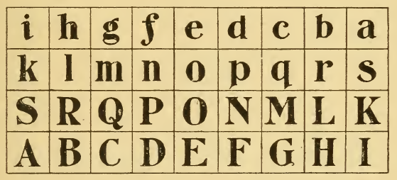

The above illustration shows a *seega* of nine *beyts* in each
row, distinguishing the *beyts* by letters; one side the capital,
and the other side, or opponent’s, the small letters.

The arrangement of the pieces is described as follows: "In
each *beyt* of one exterior row is usually placed a little piece of
stone or of dingy brick about the size of a walnut, and in each
*beyt* of the other exterior row a piece of red brick or tile, or
sometimes pieces are placed only in a certain number of *beyts*
in those rows, as, for instance, in the first four. The pieces of
one row must be distinguished from those of the other.

These pieces are called "*kilah*" (dog); in the singular, *kelli*.
The throwing of lots (*tab*), of course, and not dice, regulates
the moving of the men. They (the *tab*) are thrown against a
stick set up in the ground, and the throw counted according
to the number of *white* sides which come up. For example:

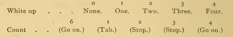

"There is evidently a crude attempt," says Mr. Taylor, "to
reckon probabilities, giving a higher value to less frequent
throws of all four whites and all four blacks than to two or three
white, which come oftener. Beside the high count, they have
the privilege of a second throw."

Incidentally, this latter fact is worthy of notice, as it
would seem to indicate that if, as seems generally admitted, lot
backgammon came first and was followed by dice backgammon,
that the former has given to the latter the rule allowing
doublets another throw.

The throw of one white, called *tab* (child)—*i.e.,* game, has
a peculiar power, for by it only can a *kelb* (dog)—*i.e.,* stone or
draught, be moved from its original position in the outer row
and put at liberty to circulate in the beyts. The *kelbs*, before
the removal from the original spot, are called *Nasara*
(Christians); *Nasaranee*, singular; but after this, when, as one
writer quaintly expresses it, they "go forth conquering and to
conquer," they are called *Muslimeen* (Moslems.)

According to Dr. Birch, no Egyptian dice have been discovered
earlier than the Roman era, nor any distinct allusion
either to backgammon. Therefore this game cannot prove a
claim to a place in the list of early Egyptian inventions; hence
the nearest relation to *tab* is probably Chinese backgammon,
though this latter is played with dice.

From Sanskrit titerature we learn that games similar to backgammon
were known in ancient India. Among them mention
is made of *Panchiko*, played with cowrie shells, and in which
it appears the winning throws were when all mouths came up
or down, as against the common throw, in which some fell each
way. Another game on the same order was also known there
which, according to the researches of Professor Weber, was
called *Ayanaja* (luck or unluck). At least, that was the expression
used in regard to the moving of the pieces which traveled
right and left through the squares, taking an unprotected man
from his place to begin his course anew.

To-day a species of backgammon known as *Pachisi* is
extremely popular in India. It can be played by two, three or
four persons, or by two pairs, the partners sitting opposite to
each other.

A cloth, with colored diagram, is most generally used as the
board, the zealous players, indeed, often carrying one rolled
round their turbans.

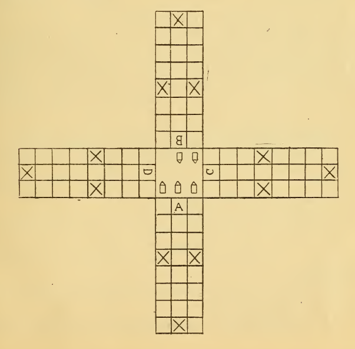

As seen from foregoing diagram, each of these four arms has
twenty-four squares, of which the three crosses on them are
called *chik* (forts).

The pieces played with are generally of turned wood or
ivory, resembling in shape the rifle bullet of the present day.
They are in sets of four, each of the players having one, all of
one color respectively, such as red, green, yellow or black.

The moves of the men are determined by the throw of the
cowrie shells, which count according to the number that fall
mouths upward.

The scoring resembies that of *tab*, and, when six cowries are
used, counts as follows:

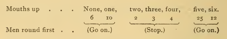

Mr. Taylor states that, after careful research into the Sanscrit
references and consultation with Professor Jolloy, of
Wurzburg, he is inclined to think that the game *Panchika*
already alluded to, and which is played with fine cowrie shells,
represents one of the earliest forms of *Pachisi*, which signifies
"five and twenty," derived, of course, from the fine cowries.
Both, as played with cowries and dice, games of the *Pachisi*
school are ancient in India.

A comparison of this Hindoo game *Pachisi* displays close
connection with Arab *Tab*. Still another game played in India,
and, like *Pachisi*, is called *Chupua*; in this variation the cowries
being superseded by a kind of oblong dice, numbered on
the four sides, but not at the ends.

The Indian *Pachisi* board has been introduced into England,
with four sets of four small draughts as the pieces and the ordinary
dice. In this form it most closely resembles English
backgammon.

From India to Madrid is a long journey, but in the tour of
search an interesting one.

In his charming paper on backgammon among the Aztecs,
Mr. Taylor gives a very interesting account of the game in
its primitive state in ancient Mexico, and from this we may
venture to cull a few items.

Long before Hernando Cortis landed with his army of Spanish
invaders at Vera Cruz, we are told, one variety of backgammon
had already found its way from Asia into Mexico, and
had become a very fashionable amusement at the babaric court
of Matizuma.

Among the various accounts of this Mexican game, known
there as *Patolli*, given by the Spanish chroniclers, the earliest
may be found in Francisco Lopez de Gomara's work—"La
istoria de las Indias y conquista de Mexico." As this was
printed in 1552, it is easy to surmise that it must have been
written while the conquest of 1551 was still fresh in his mind.

Gomara expresses himself thus: "Sometimes Montezuma
looked on as they played Patolli, which much resembles the
game of *tables*. It is played with beans, marked like one-face
dice, which they call *Patolli*. They take them between the
hands and throw on a mat or table, or on the ground, where
there are certain lines like a merrel (or a draughts-board), on
which they mark like stones the point which fell up, taking off
and putting on a little stone.

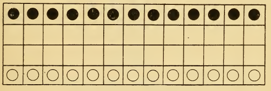

PATOLLI IN ANCIENT MEXICO

In his "Monarchia Indiana" (1616) Juan de Torquemada,
in part following this account, gives even more details, showing
the diagram which he describes to have been of the shape
of the *Pachisi* board, and the pieces of different colors.

He says of it: "They call it Patolli, because these dice are
called so; they throw with both hands on a thin mat
on which are made certain lines after the manner of a cross, [!]
and others crossing them make the point falling up (as in dice),
taking off or putting on little stones of different colors, as in
the game of tables."

In his "Historia Universal de las cosas de Nuova Espana"

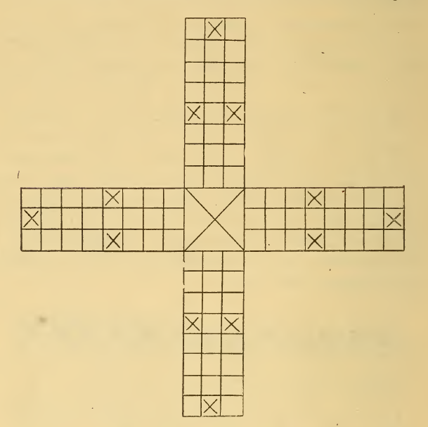

PATOLLI BOARD AS DESCRIBED BY TORQUEMADA,
SAHAGAN AND OTHERS.

Fr. Bernadino de Sahagan gives also a quaint description of the
game, explaining as well why it had ceased to be played some
time after the conquest, as follows:

"The lords for this pleasure also played a game called
*Patolli*, which is as the game of merello (or draughts), or the
like, or dice-playing, and there are four large beans, each having
a hole, and they throw them with the hands, as one plays
a knuckle bones, on a mat, where there is a figure drawn. At this
game they used to play to win precious things, such as gold beads
and precious stones, very fine turquoises. This game and that of
ball they left off, being suspicious, on account of some
idolatrous superstition in them. In another place, he further
says: "The second pastime was a game like dice; they made
on a mat a pointed cross, full of squares, like the game of
draughts, and, sitting down on the mat, they took three large
beans, with certain points made in them, and let fall on the
pointed cross.

To those interested in further research of this pastime,
delightful and, withal, exhaustive accounts, will be found in
old tomes, among which are especially recommended: Dalgo
Duran’s "Hist Indias," Clavigero’s "Storia Antica del Mexico"
Brasseur de Bourbourg's "Histoire du Mexique et de
l’Amerique Centrale," Father Joseph Ochs’ "Nachrichten von
Landern des Spanischen Amerika."

Summing up the descriptions of the various pastimes which
are classified as species of the game, in its primitive form, it is
evident that lot backgammon, as shown by *Tab*, *Pachisi* and
kindred diversions, spread over the Old World from Egypt,
across Southern Asia to Birma; and, as *Patolli* of the Mexicans
is a variety of lot backgammon, most closely resembling
*Pachisi*, and, possibly like this latter, passing into the variety
known as dice backgammon, its existence would seem to prove
that it had come across from Asia in the first place. Therefore
it can be numbered among the elements of Asiatic culture,
which are easily traceable in ancient Mexican civilization.
This, with the development in metal work, architecture,
astronomy, as well as political and religious institutions, seem
all to point to Asiatic influence.

From Patolli, or Patole, as the Egytians called it, we turn
instinctively to the Indian variety of the game, which may
be classified as another primitive form of backgammon with
which Mr L. H. Morgan, in his "League of the Iroquois" and
other writers have made us so familiar.

Of the pastimes which may be considered one of the national
games of the Iroquois race there appear to be two varieties:
*Gus-ga-e-sa-ta*, or deer buttons, and *Gus-ka-eh*, played with a
bowl and peach stones.

The former was strictly a fireside game, while the latter was
played in the public council house by a succession of players,
two at a time, and under the supervision of managers appointed
to represent the contending parties and watch the contest.

*Gus-ga-e-sa-ta* may be briefly described as being played with
eight buttons, about an inch in diameter each, made of elk
horn, and shaped like a double convex lens. They were
rounded and polished, and, furthermore, slightly burned on
one side to blacken them. A certain number of beans, fifty
perhaps, were made the capital, and the game continued until
one of the players had won them all. All the players remained
in their seats until it was determined.

The introduction of *Gus-ka-eh* among the Iroquois is ascribed
to the *Ta-do-da-ho*, who flourished at the time of the formation
of the League; and, we are told, a popular belief prevailed that
the game would be enjoyed by them in a future life, "in the
realm of the Great Spirit."

It was with them essentially a betting game, in which the
players were divided by tribes.

Through established custom of long standing, it was introduced
always as the final exercises on the celebration of the
*Green Corn*, the *Harvest* festivities and the New Year’s jubilee.

The implements of the game are described as follows: A
dish about a foot in diameter at the base and carved out of a
knot of wood or made of earth. The peach stones were then
ground or cut down into an oval form, reducing them in the
process about half in size, after which the heart of the pit was
removed and the stones themselves burned on one side to
blacken then.

The accompanying illustration shows the bowl and peach
stones, the latter in various positions, thus displaying the degrees
of their convexity.

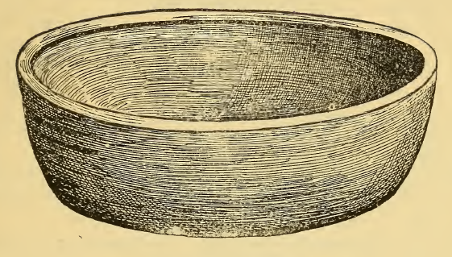

GA-JIH, OR BOWL

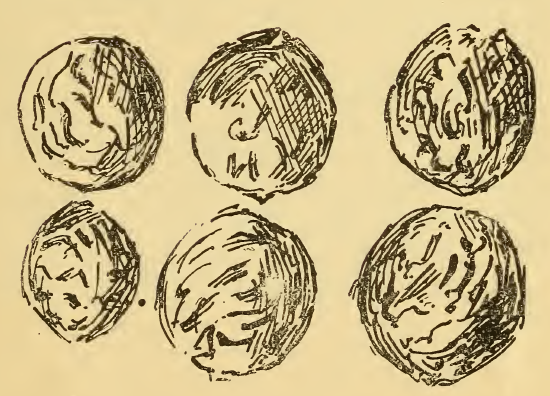

GUS-KA-EH

A platform erected a few feet from the ground was covered
with blankets. After the betting was closed—that sounds
quite modern !—and the articles had been given into the
custody of the managers, they seated themselves on this platform,
surrounded by a crowd of spectators, while the players,
two in number, sat down to the game between the two divisions
into which they arranged themselves.

The game was extremely simple, depending on the dexterity
of the player in a measure, though really more on luck.

The blackened peach stones were shaken in the bowl by the
player, the count depending upon the number which came up
of one color after they had ceased rolling in the dish.

The length of the game depended, to a certain extent, upon
the number of beans which made the bank—as a rule, this was
100—the victory being gained by the side which, in the end,
won them all. According to the laws of the game, each player
was permitted to retain his seat until he had lost his outfit—
*i. e.*, the number of beans, usually five, which were given to
each to begin with, after which he was obliged to surrender
it to another player on his side, and chosen by the managers of
his party.

Thus the game proceeded, sometimes even, when begun
about the meridian, taking another day to finish.

"It was necessarily a long game by its constitution,’’ Mr.
Morgan explains, "as it was so carefully guarded against the
extreme fickleness of most games of chance."

It is not necessary to enter into the details of the mode of
playing it, or the peculiarities and varieties of this pastime,
which bears certain and marked characteristics suggestive of
the modern and developed game of backgammon to which we
may now turn.

### PART II.

DESCRIPTION OF THE GAME AND GENERAL INSTRUCTIONS HOW
TO PLAY IT.

Of the recognized varieties of the game which prevail to-day,
three exist of a most interesting character, all of which, of
course, are played with dice and are called respectively, English,
Russian or *Tric Trac* and Turkish Backgammon.

#### ENGLISH BACKGAMMON.

To those unfamiliar with the game, a description of the implements
used therein is, perhaps, the first essential, as to
thoroughly understand it one must know what these are.

THE IMPLEMENTS.

The backgammon table is, as is very generally known, the
interior of the draughts (or checker) board. In form it is
square, usually made of leather, the borders of the same
slightly raised, and which, in fact, make the sides to the box
holding the draughts, while through the middle, where it is
divided, is a raised *bar* separating it into two tables, known as
the *inner* (or *home*) and outer tables.

These are marked with twenty-four points or fleches, colored
alternately black or white—or, as in the modern backgammon
board, red and black—six points in each section. The points
are sufficient in length to hold five pieces—or "men"—each,
the last one covering the end of the same.

These points are named as follows: That to extreme left in
white’s inner (or home) table, is called white’s ace point; the
next, white’s deuce point, and the others in turn *trois*, *quatre*,
*cinque* and *six* points.

The ace point in white’s outer table (No. 7), is called his *bar*
point, and the remaining five, *deuce*, *trois* *quatre*, *cinque* and
*six*, in their respective order.

The points in the opposite tables are named in the same way
for black.

The pieces or "men" are the same as those used for draughts,
save, that instead of twelve, fifteen of each color are required.

BLACK.
Black’s Home, or Inner Table.        Black’s Outer Table.

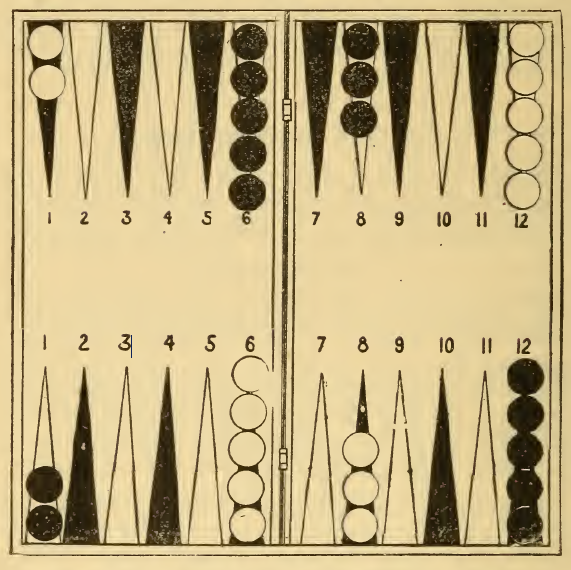

Red's Home, or Inner Table.        Red’s Outer Table.
RED.

It is customary to play toward the light; that is, make the
home (or inner) table the one nearest the window or lamp, as
the hour of the day demands.

The pieces can be reversed, making the outer table the inner
table or *vice versa*, as the light may require, although, really,
this is not compulsory.

There are two *dice boxes*, one for each player. They are
cylindrical in form, and closed at one end, and, as a rule,
slightly pressed in at the centre. In size, they are about four
inches long, and one and three-quarter inches across at the
broadest part. Usually, they, like the board, are of leather.
The interior of these little cylinders is grooved with concentric
circles.

There are two dice only—called a *pair*—which are used by
both players in turn. They are made of ivory and marked with
a number on each face, from one to six, and so placed that the
dots on the opposite sides, when added together, make seven.

The numbers are named in this wise: Ace, Deuce, Trois, or
Trey (doublets, Treys), Quatre, Cinque, and Six, or size
(doublets, sizes).

THE TECHNICAL TERMS.

*Bar*—The line which divides the box.
*Bar-point*—The point next the bar.
*Blot*—A single piece—or "man"—on a point.
*Backgammon*—W inning the entire game.
*Bearing the Men*—Taking them off the table.
*Doublets*—Two dice with the same number of dots, as two
aces, deuces, etc.
*Gammon*—Two points won out of the three which constitute
the game.
*Getting Home*—Bringing one’s men from the adversary’s
tables into one’s own.
*Hit*—To remove all of one’s men before the opponent has
done so.
*Home*—The inner table. a
*Making Points*—Winning hits.
*Men*—The pieces: *i. e.*, checkers or draughts used in the
game.
*To Enter*—To replace a piece in the table after it has been
excluded through a point (or fleche) being already full.

THE GAME.

The game is played by two persons, occupying opposite positions
to one another at the board.

If the home tables are to be on the left, the pieces will be
played as follows: White will place two men on the opponent’s
ace point, five on his twelfth (or No. 6 outer table),
three upon his own eighth, and five upon his sixth point.

Black’s pieces will be played in corresponding order directly
opposite.

The position of the pieces upon the board at the beginning of
the game is shown in Diagram No. I. on page 13.

THROWING.

Each player then takes a dice box, shaking one die in it,
with two of his fingers placed across the opening to prevent
the die falling out. The shaking is followed naturally by the
die being thrown (cast) somewhere in the centre of the board
between the two rows of points. The player who has thrown
the higher number has the first play, it being optional with
him to adopt the numbers already thrown or taking up the pair
of dice and casting again.

PLAYING.

A player in throwing the dice should always call out the
numbers shown on the faces of the same. For instance, if he
throws a five, two, he says "Cinque, deuce"; or four, three,
"Quatre, trey," etc., etc., the higher number being named
first.

This step made, the game is begun by his moving any one of
his men to an unoccupied point, technically known as "open"
point, according to the distance indicated by one of the dice, and
another man to some other point, as shown by the number on the
second die. If he prefers—this is also optional—he can move
the first man still further on, as directed by number on second
die, rather than touch another one. This completes the move.

The game thus started proceeds in the usual manner, the
players throwing and moving alternately.

The object of the game is for the player to move the men
from point to point, as the successive numbers on the dice
thrown indicate, and from the opponent’s home (or inner table)
into his outer table, thence into his own outer table, and,
finally, over the bar into his own home (or inner table).

This is technically known as "carrying the men."

It is understood, of course, that both the white and the black
pieces are moved in the same way—only in opposite directions.

As previously stated, one piece can be played the whole
throw—*i. e.,* the number on both of the dice, or one man, one
of the numbers thrown, and the other man, that on the second
die. For example: White may move quatre deuce by carrying
one man from the sixth point in black’s outer table to his own
bar point (No. 1 of his outer table), or, again, he can play (or
move) a man from the deuce point of his outer table to his
quatre point, and the second from his six to his quatre point.

When the men are played after the latter method, so as to
occupy a previously blank point, with two men, it is termed
*making a point*.

Should white, on the contrary, play any other of his men in
the same manner, as, for instance, one from his outer table to
his six point, and any other, four points, the latter will remain
on a point by himself, and this is termed *leaving a blot*.

If two similar numbers are on the face of the dice, they are
called "doublets," and the player is entitled to double what
he throws. Example: Aces, four points, instead of two, and
so on for all the other doublets. Berkeley gives the following
clear and interesting illustration, which covers. of course, the
highest throw:

"Double sixes entitles the player to 24 points, and may be
played in any of the following ways: (a), one man, 24 points;
(b), one man, 18 points, and the other 6 points; (c), one man, 12
points each; (e), four men, 6 points each, provided he does not
go beyond his ace point, nor play on any point occupied by his
adversary, *i. e.,* a point on which there are two or more men
belonging to his adversary."

If, however, all the points shown by the throw of the dice are
already covered by the opponent’s men, the moves are lost.
Example: If trey doublets are thrown, and the first third point
from all the player’s men is occupied by two or more of the
opponent’s men, the play is lost, although the six, ninth, and
twelfth points are uncovered.

While the first player (whom we will call white by way of
distinguishing the sides) is moving, the adversary (black) may
put the dice in his box and shake them, that thus, when the
first named player has finished his play—or moves—the latter
may throw, call his throw and play it.

THE RESTRICTIONS IN PLAYING.

The only restrictions in playing are: The player cannot play
(I) beyond his own home table, nor (2) on any point
already in possession of his adversary, *i. e.,* occupied by two or
more of the latter’s men.

For instance, if he throws six ace, he cannot play a six from
his six point, or an ace from his opponent’s twelfth point. He
can, however, play a seven to his six point from the opponent’s
twelfth, because his bar is open, although his twelfth is in possession
of the opponent.

Any part of a throw which cannot be played is lost; but the
player *must* play the entire throw when he can. For example:
A player throws trois ace, and the men are so placed that he
can play either trois or ace points, but not both, therefore he
must decide which seems preferable and move accordingly; but
if, by playing the ace first, he can play the trey afterward, he
must do so.

HITTING A BLOT.

When, as will happen during the progress of a game, one
man alone is left on a point it is called a *blot*, and is thus exposed
to the hit of the adversary, who endeavors as a rule to
do this by leading one of his own men to that point. The man
hit is removed immediately and placed on the bar (the division
between the boards), and the player to whom it belongs
cannot play again until the man is entered. This is accomplished
by the throw of a number which enables him to enter
the blot on an unoccupied point in the opponent’s home
table and playing it from a point of the board adjoining the
opponent’s ace point.

Naturally, the man cannot be entered on any point already in
possession of the opponent. For instance, if the points answering
to the two numbers thrown are occupied, or if doublets are
thrown, and the corresponding point is occupied, of course the
player who has a man "up" cannot enter him.

As the game draws to an end, and most of the points in the
adversary’s home (or inner) table are *covered*—that is,
contain two or more men—it grows difficult to enter; but the
player has no option in the matter; he must simply wait until
the right number comes up, or until other points are exposed
by the opponent having played some of his men up or borne
them off the table. [^1]

Two or more blots can be taken up at the same time, or in
successive throws. "Hitting a blot" often lends zest as well
as variety to the game.

It is never compulsory to hit a blot if the throw can be played
without touching the point on which it rests. Example: A
player throws quatre deuce, and wishes to play (move) a piece
two points distant from the blot. If he is able to play the
quatre first and the deuce afterwards he is not obliged to
take up the blot.

BEARING.

The game proceeds as already described until one of the
players has carried all his men into his home (or inner) table.
Directly this is done, he has the privilege of taking his men off
the board, technically called *bearing*.

For every number thrown a man is removed from the corresponding
point, or, if the player prefers, it may be played up; 
if, however, it is impossible to play up a man, it must be 
"borne."

[^1]: N.B.—When all six points are blocked, it is useless for the player to 
throw, and his adversary, therefore, may continue to play until he opens a
point in his home table.

Suppose his home table to be made up, and he throws cinque
dleuce, he bears one man from his cinque and one from his
deuce point; or, he may, if he prefers it, play a cinque from
his six-point and a deuce from his six, cinque, quatre or trey
point; or, again, he can play one and bear the other. If he
cannot play any part of the throw he must bear it—for instance,
if he has no man on his six or cinque points, he must bear the
quatre.

If a number is thrown which is higher than any point on
which there is a man, then the player must bear a man from
the highest point occupied. Example: If a six is thrown and
there is no man on the six point, the player must bear from his
cinque point, or, if that, too, is unoccupied, from his quatre
point, or, again, if that also is empty (unoccupied), from his
trois point, and so on.

If the player throws cinque ace, and has no man on his
cinque, he can, if he wishes, play up an ace from his cinque
point and bear the cinque from his quatre point. If, on the
contrary, the player throws an ace, and his ace point is unoccupied,
he may play up the ace.

Here, as in the earlicr stage of the game, doublets entitle the
player to play up, or bear, four men.

If, after the player has begun bearing his men, he hits a blot
he must enter on his adversary’s inner table, and he cannot
bear any more men until this one taken up has been carried into
his own inner table.

In bearing, should the opponent be waiting to enter any of
his men which have been hit, care should be taken to leave no
blot or unprotected point.

The player who first bears all his men wins a hit, or single
game, provided, of course, that the adversary has borne off any
of his men.

It is a *gammon*, or double game, when the player has borne
all his men before his adversary has borne any. It is a triple
or quadruple game (according to previous arrangement or
agreement between the players), or *backgammon*, when the
winner bears his last man before the adversary, not having
borne any men, has carried all his men out of the winner’s
tables.

Should a player, having borne a man, be taken up, he can
only lose a hit, even if he fails to enter the man before the adversary
bears all his.

When a number of games are being played the winner of a
hit has the right to the first throw in the new game; but if a
gammon or backgammon is won, then the right to first play in
the succeeding game is decided by the throwing each of a
single die, etc., as already described.

TACTICS AND GENERAL INSTRUCTIONS.

I. At the beginning of a game at backgammon the player’s
chief object should be, first, to secure his own or his adversary’s
cinque point, or even both; second, when these points
are secured, to play a pushing game, and try to gammon the
opponent.

II. The next best point, after the cinque point in the home
table is secured, is the bar-point, thereby preventing the adversary
from running away if he throws double-sixes.

III. When the player has secured these, he should prefer to
make a quatre point in his own inner table, rather than quatre
point out of them.

IV. Having gained this point, there is a good chance of
gammoning the adversary, more especially if he is very forward.
To accomplish this, however, it will be necessary to
vary the game, according to circumstances. Suppose the
opponent’s inner table is very ragged; it will be to the interest
of the player to open his bar-point in the hope of compelling
the adversary to run out of this inner table with a six, and
leave two blots, Then, if his men are properly spread; *i. e.,*
not crowded on any one or more points, he cannot only catch
the man (or piece) the adversary brings out, but also have a
good chance of taking up the men left behind. But if the
adversary has a blot in his inner table, it will then be advisable
not to make up his own table, etc., but have a blot in it; and
if taken up himself, he will have the probability of getting a
third man, which will return a gammon quite probable.

V. If not anxious to win more than a hit, the player should
endeavor to gain his own or the adversary’s cinque point; and
if he fail in this, through being hit by the opponent, who is
also more forward than himself, he must play a bold game.
Thus, place a man on his cinque or bar-point, and if the adversary
fails to hit it, then cover; *i. e.,* place another piece on the
one already there, the blot, himself, and play a forward game
instead of a back one.

If, on the contrary, the blot is taken up, a back game must
be resorted to, and the greater number of blots offered and
taken up, the better. 

It should be the endeavor of the player in this event to gain
or hold his opponent’s ace and deuce points, or ace and trois
points, and if possible to keep three men on his ace point, so
that if he hit a blot from there he still has the ace point
guarded.

The best play for every possible throw at the beginning of
the game, as given by Hoyle, confirmed by Cavendish and
others, is as follows

TABLE No. I

1. Two aces are to be played on the cinque point and bar
point for a gammon or for a hit.

2. Two sixes to be played on the adversary’s bar point and
on the thrower’s bar point for a gammon or for a hit.

3. Two trois to be played on the cinque point, and the other
two on the trois point in his own tables, for a gammon only.

4. Two deuces to be played on the quatre point, in his own
tables, and two to be brought over from the five men placed in a
the adversary’s tables, for a gammon only. 

5. Two quatre to be brought over from the five men placed
in the adversary’s tables, and to be put on the cinque point in his
own tables for a gammon only.

6. Two cinque to be brought over from the five men placed
in the adversary’s tables, and to be put on the trois point in his
own tables, for a gammon or for a hit.

7. Six ace, he must take his bar-point for a gammon or for a
hit.

8. Six deuce, a man to be brought from the five men placed
in the adversary’s tables, and to be placed in the cinque point
in his own tables, for a gammon or for a hit.

9. Six and trois, a man to be brought from the adversary’s
ace point, as far as he will go, for a gammon or for a hit.

10. Six and quatre, a man to be brought from the adversary’s
ace point, as far as he will go, for a gammon or for a hit.

11. Six and cinque, a man to be carried from the adversary’s 
ace point, as far as he can go, for a gammon or a hit.

12. Cinque and quatre, a man to be carried from the adversary’s
ace point, as far as he can go, for a gammon or for a hit.

13. Cinque trois, to make the trois point in his table, for a
gammon or for a hit.

14. Cinque deuce, to play two men from the five placed in
the adversary’s tables, for a gammon or for a hit.

15. Cinque ace, to bring one man from the five placed in the
adversary’s tables for the cinque, and to play one man down on
the cinque point in his own tables for the ace, for a gammon only.

16. Quatre trois, two men to be brought from the five placed
in the adversary’s tables, for a gammon or for a hit.

17. Quatre deuce, to make the quatre point in his own
tables, for a gammon or for a hit.

18. Quatre ace, to play a man from the five placed in the adversary's
tables, for the quatre; and for the ace, to play a man
down upon the cinque point in his own tables, for a gammon only.

19. Trois deuce, two men to be brought from the five placed
in the adversary's tables, for a gammon only.

20. Trois ace, to make the cinque point in his own tables,
for a gammon or for a hit.

21. Deuce ace, to play one man from the five men placed in
the adversary’s table, for the deuce; and for the ace, to play a
man down upon the cinque point in his own tables.

22. Deuce trois, two of them to be played on the cinque point
in his own tables, and with the other two he is to take the
quatre point in the adversary’s tables.

23. Two deuces, two of them are to be played on the quatre
point in his own tables, and with the other two he has to take
the trois point in the adversary’s tables. By playing these two
cases in this manner, the player avoids being shut up in the
adversary’s tables, and has the chance of throwing out the
tables to win the hit.

24. Two quatre, two of them are to take the adversary’s
cinque point in the adversary’s tables, and for the other two,
two men are to be brought from the five placed in the adversary’s
tables.

25. Cinque ace, the cinque should be played from the five men
placed in the adversary’s tables, and the ace from the adversary’s
ace point.

26. Quatre ace, the quatre to be played from the five men
placed in the adversary’s ace point.

27. Deuce ace, the deuce to be played from the five men
placed in the adversary’s table, and the ace from the adversary's
ace point.

The last three chances are played in this manner because, an
ace being laid down in the adversary’s tables, there is a
probability of throwing deuce ace, trois deuce, quatre trois, or
six cinque, in two or three throws, either of which throws
secures a point and gives the player the best of the hit.

VI. If it seems inadvisable to spread his pieces, the player
should try to escape with one or other of his distant men.

VII. When compelled to leave a blot, the player should do
do so where there is the least chance of its being taken by the
adversary

The following table, arranged by Berkeley, it will be seen
differs somewhat from that of Hoyle, with which the majority
of players are familiar. He draws special notice to the error
in Hoyle’s famous table, as also attention to the fact that he
has added "the last five long ranges," etc.:

TABLE No. II.

Giving the odds against being taken up, or hit on any number
within the reach of single or double dice.

VIII. The player must guard against crowding his game at
any time; *i. e.,* getting four or five men on any point, but more
particularly is that to be avoided on the deuce and trois points
in his home table.

IX. In entering a man which it is the adversary’s advantage
to hit, the player must have the blot on the lowest point he
can; for instance, ace point in preference to deuce point, and
so on, for if the adversary hits him it will crowd the former’s
game, compelling him to play on his low points. N. B.—The
player must avoid carrying many men on the low points in his
own table, as these men are out of play, and the board is thus
left open to the adversary.

X. It is often good play to take up a blot of an opponent and
leave one of one’s own in its place, if he cannot hit it in return,
save with double dice—*i. e.,* by throwing a number over six, as
the chances are 5 to 1 against his doing so. When playing only
for  a hit, and two of the adversary’s men are already up, this
should be avoided, as it is always a risk.

XI. At the beginning of a game or rubber, the player should
not play for a "back game’’—*i. e.,* exposing of blots unnecessarily
and otherwise waiting for the adversary to make blots,
for by this method a great risk is run in the chance of losing a
gammon in trying to win a hit.

XII. There are two chief reasons for playing a back game:
(1) If the adversary has been throwing very high, hence is as
forward that the other player has no chance of winning a hit
unless he can obtain a good home table and hit a blot of the
opponent, then the wisest policy seems to be to leave blots for
him to take up, and to keep his two men in the adversary’s
table as long as he can. (2) If the player is so hemmed in the
adversary’s table that escape seems hopeless, then, in such a
position, he should at once leave blots, as four men securing
two separate points in the adversary’s table, particularly should
they happen to be his quatre and deuce points.

From these hints on back play two obvious conclusions may
be drawn: First, it is best to block the antagonist without
delay, and thus force him to play a back game, thus to risk a
gammon or gain a hit; second, a player should never take up,
unless obliged to, blots purposely left by a skilful antagonist,
since, if it is good play to leave blots, it cannot be to his
advantage to take them up.

XIII. In carrying men home, the player should carry the
most distant man to the adversary’s bar point, next to the six
point in his own outer table, and, finally, to his own six point
in his inner table.

By following this rule as far as the throws admit, it will be
seen that the men will be carried home in the fewest possible
number of throws.

XIV. When one player is bearing his men, and the other
has two men on a low point in the first one’s table and several
in the outer table, it is well to leave a blot there, thus preventing
him from bearing his men to the greatest advantage, and
also gives the second player a chance of hitting him if he leaves
a blot. If, however, on calculation, the second player finds
that he can probably save the gammon by bringing both of his
men out of the adversary’s table, he should wait for a blot.

XV. When a set, *i. e.,* three games up of the best of five, is
played at backgammon, the odds, according to Berkeley, are
as follows :

When A has won 1 game, B none, it is 3 to 2 on A.

When A has won 2 games, B none, it is 3 to 1 on A.

When A has won 2 games and B 1, it is 2 to 1 on A.

Backgammon offers so-many problems regarding the manner
of meeting its varied throws and intricate calculations, that one
might continue indefinitely to make suggestions and descant
on its probabilities, but the foregoing hints will, let us hope,
meet the general requirements of the game. Practice only
can make the player thoroughly conversant with its methods.

In the following 

CALCULATION OF CHANCES,

as given by Hoyle in the first place, and generally adopted by
the writers of this day, valuable information will be found:

On the two dice there are thirty-six chances. In these
thirty-six chances the points are:

Thus we see that 294 divided by 36 gives 8 and a little more as
the average throw with two dice.

The chances upon two dice are calculated as follows:

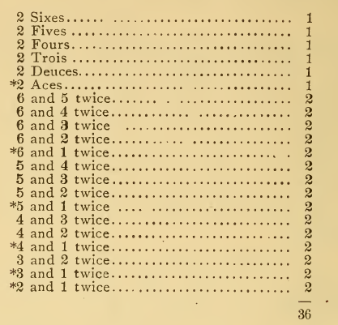

In order to find out by this table of thirty-six chances what
are the odds of being hit upon a certain or flat die, the player
must consult the following table where marked with an asterisk:

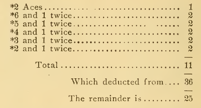

By this calculation it appears it is twenty-five to eleven
against hitting an ace upon a certain or flat die.

This method holds good with respect to any other flat die as
with the ace. For instance, What are the odds of entering a
man upon the points 1, 2, 3, 4 or 5?

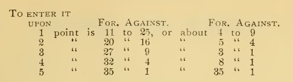

The following table shows the odds of hitting with any chance
in the form of a single die:

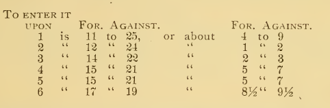

The following table shows the odds of hitting with double
dice:

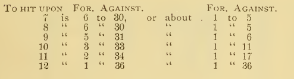

The following table is given in order to show the odds of
hitting upon a six in a table of thirty-six chances:

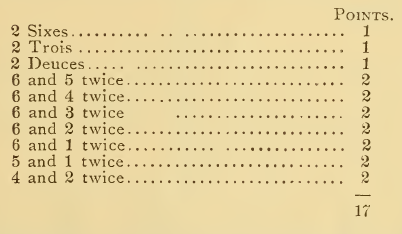

Deduct this 17 from 36, the number of chances upon two dice,
and we have 19. From this table, then, we find that it is 19 to
17 against being hit upon a six.

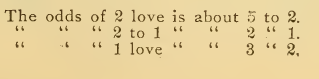

#### LAWS OF BACKGAMMON.

FURNISHING THE BOARD.

1. If a player places his men wrongly, the adversary, before
he throws a die, may require the board to be properly furnished.

2. If a player does not place all his men before he throws a
die, he cannot place those he has omitted.[^2]

THROWING.

3. The dice must be thrown in one of the tables. If a die
jumps from one table to the other, or off the board, or on to
the bar or frame, the throw is null and void, and the caster
throws again.

4. If one die rests on top of the other, or tilts against the a
other, or against a man, or against the bar or frame, the throw
is null and void, and the caster throws again.

5. If a die is touched while rolling or spinning on the board,
the player not in fault may name the number that shall be
played for that die.

6. If a die, even when at rest, is touched before the caster
has called his throw, and the throw is disputed, the player not in
fault may name the number that shall be played for that die.

7. The caster must abide by his call if the dice are subsequently
touched.

8. If the caster touches one of his own men he must play it,
unless, prior to touching it, he intimates his intention of ad-
justing it. If an adverse man, or a man that cannot be played
is touched, there is no penalty.

9. A man is not played until it is placed on a point and
quitted.

10. The caster must play the whole throw if he can; in
bearing, if a man is played, and another man or the same man
is then borne from the highest occupied point, the highest
number thrown is deemed to be borne.

[^2]: It is a disadvantage to play with too few men.

11. If a wrong number of points is played, the adversary
may require the right number to be played, but he must do so
before making his next throw.

BEARING.

12. If a man is up and others are borne before the one up is
entered, the men so borne must be entered again, as well as
the man taken up.

#### PROBLEMS ILLUSTRATING THE GAME.

Taken from Berkeley.

No. I.

BLACK, OR B.

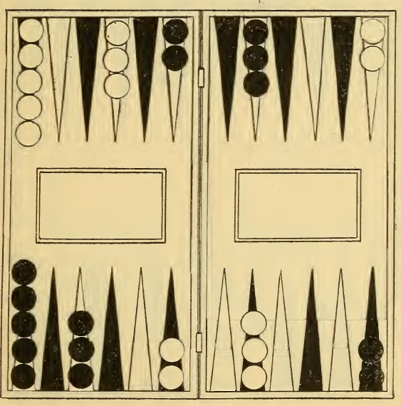

WHITE, OR A.

Suppose the men to be placed as shown in this diagram, who
has the better game, A or B?

A has, because he ought to play. if possible, an ace or deuce
from B’s ace point in order to take possession of B’s deuce or
trois point, or both. as occasion may offer; and, since he is
already in possession of B’s quatre point, he may easily bring
these men away, if he finds it necessary, and he will also have
a resting place by the convenience of that point, which at all
times during the game will give him an opportunity of running
for the hit or staying to worry B, if he thinks proper, whereas,
B cannot so readily come from A’s trois point.

No. II.

BLACK, OR A.

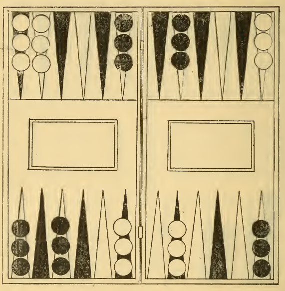

WHITE, OR B.

With the men arranged as in preceding diagram, who has the
better game, A or B?

A; because the ace and trois points in the adversary’s table
are not so good as the ace and deuce points, because when
bearing his men, the deuce point often saves him from making
a blot, which is almost certain to happen if the opponent (B)
has possession of A’s ace and deuce points. A should further
endeavor to be hit as often as possible, to keep his game backward,
and for the same reason should refrain from hitting any
blots B makes.

No. III.

BLACK, OR A.

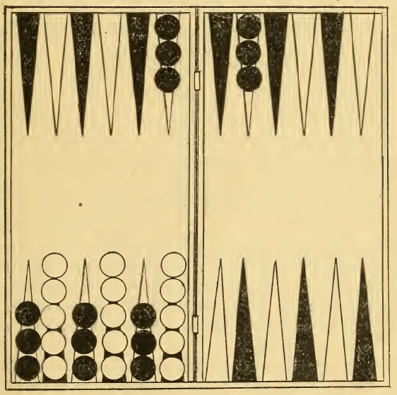

WHITE, OR B.

Who has the better of the Hit, with the men in position
shown in above diagram?

It is anybody’s game; but the difficulty lies with B, who in
the first place should endeavor to gain his cinque and quarter
points, and when that is effected, he should play two men from
A’s cinque point, in order to oblige A to leave a blot, if he
should throw an ace. Should B be successful in capturing one
of A’s men he will have the better of the Hit.

#### RUSSIAN BACKGAMMON.

This variety of the game is played with the same implements
as English Backgammon.

BLACK.

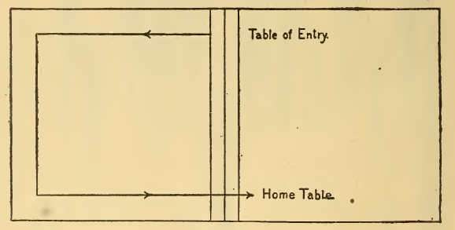

The board is not furnished at starting; but both black and
white (or red and black) men are entered in the same table—
by throws of dice—and the march of both sets of draughts is in
the same direction, viz., from any table chosen—one of the
minor tables—on which they are entered, through the other
tables to the home table.

If the upper right hand—which in this instance would seem
to answer to black’s outer table—then the march of the men is
as shown on diagram. Again, should the table marked Home
be chosen, then naturally the march will be in the opposite
direction.

A player is not obliged to enter all his men before he plays
any, and he may take up blots, even if some of his men have
not been entered.

Should a player be taken up, he is obliged to enter the captured
"man" before playing any other already entered.

A player who throws doublets is not only entitled to, but
bound to use (or "play") the doublets thrown, and also the
complimentary ones, *i. e.,* the corresponding doublets on opposite
faces of the dice. Example: He throws sixes, therefore
must first play four sixes and then four aces, and in addition
he has another throw.

This privilege given to doublets is not, however, allowed
to either player when he throws his first set of doublets in the
game.

No player is permitted to play the "complimentary" doublets
until he has completely used the doublets thrown, and, furthermore,
he has no right to another throw until he has played
both sets of doublets—*i. e.,* those thrown and the corresponding
ones.

The privilege is given of allowing the caster a a deuce, ace,
to choose any doublets he likes on opposite faces of the dice,
and to throw again. The restriction with regard to first
doublets does not apply to deuce, ace, and this throw does
not count as doublets; hence does not remove the restriction
regarding first doublets.

Sometimes, if a player cannot complete his throw, or any
part of it (whether doublets or not), it is agreed that the
opponent shall play the remainder of it with his own men, moving
only one at a time. If, however, in so doing the opponent
leaves a blot which opens a point on which the first player (or
caster) can play, this latter comes in and continues his play by
taking up a blot.

If then, the first player can complete his throw, and has
thrown doublets, or deuce, or ace, he throws again; but, if he
cannot complete it, or if the opponent completes, he may not
throw again.

If neither of the players can play any part of, or complete a
throw, the remainder of it is lost, and in the case of doublets,
deuce or ace, the caster (or first named player) does not throw
again. In other respects, the game is similar to ordinary backgammon.

Owing to the rather complicated nature of this arrangement,
many players prefer to omit the continuation of play by the
opponent as described above, while others again, will not play
the game at all, remaining steadfast in their allegiance to the
English variety of the pastime.

The chief object of this variation, so popular in Russia,
Germany, and on the Continent generally, is, that the player,
who has his men in advance, shall hold as many successive
points as possible, to prevent the opponent from hitting or pas-
sing the forward men.

#### TURKISH BACKGAMMON.

This variation differs from both the English and Russian
game, and is considered by many more interesting than either
the others.

The lead is determined as in the other varieties of Backgammon.

The player who has the lead begins by placing two of his
men (or pieces) on what would be the first point in the Russian
game, thus the two points in entering count one, until he has
fully entered the table. The sixth point extends one beyond,
until the player is able to move out the two men first placed,
and this cannot be done until all are in.

The player cannot cover a point while entering.

He is not allowed to make a point beyond the twelfth point
until that is covered, and none this side (inner table) until he
has fully entered all his men. After this he advances much as
he would in the Russian variation.

The player who throws doublets can use, not only the doublets
thrown, but also the corresponding doublets on the opposite
side of the dice. This, however, is not obligatory, as in
the Russian variety, and therefore is not always done, as, prior
to beginning of the game, the players agree often to use (count)
only the face value of the doublets. This makes the game
more equal.

The player, after covering the twelfth point, may come into
the opponent’s table, pointing there and interrupting his
entrance.

After moving out the first two placed in his table, the player
goes back to the Russian, counting first point one up to the sixth.

The game will be found very intricate, hence move absorbing,
as it proceeds; the player is frequently misled into believing
that he has the advantage, when, suddenly, he discovers
that he is beaten.

In the foregoing pages, it has been out of the question, of
course, to illustrate extensively, either by word or drawings,
the ever-varying probabilities of the game, which a thorough
study of the subject suggests.

It is hoped, however, that both historically and technically,
this condensed treatise has so clearly outlined the various
phases of Backgammon, as to be perfectly comprehensible to
the student, and that it will, furthermore, prove of sufficient
interest, to incite him to a more profound investigation of the
same.

#### OPINIONS AND AXIOMS.

"It is only persons of consequence who play at backgammon,
and those only who are the most quick witted, ready and
watchful can ever thoroughly master it," says an old French
writer.

"Even whist has not escaped defilement; but backgammon
was never a vulgar game; never beloved by lackeys."’

A Sanskrit riddle, apropos of an ancient form of backgammon:

"In a house where there were many, there is left but one, and
where there was none, and many came, at last, there was none.
Thus Kala and Kali, casting day and night on a pair of dice,
play with human pieces on the board of the world."

%% The rest of the book is advertisements. Could be interesting to render as images and include for complation's sake. %%