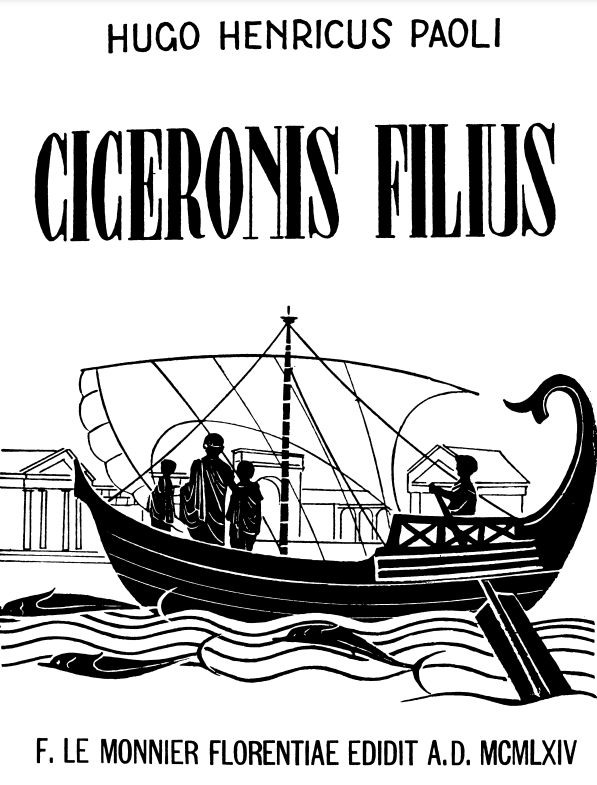

# Ciceronis Filius
---

HUGO HENRICUS PAOLI

CICERONIS FILIUS

F. LE MONNIER FLORENTIAE EDIDIT A.D. MCMLXIV

---

HUGO HENRICUS PAOLI

CICERONIS FILIUS

*puerilis narratio*
*ad domesticos Romanorum mores illustrandos*
*in usum scholarum*
*redacta*

*Editio sexta*

F. LE MONNIER FLORENTIAE EDIDIT A. D. MCMLXIV

---

Prima edizione, Dicembre 1958
Seconda edizione, Agosto 1959
Terza edizione, Gennaio 1960
Quarta edizione, Ottobre 1960
Quinta edizione, Ottobre 1961
Sesta edizione, Gennaio 1964

*Edizione francese* (con note e vocabolario) (Parigi, O. C. D. L.)
Prima edizione, 1960
Seconda edizione, 1964

*Edizione tedesca* (Berna - Monaco, Francke)
Prima edizione, 1960
Seconda edizione, 1961

*Edizione americana* (New York, Noble and Noble)
Prima edizione, 1960

*Edizione inglese* (con note e vocabolario) (Londra, Longmamus)
Prima edizione, 1963

PROPRIETÀ LETTERARIA RISERVATA

(C) COPYRIGHT 1964 BY FELICE LE MONNIER — FIRENZE
PRINTED IN ITALY

per la Francia e i paesi di lingua francese, compreso il Canada
*Casa Editrice O. C. D. L. di Parigi*

per i paesi di lingua tedesca
*Casa Editrice Francke di Berna e Monaco di Baviera*

per gli Stati Uniti
*Casa Editrice Noble and Noble di New York*

per la Gran Britannia e i paesi del Commonwealth
(escluso il Canada)
*Casa Editrice Longmans di Londra*

 ---

FRANCISCAE PAOLETTI

PRIMA LATINAE LINGUAE ELEMENTA

HOC ANNO INEUNTI

A. D. MDCCCCLVIII

---

## INITIO.

### Cicero, M. Tullii Ciceronis filius, Romae nascitur.

Anno sexagesimo quinto a. Chr. n. M. Tullius Cicero,
maximus Romanorum orator, scripserat ad T. Pomponium
Atticum, quem amicum fidissimum habebat: «Filiolo me
auctum scito, salva Terentia». Puer magnam laetitiam ortu
suo adtulit et Ciceroni patri et matri Terentiae, quorum in
domo usque ad id tempus una tantum filia creverat, nomine Tullia, tum, cum parvus ille frater natus est, annum
agens quintum et decimum.

### Filioli ortus patri nuntiatur.

Magnopere Cicero laetatus est, cum ad illum, in tablino
sedentem, ancilla quaedam accessit hilarique vultu velle se
aliquid dicere significavit. Anus prudens erat, cui et Cicero
et Terentia, multis in rebus bene cognitae, maxime confidebant. Cum ille: «Loquere» dixisset, «Gaude, Marce»,
ait, «di propitii fuerunt; mas tibi filius natus est. Iam illum
humi statui; propera, quaeso, ut quam primum modo natum 
puerum humi iacentem tollas». Mos enim erat Romanorum 
ut fiium pater agnosceret e terra tollendo.

### Primae infantis curae.

Parvum Ciceronem a patre sublatum ac deinde in alveo
lautum eadem ancilla fasceolis puerilibus vinxit; ad hoc
enim multae fasceolae iamdudum paratae erant albo colore
vel rubro. Illum tandem in cunis deposuit atque, quo
citius somnum caperet, naeniolam cantitare coepit: «Lalla,
lalla, lalla; aut dormi aut lacte». Iuniores ancillae interea
ianuam, ut mos erat, coronis ornabant, ut praetereuntes
scire possent puerum intus natum esse; aliae, ad puerum
videndum admissae, Terentiae gratulabantur, ac Lucinae,
quae dea partubus praeesse dicebatur, grates agebant, bona
omina proferentes.

### Dies lustricus.

Die nono postquam puer natus est, sollemniter in M. Ciceronis
aedibus *dies lustricus* celebratus est. Eo die infantes
nomen accipiebant, precationesque fiebant ut futura omnia
illis fausta essent, ut mors, morbus, ceteraque mala ab illis
averterentur. Haec *lustratio* dicebatur, quod verbum idem
significat quod purificatio. Maribus dies lustricus nonus erat,
feminis octavus. Parvo Ciceroni praenomen inditum est
Marcus; nam apud Romanos primogenito filio patris praenomen
plerumque imponebatur; qui mos a Graecorum more
et a nostro differt; saepius fit enim apud omnes gentes ut
nepos avi nomen referat, quam filius patris.

### De Romanorum nominibus.

Puer igitur, postquam nomen accepit, factus est, ut pater, 
M. (= Marcus) Tullius Cicero. Triplex est enim Romanorum 
nomen: Marcus *praenomen* vocatur, Tullius *nomen*, 
Cicero *cognomen*; primum singulis viris proprium est,
nomen est alterum gentis, tertium familiae. Praenomen
una tantum littera scribebatur: M. pro «Marcus», T. pro
«Titus». Neque vero veteres Romani praenomine illo ad
pueros appellandos in cotidiano ac familiari sermone utebantur,
sed cognomine: M. Cicero, cum de filiolo suo inter
familiares loqueretur «Ciceronem nostrum» dicebat, non
«Marcum nostrum». At filiae nomine gentilicio appellabantur:
Ciceronis filia Tullia erat, ut Scipionis Cornelia, ut
Caesaris Iulia.

### Ciceronis dies lustricus celebratur.

Cum in M. Ciceronis aedibus illius filii dies lustricus celebraretur, magna omnium írequentia facta est. Florebat
enim M. Cicero et eloquentiae fama et in re publica auctoritate, cum superiore anno praeturam esset adeptus, consul
brevi futurus. Magna propinquorum, amicorum, clientium
multitudo convenerunt, ut de tam laeto eventu illi
gratularentur. Clientes, in vestibulo stipati, exspectabant
dum admitterentur; ceteri atrium et peristylium compleverant.

### Romana domus. Atrium, compluvium, impluvium.

Quoniam de Ciceronis aedibus mentio incidit, res postulare
videtur ut de Romanorum domibus brevi disseramus.
Romanorum domus circa atrium ac peristylium totae aedificatae
erant, atque in hoc potissimum a nostris differebant,
quod non ex externis fenestris aerem et lucem, ut aedes
nostrae, admittebant, sed ex atrio et peristylio. *Atrium*
aula quaedam erat cuius tectum medium ita patebat, ut
quadratum foramen efficeret, quod *compluvium* vocabatur.
Per compluvium illud solis lumen et aer per domus conclavia
perpetuo diffundebantur. Cum plueret, aquae, in
ipsam domum immissae, in locum quendam recipiebantur
quem vocabant *impluvium*. (Non desunt tamen inter veteres
scriptores qui compluvium impluvium vocent, et impluvium 
compluvium). Impluvium in atri pavimento ea
ratione cavatum erat, ut marmoreum alveum efficeret,
varie exornatum; cum vero et ipsum perforatum esset,
aqua de compluvio collecta per foramen illud in cisternam
quandam confluebat et colligebatur, ut ad domesticos usus
adhiberetur.

### Cubicula et alae.

Ab atrio per parietes, qui a duobus atrii lateribus ducti
erant, aditus ad *cubicula* dabatur, loca ad dormiendum tantum
apta; nam et angusta plerumque erant et exiguo lumine
illustrata, cum nullae ibi fenestrae essent. Ut figura docet,
in extrema atri parte murus ita recedebat, ut duo vacua
loca ibi exsisterent, quae *alae* dicebantur. Quem ad usum
alae adhibitae sint non satis constat.

### Tabernae.

Iuxta ianuam loca aliquot erant, cubiculis similia, eadem
altitudine adspectuque simili quae tamen non ab atrio
adibantur sed ab ipsa via, *tabernae* dictae. Illas dominus
aedium propolis locabat, qui mercibus vendendis vivebant.
Harum tabernarum pars superior, ligneis tabulatis ab inferiore
separata, ab ipso tabernario plerumque habitabatur,
vel inquilinos alios accipiebat, quibus tuguria illa pro domo
erant. Aere et luce carebant atque inter mures, quasi et ipsi
mures essent, vivebant.

### De atrii usu.

Antiquis temporibus pater familias in ipso atrio cum uxore
et liberis magnam diei partem morabatur. Ibi liberos educabat, 
servis imperabat, rem familiarum administrabat. Clientes etiam 
primo mane in atrio exceptos audiebat. Ibi familia tota solebat
cenare, hieme ibi liberi et servi apud focum adsidentes frigus 
dissolvebant; nam cum nulla in priscis aedibus 
culina esset, focus in atrio accendebatur, cibi parabantur. 
Mutatis moribus, postquam peristylia aedificari coepta
sunt magnis conclavibus circumdata, domini familia libentius
in illis quam in atrio versabatur. Suum tamen locum in atrio,
ut ante, obtinebant et sacellum illud, Lararium dictum, familiaribus Laribus dicatum, et *arca*, ubi pater familias 
quicquid vel pretiosum erat vel diligentius adservandum, custodiebat.

### Maiorum imagines, cerae dictae.

 

Nobilium in aedibus, singulis armariis atrii parietibus
adpositis, maiorum imagines servabantur. Imagines illae,
cum maiorum vultus cera expressi essent, *cerae* dicebantur.
Mos erat ut diebus festis armaria aperirentur ac proavorum
cerae laurea corona ornarentur. Cum vero nobilis alicuius
viri funus duceretur, conducti homines, cum proavorum imagines vultibus suis aptassent, vestibus magnificis, quae tantos
viros decerent, humeris induti, defuncti feretrum comitabantur, tamquam si maiores ad illius exsequias cohonestandas convenissent. Lictores atque insignia praecedebant, ut
ostenderent quo quisque loco in honorum cursu fuisset:
qui consulatum adepti essent, qui praeturam, qui aedilitatem curulem. Illi, qui proavorum partes ferebant, Ciceronis
aetate celsis feretris iacentes vehebantur, posterius stantes.

### Cicero, homo novus.

Ciceronis in atrio nullae proavorum cerae erant; nam
ille, obscuro genere natus, suorum primus rem publicam
tractavit. At, vir lautus et urbanus, non mediocribus divitiis 
praeditus, tanta magnificentia peristylium ornaverat, ut
omnium oculi summopere delectarentur. Cum vir quidam,
dicax et maledieus, per Ciceronis aedes eo die cum ceteris 
versaretur, splendidamque illam ac recentem supellectilem 
invidis oculis spectaret, omnesque pretiosum quoddam armariolum admirarentur:

«Facilius», ait, «armaria parantur quam cerae».

Idem cuidam interroganti: «Nonne haec omnia virum magnum 
videntur decere consulemque futurum?», «Quid mirum», respondit, «si in *hominis novi* aedibus omnia nova sunt?».

Romani enim, si quis ad summos honores pervenisset,
cuius maiores nullum ante magistratum essent adepti, *hominem 
novum* illum vocabant. In Latino sermone igitur contraria
verba sunt «homo nobilis» et «homo novus»; alter
«vir multarum imaginum» dici solebat, alteri maiorum imago
nulla erat.

### Fauces, vestibulum.

Quisquis e via publica domum intraverat, atrium statim
ingrediebatur; neque tamen ianua in atrii pariete sita erat,
sed in angusto quodam aditu. Huius aditus, e via publica
recedentis, quae pars ante ianuam erat, *vestibulum* vocabatur,
pars posterior *fauces*. Clarorum virorum aedes amplioribus
ac splendidioribus vestibulis praeditae erant, cum
mos esset Romanorum ut clientes primo mane patronum
suum salutarent, «Have!» dicentes; frequentes igitur in
vestibulo morabantur, donec intrandi licentia fieret.

### *«Cave canem!»*.

Ianuae cella adiacebat, in qua servus aliquis, ex iis
delectus quos dominus fidissimos putabat, perpetuo manebat.
*Ostiarius* vocabatur, eiusque munus erat domus aditum die nocteque summa vigilantia custodire. Domestici Molossi 
plerumque aderant, quorum metus fures a domo arcebat; 
atque, quo maior terror furibus iniceretur, in vestibuli
pavimento, tessellis strato, ringentem canem crustarii
effingebant, hoc titulo quadratis litteris addito: CAVE
CANEM.

### Ianua.

Ianuae partes erant: *postes*, *limina*, *fores*. Limen
quod sub pedibus intrantis erat, *inferum* dicebatur, quod
super caput, *superum*. Si quis tamen «limen» nullo alio
verbo addito dixisset, *limen inferum* intellegendum erat. 
Postes, ex lapide vel ligno facti, spatium, quod proprie 
*ostium* vocabatur, utrimque finebant, atque ita erant collocati, ut, in limine infero insistentes, limen superum sustinerent. Ostium ipsum fores claudebant *pessulis* 
instructae. Ligneae erant, aere et ebore 
in ditiorum aedibus ornatae. Saepius tamen clavi trabales
pro ornamento erant, lato capite ex externa facie, ubi defixi
erant, eminentes.

 

### De quibusdam. Romanorum superstitionibus.

Romanorum animos variis superstitionibus imbutos esse
satis constat. Cum enim putaretur, si quid mali forte intus
incidisset, id per ianuam domum intravisse, multis modis
cavebant ne calamitatem ullam ianua admitteret: ARSEVERSE
igitur in foribus inscribebant, ut magico illo vocabulo periculum incendii averteretur, vel lupi barbam suspendebant,
quae mala omnia domo averteret. Eam vim enim in lupi barba inesse putabant.

### Posticum.

Differt ab ianua posticum; ostiolum id erat per quod
ab angiportu in aedium latere sito, accessus alter in interiores aedium partes dabatur. Domestici famuli, institorum
ministri, omnis baiulorum turba hoc ostiolo solebant intrare,
ne transitus per atrium nimius fieret, aptiusque illi ad
culinam pervenirent, quae in omnibus fere aedibus prope
posticum sita erat. Dominus ipse interdum postico exire
properabat, si quando fastidiosi alicuius hominis molestiam
vel contumacem clientium pertinaciam effugere vellet.

### Tablinum, cenaculum.

In atrii extremitate spatiosum quoddam patebat conclave, quod *tablinum* vocabant; fauces et ianuam ex adversa
parte id prospectabat, ex aversa peristylium. Tablini pars
superior, ubi veteres Romani interdum solebant cenare,
*cenaculi* nomen etiam tum servabat, cum more Graeco triclinia aedificari coepta sunt. Posterius cenacula ea quoque
loca dicta sunt quae in insulis sub tegulis habitabantur.

### Andron, peristylium, triclinium, oecus.

Brevis et angustus *andron* transitum dabat ex atrio ad
*peristylium*. Hortus is erat amoenissimus arbusculis consitus, areolis distinctus, marmoreis ornamentis decoratus. Buxi
vel lauri saepes areolas circumdabant; parvae sed nitidae
gestationes, inter areolas currentes, iter dabant ad porticus,
quae interiores peristylii partes exornabant, vel ad amplissima conclavia. Haec, si ad cenandum apta erant, *triclinia*
dicebantur, si ad amicos accipiendos, *oeci* vel *exhedrae*. Ditiorum hominum in peristylis magna etiam fontana inveniebatur, loco clauso exstructa, ubi marmoreum labrum
aquam ex alto redundantem excipiebat. In medio vero peristylio saepe fonticulus situs erat, vel marmoreum triclinium.

Aestivis caloribus patri familias gratum erat cum uxore
et liberis in aperto cenare. Ciceronis temporibus ampla
erant peristylia et venusta; sed antequam apud Romanos
Graeci mores invaluerunt, quo tempore vetus adhuc disciplina vigebat vivendique ratio simplicior erat et durior,
nondum post tablinum peristylia aedificabantur. Priscis illis
viris satis erat quod postremae domus parti parvus tantum
hortus adiacebat, quem pater familias manibus ipse suis
colebat, ne herbae atque olera mensae deessent. Ad harum
exemplum recentioribus etiam temporibus, quamquam perraro, aliquot domus vetusto more aedificatae sunt.

### Suspensurae et parietes tubulati.

Vere, cum caeli serenitas esset, atque aestate plerumque,
infantis Ciceronis cunae in peristylii horto ponebantur. Mite
est enim caelum in urbe Roma et aer saluberrimus. Dormiebat ille in ipsis cunis fasceolis involutus, vel adsidenti matri pueriliter ridebat, vel papiliones passim volitantes oculis
sequebatur. Cur enim non id faceret, quod pueri omnes faciunt? At hieme in cubiculo magnam diei partem detinebatur; neque vero timendum erat, vel si tempus anni asperius esset, ne ille, frigore laesus, in morbum incideret, ac pituitis aut distillatione laboraret; nam hieme quoque aedes modico
calore tepebant. Ea enim ratione aedificabantur, ut vacua
spatia, *suspensurae* dictae, sub pavimento relinquerentur. Ex fornace in imis aedibus exstructa, cuius ignibus aqua calida ad balneum calefaciendum atque ad ceteros domesticos usus parabatur, vapor per suspensuras diffundebatur parietesque pervadebat; qui, cum in interiore parte in longitudinem perforati essent, *parietes tubulati* dicebantur.

### Vir dicax Ciceronem oratorem adit.

Erat, ut supra diximus, in M. Ciceronis clientibus vir quidam dicax ac maledicus. Hic, quamquam aliquot beneficiis
ab illo erat adfectus, si quid tamen improbi dicendum erat,
linguae temperare nequibat. Accidit autem ut quadam die,
cum praeter solitum hiems imbri maximo ac vento saeviret,
vir ille, in M. Ciceronis conclavia admissus, litteras illi traderet a quodam amico missas. Eo tempore M. Cicero summopere nitebatur ut ad consulatum perveniret; plurimae
igitur epistulae a fautoribus adferebantur. Accepit Cicero
clientem suum, ut illius mos erat, humanissime; grates egit
propter epistulam sibi adlatam; nummos aliquot adiecit.

### De insulis inquilinis locandis.

Cum vero ille domum redire coepisset, haec secum in
itinere meditabatur: «Longe aliter divites vivunt ac pauperes. Domos amplas ac magnificas illi possident; at nos
in insulis nostris minore spatio utimur quam apes in alvearibus, in stabulis pecus».

Insulae dicebantur lata quaedam et excelsa aedificia
quorum muros via publica continuo circuitu cingebat. Singulae insulae complures privatas aedes continebant, vix
ad domicilii commoditates praebendas idoneas. Pauperiores cives illas modica pensione conducebant atque habitabant cum familiis suis. Harum aedium exemplum exhibent veteres illae insulae quae nuper Ostiae effossa terra ad lucem restitutae sunt.

### De insularum incommodis.

«Divitum conclavia plano pede aedificantur; turres, si
quae sunt, a servis et ancillis habitantur. Nos vero sescentas
scalas ascendamus necesse est, ut in aedes nostras perveniamus. ipse summum tabulatum habito, unde, si de fenestra praetereuntium turbam despexi, formicae illi, ut ita dicam, mihi videntur, non homines. Satis esse aiunt, si nos habitandam domum habemus, cum plebs infima in tabernis vivat. At quam domum! Divites omnia habent in aedibus suis: lucem, aerem, aquarum fonticulos; in urbe viventes rus habent intus et nemus. Nostrae aedes ex fenestris in viam prospicientibus lucem capiunt; quibus obseratis, lumine carere necesse est: tenebrae intus sunt, vel die medio». (Nondum enim usus vitreorum obicum fenestras claudentium satis vulgatus erat. Rara erant specularia neque illa, ut nostra, perspicua).

«Quid de quiete illa dicam qua divites soli domi fruuntur?Aedium muri nullas fere fenestras habent; solidi sunt et spissi, strepitus omnes arcent. Viarum clamor non laedit aures, somnum non aufert. Nec nares odor ille taeter offendit, quem compita exhalant et nos perpetuo per fenestras angustum cubiculum invadentem naribus excipimus. Suavis odor apud illos e peristylii rosariis per domum totam effunditur; at me, quamvis cenaculum habitantem, nares meae cotidie certiorem faciunt caprarum gregem sub fenestris transisse, suem apud lanium esse mactitam, mortuam felem in via putrescere».

### De insularum conclavibus.

«Divites, quo commodius habitent, aedes ita aedificari
iubent, ut singula conclavia ad usum suum respondeant,
ut alia apta sint ad cenandum, alia ad clientes audiendos,
alia ad dormiendum. Quin etiam in illorum cubiculis ipsa
pavimenti ornamenta ac paries apte incavatus indicant quo
loco lectus collocandus sit. Apud nos contra conclavia omnia
similia sunt, ut capsula capsulae: inquilinus, qui superius
domum meam habitavit, liberos docebat ubi ego dormio;
qui post me eandem domum habitaturus est, ibi fortasse
cenabit, post illum alius, si forte sutor erit, sutrinam faciet. Haec tamen ferenda sunt, nam, si pecunia deest, non licet esse delicatis. At quid quod semper ruina impendet? Parietes rimas agunt; externus murus iam corruisset, nisi obliquo tigno fultus esset. E tecto avolaverunt tegulae; cenaculum perpluit; ventus nobiscum gratis habitat, nulla pensione soluta».

### Tulliolae nuptiae parantur.

Tertium annum Cicero agebat, cum animadvertere coepit
complures iam dies domum suam praeter solitum virorum
et matronarum multitudine frequentari; matrem interdum
laetiore esse vultu, interdum anxiam videri; sororem Tulliam pupas diligenter exornare easque, quasi discessuram, lacrimantem adloqui: «Valete, pupae! Valete pueritiae et adulescentiae meae sociae dulcissimae!». Interdum ancillae muliebrem Tulliolae mundum diligenter expoliebant. *Mundum* Romani adparatum illum vocabant, quo mulieres ad cultum corporis formaeque curam utebantur: acus crinales, pectines, specula, pyxides varias unguenta continentes, scrinia ad aurea ornamenta servanda. Parvus erat Cicero, nec satis acuti ingenii; intellegebat tamen novi aliquid in aedibus fieri. Nuptiae enim Tulliolae parabantur.

### De Tulliolae sponsalibus.

M. Cicero, antequam filiolus ille natus est, filiam Tulliam duodecimum annum agentem C. Calpurnio Pisoni Frugi spoponderat. Ea res tum inter sponsae patrem et sponsum agebatur. Aiebat hic: «Spondesne te filiam tuam mihi uxorem daturum?»; cui ille: «Spondeo». Ea sponsalia dicebantur. Ante sponsalium diem Tulliola ignoraverat quem sibi sponsum pater destinaturus esset; nam apud veteres Romanos mos ille vigebat, ut filiae patris auctoritati in omnibus rebus essent obnoxiae, nec ipsae sponsum sibi eligerent, sed a patre datum acciperent. Sponsalibus peractis, Piso Tulliolae aureum anulum tradidit, medio sinistrae manus digito usque ad nuptias gestandum.

### De die nuptiali.

Tulliolae nuptiae eodem anno celebratae sunt quo M. Cicero ad consulatum pervenerat, magna civium frequentia ac multitudine. Quo mense Tullia Pisoni nupserit non satis constat; credendum tamen non est in mensem Maium nuptias illas esse constitutas, qui mensis infaustus habebatur. In die nuptiali eligendo Romani adeo superstitionibus obligati erant, ut et Maium mensem totum, et priorem Martii et Iunii partem vitarent, et Kalendas insuper, et Nonas, et Idus, ne de omnibus diebus dicamus qui religiosi putabantur.

### Tulliolae vestis nuptialis.

Pridie nuptiarum diem Tulliola togam praetextam, quam
Romanorum virgines induere solebant, cum pupis suis Laribus dicavit. Albam vestem nuptialem deinde induit, quae
*tunica recta*, vel *regilla*, vocabatur. Sic ornata in cubiculum suum discessit suoque in lectulo tota nocte iacuit.

Die nuptiali Tulliolae ancillae singulari quadam arte illius
comas compserunt, ut in sex tutulos colligerentur atque sex
illos *crines* efficerent, in quos novae nuptae capilli, ut mos
erat, deducebantur. Ad id officium ferrum recurvum adhibuerunt, cui nomen erat *hasta coelibaris*.
 

### Tulliolae nuptiae celebrantur.

Initium nuptialis ritus auspices dederunt, quibus auspicia
capientibus Cicero pater adfuit; rettulerunt illi favere deos
novo conubio; faustum id fortunatumque futurum. Atrium
deinde Tulliola est ingressa, flammeo velata, vultu demisso
levique rubore suffuso. Illam pronuba comitabatur, mulier
aetate et spectatis moribus venerabilis, quam Tulliolae parentes ad id officium inter *univiras* delegerant. Apud Romanos quae mulier uni tantum viro nupsisset, *univira* dicebatur: morum integritatem id testabatur, omenque adferebat stabile ac felix conubium fore.

### Dextrarum iunctio.

Dum ceteri novae nuptae gratulantur, dum matronae
illam spectant, laudant, amplexantur, Cicero ac Piso coram
decem testibus *tabulas nuptiales* signaverunt, iamdudum,
inde a sponsalium die, exaratas. *Dextrarum iunctio* secuta
est, quo ritu nihil sanctius in celebrandis nuptiis erat, nihil
sollemnius. Pronuba Tulliolae dexteram in dexteram Pisonis iniecit; manu invicem adprehensa, uxor marito, maritus uxori polliciti sunt velle se vitae consortes esse amore perpetuo ac fide bona. Plausu ac clamore omnes qui aderant dextrarum iunctionem prosecuti sunt. Triclinium deinde intraverunt ubi lautum convivium apparatum erat.

### Quanti M. Tullius Cicero artem coquinariam fecerit.

Laute convivari Romani solebant, cum certis quibusdam temporibus, tum maxime in nuptiis. Cicero, qui consul eius anni esset filiamque unicam apud nobilem iuvenem in matrimonio collocaret, nec curis eo die pepercit, nec pecuniae. Hominem in foro insignem, summum rei publicae magistratum obtinentem
non puduit, id quod mirum videri potest, coquis imperitare
eosque consilio regere, ne quid in arte coquinaria delinquerent. Vehementer errat, si quis putat artem illam Ciceronis temporibus vilem habitam esse et despectam. Quam
multos nominare possum qui, summi imperatores in bello,
summa auctoritate in re publica praediti, domi tamen diligenter culinam suam curaverunt, ac cenandi magistri habiti
sunt: ut Dolabellam, ut A. Hirtium illum qui Caesaris legatus fuit mortemque in proelio Mutinensi obiit, ut alios complures. Cicero ipse in epistulis, quae exstant, se fatetur in arte coquinaria non mediocriter esse versatum.

### De Romanorum conviviis. Cena, prandium, ientaculum.

Quam Romani *cenam* vocabant, semel in die sed copiose apparabatur; cena vero, quae quotidianam consuetudinem
cibi capiendi excederet, convivium etiam dicebatur, aut, si publice celebraretur, epulum. At simplex *prandium* erat, simplicius *ientaculum*; alterum sub meridiem comedebatur, primo mane alterum. Cena non ante incipiebat quam sol occidisset; intemperantiae indicium putabatur, si qui ante solis occasum in convivio discubuissent: eae cenae *tempestiva convivia*, dicebantur. In prandio parcus cibus capiebatur, nulla mensa adhibita. Pueri in litterarum ludum itantes ientaculum secum ferebant, vel domi paratum, vel a pistore emptum.

### De tricliniis.

Romani stantes prandebant, discumbentes cenabant.
Consuetudo illa, ut convivae discumbentes cenarent, bellorum Punicorum aetate invaluit, cum Romani Graeco
more vivere coeperunt. Feminae tamen Ciceronis temporibus cum viris discumbentibus sedentes cenabant. In triclinio tres lecti
strati erant, eo ordine dispositi ut imago ostendit: *lectus summus*, *medius*, *imus*. Summus dicebatur qui a sinistro latere medii lecti situs erat; qui a dextro, imus. Eodem nomine in singulis lectis tres loci distinguebantur: *locus summus*, *medius*, *imus*. Qui inter convivas dignitate excelleret, imum locum in lecto medio occupabat, *locum consularem* ob id dictum. Iuxta eum, loco summo in lecto imo, dominus plerumque discumbebat. Hac vero aetate etiam lunati lecti
in convivio adhiberi coepti sunt; *sigmata* vel *stibadia* vocabantur.

### Cenatoria supellex.

Mensa 1uxta convivas posita rotunda erat; in mensa ligneum *repositorium* patinas cibis oneratas sustinebat. Ibi et *salinum*, et *acetabulum*, et *lagoena* praesto erant. Facultas erat convivis ut quantum quisque cuperet inde ipse sumeret. Famuli, vacuis lagoenis ablatis, quas convivae exsiccaverant, plenas alias reponebant.

Mos erat Romanorum ut raro vinum merum potarent,
sed potius diluerent aqua calida vino immixta, quam quidem vas aeneum continebat ob similitudinem formae *miliarium* dictum. Ad hauriendum vinum concavum quoddam vasculum aptum erat, longo capulo praeditum: *cyathus* vocabatur. Cum vero Romanorum vina turbida plerumque ac faeculenta essent, vinum *colo* vel
*sacculo* liquatum in convivarum scyphos a ministris infundebatur ; nix etiam in sacculum inici solebat, si quis forte potionem refrigerare cuperet.

Ciceronis temporibus nondum Romani consueverant tricliniares mensas albo linteo obtegere: ignotum adhue *mantele* erat, quo illi uti non ante Imperatorem Domitianum coeperunt. Convivae cibos digitis arreptos ad os ferebant; nullas enim
apud antiquos furculas fuisse satis constat: saepius igitur manus lavandae erant. Ad hoc formosiores servi semel atque catillos circumferentes aquam convivis porrigebant. Cibos iam ante famulus quidam, huius artis peritus, in singula pulmenta minuerat: *scissor* is, vel *carptor*, dicebatur.

Ad sorbitiones vel madefactos cibos hauriendos *ligulae*
adhibebantur; ligulis similes *cochlearia* erant, ad id idonea,
ut ostrearum valvae facile dehiscere possent. Ligulae oblongae et concavae erant, cenatoriis instrumentis prorsus similes, quae nos «cucchiai» vocamus; at contra cochlearia rotunda erant ac plana.

### Quaedam parum decens Romanorum consuetudo.

Incredibile dictu: in. Romanorum cenis convivae, si quid aspernabantur, vel dentibus mandere atque extenuare nequibant, pavimentum in medium proiciebant: semesos pisces, ossa, adrosa
carnis frustula; ne tamen hae ciborum reliquiae convivarum oculos offenderent, interdum servuli, *scoparii* dicti, pavimentum verrentes sordibus illis purgabant.

### De mappa.

Linteam mappam vel convivae domo secum portabant,
vel dominus suppeditabat. Duplex mappae usus erat: non
enim ad id tantum adhibebatur, ut os abstergeret, sed si
quis, inops ac despectus cliens, ad divitum cenam esset
invitatus, licebat illi non comesos cibos mappa involvere
domumque secum adferre. Qui mos, rarior ante, tum increbruit postquam libera res publica periit, populusque Romanus unius dominatum ferre coactus est. Tum vero, una cum libertate amissa, etiam singulorum dignitas est imminuta.

### De tribus cenae temporibus.

*Cena*, quae proprie dicebatur, post *gustationem* initium
habebat; cenam *secundae mensae* sequebantur. Convivii igitur haec tria tempora erant: *gustato* (vel *gustus*), *cena*, *secundae mensae*. Si forte secundae mensae usque ad multam
noctem producerentur, *comissationis* nomen accipiebant. In
cena non unum ferculum adponebatur, sed complura. Fercula Romani scriptores interdum *cenas* vocant, ut *prima*,
*altera*, *tertia cena*, idem sit ac *primum*, *alterum*, *tertium ferculum*. Cena igitur tribus modis dicitur, nam et ipsum convivium significat, et medium convivii tempus, et ferculum.

### De gustatione.

In gustatione, quamquam et lactucis et porris locus erat,
ii potissimum cibi adponebantur, qui, ut crudae ostreae
vel thynni frustula in sale adservata, gulam pervellerent
edendique cupiditatem excitarent. Neque ovum unquam deerat, unde saepe illud usurpatum «ab ovo incipere» in proverbii consuetudinem venit. Mulsum in gustu potare mos erat, non vinum; ea potio ex melle conficiebatur leni vino
immixto. Gustatio igitur et *promulsis* dicebatur.

### De cena ipsa.

In cena robustiores cibi comedebantur. Nec solum vitulina et suilla caro adponebatur, avesque vel assae vel elixae
vel in iure suo natantes, omnia insuper genera piscium boletique illi qui inter fungos suavissimi habebantur, sed et
glires cibo erant et onagri, et psittacorum linguae. Quin
etiam glires in glirariis saginabantur, ut in cortibus capones; nec splendor plumarum pavoni proderat, cum Romani
tam formosam avem necarent ut carnibus eius vescerentur.
M. Ciceronis epistulae docent quanti ille pavonis carnes
fecerit.

### De Romanorum culina.

Multa igitur et varia vasa coquinaria erant: ahena
caldaria, ollae, situlae, truae, caccabi, craticulae, hydriae,
ligulae, clibani, cyathi.

Neque vero simpliciter aut parva cura cibi in culina
parabantur; magnum quiddam esse coquorum artificium
putabatur. Quo magis quisque in arte coquinaria eminuerat,
eo pluris emebatur. Coquorum dux, *archimagirus* vocabatur,
superbo supercilio ministris suis praeerat, insigni sapientia
coquus, impensa pecunia a domino paratus. At varios illos
cibos, quibus in conficiendis Romanorum ars coquinaria excellebat, quisnam hodie nostrorum hominum ferat? Quis non
stomacho laboret, si fungos melle confectos comederit, vel
pisces mali Armeniaci suco madidos, vel salsamentis condita
poma, vel carnes acri illo iure conditas quod *garum* dicebatur?

### De iure quod «garum» dicebatur.

*Garum* ius quoddam erat ex piscibus confectum, quos
minutatim scissos cum ipsis extis ad solem putrescere sinebant. Cum tempus et solis calor mixturam illam fermentassent,
*liquamen* inde fiebat. Calatho deinde in liquamen immerso, exspectabant dum liquaminis pars purior in calathum sensim permanaret ac, sic liquata, a faece secerneretur;
id *garum* erat; faex illa residua *allec* dicebatur, et ipsum ad culinae usum idoneum. Garum, in amphoris conditum, in
aedium cellis servabatur; illud coqui ad complures usus
adhibebant. Ex omnibus piscibus ad garum conficiendum
maxime idoneus scomber erat; sapore scomber ille excellebat
quem Hispani in aquis suis piscabantur. Garum optimum
igitur ex Hispania importabatur magnoque pretio Romae
emebatur.

### De secundis mensis.

Perfecta cena, non ante secundarum mensarum initium
fiebat, quam dominus Laribus, vino mero in mensam effuso, libasset. Larium parva signa in mensa ad id statuebantur; omnes bona omina proferebant. In secundis mensis placentae adponebantur melle vel caseo confectae, variis
cum pomis, atque ad irritandam gulam, quo libentius convivae potarent, sicca bellaria, uva passa, arida ficus. Tempus
enim potandi erat, nec ulla iam edendi cupiditate satur
conviva tenebatur.

### Quos cibos Romani ignoraverint.

Quicquid vel Italiae agri ferebant, vel in villarum cortibus, piscinis, leporariis, glirariis, aviariis alebatur, quicquid ex
externis vel maxime remotis terris mari vehebatur, ea omnia
Romae divitum mensas ornabant. At quam multa Romanis
deerant, quae nunc subtilioris palati homines mensarum delicias putant! Nec minor erat potionum paucitas quam ciborum: «theam» quam dicimus, post meridiem ducere Romanorum matronis mos non erat: nemo enim iis rebus uti potest quae nullae sunt. Nulla apud Romanos lycopersica («pomodori») erant, nulla solana tubera («patate»); nondum vulgatus erat phaselorum («fagioli») usus, parum cognita odorata illa tubera («tartufi») quibus nihil est in mensis nostris exquisitius. Rarissima et ex orientis solis partibus advecta poma citria, suco vel acri («limoni») vel dulci («aranci») quae quidem primum post Diocletiani aetatem in Italia crescere coeperunt.
Saccharon («zucchero») ipsum ad medicinae tantum
usum adhibebatur; farina melle et musto subacta puerorum crustula parabantur; cetera bellaria item.

Quae apud nos conviviorum iucunditatem potissimum
augent, adeo antiquitas ignoravit, ut ne nomen quidem quo
illa significari possint inveniatur. Quisnam igitur scire potest quo nomine Cicero, puta, vel Caesar fabam illam Arabicam, quam nos «caffè» vocamus fuerint, si nossent, dicturi? Potiones etiam, vino validiores, quas nos «liquori» dicimus, penitus ignorabant. Ne tamen credideris tabernas potorias («bar» recentiores homines dicunt) apud antiquos Romanos nullas fuisse. Thermopolia vocabantur; nec rariores erant quam apud nos.

### De pane.

Quin etiam pane vesci sero Romani coeperunt, cum ante Punica bella una *puls* in honore fuisset: panis optimus *candidus* vel *mundus* dicebatur; qui rudius confectus esset, *secundarius*; infimi vero generis, *plebeius* vel *rusticus*. Sed panis multifariam fiebat, nec e frumento solum sed ex hordeo, vel etiam ex milio aut panico. Inter varia frumenti genera nobilissimum illud erat quod *triticum* vocabatur. Frumenti semina agricola in aratis agris ligone condebat; postquam vero messis maturuerat, ex spicis decussa grana molis in pistrino frangebantur. Tum pistor ex comminutis granis farinam a furfure secernebat, eaque diu ac diligenter subacta ita confectum panem in furno coquebat. Eandem igitur panificii operam apud veteres constat fuisse ac nostra aetate; idem iter, ut ita dicam, tritico conficiendum erat ut de agrorum solo ad hominum mensam, tamquam divinum quoddam donum perveniret. At duplex panis usus apud Romanos erat, nam et cibo erat et remedio; multi enim morbi pane curabantur; quam medendi rationem iamdudum ars medica repudiavit.

### Tulliolae cena nuptialis.

Dum nos de Romanorum conviviis disserimus, in M. Ciceronis domo magnifice convivae epulantur. Cena nuptiali multas horas
producta est, cum ab hora nona diei discumbere coepissent. Cursitantes per triclinium famuli magnasque lances capitibus sustinentes, operam suam convivis summa cum alacritate
navabant. Altilia adponebantur, muraenae, sumen; complures insuper botelli quos coqui suilla carne farserant, variis condimentis immixtis. Qui ad nuptias invitati eo undique convenerant, integram famem ad convivium adtulerant, neque adhuc ad saturitatem comedisse nec satis potasse videbantur. Timidula Tullia pronubae adsidens comedebat et ipsa; parce tamen, quamquam, septimum et decimum annum cum ageret, puerili voracitate impulsa, suavissimis illis cibis adliciebatur. At summopere cavebat ne gestus edendi alienus esset a matronarum decore; nec manu tota illa sed summis digitis lepide pulmenta carpebat.

### Piso Tulliolam rapere conatur.

Dum convivae comedunt, potant, variisque sermonibus
et clamore triclinium implent, paulatim advesperascit, iamque servuli *faces* adferunt et accensos *lychnos* ad *lychnuchos* suspendunt. At quid fit? Ex improviso Tulliolae maritus ex lecto tricliniari surgit, magnum quiddam ausurus; ipsam adprehendit, clamitantem trahit, matre frustra obnitente. Spectant ceteri, hortantur, plaudunt; nemo timet ne quid gravius accidat: haec omnia per iocum fiunt.

Ea enim consuetudine Sabinarum raptus memoria perpetuo renovabatur.

### Incipit Tulliolae deductio.

At brevis ioocus ille fuit; non diu
Piso conatus est uxorem rapere, sed,
Tulliola dimissa, discessit domumque
suam redire coepit. Dum procedit,
nuces et bellaria pueris comitantibus effuse iacit. 
Illum ceteri sunt secuti. Hinc
*deductio* initium cepit. Hoc nomine nuptialis
pompa significabatur qua nova nupta vespere a patris aedibus in mariti domum deducebatur. Iam
in via faces agitabantur, atque inter
populi clamores, «Talassio! Talassio!»
iterantis, tibiarum sonus audiebatur.
Lychnuchus. Nuptiales faces *taedae* vocabantur.

### Nuptialis pompa.

Tum demum Tulliola in viam prodiit, quam utrimque
pueri duo manu tenebant; puer alius praecedebat, facem
praeferens ex spina alba, in ipso M. Ciceronis Larario accensam. Huius ardentis spinae aliquid omnes rapere conabantur, cum putarent illum ad extremam aetatem perventurum, si quis vel minima illius spinae particula esset potitus. Nuptialis pompa subsequebatur; novum maritum omnes convicio ac maledictis insectabantur, ut Romanorum in
nuptiis mos erat. Prisca haec consuetudo Fescennina licentia dicebatur. Dum vero nuptialis pompa domui Pisonis
appropinquat, «Talassio! Talassio!» illud frequentius clamari coeptum est. Id verbum quid significet non satis constat. Ad Pisonis aedes tandem perventum est.

### «Ubi tu Gaius, ego Gaia».

Ubi primum Tullia ad Pisonis ianuam accessit, postes
laneis vittis ornavit, limen adipe suillo inunxit, quod bonum opulentiae futurae auspicium putabatur. Dum in eo
officio detinetur, Piso, qui iam intus erat, e patefactis foribus caput protulit, rogavitque: «Quisnam es, mulier?
Quaenam vocaris?»; cui illa: «Ubi tu Gaius, ego Gaia».
Tum virorum circumstantium qui validioribus viribus erant,
sublatam Tulliam, ne limen tangeret, in ipsas aedes introduxerunt. Introeuntem uxorem Piso *igni atque aqua* accepit; obtulit enim illi aquam domi haustam ignemque in Larario accensum. Quo ritu illa mariti sacrorum consors facta est. In atrium deinde est deducta; quo postquam venit, iussit illam pronuba ad lectum genialem accedere ibique novae familiae deos orare ut propitii essent. Quibus rebus peractis, discesserunt omnes. At cum parvus Cicero semel atque iterum sororem osculatus digrederetur, neuter lacrimas continuit.

Postridie eius diei, Tullia, matronali stola induta, in
Pisonis atrio Laribus sacrificavit.

### De primis Ciceronis ludis.

Tulliola, quamdiu apud patrem fuit, parvum Ciceronem
tantopere dilexerat, ut et saepe cum illo pueriliter luderet,saepius vero in fratre curando matris vices sustineret; erat enim quattuordecim annis maior natu. Tristior igitur puer post sororis discessum factus est, multumque temporis in peristylio terebat, casulas, ut pueri solent, areolarum humo aedificando, vel in harundine equitando; nec tamen amissae sororis maeror minuebatur. Id M. Ciceronem patrem non fugit; qui ut illam aegritudinem a filioli animo abduceret, iussit domum suam cotidie aequales pueros vocari, summo loco ortos. Quod illi facillimum fuit, consul cum esset.

### De quibusdam puerorum Romanorum ludis.

Pueri illi, cum simul essent, saepe certatim *pila* ludebant, saepe *tubrinem* vel *orbem* agebant. Orbis (Graeco nomine *trochus* vocabatur), cum tintinnabulis ornatus esset, crebrum acutumque sonum currens emittebat. Turbo flagello agebatur, orbis vero exili quadam ac recurva rude cui *clavis* nomen erat. Magnam delectationem omnes ex ludis illis percipiebant. Neque eos pudebat, qui natu paulo maiores essent, equorum munere fungi, aetateque minores humeris vectare; illi, ut equi adsolent, calcitrabant, hinniebant, capitibus perpetuo innuentes; hi voce, pedibus, verberibus etiam equos suos incitabant.

### «Par impar»; «capita et navia».

Saepe etiam vel par impar ludebant, vel capita et navia.
Par impar ludere id erat: quaerebat alter utrum lapilli aliquot, quos ipse manu clausos tenebat, pari numero essent
an impari. Victor erat qui sie respondisset ut res se habebat. Capita et navia hoc modo ludebatur: nummulo in
altum iactato, cuius in adversa parte caput insculptum
erat, navis in aversa, providendum erat utrum caput ostendens nummulus ille casurus esset, an navem.

### De «musca aenea».

Magnus puerorum clamor erat et risus, cum illi id luderent, quod Graeco nomine *muscam aeneam* vocabant. Unus
ex illis, capite ante oculos fasceola obligato, vacuum aerem praetemptans aliquem deprehendere conabatur. «Captabo
aeneam muscam», cantitabat; at ceteri: «Captabis tu quidem, sed non deprehendes» Quam vocem cum iterarent,
caecam illam museam parvula virga verberabant, caute
tamen appropinquantes, ne ipsi caperentur. Deprehensus
musea aenea invicem fiebat.

### Pueri maiores natu imitantur.

Mos est ille puerorum, ut maiores natu ludis suis imitari
velint; neque aliter Romae fiebat. Interdum enim parvi
illius Ciceronis socii se «iudices» vel «magistratus» esse
simulabant. Consul aliquis creatus, consulis partes sustinebat, lictoribusque stipatus per peristyli ambulationes vel sub porticibus gravi supercilio incedebat. Ficta etiam bella gerebant, acriter proeliantes. Alteri saepe latrones erant, alteri milites, magnoque clamore alius alium verberabant,dum suum quisque adversarium superare conatur; nec raro fiebat, ut simulatae illae pugnae in veras pueriles rixas evaderent.

### Dexteritatis praemia.

At nucibus plerumque pueri illi ludebant. Vicissim nitebantur 
omnes ut, magna nuce iacta, parvum aliquod castellum ferirent, 
sic ex quattuor nucibus exstructum, ut
tres nuces humi infixae superpositam nucem sustinerent.
Si castellum illud, nuce ictum, corruisset, disiectae nuces
praemium victoris erant. Multa etiam alia dexteritatis certamina 
fiebant; qui primus in illis fuisset, rex creabatur.
Ludentes igitur cantitare solebant: «Rex eris, si recte facies»; 
quae vox apud Romanos in proverbii consuetudinem
venit.

### De primis Ciceronis studiis.

Septimum annum Cicero agebat, cum pater eius statuit
ut ille prima litterarum elementa disceret. Traditus est igitur
*litteratori*, qui puerum blandis verbis oblatisque crustulis
excepit, dubium illum quidem et haesitantem, sed non
admodum rudem, cum iam ante ab ipso patre institutus,
*O* litteram ab *I* littera discernere posset, quod altera rotunda 
esset, altera recta. Postquam litterator illum erudiendum 
suscepit, elementa omnia dignoscere atque in cera
exarare didicit. Mox litteratori est additus *calculator*, quo
magistro rationes subducere coepit. Ostendebat ille qua ratione 
as unus in partes multas diduci posset, quomodo calculi
ponerentur, cetera huius generis. Parum esse aiebat, si quis
id tantum nosset bis bina quattuor fieri.

### De notariis.

Eo tempore nondum pueri *notario* tradebantur, ut artem 
illam discerent, quam nos Graeco verbo «stenographiam»
dicimus. Hane artem qui novit, idoneus fit, notis
quibusdam adhibitis, ad verba celeriter chartis mandanda.
serius tamen, cum populus Romanus iamdudum sub principatu
viveret, ars notaria vulgata est; tam adsidue illam
discipuli sub notario discebant, ut litteras sub litteratore,
rationes sub calculatore. Notas igitur parvus ille Cicero non
didicit, quamquam in ipsis patris aedibus servus Tiro vivebat,
qui primus putatur notas invenisse.
 

### Parvus Cicero in ludum itare incipit.

Primos magistros Cicero domi habuit; deinde in litterarum
ludum itare coepit. Cum vel in ludum primo mane
iret vel inde sub vesperum rediret, custos illum comitabatur. 
Servus erat hic natione Graecus, homo severus et diligens
nec plane indoctus, quem M. Cicero filio praefecerat
ut illum, absente patre, si opus esset, corrigeret, simulque
Graecam linguam colloquendo doceret. Nemo enim apud
Romanos erat quin, si in studiis paulo provectior esset,
Graeco sermone tam bene uteretur quam suo. *Capsarium*
conservi custodem illum vocabant, servile officium exprobrantes, 
quod, cum Cicero ludum peteret, capsam ille gestaret 
scriptorios calamos continentem; Terentia vero, M. Ciceronis 
uxor, Graeco nomine *paedagogum*, nobilius quiddam
significare cupiens, non sine putida quadam doctrinae ostentatione; 
nam Romanorum matronae peregrinis verbis libentissime 
utebantur; qui mos usque ad nostram aetatem permansit.

### De Ciceronis scholastico instrumento.

Id erat parvo Ciceroni ingenium, ut a pueritia non tanti
litterarum studia faceret, quanti vitae elegantiam externarumque 
rerum faciem. Specie capiebatur, nec, procedentibus 
annis, illius indolem aetas mutavit. In ipso scholastico
instrumento comparando maximae ei curae fuit, ne quid
vile in illo inveniretur, ne quid sordidum: ut recti calami
essent ac politi, ut scalprum in argentea custodia adservaretur,
ut cerarum tabellae eburneis ornamentis splenderent,
capsamque in ipsam, ex citro confectam, invidi ceterorum
discipulorum oculi converterentur.

### Calamus, scalprum, atramentum, cerae, stilus.

*Scriptorius calamus* parva brevisque harundo erat, cuius
pars extrema sie *scalpro* acuebatur ut in cuspidem exiret.
*Atramentum* solidum erat, colore, ut. verbum ipsum significat, 
plerumque nigro; ex fuligine fiebat, pice vel resina
exustis. Nec minii usus in litteris exarandis incognitus erat,
sed ruber ille color in librorum indicibus adhibebatur. Discipuli
in ludis id tantum atramenti aqua solvebant quod cotidianus
usus posceret. Membranas vel chartas atramento illinebant,
at *ceras* stilo exarabant. *Stili* caput alterum acutum
erat, alterum quadrata lamina terminabatur: illud ad exarandam
ceram utile erat, hoc ad ceram exaequandam scripturamque
delendam.

### Cicero in morbum incidit.

M. Ciceroni Terentia uxor nuntiavit aliquot iam dies
filiolum non bene valere. sollicitam de illo se esse fatebatur.
«Cibum aspernatur», aiebat; «noctu raro quiescit; difficilis
et anxius est illi somnus. Interdiu dormitat vel lento collo
braechioque pendente sedet. Animadverti etiam vespere illum 
febricula laborare». Quibus rebus auditis, M. Cicero,
magna et ipse sollicitudine adfectus, familiarem medicum,
quem, ut Iomanorum mos erat, in servorum numero habebat,
statim arcessivit, eiusque consilio est usus; deinde, cum
Ciceronis morbus ingravesceret, medicos alios advocavit.

### De Romanorum medicis.

Eo tempore magna erat homae medicorum peregrinorum
multitudo; nam ab aetate belli Punici secundi coeperant
ex orientis solis partibus Graeci medici Romam frequentes
convenire. Adliciebat eos et splendor urbis et quaestus
cupiditas; nulla enim ars erat fructuosior, cum praesertim
illi non omnibus aegrotis se subvenire posse profiterentur,
sed certos tantum morbos, certas tantum corporis
partes singuli medici curarent. Hic febrim levabat, laterum
dolorem ille; alius cuti medebatur, alius dentibus, alius gutturi,
alius oculis; nec qui chirurgus fracta ossa componebat,
vulneribus idem medebatur aut ventris deformitates manu
corrigebat. Neque vero medicae deerant quae aegrotantes
mulieres curarent.

### Quomodo Romanorum medici artem suam exercuerint.

Medicorum alii operam suam apud privatos praebebant,
uni familiae, ut qui servi essent, addicti, aut milites apud
exercitum curabant vel in ludis gladiatoriis gladiatores;
mercede alii artem suam exercebant, si quis illorum officium
posceret. Illi qui *clinici* dicebantur cubantes aegrotos adibant;ceteri in tabernis quibusdam, sic ornatis et instructis
ut ad medicinam exercendam idoneae essent, vel consulentes
audiebant vel aegrotos curabant. Eae tabernae *medicinae*
dicebantur. Sero apud Romanos *archiatri* exstiterunt, qui mercedem
de publico ideo acciperent, ut cives omnes, vel pauperrimos,diligenter curarent. Haec consuetudo, e Graecis provinciis
translata, aetate nostra ita est vulgata, ut nihil aliud
populorum cultum atque humanitatem manifestius indicet.

### Cicero a peregrinis medicis curatur.

Frequentes igitur Ciceronis domum peregrini medici venerunt,
quibus omnibus maiorem inanitatem inesse patuit
quam doctrinam. Parvum illi Ciceronem stantem auscultaverunt,
lacentem perspexerunt, ventre semel atque iterum
compresso. Notaverunt etiam quomodo venae moverentur,
qui calor cutis esset; ex ipsa exserta lingua signa habuerunt.
Ut brevi praecidam, ea omnia fecerunt quae nostra quoque
aetate medici adsolent. Decreverunt denique non ante febrim esse
discessuram, quam Cicero febri caruisset, neque
fore ut ille convalesceret, nisi prius morbo evasisset. Oraculo
edito magnaque mercede accepta exierunt. Cum domo egressuri essent,
unus ex illis, omnibus consentientibus, adiecit:
«Si forte, quod di avertant, ille decesserit, certum id indicium erit
hunc morbum mortiferum fuisse».

### Ciceronis ancillae maledico sermone de Graecis medicis iudicium faciunt.

Graeci medici tandem discesserunt; quos vetus quaedam
ancilla, cui Phrygia nomen erat, vultu non benevolo ac
velut irridens abeuntes est prosecuta. Creverat illa Arpini
Ciceronis in aedibus, ac domini familiae amantissima erat;
sed natura morosior, quod vitium aetas provecta auxerat,
ac lingua tam garrula, ut omnium aures anili loquacitate
obtunderet. Tum vero conservam quandam adlocuta:

«Et opera et oleum», inquit, «domino nostro peribit, si
in filiolo suo curando suadentibus medicis aures praebebit».

Cui illa:

«Et pecuniam magnam, opinor, est effusurus. Novi
enim Graeculos istos: medicinam profitentur, lucrum ligurriunt. Nummos illi concupiscunt, nec quicquam aliud:
ut mel muscae, ut pueri nuces».

Tum Phrygia: «Recte, hercle, id dicis. Num antequam
medici isti ex Graecia venerunt plures homines Komae moriebantur?
Num mala valetudine Romani perpetuo laborabant?
At Cato ille sapiens, quem memorant Graecos medicos odisse,
integris viribus, ut saepe dominum nostrum commemorantem
audivi, ad extremam senectutem pervenit. Quin etiam,
si quis forte ex familiaribus suis in morbum inciderat, ipse
medendi rationem inveniebat, ipse parabat emplastra, vel
purgatoria medicamenta aegrotis sorbenda porrigebat».

### Veteres morborum curationes.

Cum altera cachinnans adnuisset, Phrygia, conservae adsensu
elata, tamquam magister ex cathedra adiecit haec:

«Herbis enim ea aetate morbi omnes curabantur, vel
quorundam animalium adipe, vel etiam pane, melle, oleo,
aceto. An putas me, hac aetate anum, quomodo morbi curentur prorsus ignorare? Memini me, cum huius familiae
pueri interdum lippitudine laborarent, illorum oculos violis
atque eroco curare, in aqua ex imbre collecta cum myrrhae
granulo incoctis. lriduum non intererat: morbus totus aberat. Quid opus est medicis? Num purulenta vulnera aptius
curantur quam si asphodeli folia imponas? Dentes putrescere coeperunt: cotidie mane salem sub lingua contine,
donec liquescat; non iam putrefient. Dentium dolore laboras? Cucurbitae carnes, absinthii suco ac salis micis immixtis, hunc
dolorem penitus tollent. Maius dicam: dentes
dolore immunes fient si quis illos quotannis testudinis sanguine colluere consueverit. Huius familiae servulus morbo
regio quondam laborabat; sinapi in cucumeris suco infusum
illum exsorbere iussi: medicamentum paraveram, manibus
ipsa meis poculum praebui. Quid plura? Tam cito ille ad
sanitatem revertit, ut ne haedi quidem adeo sint alacres».

### Cicero convalescit.

Per aliquot continuos dies Cicero graviter aegrotavit;
nec interdiu nec noctu febris remittebatur. Solliciti parentes
illum absurda verba edentem audiebant: «Lamia adest»,
delirans clamitabat, «apage illam, mater! Canem domesticum, pater, copula vincito: ingentes illius ex humeris alae
proveniunt. En advolat, me miserum: omnes peristylii passerculos in ipso aere voravit».

Febri tandem carere coepit. At inquirenti matri morbi
causa iam apertissime patuerat; nam cum Cicero ventri
ac gutturi nimis servire consuevisset, ac saepe, clam parentibus et ipsis servis, cibis ad coneoquendum difficilibus se
ingurgitaret, iamdudum cruditate laborare coeperat. Ieiunia
illum ad sanitatem redegerunt, non medici.

### De M. Ciceronis domo in colle Palatino.

Saepius Cicero Marcum, patrem suum, cum Terentia
uxore colloquentem audiverat, cum diceret: «Romae equidem nullas privatas aedes his nostris pulchriores esse arbitror. M. Crassi haec domus ante fuit, viri et eloquentia insienis et exquisitissimo in omnibus rebus iudicio; cui tam
bene habitanti quis tum non invidit? Neque immerito;
nihil enim hic desideratur. In Palatino colle haec domus
aedificata est, ubi omnes fere Romanorum principes, rei
publicae regendae periti, domicilium habent. Hinc forum
adiacet, ex altera parte Circus. Medium Romae locum habitamus, nec quicquam, si Capitolium exceperis, in hac urbe
nobilius habetur. Permagno, fateor, has aedes emi; tanti
mihi constiterunt, ut nulla suburbana villa, sit licet ampla
et sumptuosa, carior sit. Me tamen has aedes emisse nunquam paenitebit».

### Parietes, camerae, pavimenta.

In M. Ciceronis domo omnia nitebant. Parietum alii
picti erant, alii marmoreis crustis distincti; camerae vero
*laquearibus* (quae etiam *lacunaria* dicebantur) exornatae
erant auro obtectis, saepe etiam ebore variatis. Singula
laquearia tamquam figuram quadratam marginibus efficiebant, cuius pars media *locus* dicebatur. hunc locum vel
parvis picturis vel ornamentis ex gypso artifices compleverant. Nec minor erat pavimentorum splendor, quae ita
tesselis ad variarum rerum effigiem structa erant, ut hic
flores exhiberent, illic aves vel pisces vel arbores cum ipsis
fructibus vel humanas facies. Tessellae plerumque ex secto
marmore factae erant, interdum ex vitro vel ex onyce vel
etiam ex auro. Haec omnia parvulus ille Cicero laetus mirabatur, iam inde a puero luxuriae et elegantiae cupidus.

### «Nosce te ipsum».

Unam tantum figuram in triclinii pavimento aequo animo

spectare non poterat oculosque ab illa pavescens avertebat; nam
tessellarii corpus ibi nudis ossibus cohaerens
effinxerant rogo impositum, nigris quibusdam uncisque lineis pyrae
flammas simulantibus, nigrum ipsum ac membra horrendum in modum
distorquens. Subter id Graecis
litteris inscriptum erat: «Nosce te ipsum». Sapientis enim
esse Romani putabant in ipsa conviviorum laetitia moriendi
necessitatem non oblivisci. At Ciceronis filius ubi primum
Graecum sermonem discere coepit et Graecum illum titulum
Latine vertere potuit: «Cibi fastidium», inquit, «iniciunt
ista; memetipsum equidem ignorare malo, quam languenti
stomacho conviviis adesse».

### De Romanorum lectis.

In domestica M. Ciceronis supellectile nihil pretiosius
erat quam lecti et mensae. Lectorum apud Romanos multa
genera erant. *Lectus cubicularis* is dicebatur qui in cubiculia
esset, dormientibus vel cubantibus aptus; qui in tricliniis
*tricliniaris*; alii alio nomine indicabantur. Si quis litterarum studiis deditus erat, *lecto lucubratorio* utebatur, ubi
per multas horas quiescendo meditari posset vel legere vel
aliquid in tabellis adnotare. Id omnibus lectis commune
erat quod pedes *spondam*, fasciae vel lora (*institae* dictae)
*culcitas* sustinebant.

### De lectorum partibus.

*Sponda* ligneum quoddam firmamentum erat, quattuor
vel sex pedibus fultum, obtentis institis toros et culcitas
sustinens. Bina adminicula singulis spondis adnitebantur,
quorum alterum, super iacentis caput eminens, *fulcrum* dicebatur,
alterum, parietem obtegens, *pluteus*. In divitum
aedibus lectorum plutei et fulcra, ex pretiosis lignis confecta,
aureis et eburneis laminis ornabantur. Toris et culcitis
*stragula vestis* insternebatur. Instrato lecto lintea vestis
circumducebatur, cui nomen *toral* erat. Pauperum lecti, *grabati* dicti,
fulero et pluteo carebant.

*Pulvinis* quoque Romani utebantur, nec solum in lectis,
sed etiam in sedilibus, nec solum ad caput fulciendum, sed
etiam ut tricliniaria loca distinguerent. Pulvini quadratis
stragulis fiebant, tomento repletis. Pulvinus dormientis caput
sustinens *cervical* dicebatur.

### De Romanorum mensis.

Varius apud Romanos mensarum usus erat; mensis enim
et argentarii et institores utebantur, privati etiam homines
in aedibus suis: hi ad domesticos usus, argentarii vero ut
nummos in parvos acervos congestos haberent, si quis
nummos nummis commutare vellet (idem fere apud antiquos erat *mensa*,
quod apud nos «banca»), institores ut quae
venalia haberent praetereuntibus proponerent. Ditiores vero
homines complures magni preti mensas possidebant, ut
apte et magnifice cenae in triclinio instrui possent; quarum
alias, ad divitiarum ostentationem adhibitas, *argento escario* et
*potorio* onerabant (*abaci* hae mensae dicebantur), alias
iuxta convivas poni iubebant, ut *repositorium* et vini lagoenas sustinerent.

### De varia mensarum forma.

Forma quoque mensarum

varia erat, cum aliae quattuor

pedibus, aliae tribus, aliae,

pede uno niterentur. Haec Ho-

mani monopoda4a vocabant, ac

tune primum in Italiam inve-

xerunt, cum Asia devicta est. :

Ingenti pretio emebantur ; sin- Mensa.

gulari enim artificio perfecta

erant, cum pes affabre excultum orbem sustineret, vel ebore

confectum vel ex pretiosissimo ligno excisum. Huius mensae

pedem írapezophorum vocabant. Mensa tripes ex vilissimo

ligno plerumque conficiebatur, eiusque locus in pauperum

supellectile erat. At mensae trinis pedibus praeditae, Del.

phicae cortinae formam referentes, atque ob id Delphicae

dictae, inter sumptuosas habebantur.

### Cicero in Campum Martium ducitur.

Sextum annum Cicero agebat, cum casus quidam incidit,

cuius recordatio ex illius memoria numquam excessit. Duxe-

rat illum paedagogus in Campum Martium hora fere quinta.

Cum mense lunio exeunte aestatis calor Romae iam ingra-

vesceret, magna et varia multitudo eo convenerat, ut ni.

miam Fori frequentiam fugeret. Ali otiose ambulabant;

alii equitando vel luctando corpora exercebant; alii cum

amicis colloquendo tempus terebant vel, ut fieri solet, de

praetereuntibus iudicium et censuram faciebant. Constat

enim nullam civitatem Romana maledicentiorem fuisse.

Cicero animadvertit multorum ora in se esse conversa.

«Heus tu!», aiebant invicem, «vidistine parvum illum pue-

rum ? Ciceronis illius filius est qui ante hos paucos annos

consul fuit».

Anno enim sexagesimo tertio a. Chr. n. M. Cicero ad

consulatum pervenerat atque, Catilinae coniuratione oppres-

sa, magnam se gloriam adeptum esse arbitrabatur. Sed

quamquam vir inanissimus optime se de re publica meruisse

perpetuo praedicabat, neque ulla alia de re libentius loque-

batur, de illius consulatu non idem iudicium omnes facie-

bant. Laudi alteri illi dabant quod gravissimum periculum

rei publicae Romanae impendens impigre et strenue re-

movisset; illum contra alteri criminabantur quod Catilinae

socios indemnatos interfici 1ussisset.

### Quid de Cicerone patre audierit.

Dum igitur Cicero cum paedagogo ambulat in Campo

Martio ac puerili modo de unoquoque oceurrentiun civium

ex illo sciscitatur, ille vero, quasi aliud agens, lente ac negle-

genter ad interrogata respondet, in suspectos quosdam ac

male animatos homines inciderunt, qui obliquis oculis adu-

lescentulos ex equestri ordine certaminibus gymnicis corpora

exercentes spectarent.

«Sic Romae fit», aiebant; «divites ludendo tempus te-

runt, pauperes fame pereunt».

Succincta tunica, incompti capilli, sordidi cerassioresque

calcei plebeios homines declarabant. Quorum unus, cuius

in oeulis sinistrum quoddam lumen elucebat, parvo Cice-

rone appropinquante, murmurare coepit:

«Pusionis istius pater, qui se patrem patriae vocari

gloriatur, quantum mali ipsius capiti impendeat, prorsus

non videt».

Atque elatiore voce:

«Refer haec, puerule, patri tuo: illum non * patrem pa-

triae' plebs Romana vocat, sed *sicarium ', qui nulla iudicum

sententia liberos cives ad supplicium duci iusserit».

Expalluit paedagogus, arreptaque manu puerum secum

trahebat, metu captum ac semel atque iterum rogantem:

«Quid homini illi nobiseum est? Quid sibi vult? Hunc

virum numquam apud patrem meum vidi; nos tamen ille

probe videtur nosse». |

Celeriter discedentes homo sequebatur: «' Tristior pater

tuus vivet, male peribit. Sabinam enim anum interrogavi,

divina mente praeditam, ut cognoscerem quomodo ille esset

obiturus».

substitit paulum Cieero, subitaque sollicitudine cor-

reptus, frustra paedagogo obsistente, audacter rogavit:

«Quidnam illa tibi respondit? dic, age».

lum ille, acerbo cum risu puerum intuens:

«Quid ? Qui laqueo civium gulas fregit, ipse iugulatus pe-

ribit. Fiet id aliquando: memento. Haec Catilinae ultio erit».

landem, ducente paedagogo, puer ex illa multitudine

evasit.

### Lex in M. Ciceronem lata.

Magis in dies palam fiebat, quanto odio M. Cicero plebi

Romanae esset, cum praesertim P. Cledius, quem M. Ci-

— 48 —

cero inimicissimum habebat, C. Iulio Caesare favente, po-

pularem invidiam in illum, quocumqueimodo poterat, con-

c*itaret. Ad idir*es est adducta, ut, si quando parvus Cicero
*
 um pa*edagogo vel remotioribus urbis locis ambu*latum*
 exi*sset, infiua*e plebeculae pueri, ubi primum illum agno-

vissent, statim clamare inciperent: «M. Ciceronis filius adest;

«maledietis puerum obruebant, lapidibus incessebant».

depellamus illum. Cur patimur eum inter nos versari ? Quin

manus in illum inicimus ?». lidem maledictis puerum obrue-

bant, lapidibus ineessebant, vel contumeliose intuentes con-

sputabant.

P. Clodius tandem, qui, quamquam nobili loco natus,

ad plebem transierat et tribunus plebis creatus est, legem

tulit ut, si quis indemnatos cives necavisset, ei aqua et igni

interdiceretur. M. Cieero sensit se hac lege peti, atque ex

Italia discedere sponte properavit.

### M. Cicero in exsilium proficiscitur.

Iamdudum Cicero notaverat patrem tristem et taciturnum

factum rarius foras exire, rarius amicos et familiares apud

se accipere; magnam diei partem illum, ut qui anxia cura

premeretur, obducta fronte cogitabundum per aedium con-

clavia ambulare: tablinum exhedra mutare, exhedram oeco;

celerius interdum ire, interdum defixis oculis consistere. Ma-

trem etiam plerumque silere vel, lacrimis obortis, cum fide-

lissimis ancillis colloqui. Cum vero Tullia soror ex coniugali

domo parentes visura venisse, numquam cum matre sine

suspiriis esse locutam, aut sine lacrimis discessisse.

At quadam die, quamquam in aedium parte ab atrio

remota sub paedagogi custodia versabatur, flebilem quan-

dam feminarum vociferationem audivit atque cum eiulati-

bus ancillarum ipsius matris lugentis querimonias. Custo-

dem adlocutus: «Quid fit?», Cicero ait, «tristius aliquid

accidit, opinor».

Obmutuerat ile; ne unum quidem verbum tota die

protulit.

Cum advesperavisset, neque adhue pater, ut consueve-

rat, puerum ad se adduci iussisset, vetus quaedam ancilla,

quae absente matre matris vices sustinebat, casu Ciceroni

obvia venit. Cui roganti quid novi afferret, paulisper prius

cunctata, tandem respondit:

«Romam pater tuus reliquit; iniquae legi obnoxius in

exsilium est profectus».

Quo nuntio accepto, Cicero vix se tenere potuit quin

magnam vim lacrimarum profunderet.

### Pater abest.

Postquam M. Cicero in Graeciam est profectus, illius

domus Romae maeroris et aegritudinis plena erat. Diem

tristem tristior dies subsequebatur. Unum solacium erat

quod erebrae epistulae a viro missae saepissime Terentiae

adferebantur, quas illa cum legeret lacrimis prope delebat.

Nam M. Cicero, qua inconstantia fuit, tantum in rebus se-

cundis superbum et gloriosum se praebuit, quantum in ad-

flictis querulum et demissum. Seribebat enim: «Conficior

maerore, mea Terentia, nec meae me muüseriae magis ex-

cruciant quam tuae vestraeque». Vel etiam: «Cum aut

scribo ad vos aut vestras lego, conficior lacrimis sic, ut

ferre non possim». Quae verba magis infirmam muliercu-
Iamdecere opinamur quam virum Romanum, eumque con-

sularem.

### De re vehiculari apud Romanos.

Quoniam mentio incidit de crebris litteris à "Terentia

acceptis, cum illa Komae moraretur, vir eius in Graecia

exsul esset, suspicor nonnullis puerorum hane historiolam

legentium audiendi studium iniectum esse quomodo anti-

quis temporibus litterarum commercium vel publice vel

privatim se haberet. Publiceum officium, quod nos «la po-

Sta» vocamus, Romani vario nomine indicabant, cum illud

cursum publicum, cursum vehicularem, cursum fiscalem, rem

raedariam vel vehicularem dicerent, ne nomina omnia per-

sequar, quae varia et multa sunt.

Cursum publicum primum a Dareio, Persarum rege, exco-

gitatum illi qui post Alexandri Magni mortem in illius im-

perium suecesserant in ipsorum regnis instituerunt. Sed in

re vehiculari ordinanda Romani longius quam ceteri populi

provecti sunt.

Illud tamen animadvertendum est, quod apud antiquos

cursus publicus uni tantum rei publicae administrandae ne-

cessitati subveniebat. Ut privatae litterae ad eos quibus

inscriptae erant adferrentur privati ipsi suis opibus et im-

pensis curabant.

Cursus publicus celerior et constantior ab Augusti tem-

poribus factus est, postquam Augustus iussit modicis inter-

vallis per militares vias vehicula disponi, quo facilius co-

gnosci posset quid in provincia quaque gereretur.

### Cursus publicus ab Augusto ad Constantinum.

Ab Augusti usque ad Constantini aetatem, Komani im-

peratores in cursu publico aptius constituendo multum pro-

fecerunt. Rei vehiculari Romae praefectus praetori, in provin-

cus praesides, praeerant, quorum singuli administro quodam

utebantur, qui praefectus vehiculorum vocabatur. Singulae

autem provinciae ita in partes discriptae erant, ut, quibus

locis equi stationarii mutandi essent, omnia reperirentur

quae eursus publici necessitas posceret. Huic officio manceps

quidam erat praepositus.

### De epistularum commercio inter privatos.

Ciceronis temporibus, si quis in re publica eminebat,

frequentes ei epistulae mittendae erant: ad familiares, ad

amicos, ad potentiores civitatis viros. Magnam igitur (a-

bellariorum multitudinem inter servos alebat, qui litterarum

fasciculos ad inscripta nomina perferrent. Tabellariorum ce-

lerrimi cursores dicebantur; longiora itinera hi capessebant.

Litterae quae locis disiunctissimis maximeque diversis red.

dendae essent, iis plerumque tradebantur qui illuc iter face-

rent. Cum vero litterarum commercium ingentem sumptum

privatis adferret, qui in amicitia erant consuerant inter se

ita subvenire, ut alter alterius cursoribus invicem uteretur.

At si propter commorationem tabellariorum et cursorum

nemo erat cuilitterarum fasciculus traderetur, litterae ali-

quot dies in manibus illius qui scripserat inertes manebant.

### M. Cicero ab exsilio revocatur.

M. Ciceronis exsilium non diuturnum fuit. Anno enim

postquam ille Romam relinquere coactus est, Senatus de-

crevit ut in patriam revocaretur, summo studio de eius

reditu C. Calpurnio Pisone adnitente, cui, ut supra diximus,

Tullia nupserat. Maerorem Terentia deposuit totaque fa-

milia ex magna aegritudine recreari coepit. Parvulus tum

Cicero annum octavum agebat atque, cum ea sit puerorum

— B9 —

natura, ut ad laetitiam procliviores sint quam ad aegritudi-

nem, magnopere gaudebat familiae faciem esse mutatam.

Iam Terentia coeperat domum ut ante diligenter servare,

aequo animo ancillis imperare, omnia intus sic disponere,

ut si redeuntem maritum brevi esset acceptura.

### Nuntius tristis de Pisone adfertur.

Sed hominum fortunae in dies mutantur. Quadam die

una ex ancillis Tulliae Ciceronis domum primo mane adiit

atque concitatis verbis ab ostiario petiit ut in conspectum

Terentiae statim admitteretur. Venia impetrata lerentiae

cubiculum introiit eique tabellas raptim a Tullia exaratas

trementi manu porrexit. Quibus lectis Terentia primum

expalluit ac mutescens inscriptas litteras semel atque ite-

rum relegit, quasi oculis suis vix confisa; deinde: «O me

miseram !» clamare coepit, «o me perditam et adflictam!».

Seripserat enim Tullia: «Piso meus, repentino morbo cor-

reptus, aegrotat graviter». lerentia, ubi primum improvisus

ille dolor paulum requievit, domesticas ancillas adlocuta:

«Ferte cito vestem meam», inquit (nondum enim a lecto

surrexerat); «ferte tunicam, strenue, stolam, ricinium etiam.

Agite, heus! Ocius! Quid cessatis, ignavissimae? Statim

foras exeam oportet ut Tulliodlm, filiam meam, quam

primum conveniam».

### Piso moritur.

Dicto citius ancillae dominae paruerunt; iamque Teren-

tia, stola illa induta qua Romanae matronae vestiri sole-

bant, s1 foras essent exiturae, aedium in atrio, aegre moram

illam ferens, pedisséquas exspectabat, cum ipsam 'Tulliae

nutricem conspexit e vestibulo aedes intrantem atque in

limine haesitantem. Haec anus Tulliam a nuptiarum die in

Pisonis domum secuta erat, eamque Tullia tamquam alteram

matrem diligebat; aetatis provectae mulier, sed obvia atque

affabili natura, facie plerumque hilari, argutis oculis; tum

vero adeo tristis et conturbata, adeo squalida, ut ipsi capilli

— B3 —

incompti, ipsa sordida ac discincta vestis, magna 1llam celeri-

tate ac festinatione aedes dominae suae reliquisse indicarent.

Roganti Terentiae: «Quid mihi nuntias? Loquere», re-

spondit: «Gaius decessit» Nec verbum ullum adiecit.

### Pisonis funus indicitur.

Saepe mater parvum Ciceronem monuerat, si forte ille

in atrio versaretur, ne ultra limina in vestibulum procederet :

multa in publico fieri quae ingenuum puerum nosse non

oporteret. Sed mos est puerorum parentum praeceptis in-

terdum non obtemperare; neque vero Cicero tam docili

animo fuit, ut à ceterorum puerorum consuetudine unus

discederet. Accidit igitur ut, postridie eius diei quo Piso

decesserat, Cicero, cum forte paedagogus abesset, peteret ab

ostiario ut vel minimam horam fpraetereuntes in via sibi

liceret adspicere. Abnuit primum ostiarius; at tandem flagi-

tanti puero morem gessit.

Qui quidem, postquam in media via fuit, praeconem lugu-

bri veste indutum conspexit magna voce clamantem: «C. Cal-

purnius Piso, Quiris, leto datus est». Haec verba, a remo-

tissima antiquitate tradita, idem significant atque: «Piso,

Romanus civis (Qwuiris) decessit (leto datus est)»

### Parvi Ciceronis dolor.

Quantum doloris Cicero ceperit, cum, repentino illo nun-

tio casu quodam aecepto, sororis virum mortuum esse co-

enovit, difficile est dictu. Nam Piso, vir singularis humani-

tatis ac suavissimis moribus praeditus, parvum Ciceronem

tam carum habuit, ut maioris fratris loco illi potius esset

quam adfinis; nec quicquam unquam praetermisit quin adu-

lescentulum sibi conciliaret. Singultiens igitur Cicero domum

celeriter repetivit, in cubieulum suum confugit nec cibum

toto die ullum cepit. Mater aberat maximaque ancillarum

pars illam ad Tulliam comitatae erant. Quae domi manse-

rant, de repentino Pisonis obitu maerentes colloquebantur.

Puer solito neglegentius adservabatur.

— 54 —

### Pisonis funus paratur.

Dum Cicero solus ac tristis vel lectulum suum premit, vel

aedium conclavia tamquam obstupefactus pererrat, leren-

tia Tulliae aderat, exstinctum virum perpetua lamentatione

deflenti. Extremum morientis spiritum uxor exceperat, ocu-

los operuerat, anulum, ut mos erat, detraxerat. Deinde, post-

quam, id quod vetus Romanorum ritus poscebat, ter virum

conclamavit, in remotissimum oecum recesserat ut loébwunaru

funus pararent.

### De libitinariis.

LibinarW d dicebantur quibus mortuorum exsequiae

commissae erant, magnamque circa se ministrorum multi-

«corpus in aedium atrio iacuit».

tudinem habebant qui singula curarent. Instrumentum fu-

neris suppeditabant, ut sandapilam, lectum funebrem, fere-

irum ; cormicines, tibicines, praefícas iidem conducebant. Qui

libitinariam exercebant, maximos quaestus ex ea arte facie-

bant; quae tamen, cum indecora ac turpis videretur, non

minorem ignominiam adferebat quam lucrum. Libitinarii ob

id vocabantur, quod L4b$ina Venus vetus Mortis appel.

latio fuit.

### Mortui Pisonis expositio.

Dies septem mortui Pisonis corpus in aedium atrio iacuit.

Illud pollonctores, humi prius depositum ac frigida aqua

ablutum, deinde accurate lautum atque perunctum, po-

stremo praetexta toga indutum in funebri lecto composue-

rant ibique odores adsidue incendebant. Virentis piceae rami

per illos dies foribus adiacebant; flentes ancillae illos iuxta

Pisonis mortem adposuerant, quod funebre indicium esset.

lacentis Pisonis vultum unus e pollinctoribus in cera im-

pressit, quae ad sem-

piternam illius mie- [( UPOUDUCU

moriam in air ar- !

mariolo adservaretur.

### Piso effertur. 

21 rper , 3

Octavo die post-

quam decessit, Piso

a vespillonibus ex ae-

dium atrio est ela-

tus, ut ad ustrinam extra pomerium deferretur atque in

rogo ibi exstructo cremaretur. Vetabant enim leges corpus

mortuum intra urbis moenia comburi. Funebris pompa ma-

eno sumptu et magnificentia ducta est. D(ssignatores, utrim-

que dispositi, curabant ne quid funebrem pompam turbaret,

ut omnia recte ac rite procederent. Praecedebant cornicines

et fidicines, qui quidem, quacumque funus transibat, acuta

cum gravibus temperantes, mixto ingentique sono praete-

reuntium aures complebant. Subsequebantur qui ferales fa-

ces agitabant, cum iisque conductae aliquot feminae (prae-

ficae dicebantur), quae, mercede accepta ut lugubres eiula-

tiones ederent, clamore magno fictum ostentabant dolorem.

«funebris pompa magno sumptu ducta est».

— 56 —

Quarum una interdum, ceteris tacentibus, maesta quadam

naenia exstincti viri, qui efferebatur, laudes canebat.

### Pisonis feretrum.

Post ululantium praeficarum turbam i lento gressu pro-

cedebant, qui cereis imaginibus ad ora aptatis maiores, ut

supra diximus, simulabant. Virilis sexus consanguinei fere-

trum deferebant: iacebat Piso in lecto eburneis pedibus or-

nato, purpureis vestibus instrato, ac sic positus, ut omnes

illius faciem videre possent. Post feretrum propinqui om-

nes utriusque sexus veniebant cum ipsa Pisonis uxore. Servi

complures, quos Piso testamento manumiserat, feretrum pil-

leati sequebantur. Ea erat enim Romanorum consuetudo, ut

liberti pilleo caput tegerent. Cum ceteris, ad exsequias co-

honestandas, magna multitudo convenerat familiarium, no-

bilium virorum, clientium.

### Tulliae dolor.

Muti procedebant omnes. Passis capillis vestituque squa-

lido Tullia multis cum lacrimis feretrum prosequebatur, me-

dium locum inter propinquos tenens; saepiusque misera

pectus plangebat vel genas lacerabat unguibus. Constat

Romanorum legem antiquissimam sanxisse ne mulieres in

funeribus nimium dolorem ostenderent, sed quod lege vetitum

erat consuetudine coneedebatur. Deos etiam interdum vo-

cabat ut exstinctum virum sibi redderent. Parvus Cicero

comitabatur, illius vestibus adhaerens, magno et ipse dolore

permotus, quamquam nondum e pueris excesserat, quae aetas

omnia leniora facere solet.

### Pisonis laudatio funebris.

Postquam in Forum ventum est, tum tibiae acutius ca-

nere, cornua graviorem bombum edere, praeficae miserabi-

lius eiulare. Undique tuniecatus popellus adeurrebat, funus

spectaturus. Cum autem funebris pompa ad HRostra perve-

nisset, improviso silentio facto, unus ex Pisonis propinquis

— 517 —

laudationem funebrem de more pronuntiavit. Proavorum

gloria et rebus gestis commemoratis, Pisonis honores recen-

suit, virtutes laudavit, de summa illius in absentem socerum

fide praedicavit. Maiorum imagines proavorum simulacra

reddentes, circum feretrum dispositae, quasi laudantis verba

audirent, sollemni ritui religionem addebant.

### Pisonis corpus crematur.

Feretrum qui gestabant post habitam laudationem rur-

sus humeris impositum ad ustrinam detulerunt. Funesta ibi

facie rogus ex usto nigrantique ustrinae solo eminebat; lignis

in arae formam congestis exstructus erat, pice, siccis foliis,

murra inter ligna immixtis, quo facilius materies ignem

conciperet. Virentes cupressorum rami lateribus intexti ro-

gum obtegebant.

Pollnetores Pisonis corpus cum ipso lecto rogo impo-

suerunt; deinde familiares ture, unguentis, odoribus adsper-

sum florum corollis ornaverunt. Tum, postquam infelix illa

uxor, Tullia, «vale» dicto supremum osculum mortui viri

in fronte impressit, admotis facibus rogus est incensus.

Ubi primum corpus cum materie totum exarsit, Tullia,

ablutis manibus, ossa legit, vino respersit, in olla quadam

condidit. Postridie Pisonis cineres, unguentis immixti atque

in urnà cum exustis ossibus compositi, in maiorum sepulcro

humati sunt.

### De M. Ciceronis reditu.

Maeror parvi Ciceronis de Pisonis obitu non diuturnus

fuit; cito enim puerorum dolores mitescunt. Magnum in-

super gaudium paulo post adtulit illi Marci patris reditus.

RHedeuntem populus Romanus magna cum laetitia accepe-

rat; neque tamen illum fallebat quantum res Romanae

essent mutatae: Senatus auctoritatem imminutam, incer-

tum vulgus, nobilium plerosque dubios et cunctantes; Cae-

sarem, vel absentem, plurimum posse. Sed M. Cicero, quam-

quam rei publicae statum bene noverat, summopere nite-

— B8 —

batur ut, quantum posset, amissam gratiam apud cives rc-

cuperaret. |

Nee quicquam ille, postquam ab exsilio rediit, antiquius

habuit, quam ut ipsius domus in monte Palatino rursus

aedificaretur. Priorem domum enim furor plebis a P. Clodio

concitatae funditus everterat.

### M. Cicero aedificat.

Iam novae aedes surgebant, magnaque operarum multi-

tudo officium suum exsequebantur. M. Cicero ipse, si quid

otii erat, multam diei partem ibi terebat: colloquebatur

cum redemptoribus, fabros, si quid rectius agendum erat,

admonebat, adlatam materiem recognoscebat. Patri filius

aderat rei novitate inductus atque omnia inspiciend! stu-

diosus. Saepe etiam, absente patre, cum paedagcgo in exstruen-

dae domus area versabatur. Sed quadam die, repentino tu-

multu exorto, atrocius quiddam factum est.

Vagabatur enim Cicero otiosus in area, gravique vultu,

ut pueri solent, tamquam si ipse aedificandi artis peritissimus

esset, aliquot quadratos lapides ex ordine positos recensebat,

cum de improviso magnus clamor exauditur.

### Plebs Romana tumultuatur.

Armati homines aream invadunt, fabros inde expellunt,

incohata opera disturbant, proximam Q. Ciceronis domum,

M. fratris, lapidum coniectu frangunt, accensis facibus flam-

mis dare conantur. Interea seditiosi viri vicatim ambientes

plebem sollicitant. Maior in aream concursus fit. Omnia tur-

bae ac terroris plena erant. Fugiens Cicero paedagogum una

fugientem rogavit:

«Cur hi homines in aream nostram tanto furore insae-

viunt ?».

Cui ille: «Noli id quaerere; ebrii sunt».

«S1 ebrii sunt, cur patrem meum unum vituperant ? Cur

unum illum oderunt? Clamantes complures audivi: * Pereat

M. Cicero! '».

— p9 —

Tum paedagogus: «Clodius ille, qui tantopere nisus est

ut pater tuus in exsilium pellereiur, cum se victum putet, sic

f*ortasse accepia*m ignominiam ulcisci conatur».
*

 ## *Cicero apud patrem in Tusculano commor*atur.*
 
Ia*mCicero, uud*ecimum annum agens, prima studia in

ludo perfecerat, cum pater illum Graeco cuidam servo tra-

didit, eximia doctrina praedito, cui Dionysio nomen erat,

severiore disciplina excolendum. Consueverat tum M. Cicero

magnam anni partem in Tusculano commorari, quae loca

summopere diligebat, diuque proeul abesse ab urbe, post-

quam Romae, Caesare et Pompeio principatum obtinentibus,

pristinam auctoritatem amiserat.

Venit igitur Cicero plus librorum secum adferens quam

discendi cupiditatem, atque, cum magis illius animus ad

vitae lautitias quam ad studia inclinaret, libentissime se

in Tusculano esse fatebatur; quicquid enim adspexerat, luxus

atque opulentiae indicium erat.

### De Tusculano.

locans saepe M. Cicero filio suo secum colloquenti:

«Haec villa», aiebat, «aequalis tua est». Coeperat enim lu-

sculanum eo ipso anno instruere quo Cicero filius natus est.

Circumiacentes hortos signis in Graecia emptis ornaverat,

interiores aedes pretiosa supellectile instruxerat, bibliothe-

cam accurate ordinaverat, libris compluribus in bibliothecae

armaria digestis. In libris comparandis consilio est usus

T. Pomponii Attici, qui eo tempore in arte libraria excellebat.

### De Romanorum villa urbana.

Duo apud Romanos villarum genera erant: altera vila

wrbana dicebatur (vel villa pseudourbana, vel meritorvum),

altera villa. rustica. Villae urbanae ad dominorum volupta-

tem aedificatae erant, villae rusticae ad ea omnia suppedi-

tanda quae agrorum cultus poscebat. Villae urbanae ple-

rumque a peristylio adibantur, non, ut aedes urbanae, per

— 60 —

vestibulum et fauces, ab atrio, largiusque aere fruebantur et

sole. Cum vero rus, patentibus agris, laxum spatium ad

aedificandum praeberet, plura in illis triclinia aedificari

mos erat, ampla item cubicula, vel separata illa domus

membra quae diaeíae vocabantur. Singulae diaetae plura

conclavia aut cubicula capiebant. Neque externae fenestrae

deerant, sed et in triclinio discumbentibus et in cubiculo

iacentibus agros, vineas, colles latissimis fenestris licebat

prospectare. Nam praeter cubicula ad dormiendum idonea

alia parva conelavia in eubiculorum modum aedificata erant,

in quibus, s1 quis vellet, tranquillo in otio interdiu morari

poterat legendo vel meditando vel quiescendo.

### De villa rustica: cortes et piscinae.

Binae cortes in villis rusticis erant exstructae, quibus in

medius singulae piscinae haud mediocri amplitudine sitae

erant vel solo impressae vel caeso lapide cavatae. Harum

piseinarum interior ad id adhibebatur, ut boves ex agris

reducti, oves ex pabulo redeuntes ceteraque animalia et

bibere possent et aqua perfundi; aves etiam aquaticae ibi

innabant. In exteriore piscina et coria et lupini macera-

bantur, et quicquid diu aqua molliri oportebat.

### De villae rusticae parte interiore.

Circum interiorem cohortem plurima conclavia aedificata

erant. Ibi et etlicus habitabat, qui familiae rusticae praee-

rat;ibi et cellae serviles erant, et rustica balnea; valetuda-

narium, etiam in quo aegroti servi curabantur, et ergastu-

lwm, Ya aedificatum, ut deterioribus servis poenae locus

esset.

Dubia et equilia prope culinam sita erant, ne modico

calore unquam carerent ; amplior enim culina in villa rustica

erat quam in urbe, neque aptior alius locus in villa vide-

batur quo, maxime tempore hiberno, servi congregari pos-

sent et iuxta focum quae domi facienda essent sedentes

perficere.

— 61 —

### De reliquis villae rusticae aedificiis.

Granaria, quo post messem rustici servi frumenta conge-

rebant, et cella vinaria, in qua vinum fermentari sinebatur vel

in amphoris diffusum servabatur ut inveterasceret, separatim

opportuno loco aedificata erant. Ad septemtriones spectabant,

nam calor et nimius humor frumento nocere solet et vino.

Fructus vero, ex arboribus suo tempore decerptos, in hor-

reo quodam servabant, Graeco nomine oporotheca, dicto. Foe.

«in urceolis vel amphoris».

num in foenil? condebatur, quod aedificium quam maxime

a ceteris separatum erat propter incendii periculum. Oleum

ex oleis forculari expressum, atque in urceolis vel amphoris

conditum in cella olearia servabant. Villae rusticae et are?

et horrea alia adiacebant, et mubilariwm, quo agricolae, $i

improvisa tempestas coorta esset, demessas spicas conge-

rerent.

### M. Cicero in Ciliciam proficiscitur.

Nulla unquam inter potentes firma amicitia fuit. Caesar

et Pompeius, postquam inita societate Senatusque aucto-

ritate imminuta Romanarum rerum potiti sunt, dissentire

ac de principatu inter se contendere coeperunt. Quae dis-

sensio in gravissimas dubitationes M. Ciceronem adduxit,

cum aemulorum neutri displicere vellet, neutri vero ita

fidem suam adstringere, ut nulla via ad alterum confugiendi,

81 Torte necesse esset, relinqueretur. Cum suspensus ille atque

incertus haereret, peropportune accidit ut in Ciliciam pro-

consulari potestate mitteretur. Profectus est igitur anno

septingentesimo tertio ab U.c. (— 51 a. Chr. n.), mense

Maio; atque, cum Benevento ac Venusia Brundisium venis-

set, navem ibi conscendit paulumque Actii commoratus pri-

mis insequentis mensis diebus Athenas pervenit.

### Cicero filius patrem iter facientem comitatur.

Comitabantur illum Cicero filius, annum quintum et de-

cimum agens, atque una cum eo Quintus Cicero, fratris

Quinti filius, anno maior natu, cuius mater T. Pomponii

Attici soror erat, viri, ub supra diximus, M. Ciceroni summa

familiaritate coniuncti. Dionysium etiam, servum illum doc-

tissimum, M. Cicero secum adduxerat, ut Ciceronum studiis

apud Graecos praeesset.

Valde Athenae Ciceronem filium eiusque patruelem Ífra-

trem delectaverunt, urbs et monumentis insignis et huma-

nis litteris florens. Brevis haec Athenis commoratio occasio

fuit totam Graecam paeninsulam visendi; nam Marcus pater

una cum adulescentulis illis iter per Graeciam íacere sta-

tuerat.

### De Romanorum raedis et carrucis.

Haedis iter fecerunt; nam veteres Romani, cum peregri-

nationem aliquam suscepissent, terrestri itinere raedis ute-

bantur, maritimo navigiis. Inter multa et varia vehiculorum

genera, quae apud illos in usu erant, maxime peregrinanti-

bus aptae raedae videbantur, quod celeriter trahebantur et

tam firmiter exstructae erant, ut plures homines una raeda

commode veherentur.

Raedarum usus, ut omnium fere vehiculorum, a Gallia

in Italiam invectus est. Quattuor rotarum vehiculum raeda

erat duabus mulis plerumque tractum; sed agiliores raedae

quaternis, vel octonis, perraro denis equis vehebantur.

Neque tamen tantum commoditatis raedae iter facientibus

— 63 —

praebebant, ut, si quis plurimos dies in itinere consum-

psisset, non ante eo quo statuerat perveniret, quam illius

membra, cum insomnia tum diuturna iactatione, lan-

(rS n : A : NEP CS " L£ME a. :. : A Jeu.» " E * "e l

" v. pO . CLP ELEC - al n . . . TK L DA a 9 "^ TEM

ZIJJIIPIPADEI EPA LIILTIRZZgLLDE LL] T J mE VR DI 2r SUL UI, ALL.

B7 SENE 00v

a.»» €" a Do . a" *

* SN anal bis J APPEL" &*! "ote at. ua FEN. 1-5; ONCE ?

T X wrsolocSIMlaR ONSE X A US Ps eses eri

j^^ -€-o ^ M TA TOSSMLD LPS TTE LL»* .

ue Y - 1 & X ' r L o 4. Jet m in UM oin a "uc * r

j Ui» M& "Y - "Y NE |t Loéc JI a. t^ LN" - (OT "- TIN 2" & ^

- d 1 ^»* P " rc ^ 2 t RN "a, 47 . " lt

e- IN ] H . ue "u* ' in $e L d. Ld -€-'* 17 BELLA 7 * "' Mar. * e . 7

" Lio E J'AI -- . ". "o- x "x * ^ t 9 - * ^" , *»"* a ' " "

AR AME Y Ung t. nuova sn Jn... * . "P $4738 4,4 0 sn o .,-

MI . - 0 tS tM. "Aue &ni un c - '.a ch a'*wNÀ n "-—— a8 0a 2t. o. ua s a* So.

. "9. ) " AT 7 P. ^T. x PRI T: FN... . -* ^4 ^» '* à ' C. e "e. au aet? . LINE .

"FL " 2 M "-. A»»A . P .7 "LET I y QU a 7 - (VAT ; - [ , - "o 2. oon. L. dn i M. ] .
u vu NASCE FEREXNDEN- AM RTENOBRUP —-.» | va qr, "E . : EE EN" PER " "LEE . Ls ow» . ^q " * o. * a " 1 .
2c |] Ut à A " T" LA t3, ; "rh. ,$5 ^ AP PA . À d AULA a ] m^Is ! 2 2 "n * '
U H Nm
 T - LTD: " ' DIDI 2 thin, tc» A- APTDR u NT L| NY

e X). - CAMP ey e Ts mpi a. eM, TI ! a. A

: PIP E A * AM» -. xr " ni a zu. T". "Ws . Eur 2

y- * NT an ". - -r' " -. - - ua -»" . is. s. ] -*

5 st - "o "oa»" m : : . E h * '

" , pP OF 7 "4 A. : -" "B LL Mt " 5 - : -* A m |! T " L h -* .

| RE .t» . 1d a 5 4 uL , ^ - JL * p"

E "M | * [ "» , a sx [ |- m- L1 ad

«agiliores raedae equis vehebantur».

guida ac defatigata essent ossaque, ut ita dicam, paene

conífracta.

Posterius enim — qui mos, sero tamen, Cicerone iamdiu

mortuo, invaluit — ne peregrinandi necessitas longiora itinera

d"

LA

ANUOUCOCUUD

Nd e ENS A

«&àd leviores currus equi iungebantur».

in cruciatus verteret, Romani dorm^itoriis carrucis nti coepe-

runt, quarum in interiore parte lectulus ita aptatus erat ac

vestimentis instratus, ut illis, qui sic iter facerent, et iacendi

— 64 —

facultas daretur et dormiendi. Nullum vehiculorum genus

carruca sumptuosius erat; carrucam vero illam, quae dor-

mitoria vocabatur, si quis nostrorum «wagons-lits» proa-

viam fuisse dixerit, non ille, opinor, errabit.

### De ceteris Romanorum vehiculis. (Plaustrum, arcera, pe-

torritum ).

Multa et varia vehiculorum genera praeter raedas et

carrucas apud Romanos constat fuisse; ad graviores currus

boves vel tauri iungebantur, ad leviores equi. Ad onera de-

ferenda aptissimum erat plau-

sirum, duabus plerumque rotis

praeditum, rarius quattuor.

Hoc vehiculum ad rustiea ope-

ra idoneum erat; adhibebatur

etiam ad graviora pondera ve-

henda, velut arenam, lapides,

asseres, tigna. Ex quo factum

«hoc vehiculum ad rustica opera est ut, quamquam lex Roma.

idoneum erat».

na statuerat, ne currus ullus a

solis ortu usque ad occasum per urbem iter faceret, si quis

tamen intra moenia aedificaret, facultas ill daretur mate-

riem per vias urbis plaustris deferendi.

«adhibebatur etiam ad graviora pondera vehenda».

singulare quoddam plaustri genus arcera. vocabatur. Un-

dique contecta erat, atque ea ratione facta, ut et currus

commoditatem praeberet et lectuli. Aegri atque ii qui admo-

dum senes essent hoc curru vehebantur.

— 65 —

Aptum autem vehiculum ad complures homines vehendos,

saepe magnifice exornatum, pelorrítum erat, et ipsum a

Gallia importatum. Petorritis nobilissimi viri utebantur in

itineribus, victores duces

in triumphis.

### De ceteris Romanorum

vehiculis. (Cisium, es-

sedum, covinus, car-

pentum, pilentum).

Birotum vehiculum c?-

sium erat, quod bini vel

terni equi uneti trahebant, c essedi similis covinus erat».

capso contectum, ne im-

bres vel nimii solis radii insidentes laederent. C'siar5, qui

vocabantur, publicorum aurigarum officio Iiomae fungeban-

tur, si quis Roma in suburbanum agrum vectari vellet.

Cisio simile, sed firmius ae robustiore materie compactum,

essédum erat, quod quidem illorum essedorum speciem rete-

rebat quibus Galli, bellum cum gererent, in acie uti consue-

Carpentum.

rant. Privata utilitas essedorum usum mutavit, non speciem.

Essedorum, quibus privati utebantur, magnitudo potius

quam forma differebat. Maiora esséda essedarius agebat, mi-

nora dominus ipse. Essédi similis covinus erat.

Carpent? origo vetustissima ferebatur; sed priscum illud

ac rude 1talicarum gentium vehiculum procedente tempore

5. - PAOLI. Ciceronis filius.

— 66 —

in lautum concinnumque currum evasit, aptam vecturam

nobilibus matronis praebentem. Eadem fere ac carpenti spe-

cie, sed pondere maiore pilentum erat, vehiculum quattuor

rotarum, quo antiquis temporibus Vestales tantum vecta-

bantur. Mutati mores illius currus usum inter matronas vul-

caverunt.

### Athenis relictis, M. Cicero Delum adpellit.

Postquam M. Cicero cum adulescentulis illis terrestri iti-

nere confecto Athenas revertit, paulisper ibi commoratus,

navem conscendit, ut in Ciliciam perveniret. Mensis lulius

«navem conscendit, ut in Ciliciam perveniret».

erat (mensis hic Ciceronis aetate Quintilis vocabatur), quo

anni tempore maxima navigiorum pars iamdiu in mari erat

a Graecis mercatoribus conducta. Negotium magnum fuit

navem vel minimam invenire quae praesto esset; postre-

mum tamen Cicero, nonnullis Rhodiis et Mytilenaeis homi-

nibus operam suam officiose navantibus, parvulum navigium

nactus est, quod, eum ponte et extremis pluteis careret,

Graeco nomine aphractum vocabatur. Conscenderunt igitur,

— 671 —

M. Cicerone aphracti imbecillitatem culpante, quo nullum

navigium fluctum minus ferre posset aut tardius navigaret.

A Piraeo profecti ad Delum insulam cursum tenuerunt.

Quo M. Cicero ubi primum adpulit, nihil festinare statuit,

seque non ante vela daturum nuntiavit, quam mare bonam

navigationem portenderet; nam cum usque ad GyArum in-
sulam bene atque iucunde navigasset, hace inula post ter-
gum relicta, saevo non adverso vento navigium impellentecitius quam suspicatus erat Delum pervenerat, adeo tamen
fluctuum agitatione fracts ac perturbatus ut procelloIo mari

## Pater nauseat, filius iucunde navigat.

Aegre ille navis iactationem ferebat ac, si forte tempestas

minus idonea esset ad navigandum, nausea perpetuo labo-

rabat. Sedebat miser in angulo quodam navigii, rudentibus

in orbem circumvolutis fultus, ore exsanguis, languescente

collo, vitreis oculis interdum prominentibus, quotienscum-

que omnium in conspectu ingestum cibum evomere coge-

batur.

At filius, qui nullam a navigii agitatione molestiam ha-

beret, raro nauseanti patri aderat, non quo parum pietatis

in illo esset, sed quod rerum novitate summopere adlicie-

batur, eaque notabat quae prima itinera facientibus insolita

aec mira videntur. Praetereuntes insulas adtonitis oculis, ut

adulescentuli solent, recensebat: Ceo, GyArum, Syrum, quae
alia aliam sic subsequebantur, ut si Asiam ptentibus iter
monstrare vellent. Delphinos etiam spectabat interdum, qucurvo dorso inter fluctus edito, quasi pueriliter ludentes,
eadem celeritate e navis suleum post puppim peIebant,
et longe à nave in altum revertebantur.

### Cicero cum Marco patre patruelique fratre in Asia moratur.

Ephesum tandem pervenerunt quinto et decimo die post-

quam Athenas reliquerant. Asia provincia M. Ciceronem iter

in Ciliciam facientem admirabiliter accepit. Venit etiam a re-

— 68 —

gno suo, ut illum salntaret, DeiotArus rex, qui amice atque
offieiose praeter ceteros se gessit. Vetus hicac fidissimus
amicus populi Romani, rex à Senatu appellatus erat, atquiampridem ad Ciceronis familiaritatem se adplicuerat. Pau-
cos dies Ephesi mratus M. Cicero, qui, proconIul cum
esset, in Cilieià provincia exercitui praeeratifficili et moroso, atque, ut pueri illi dititabant, furenter iras
ci soIitus.

ostes in acie caedere,munitissima loca oppugnando Iapere.
Gloriabatur Cicero atque cum patrueli fratre frequenm-
quam narranti attentissimas aures praebebant, vixdum ille
iscesserat, alius alium cum malevolo risu intuentes, non

maiorem gloriam M. Ciceronem adepturum fuisse aiebant,

si muscarum exercitum vel formicarum agmina fudisset: vere

illum Pindenissitas armis superasse, sed Pindenissitae qui

essent, antequam M. Cicero cum proconsulari imperio in

Ciliciam venisset, neminem in Asia audivisse.

### Quomodo M. Cicero curn Pindenissitis bellum gesserit.

Quid M. Cicere in provincia sua egerit paucis explican-

dum est. Parthorum regnum semper Romano imperio infe-

stum fuit. Cum igitur graves nuntii de Parthis venirent,

hostesque Ciliciae imminere dicerentur, Cicero, ne qua im-

provisa hostium incursio se necopinantem opprimeret, ad

Amanum montem contendit, qui Syriam a Cilicia dividit.

Mons plenus erat hostium, quorum magnum numerum Cice-

ronis copiae occiderunt. Pindenissum deinde contendit. Feri

homines et acres et omnibus rebus ad defendendum parati,

— 69 —

oppidum illud munitionibus saeptum tuebantur. Cuius moe-

nia Cicero vallo et fossa cinxit. Aggerem maximum exstrui

iussit, turremque altissimam ad.

moveri; magnam tormentorum

copiam opportunis locis collo-

cavit. Semel atque iterum mili-

tes moenia vel admoto ariete

labefactare, vel testudine facta

capere conati sunt. Serius ta- «admoto ariete».

men quam Speraverat magno-

que labore Cicero negotium confecio; nam septimo et quin-

quagesimo die postquam eos oppugnare coeperat, Pindenis-

sitae se dediderunt. Ci-

cero ab exercitu impe-

rator appellatus est.

### Cicero cum patre in

Italiam redit.

Anno quarto et

septingentesimo ab

U. c. (2 50 a. Chr. n.)

M. Cicero Cilicia pro-

vincla decessit. 'To-

tum íere mensem

Athenis commoratus

«testudine facta». navem in ltaliam re-

diturus conscendit

brevique, bonam ac certam tempestatem nactus, Brundisium

adpulit; Cicerones illum et Dionysius servus comitabantur.

Vehementer Cicero filius gavisus est cum sibi e portu

urbem petenti Terentiam matrem obviam venientem vidit.

Romam illa reliquerat ut quam primum redeuntem filium

reviseret. Nihil exoptatius Ciceroni, nihil carius matris ad-

ventu fieri potuit. Quae oscula, qui complexus fuerunt!

Multa mater de longo illo itinere est percontata, multa filius

et de se et de patre et de iucunda patruelis societate narra-

vit: quiequid acciderat non sine quadam puerili vanitate

referebat. Locorum armioenitatem, aedificiorum splendorem,

navigationis casus verbis effingere conabatur, omnia, ut adu-

lescentuli solent, in maius augens.

### M. Ciceronem, Romam reversum, bellum civile imminens

maerore adficit.

At reditus M. Ciceronis in patriam nec splendidus nec

laetus fuit. Speraverat ille, qua erat ingenii levitate, fore

ut à Senatu sibi triumphus decerneretur, quod Pindenissitas,

metuendos hostes, profligasset atque a victore exercitu «im-

perator» appellatus esset. Sed nec quicquam in petendo

triumpho profecit et excitam civitatem ac penitus turbatam

Invenit: incertum rei publicae statum; magnam dissensio-

nem ortam inter Caesarem et Pompeium; ambiguam Sena-

tus fidem; viros, qui boni vocabantur, metu suspensos nec

Inter se consentientes: postremo civile bellum procul dubio

imminere.

In Formianum igitur recessit atque de re publica, prout

vulgi rumores ad illum adferebantur, cotidie magis timere

coepit. l'am anxio, tam sollicito animo erat, ut quodam die

ad Atticum, amicum suum, quasi divina mente instinctus,

seripserit: «Pace opus est; ex victoria cum multa mala, tum

certe tyrannus exsistet». Quae verba non multo post civilis

belli exitus comprobavit.

### Cicero filius se cito vestem purarr, induturum sperat.

At Cicero filius, quamquam spe deceptus, quod frustra

triumphantem patrem se spectaturum sibi finxisset, sum-

mopere tamen laetabatur domi se apud matrem esse, diem-

que illum exspectabat quo sibi toga esset induenda. Mos

erat enim Romanorum ut adulescentuli qui septimum et

decimum annum agerent, praetexta deposita, vestem pu-

ram sumerent. Nam praetexta, purpurea fasceola ornata,

puerile vestimentum erat; nec quisquam lomanus civis pu-

tabatur, nisi toga pura indutus ambularet.

### De Romanorum vestitu.

Multum mores nostri à Romanis differunt; sed maxime

in vestimentorum habitu. Id tamen nobis, recentioribus

hominibus, cum antiquis commune esse constat, quod alia

virorum vestimenta sunt, feminarum alia. Apud Romanos

igitur viri et mulieres, ut aetate nostra, vestitu distingue-

bantur, nec timendum erat ne, si quis forte M. Ciceronis

uxorem procul vidisset, dubius haereret utrum Terentia illa

esset, an M. Cicero. Nec vestimentis solum mulieres a viris

differebant, sed et calceamentis et ornamentis et comendae

comae ratione: ut brevi praecidam,

toto corporis cultu. ^g

Virorum vestimenta erant: (íoga,

lunica, plurima insuper pallhorum ge-

nera. Stola pro toga mulieres uteban-

tur, muliebri tunicae superinduta. Sto-
Iam7r?cinio vel palla, tegebant.

### De Romanorum toga.

Inter virilia Romanorum vestimen-

ta primum locum /oga obtinebat, quae

quidem domestica ae propria Romano-

rum vestis erat, atque eo usque civis

Romani dignitatem palam faciebat ut

populus Romanus a Vergilio poeta

«gens togata» sit vocatus. Lanea ve-

stis erat, oblonga, angulis in extremi-

tate rotundatis, eiusque longitudo hominis staturam dimi-

dio superabat. Hac veste, prius ita plicata, ut superpositae

partes latitudine impares essent, Romani togam compone-

bant, neque ante togam ad pedes fluere sinebant quam ali-

quot sus ex illa ferent laxioresque vestis partes in nodum

colligerentur, qui wmbo vocabatur.

Haec tam perplexa tamque augusta et magnifica vestis, cum

civium adspectum graviorem faceret, maiestatem illam adde-

bat, quam hodie quoque in Romanorum statuis admiramur.

x«toga domestica ae pro-

pria Romanorum vestis

erat».

### De togarum varietate.

'Togam cum dicimus, toga pura intellegenda est. logam

vourpurea Ííasceola distinctam, quam ?praetextam vocabant,

pueri; ut supra dictum est, induebant, et magistratus: hil

ut muneris dignitatem veste ipsa ostenderent, illi ut aetatis

innocentiam.

Triumphantes imperatores magnificam ac sumptuosam

togam induebant, quae, cum palmulis acu pictis ornata

esset, loga, *1cla, vel toga palmata vocabatur. Augures vero

ceterique sacerdotes írabea in publico utebantur: toga haec

erat varüs coloribus intexta.

Romani, cum stipendia mererent, sago utebantur. Domi

igitur togam induebant, in bello sagum, ut apud illos toga

civilia iura indicaverit, sagum militiae officium. Imperator

vero, ut ab omnibus dignosceretur, purpuream vestem indue-

bat, cui nomen erat paludamentum. At si forte sacrificium

aliquod de more maiorum in ipsis castris faciendum erat,

togam imperator induebat, ita circa pectus advolutam, ut

expeditis bracchiis omnia quae ritus posceret perficeret. Haec

ratio togae induendae cinctus Gabinius vocabatur.

### De tunicis.

Tunica duobus modis dicebatur; nam hoc verbo et lin.

teus amictus significabatur quo nos quoque eutem corporis

a crassiorum textilium contactu defendimus, et lanea illa ve-

stis, quam viri inter tunicam interiorem induebant et togam,

mulieres vero inter linteam illam tunicam et stolam. Qui se-

natorii ordinis erant, latam fasciam ex purpura tunicis ad-

suebant, exiliorem equites: latum clavum 1llum vocabant,

hunc angustum. Duabus plaguls tunica confecta erat, qua-

rum altera in virilibus tunicis usque ad genua extremis oris

descendebat, altera ad medios poplites. At contra muliebres

tunicae talares erant. Viros huiusmodi tunicas induere ma-

gnum dedecus ac flagitium habebatur. Quo melius tunica

adhaereret, cingulo vel zona medio corpori adcingebatur.

Nullae vero manicae hac aetate tunicis addebantur; nam ma-

— T3 —

nicatas tunicas habere contra bonos mores erat. Huiusmodi

tunicae primum extremis imperii Romani temporibus etiam

a viris honesto loco ortis indui coeptae sunt: Dalmaticae

vestes, vel colobia vocabantur.

### De ceteris virilibus vestimentis.

Multis et varus vestimentis praeter togam et tunicam

Romani utebantur, vel togae superinduendis, vel togae loco

induendis. Palltwm spissus quidam amictus vocabatur, togae

oficio similis, brevior tamen et simplicior. Non multum a

pallio paenula differebat, 1ter facien-

tibus aptior, humeros aec plerumque

caput quoque obtegens. :»

Genus alterum pallu, endrommis Ci

(vel endromida) ad id erat idonea,

ut grave integumentum praeberet,

si improvisus imber coortus esset,

vel si post palaestrae ludum fessum

ac sudore madidum corpus veste sta-

tim involvi oporteret. Crassiores ali

amictus, ut brrus et bardocucullus,

adsutis cucullis caput tegentibus

praediti erant.

Lacerna, cuius usus post Cicero- Cucullus.

nis aetatem invaluit, brevis erat ex-

peditaque vestis, quae cotidianis negotiis operam dantibus

celeriorem quam toga incessum reddebat, motusque corpo-

ris agiliores. Synthésis vero cenatoria illa vestis vocabatur,

quam in conviviis comissantes induebant.

### De muliebribus vestimentis. Quae vestis caracalla fuerit.

Antiquis temporibus toga fuit commune vestimentum vi-

rle et muliebre; sed mutatis moribus iamdiu Romae mu-

lieres stolam tunicae iniciebant, cuius in extrema ora pur-

purea fasceola, «nstita dicta, adsuta erat. Subter stolam binis

— 74 —

tunicis utebantur, quarum interior subucula, vel «nterula,

vel indusvum vocabatur.

Inter feminarum vestes a serioris aetatis scriptoribus

etiam caracallae mentio fit. Duo caracallae genera fuisse

accepimus, cum eodem nomine Latina lingua et muliebrem

vestem et virilem significaret; brevis altera

erat, sine manicis, plerumque sumptuosa, ta-

laris altera virisque mollioribus apta. Hanc

ideo postea Antoninianam vocatam esse tra-

dunt, quod Imperator Antoninus ea veste

indutus inter milites versari soleret. Ex quo

factum est ut vestis ab imperatore nomen

duceret, imperator a veste; nam in con-

suetudinem venit imperatorem illum, pro

Antonino, Caracallam vocare.

### De Romanorum calceamentis.

Quoniam de Romanorum vestitu tam

! multa disseruimus, pauca de calceamentis

«mulieres. stolam

tunicis inieiebant», àddamus oportet, ne quis forte credat sena-

tum populumque Romanum nudis pedibus

per Urbis vias ambulasse, aut nudis pedibus Ciceronem fuisse,

cum diceret: «Quousque tandem Catilina...?». Calceis Ivomani

utebantur et soccis et soles. Ex corio confectus calceus pe-

dem totum tegebat cruribusque, quo aptius adhaereret, lo-

ris quibusdam adligabatur. At socc? leviores erant lorisque

omnino carebant. Soleae autem, quae sie circumcisae erant,

ut pedis formam referrent, digito pollici subtilibus habenis

adligabantur plantasque tantum obtegebant, non ita ad

arcendum frigus aptae, ut ad cutem contra soli duritiem

muniendam. Simplici corio aliae confectae erant, concin-

niores aliae et coloratae, interdum laneis pannis intus adsu-

tis praeditae. Solearum habenas antiqui scriptores amenta

vocant vel obstragula. A soleis non multum crepidae (vel

crepidulae) differebant, quarum usus & Graecis cum 1pso

nomine est importatus; utrique pedi aptae erant, vel dexte-

— 75 —

ro vel sinistro, atque ita confectae, ut pedis digiti non om-

nino nudi relinquerentur.

Militare calceamentum calíga erat, ex quo aliquot post

annos Imperator Caligula cognomen duxit, quod, tum etiam

puer cum esset, caligatus inter milites versari coeperat. Vi-

lioribus caleeamentis plebecula in urbe, rustici homines in

agris utebantur, velut perontbus et sculponews. Sculponeae

nomine lignea quaedam solea significabatur; rude corium

pedibus atque talis advolutum pero erat.

Muliebria calceamenta hoc tantum a virilibus differe-

bant, quod levius pedem premebant variisque coloribus in-

fecta vel illita erant. Quae ditiorum mulierum pedes tege-

bant, purpurea erant vel aurata, saepe etiam margaritis

distincta atque gemmis. Namque eo tempore infimae plebis

feminae rudibus calceamentis utebantur, vel omnino care-

bant; honestae feminae

pretiose calceatae ambu-

labant.

### De calceis.

Idem erat in calcea-

mentis calceus, quod in z

vestibus toga; nam ge- Calceus. Calceus patricius.

nus hoc ornatus Romani

sibi proprium ae domesticum putabant. Sed calceis in pu-

blico utebantur, in aedibus soleis. Utrumque enim 1indeco-

rum videbatur, et sine calceis foris versari, et cum calceis

domi. Si quis igitur vel suam ipsius vel alienam domum

intraturus erat, statim, calceis depositis, pedes in soleas

intromittebat.

simplex caleceorum corium erat quo privati homines pe-

des tegebant, nullo ornamento addito. At contra qui in re

publiea eminebant, calceis ipsis nobilitatem suam ostende-

bant, ut patricii viri et senatores. Calceus aíricvus ruber

erat, senatorvus niger; uterque teretibus quibusdam ocorrigiis

suris adligabatur, eburneis lunulis ornabatur.

— 76 —

### Quomodo Romani caput operire consuerint.

Mos quondam priscis Italicis populis fuit operto capite

in publicum prodire; sed Ciceronis aetate mos ille antiquus

eo usque in desuetudinem venerat, ut si quem capite pil.

leum gerentem praetereuntes vidissent, id ipsum libertini

hominis condicionem palam faceret. Nam liberi aperto ca-

pite ambulabant, cum pilleo liberti, servi vero nullo capitis

tegumento, sed ecapilhs rasis. Inter servos enim ii tantum

pueri qui in conviviis pocula ministrabant promissam co-

mam gerebant. Si quis tamen longum iter facturus erat,

lato tegimine utebatur quod pe'Asus vel causa vocabatur;
eodem modo illi qui in theatro vel in cireo edentes ludos
aestivo tempore spectabant caput a solis radiis defendebant. Qua vero forma petAsus a causia internosceretur, abantiquis scriptoribus traitum non est.Mense decembri,cum Saturnalia Romae celebraIentur,
cives etiam pilleati eran; nec togam indubant, sed syIthési,fuisse.

atronas aperto capite ambulare Komani mores non

sinebant. Neque tamen Romanae mulieres huiusmodi capi-

tis tegiminibus utebantur, quae nostrae aetatis matronae

comis suis imponere solent atque, ubi primum prior forma

obsolevit, sic aptari iubent ut saeculi libido poscit. Quod

nos «cappello» vocamus antiquis temporibus nullum erat.

limbo vestis super caput reducto Romanae matronae ple-

rumque velabantur; taeniolae vero quae capiti innecteban-

tur mulierum capillos eodem tempore et exornabant et te-

gebant.

### Cicero vestem mutat.

sed, ut ad Ciceronem nostrum revertamur, unde haec

digressio de Romanorum vestitu initium habuit, Arpini ille

togam puram accepit. M. (Cicero pater, cum epistulam

I. Pomponio Attico missurus esset (eidem illi cui ante

— 77 —

septem et decem annos se filiolo auctum nuntiaverat), haec

verba adiecit: «Ego meo Ciceroni, quoniam loma caremus,

Arpini potissimum togam puram dedi, idque municipibus

nostris fuit gratum». Non enim tempora sinebant hHomae,

ut mos erat, filium in foro magna cum sollemnitate de-

ductum amicis et clientibus ostendere, ut novum illi to-

gatum civem plausu, donis, bonis ominibus exciperent. Del-

lum civile enim exortum erat, nec Cicero ignorabat aucto-

ritatem suam, qua paucis ante annis mirum in modum flo-

ruerat, tum pariter cum rei publicae libertate perisse.

### Cicero de toga pura praeter modum gloriatur.

Postquam Cicero filius vestem mutavit, quisnam Arpi-

natium illum togatum non vidit ? Omnes oppidi areas, vicos,

vias forumque totum, hue illuc excurrens, frequentabat, ut

vel caecis, si posset, togam suam ostenderet. Magnum illius

famulis negotium erat togam cotidie componere. «Nonne

vides», furens exclamabat, «ut male toga defluat, quam non

concinnus sit umbo? Quid cessas, inepte, hos sinus aptius

accommodare ?». Horam unam, horam alteram ; nondum res

ad exitum perducebatur, nec prius servi a magno metu

recreabantur, quam ille, bis terve cervice in omnes partes

flexa togaque undique circurispectata, tandem «Optime!»

dixisset.

Tum magnifice domo exibat: togatam pupulam diceres.

### Quantum incommoditatis toga adferat.

Cum Cicero quadam die ante meridiem domum revertis-

set neque adhue togam deposuisset, occurrit illi in atrio vir

ille maledicus, de quo supra mentionem fecimus. À quibus-

dam senatoribus missus Roma Arpinum venerat ut secretas

litteras M. Ciceroni traderet. Quo conspecto Cicero:

«Quomodo vales?» inquit.

«Bene», respondet ille, «ut tempora sinunt. At nunc

quod te bene valentem video gaudeo laetorque».

— 78 —

«At quem videre putas?».

«Quem, rogas? Te, opinor, nam nemo alius hic adest».

Tum Cicero:

«Marcum Ciceronem vides, Marci Ciceronis filium, virum

togatum».

Quatit ille caput: «Toga quid sit, infelix, nondum no-

sti: sescenta habet incommoda. Miseret me tui, Marce, vir

togate».

Obstupuit Cicero, atque: «Non intellego quid dicas»,

inquit.

At ille: «Audi. Vestis ista magnifica, ut hinc incipiam,

artus implicat et coercet, crura impedit, incessum tardio-

rem facit. Num tu, Mar-

ce, togatum hominem ce-

leriter currentem vidisti

unquam? Eadem pulve-

rem aestate colligit, hieme

lutum. Vel si mundam 1in-

duisti, brevi sordescit eam-

que fulloni tradas oportet

detergendam aut lavan-

dam. At fullones, opinor,

bene nosti: pro parva

opera mercedem magnam

exposcunt: artifices vo-

cantur, fures sunt.

Quid, quod ardente

canicula, si toga ista in-

volutus ambules, in su-

dorem te dissolvi necesse

est? Haee vestis tamen

quae aestate tam gravis

est, non satis corpus a

Fullones. vento hieme defendit ; fri-

gus undique admittit, cru-

ra ventilando horrore perstringit, ac tam celeriter humidita-

tem concipit, ut, si paullulum modo decidente imbre madefiat,

—79 —

in spongiam, ut ita dicam, conversa te toto corpore tremere

ac dentibus crepare cogat. Quam saepe, fateor, plebeiis homi-

nibus invideo, qui in foro atque in viis versantur sola tu-

nica induti. Beati mihi videntur illi. Nos vero, ex quo togae

inservire coepimus, vivendi iucunditatem amisimus. Quando

enim illam deponere licet? logatus magistratus adis, toga-

tus patronum comitaris, amici funus sequeris, apud praeto-

ris tribunal, testis vocatus, ades. Togatus etiam, quo officio

nullum miserius est, primo mane potentioris hominis in ve-

stibulo inter stantes atque oscitantes clientes exspectas dum

ad salutationem matutinam admittaris. Manumissus ser-

vus mihi videor quotienscumque domi meae, toga deposita,

sic tandem vivere incipio ut mihi libet».

Tristis Cicero haec verba audivit nec quicquam respon-

dit. At fertur ex illo die minore togae studio flagrasse.

### Mutata veste Cicero liberiorem vitam degit.

Mutata veste Cicero vitae quoque rationem mutavit,

atque, sive Arpini erat sive in Urbe, liberius in publicum
prodibat ac frequentioribus locis, nullo custod subsequente,
inambulabat. S81 quando pater illum aliquot dies Romae morari permiserat, communem vitam cum aequalibus suis agere
solebat, nec quicquam ibi gratius fatebatur esse; Iam so-
cium sibi addiderat, cum patrueli fratre Quinto, adnibus

colebatur. Ante meridianas horas cum illis in Campo Martio
at ibique vel equitando vel cum aequalibuscertando cor-
pus exercebat, ut se ad militiae duritiem adsuefaceret. Posmeridiem vero per vicos omnes errans serpentes multitudinisrumores et captabat et diffuIdebat.

### Inter Pormpeianos equites Cicero apud Pharsalum pugnat.

Insequenti anno postquam vestem puram sumpserat, Ci-

cero prima stipendia in equitum turmis meruit, atque in

Pompei exercitu apud Pharsaàlum pugnavit; unde post illam

— 80 —

cladem & Pompeio acceptam Romam revertit sine gloria ille

quidem, sed sine dedecore et infamia. Nam cum Caesaris

milites infestis pilis citatoque cursu Pompeianos equites ador-

ti sunt strictisque gladiis comminus pugnare coeperunt, for-

tissime Cicero cum ceteris equitibus legionum impetum tulit.

Ubi vero Pompeianae turmae, quamvis strenue pugnantes

ac resistentes, ab alus Caesarianis cohortibus, recentibus

atque integris, se à latere peti senserunt atque, a paucis

initio fugae facto, universi terga verterunt, tum Cicero sa-

luti suae magis consulens quam bellicae virtutis laudi, fu-

gientibus omnibus, et ipse in fugam se dedit.

### Pater maeret, filius otiatur.

C. Iulius Caesar post Pharsalicam victoriam Pompeique

mortem adversariorum copiis in Libya atque in Hispania

profligatis Romanarum rerum unus est potitus perpetuam-

que dietaturam adeptus sic omnibus imperare coepit, ut

praeter nomen regia penes illum potestas esset. Tristis M. Ci-

cero pater amissam libertatem deflebat atque solacium il-

lud quaerens, quod unum temporum iniquitates bonis viris

offerre solent, in philosophiae studia totus incubuerat.

sed filius eius Cieero, ut sunt adulescentium animi ad

Ilucunditatem vitae proclives, otii voluptatibus quocumque

modo poterat fruebatur. Quin etiam, quo liberiorem vitam

sibi degere liceret, a patre petierat ut sibi vel domum Romae

conduceret, vel peregrinanti sumptus faceret. Otiabatur in-

terea; mane, ut prius consueverat, in Campo Martio versa-

batur, post meridiem in balineis. Eo enim post horam nonam

magna civium pars, cotidianis negotiis exactis, solebat con-

venire, u& commode lavarentur atque vel pila ludendo vel

cum amicis colloquendo tempus tererent. Nam Romae decli-

nante die vel sapientibus ac severis viris otiosis licebat esse.

### De Romanorum balineis.

Extremis rei publicae temporibus, quamquam Romani

cives iampridem priscis rusticisque moribus exutis mundiori

— 81 —

cultui studere ac frequenter in balineis publicis lavari coe-

perant, nondum tamen magnificentissimae illae thermae in

urbe surgebant, quae posterius sub principatu aedificatae

sunt, ut (ne omnes, quae multae sunt, enumerem) Neronia-

nae thermae sub Nerone, Antoninianae sub Caracalla: illae

quod optime calefactae essent saepe ab antiquis laudatae,

hae propter amplitudinem ae magnificentiam insignes. Plu-

rima tamen et privata et publiea balinea erant, quae in

quotidiano sermone distinguebantur, cum privata neutro

Swngulae thermarum partes.

genere indicarentur, publica feminino, atque altera balinea

(vel potius balnea) vulgus vocaret, alteras balneas. Sum.-

ptuosae thermae primum sub Augusto, Agrippa auctore,

aedificari coeptae sunt.

### De variis thermarum locis.

Corporis lavandi cura cum diversa loca, tum varia ho-

minum officia poscebat; ideoque singulae thermarum partes

singulis lavationis momentis apta erant.

A podyterium vocabatur ea thermarum pars, ubi, nudato

corpore, lavantes vestimenta deponuebant. Ad quae acci-

pienda plurimi loculi in apodyterii parietibus cavati erant,

nullo tamen ostiolo praediti, ut ditiores homines, ne fures

exutas vestes auferrent neve quis ob neglegentiam mutaret,

servulo illas custodiendas traderent.

Locus ad frigidam lavationem aptus frigidarvwm voca-

batur, ad calidam caldarvum. Sed cavendum est ne quis

credat, ut falso nonnulli definiunt, fepidarvum, quo nullae

thermae carebant, locum quendam esse in quo illi lavaren-

tur qui tepida aqua ablui cuperent; nam eum modico ca-

lore locus ille teperet sedilibusque vel scholis ubique in-

structus esset, ad id unum adhibebatur, ut inter frigidam

et calidam lavationem mora aliqua interponeretur.

Tepidario plerumque Laconwcum coniunctum erat, an-

gusta quaedam cella, magno flammarum vapore calefacta,

ut fervens aer abundantem sudorem e lavantium corporibus

eliceret. Ideo et assa sudatio vocabatur.

Nec deerant in thermis p$scenae matatoriae, si quis in

aqua frigida natare vellet, neque wnctoríum, ubi cutis un-

guentis peruncta fricabatur, neque sphaeristerwwm. pila lu-

dentibus aptum.

Desidiosi viri, vel qui seniores essent aut corpore in-

firmo, in labris singuli lavari malebant, vel nudo corpore

solis calorem cute excipere, quod quidem apricari dicebatur.

### Cicero circenses ludos spectat.

Nihil agens Cicero per urbis vias vagabatur, cum ob-

viam illi Acidinus fit, arreptaque dextera: «Nisi forte quid

habeas», inquit, «quod hodie magis te adliciat, pergratum

mihi feceris si mecum veneris. Magnus enim ludus gladia-

torius nuntiatus est. Visne me comitari?».

Cui Cicero: «Cur non? Otiosus sum, neque unquam gla-

diatorum paria armis dimicantia vidi; at saepe audivi ma-

gnam delectationem hoc spectaculum adferre».

Circum intrant; adsidunt; spectant. Post sollemnem cer-

taminum adparatum ludus incipit. Splendidis armis induti

gladiatores alter alterum petunt.

— 83 —

Dum gladiatores proeliantur, Acidinus Ciceronem adloqui

non desinebat: «Videsne», aiebat, «ut Thraex non libenter

moriatur? Languidulus est in iugulo ad vulnus porrigendo;

male artem suam

didicit ille! At con-

tra, quam audac-

ter prius Syrus oc-

cidit! Quam non

timide mortale

vulnus excepit!».

Plebs interea,

sanguinem sitiens:

«Ure! Verbera!» «post. sollemnem certaminum adparatum».

clamitabat; «Vici-

sti illum strenue; occidere quid cessas?», ac pollice verso

conviciis ac probris moriturum consectabatur.

Retiariwum peritissimum eo die corpore ingens secutor, et

ipse in arte sua non mediocriter versatus, propius invadere

ac gladio vulnerare temptabat. Caput hic galea, corpus

scuto tegebat; nudo capite ille, nudis pedibus, brevi tan-

«dum gladiatores proeliantur».

tum tunica indutus manu altera tridentem, altera ferreum

rete agitabat, summopere vitans ne se adversarius comminus

pugnare cogeret. Incertus pugnae exitus videtur. Celeri pede

secutor tamquam fugienti instat; at retiarius, tempore op-

portuno arrepto, rete ex improviso iacit, secutorem ita ad.

volvit, ut vix moveri possit, impeditum adgreditur atque bis

— 84 —

terque tridente in ventrem infixo, laceratis extis expirantem

in harena Circi relinquit.

Tum spectatores ardenter plaudere, clamores ad caelum

tollere, conviciis petere et sibilis ut secutor statim iuguletur.

Postquam e Cir-

co exierunt, Acidi-

nus Ciceronem ro-

gavit: «Quid tibi

ludi gladiatorii visi

sunt? Neglegentius,

nis! fallor, specta-

bas».

Cui ille: «Iucun-

dius quiddam esse

Retiarius ; secutor. putaveram. Idem

semper est; mac-

tantur in Circo homines, ut apud lanium boves. Neque ta-

men ista displicent».

### Cicero Athenas proficiscitur.

Eadem erat et in Cicerone filio peregrinandi cupiditas

eb in eius patre ardens quaedam et ambitiosa voluntas ut

apud Graecos ille in severiora studia incumberet eamque

doctrinam hauriret, qua excultus ad summos honores pos-

set aliquando pervenire. Cum igitur Cicero quadam die

Marcum patrem adisset ab eoque petisset ut per illum

Athenas proficisci sibi liceret, ubi, si Cratippum, qui sum-

mus eius aetatis philosophus habebatur, ceterosque docto.

res audisset, multum se in studiis speraret profecturum,

tantum abfuit ut pater id abnueret vel quicquam obiceret,

ut contra, lacrimis obortis, ita responderit:

«Consilium probo, fili mi, tibique plaudo. Nam tristissimis

his rei publicae temporibus haec una spes maerorem meum

leviorem facit, fore ut talis lius meus sit, qualis ipse fui».

Quae cum dixisset M. Cicero, vir optimus, sed vanus

et gloriosus laudumque suarum usque ad fastidium osten-

— 85 —

tator, coepit coram filio elata voce scaenicoque gestu versus

plurimos ex illo poemate recitare, quod in suum honorem

ipse composuerat, atque «De consulatu meo» inscripserat.

Arma glad4atoria.

Postquam pronuntiandi finem fecit, demisso capite diu con-

ticuit. Deinde:

«Haec omnia», exclamavit, «frustra fuerunt. Vixi. Flo-

rui. Nulla iam est omnino res publica; nullus ego».

### Nihil sine nummis fieri se Cicero probe didicisse ostendit.

At Cicero, patri obsequens, cum versus illos, quos iam-

dudum memoriter didicerat, attentissime audivisset, brevi

mora interiecta: «Velim, pater, mihi ignoscas,» inquit, «8

id te rogo quod ad peregrinationem meam non mediocri-

ter pertinere censeo. Satisne pecuniae habes ad id quod

statuimus? Nam mihi, filio tuo, non licet Athenis sine

aliquo decore vivere. Metuo enim, si parcior sim, ne mihl

omnes pauperiem obiciant, sordes tibi».

— 86 —

Cui Marcus: «Bono animo sis, mi Cicero; omnia iam

providi. Haud ignoras aliquot mihi domos in Aventino at-

que in Argileto esse pensione non parva ab inquilinis con-

ductas. Ex illarum mercedibus quod tibi opus erit suppe-

ditabo».

Post aliquot menses Cicero Athenas profectus est.

### Cicero Athenis philosophos atque rhetores audit.

Athenis cum esset, Cicero non unam eandemque vitae

rationem sequebatur. Interdum philosophorum ac rhetorum

scholas magna cum diligentia frequentabat; interdum epu-

lis ac vino, quibus ex adulescentulo praeter modum deditus

erat, tanta intemperantia indulgebat, ut litterarum studia

omnino neglegeret, vel ebrietate impeditus vel somno. Ru-

mor erat saepius illum, Athenis relictis, per Graeciam totam

esse peregrinatum, voluptates illas sectantem, quae ganeo-

nem potius ac dissolutum hominem decerent, quam adule-

scentem severioribus studiis deditum.

Condiscipulos Athenis habuit nonnullos optimatium filios,

ut Acidinum illum quem supra memoravimus, Bibulum,

Messallam, alios. Quem in numerum sponte ac libenter Ve-

nusinus quidam adulescens adscitus est, humili loco natus

(nam pater eius libertinus erat) sed promptus, sermone

iucundo, incredibili quadam vi ingenii praeditus, amicus

idem fidus ae probatus. Horatio Flacco nomen ei erat, nec

temere plerique dictitabant magnum illum poetam aliquando

futurum.

### Nuntius de caede Caesaris Athenas adfertur.

Crebri interea de Romanis rebus nuntii Athenas adfe-

rebantur: potentiorem in dies Caesarem fieri; sed quo am-

pliores honores ad illum a Senatu essent delati, eo maiorem

in eum adversariorum invidiam fieri. Amicos eius praeter
modum superbire; viros optimos aut ad aduationem coac-
tos, aut à re publica omnino amotos. Talia in Graecia dItalicis rebus nuntiabntur. Horruerunt omnes, cum Ix im-

oviso adlatum est coniurationem adversus Caesarem esse

factam, ipsumque viginti tribus vulneribus confossum in

Curia, iuxta statuam Cn. Pompeii, trucidatum esse. Coniu-

ratos Capitolium occupavisse, dictaturae honorem in per-

petuum esse sublatum.

### Octavianus societatem init cum Antonio et Lepido.

Ubi primum nuntius de caede Caesaris Athenas perlatus

est, Acidinus, nulla mora interposita, e domo se proripuit,

ut quam primum Ciceronem conveniret. Occurrit illi in via.

ad se properante gressu venienti.

«Audistine», inquit, «quid de Caesare adlatum sit? Pe-

rit ile tandem; econiuratorum pugiones libertatem nobis

restituerunt».

At Cicero contracta fronte, ut qui suspenso animo esset

et sollicito:

«Audivi», inquit, «sed quinam rerum exitus futurus sit

nemo adhue providere potest. Omnia in ambiguo sunt. Vide

ne nimis mature laeteris. Caesar occidit; Antonius vivit.

Saepe enim patrem meum audivi cum diceret alterum

Caesarem illum esse, plebi aeque acceptum, moribus Cae-

sare nequiorem, atrociorem animo. Humor est Bruti facinus

Romanae plebi non esse probatum».

Nec fallebatur. Cum enim brevi tempore civile bellum

in Italia exarsisset, quo exorto C. Caesar Octavianus et

M. Lepidus Senatus partes contra Antonium secuti sunt,

magna ex improviso rerum mutatio facta est. Post Mutinen-

sem pugnam, qua M. Antonius fusus et fugatus est, M. Le-

pidus Caesarem cum Antonio in gratiam reduxit. Pepige-

runt tres illi viri se contra omnes coniunctos fore, summo-

que imperio potiti lege statuerunt, ut ii qui Caesari adver-

sati essent nullo iudicio interficerentur. Acerrime igitur in

proscriptos saevitum est. Urbs tumultus et terroris plena

erat. Nihil tutum putabatur, nihil sanctum. Spes una in

Bruti armis erat, qui Graeciam provinciam in suam pote-

statem redegerat ingentique exercitui praeerat.

### Cicero iter ad Homam inceptum intermittit.

Quae postquam in Graecia nuntiata sunt, Cicero, cum

ignoraret non tantum patris nomen, sed suum etiam in

proscriptorum numerum relatum esse, Romam iter facie-

bat. In itinere, cum ad mare appropinquaret, Aristocritum

citato cursu ad se venientem vidit. Servus erat hic M. Cice-

ronis, inter cursores celeritate ace fidelitate insignis. Litte-

ras illi ante aliquot dies a patre datas reddidit, quibus pater,

quamquam nondum triumvirali potestate constituta, salu-

tem suam in magno esse discrimine nuntiabat, uni tamen

Bruto se confidere. Hortabatur igitur ut Bruti castra pe-

teret; cito illum conaturum si triumvirum vires in acie

frangi possent.

### Nuntium de morte patris Cicero accipit.

Mutato itinere Cicero in Macedoniam atque ad Bruti ca-

stra, unde profectus erat, quam celerrime contendit. Com-

plures iam dies eo pervenerat, cum Aristocritum tristi vultu

redeuntem ae se inter milites quaeritantem adspexit. Adut

illum, qui quidem aliquid se de patre adlaturum renuntiavit,

petiitque ut venia sibi daretur cum ipso secreto colloquendi.

Postquam Aristocritus et Cicero recesserunt, prior hio:

«Quid de patre meo nuntias? Loquere».

Cui ille: «Durum quiddam, Marce, imperas; sed vera

me loqui necesse est, vel si nuntius tristissimus adferendus

est. Pater tuus perut».

Diu Cicero tacuit; sed nubilus vultus, trementes manus,

contractumque supercilium quantum dolorem ex eo nuntio

accepisset palam faciebant. Denique:

«Nihil novi fortasse», inquit, «nuntias; id evenit quod

iamdiu metuebam. Quisnam in Antonio clementiam esse

suspicaretur? Quisnam in Octaviano fidem? At, nulla re

omissa, quomodo illum necaverint enarra».

Tum Aristocritus: «Postquam Octavianus ea lege cum

Antonio et Lepido societatem iniit, ut tresviri rei publicae

constituendae ipsi per quinquennium essent, ae suos quis-

«infaustum omen!».

que inimicos proscriberet, nemini iam dubium fuit quin

patri tuo esset pereundum».

«At cur», Cicero interpellavit, «cum tresvirn Iomam

appropinquarent, urbem ille non reliquit ?».

«Fugit ille quidem, primum in Tusculanum, deinde trans-

versis itineribus in. Formianum, ibique à propinqua ora

maritima navieulam conscendit. Navis, secundo vento acta,

ad promunturium Circaeum feliciter adpulit; sed ille, mu-

tato consilio, nautis imperavit ut se Caietam deferrent. Ecce

autem, cum litus adiret, densum corvoruin ae graculorum

agmen — infaustum omen! - ex Apollinis fano, quod in

— 90 —

litore aedificatum est, ex improviso evolant. Crocitantes

atque importuna voce nescio quid mali minitantes, ruden-

tibus navis, antemnis, gubernaculo insidunt. Cymbula vec-

tus Marcus oram maritimam tetigit suamque villam adiit.

Tum dirae illae aves villam invadere, limina ac fenestras

rostris atque alis verberare, Marci lecto advolare, ipsius

togae sinum arripere. Familiaribus admonentibus, metu ille

amens ac maerore confectus navem iterum conscendit, sed

cum navis iactationem ferre non posset, nautis imperavit ut

rursus litus peterent. Vitae taedium eum ceperat: exclama-

bat interdum: ** In patria moriatur necesse est qui patriam

servavit".

### Quomodo M. Cicero iugulatus sit.

Dum ad villam regreditur obviam illi fiunt in ipso litore

sicari ab Antonio missi, Herennius centurio et Popillius

tribunus. Tum ego, eonservos meos adlocutus, qui mecum

Marcum comitabantur:

* Non sic ", aio, ** Marcus noster peribit!

Adnuunt illi sicasque, quas sub vestibus celatas habe-

bant, extrAhunt, fortiter pro domino suo ad dimicandum
parati. Tum Popillius armatorum turbam, que illum comi-
tabatur, propius accedere iubet, atque in e obliquis oculiintuens, excIamat:

Cui ipse:

* Qui pudor in sicariis ? ".

Iamque utrimque ad pugnam acceingebamur. Illi destric-

tis gladiis, nos elatis pugionibus alteri alteros petituri era-

mus, cum pater tuus:

** Lecticam deponite, pueri ", inquit; ** ferte aequo animo

quod fors iniqua cogit ".

Prominentem ex lectica immotamque cervicem praeben-

tem iugulant. Obtruncato capite — horribile dictu! — manus

etiam illi praeciderunt, ut ea spolia Antonio deferrent, prae-

mium pro scelere laturi».
 

### Ciceronis somnium.

Insequenti nocte Cicero sub tentorio iacens somnum capere
non poterat. Obversabatur enim illius oculis patris imago,
quae, prout illam fingebat, tempora nunc laeta nunc tristia
in mentem revocabat. Cum vero primo mane gravis atque
solito aretior somnus illum corripuisset, visum est illi patris
simulacrum iuxta castrensem lectulum adstitisse seque his
verbis compellasse:

«Ne nimis doleas, Marce fii, quod a sicario iugulatus
eum vitae exitum habui, quem boni cives numquam miserari
desinent. Vitam amisi, servitutem etffugi; potentiorum
iram expertus sum, contumeliosam victorum superbiam non
pertuli. Octavianum ipsum aliquando paenitebit insontem
me et inermem, ut Antonio gratificaretur, prodidisse; tu vero
cave ne civium facinora in odium patriae vertas.

Quicquid acciderit, patriae inserviendum est. Patriam ego
quondam ut mortuam eluxi; sed moriuntur homines, patria
non moritur. Qui acceptorum beneficiorum immemor
fuit, qui perfide sicariis me obiecit, pacem idem paucis post
annis inter homines reducet, maria tutissima reddet, imperii
Romani fines ampliores factos firmabit. In orbe pacato
mitissimus regnabit; nec tibi, quod arma in ipsum sumpseris,
inimicus erit. Quin etiam honoribus te augebit; eo favente
consul fies. Quae munera, sic iubeo, ne respuas; nam
quod tibi ille dederit, Manibus meis oblatum putabit, quos
numquam se placaturum sperat, nisi cum filio meo in amicitiam
redierit. Illud unum te admoneo, ne casus vitae meae
unquam obliviscaris: magno documento erunt quo animo
civilia officia exsequenda sint, vel si non omnia prospere
sint casura. Saepe enim opinio me fefellit, saepe, fateor,
erravi: sed error culpa caret, si quis patriam ante omnia
dilexerit».