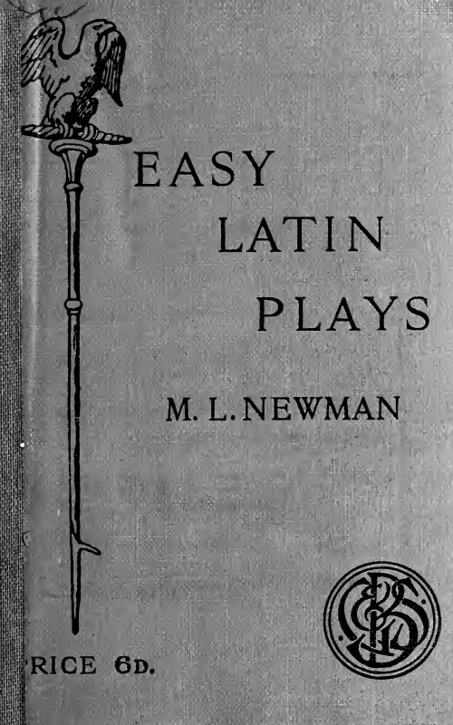

# Easy Latin Plays

---

EASY LATIN PLAYS
BY
M. L. NEWMAN
  
LONDON: G. BELL AND SONS, LTD.
YORK HOUSE, PORTUGAL STREET, W.C.
1913

---

OXFORD: HORACE HART
PRINTER TO THE UNIVERSITY

---

## PREFACE

'Mater Gracchorum' is published at the request
of teachers who attended the Summer School of
Latin at Bangor. The play was written to serve
as a reading-book for an Upper Third Form during
the second and third terms of the year in which
Latin was begun. A year’s course of lessons in
Roman History had preceded the learning of Latin.
All the work of the class (frequent drill in grammar,
oral work by question and answer, and simple
sentence construction) was based upon the text of
the play.

‘Gemini’ was similarly used in a class of younger
girls during the second term of the first year.

SHEFFIELD HiGH SCHOOL FOR GIRLS.
January, 1912.

---  

## MATER GRACCHORUM

DRAMATIS PERSONAE

Cornelia.

Gaius Gracchus.

Blossius.

Marcus Octavius.

Tib. Gracchi Filius.

Famulae.

Cives.

Tribuni.

Senatores.

---

### Scaena I. Apud Corneliam.  

*Cornelia; G. Gracchus; famulae. Tib. Gracchus.*

*Gai.* mater mea, cur cessat Tiberius? quid agit?
solitarius iam semper ego in Campo me exerceo, vel
in silvis feras capto solitarius.

*Cor.* frater tuus, mi fili, pro patria nostra cogitat
et laborat. num vis patris vestri filium, Africani
nepotem, esse degenerem? num ille venationibus
studebit, dum miseriis premuntur cives Romani?

*(clamores audiuntur)*

*populus (extra).* euge, euge! salve Gracche!
ecce Tiberius, tribunus plebis!

*Gai.* cur mater...?

*Cor.* exaudi! quid audio? quid clamant?

*(intrat Tiberius)*

*Ti.* salve, mater! salvete!

*Cor.* mi fili, quid audiebam? quid clamabat
populus?

*Ti.* mater mea, populus Romanus me tribunum
plebis creavit.

*Cor.* tu ergo, mi fili, servabis Romam. senatum
comprimes, cives fovebis.

*Ti.* nuper in Italiam reveniebam. iter faciens
per Viam Appiam multum dolebam. ubique servos
videbam, miseros homines et turpes, greges custodientes, 
ubi agricolae Romani olim habitabant
et suos quisque agros colebat. nunc, eheu, omnes
agros divites habent; cives Romani in urbe in
paupertate ac vitiis versantur, optimatium clientes.

*Cor.* hoc ergo tibi erit opus, mi fili.

*Ti.* legem feram iustissimam. agros pauperibus
reddam; iterum suum quisque fundum colet.

*Cor.* *(Gaium alloquens)* huc, puer! audisne? ego
et tu testes sumus. Tiberius populo Romano agros
Italos restituet, et pristinos Romanorum mores.

---

### Scaena II. In Foro.

*Ti. Gracchus; M. Octavius; ceteri tribuni; cives.*

*cives* *(inter se colloguentes)*. tacete! veniunt
tribuni plebis. audite Gracchum!

*Ti.* cives Romani, suffragia feretis. ego agros
Italos cupio inter cives omnes, ut antea, distribui—
privari eos qui plus habent agri quam quingenta
iugera, M. Octavius vetat; tribunus plebis plebem
prodit. *(Octavium alloquens)* Marce Octavi, rursus
te admoneo. desine etiam nune populi voluntatem
impedire. *(Octavius tacet.)*

cives Romani, suffragia ferte! censeo Octavio
magistratum abrogandum. quid sentitis? placetne?

*cives.* placet.

*Ti.* Marce Octavi, magistratus tibi est abrogatus.
abi! expellite eum!

*Oct.* mox tu poenas dabis, qui leges Romanas,
tribunum sacrosanctum, ita violas.

---

### Scaena III. In Foro. Vesperi.

*cives. Ti. Gracchus; filius praetextatus.*

*civ. I.* quid tu sentis? num Gracchus...

*civ. II.* hoc equidem sentio. Graechus... sed
ecce! inde venit ipse.

*(intrat Ti. Gracchus cum filio)*

*Ti.* cives! amici! mihi si cras erit ultimus dies,
excipite hune, filium meum carissimum. hodie
vobis hunc trado; cras animam meam fortasse pro
vobis deponam.

*cives.* vives, Gracche—vives et superabis. iterum
eris tribunus.

euge, euge! salve, Gracche!

*(exeunt.)*  

---

### Scaena IV. In Capitolio.

*cives; rusticus. senatores; tribuni; Ti. Gracchus.*

*rust.* salvete, amici! nuper rure in urbem adveni.
dicite mihi! quid hic agitur?

*civ. I.* comitia habentur; tribuni plebis creantur.

*rust.* qui petunt? cui favet populus?

*civ. I.* Tiberius Gracchus petit iterum esse
tribunus.

*rust.* quid? nonne leges id vetant?

*civ. I.* vetant sane leges, sed populus favet
Graccho.

*civ. II.* nuper ille agros Italos civibus pauperibus
reddidit.

*rust.* bene egit. iure illi populus favet.

*civ. III.* immo leges violat petens iterum tribunus
esse. mihi displicet.

*civ. II.* crescit clamor!

*rust.* quid agitur?

*(intrant senatores tribuni Gracchus contendentes.
Gracchus cadit.)*

---

### Scaena V. Apud Corneliam.
  
*Cornelia; famulae. Blossius; cives.*

*Cor.* cer cessat Tiberius? summo hodie amore
eum exspecto.

*fam.* exaudi, domina! venit.

*Cor.* num ille venit? cur non cum clamoribus
populi venit?

*(intrant Blossius et cives)*

*Bl.* salve, Cornelia!

*Cor.* salve, amice! quid mihi nuntias?

*Bl.* tristia, eheu! nuntio—tristissima.

*Cor.* quid? haud tristissima, amice, potes nuntiare, 
nisi turpem scilicet filius meus se praebuit.

*Bl.* Cornelia, Tiberius mortuus est.

*Cor.* a... pro patria vero mortuus est. o amici,
abite! filium meum huc adducite!... multas
horas eum exspecto, iam tandem eum accipiam.

*(intrant cives cum Tiberii corpore)*

*Cor.* salve, mi fili! nunquam antea tanta laetitia
quanta hodie te accepi. maxime hodie te amo
atque laudo. o, me! ter quaterque nune beata
sum—pater meus Hannibalem superavit: vir meus
in Hispania gloriam sibi comparavit; filiorum,
quos illi peperi, unus hic iacet—pro patria mortuus 
est; vivit alter—pro patria vivet et laborabit!
*(civibus)* vobis, amici, gratias reddo, quod haec tam
laeta mihi nuntiavistis, hoc tam carum corpus
ad me adduxistis. *(famulis)* venite, puellae!
exceedemus. Deis Immortalibus gratias reddemus.
festinate! mulierem beatissimam ad templa deorum
adducite—Scipionis filiam, Gracchi uxorem. matrem
Gracchorum!

---  

## GEMINI

DRAMATIS PERSONAE

Numitor.

Romulus
			*gemini.*
Remus

Faustulus, *pastor.*
  
Senex.

Ministri.

Pastores.

---

### Scaena I. Extra Numitoris Domum.

*(intrant dextra Romulus et Faustulus; intrat sinistra senex.)*

*Rom.* salve, senex!

*sen.* salvete!

*Rom.* estne haec Numitoris domus?

*sen.* Numitoris est domus.

*(exit dextra)*

*Rom.* *(Faustulum alloquens)* haec, pater, est Numitoris
domus.

*Faust.* tu, domum, Romule, intra. ego ibi te
exspectabo. heu miserum! multum doleo quod
filius meus, Remus, captivus est.

*(exit Romulus sinistra, Faustulus dextra.)*

---

### Scaena II. Intra Numitoris Domum.

*(Numitor sedet. ministri circumstant.)*

*Num.* ecce! quem ducunt pastores?

*min.* captivum ducunt catenis vinctum?

*(intrant pastores Remum ducentes)*

*Nun.* hic homo, quis est?

*pastor.* hic unus est, domine, pastorum Amulii,
quem captum ad te adducimus.

*Num.* cur hunc ad me adducitis vinetum?

*past.* pastores Amulii nobis sunt inimici.

*Num.* quam est formosus! *(Remum alloquens)*
veni, homo! volo te aspicere, o me miserum!
quantum est Reae Sylviae similis, filiae meae carissimae, 
quam Amulius necavit !

*(intrat Romulus)*

*min.* quis inde venit?

*Rom.* salve, o domine!

*Num.* quis es tu, qui captivi nostri tam similis es?

*Rom.* Romulus appellor. hic est frater meus,
Remus.

*Num.* quid petis, Romule?

*Rom.* Remum peto, qui a servis tuis huc ductus
est captivus.

*Num.* unde venisti?

*Rom.* ab Aventino venimus, ubi Amulii greges
custodimus.

*Num.* quis vobis est pater?

*Rom.* Faustulus est pater noster, Amulii pastor.

*Num.* *(ministrum alloquens)* abi! Faustulum huc
adduc! *(exit minister)*

*Rom.* iam ille apud portam exspectat.

*(intrant minister et Faustulus)*

*min.* hic, domine, est Faustulus.

*Faust.* salve, o domine!

*Num.* aspice hos! suntne filii tui?

*Faust.* per multos annos, domine, hos educamus
et ego et uxor mea.

*Num.* quid tum? nonne sunt vestri filii?

*Faust.* non sunt nostri filii, sed cum liberis nostris
hos educavimus.

*Num.* quid? unde sunt?

*Faust.* hos diu abhinc in ripa fluvii inventos ad
casam meam adduxi—tum parvuli erant.

*Num.* quid? in ripa fluvii! parvuli!

*Faust.* ibi relicti erant.

*Num.* tibi magna dabo praemia et uxori tuae.
venite huc, Romule et Reme! audite omnes! frater
meus, Amulius, homo improbus, olim regnum meum
occupavit, filium meum necavit et filiam Ream
Sylviam, et liberos eius parvulos in fluvium
praecipitavit. ecce, Romulus et Remus, filiae meae
liberi, a Faustulo servati!

*ministri et pastores.* salvete, o domini!

*Rom. et Rem.* nos Amulium superabimus et
Numitor rursus erit rex.
