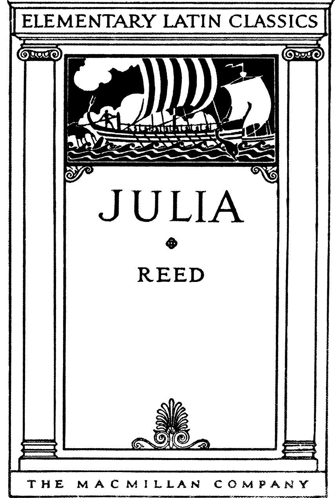
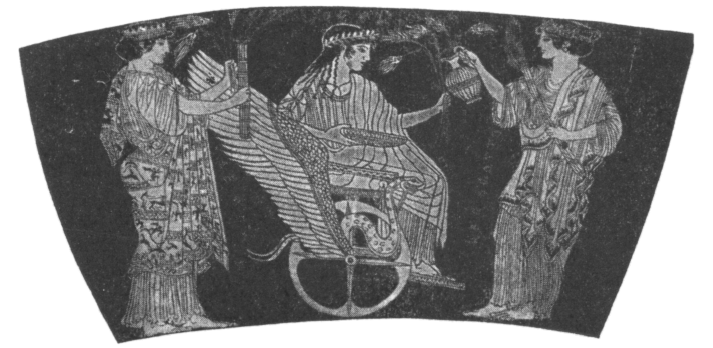
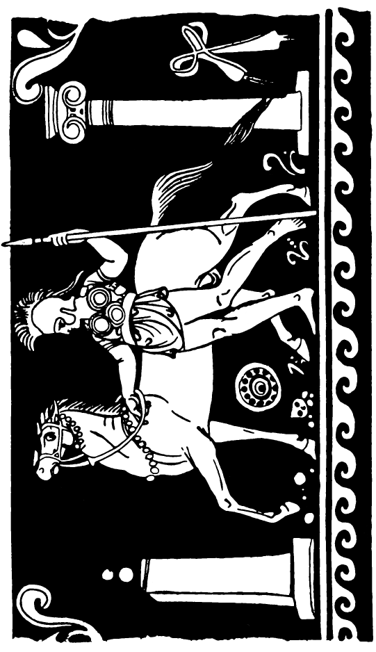
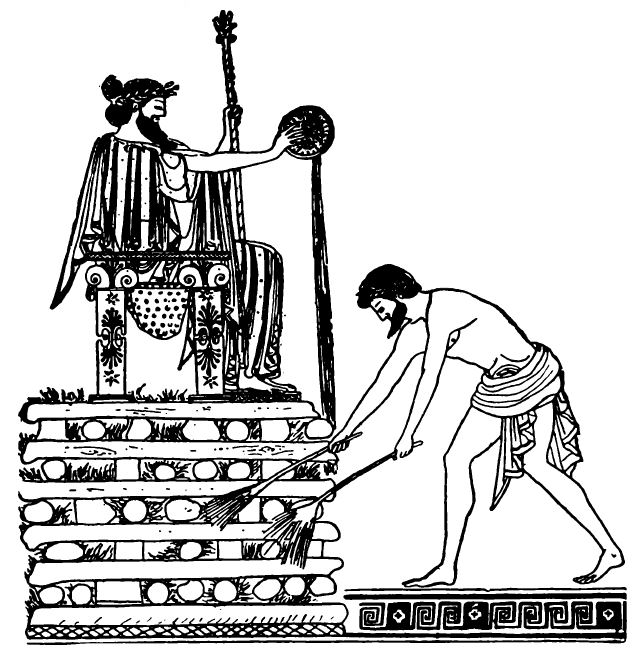
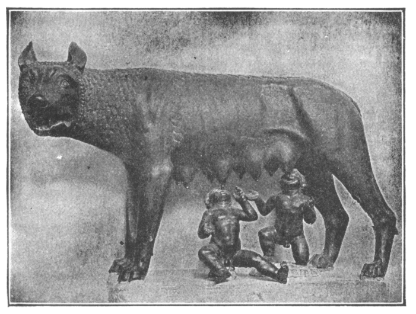
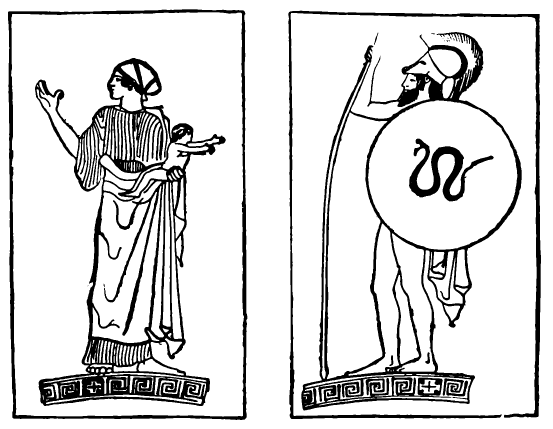
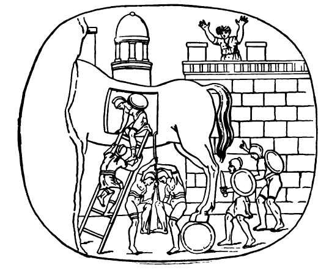
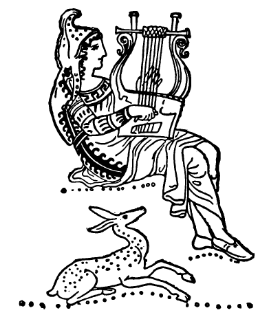

# JULIA: A LATIN READING BOOK 

---

THE MACMILLAN COMPANY 
NEW YORK • BOSTON • CHICAGO • DALLAS 
ATLANTA • SAN FRANCISCO 

MACMILLAN AND CO., Limited 
LONDON • BOMBAY • CALCUTTA • MADRAS 
MELBOURNE 

THE MACMILLAN COMPANY 
OF CANADA, Limited 
TORONTO 

---

Julia

A Latin Reading Book 
Written by 
Maud Reed 
Classical Mistress at Lincoln High School 

With an lntroduction by
Mabel C. Hawes 
Head of the Department of Classical Languages 
High Schools, Washington, D. C. 

New York
THE MACMILLAN COMPANY 
1941 

---

Printed in the United States of America 

All rights reserved—no part of this 
book may be reproduced in any form 
without permission in writing from 
the publisher, except by a reviewer 
who wishes to quote brief passages in 
connection with a review written for 
inclusion in magazine or newspaper. 

Reprinted June, 1924; August, 1924; January, 
1925; May, 1925; August, 1925; May, 1926; 
Deccmber, 1926. May, 1927; June, 1928. 
September, 1929; October, 1934; December, 1935. 
June, 1937 ; November, 1939; March, 1941. 

---

## INTRODUCTION 

American boys and girls could find no more 
delightful companion with whom to spend 
pleasant hours than the little English *Julia*. 
With her they may wander on the seashore, be 
carried off by pirates, and be rescued; with her, 
too, they may listen to the kindly schoolmaster 
as he tells the deathless tales of Greece and Rome. 
Here they may meet, as they should, Romulus 
and Remus, Horatius and Regulus; here they 
may learn, also, of the translation of Romulus 
to the skies, of Bacchus and the pirates, of the 
sacrifice of Iphigeneia, and of the love of Hector 
and Andromache. The selections are well made, 
and while the stories are told with the greatest 
simplicity, they yet achieve a life and literary 
quality that is as far as possible removed from 
the woodenness of the ordinary simplified renderings
Conspicuous among the excellent, for 
sympathy and charm, is the version of the lovely 
tale of Ceres and Proserpina. 

Since the little book accomplishes so well its 
avowed purpose, "to please," Latin teachers 
will welcome it as a valuable ally in the effort 
to interest our children in the treasures of 
Greece and Rome. Professor Dewey has shown us 
that true interest is not a weak surrender to the 
pleasure of the moment but is essential to all 
serious work; and the fact that Latin teachers 
have accepted this principle is evidenced by the 
multiplication of Latin plays, Latin games, and 
stories, Roman motion pictures, and various 
teaching devices that relate Latin to childhood. 
Among the best of such material is *Julia*, a 
veritable Mercury—or shall we say Iris?—with a 
message for Latin beginners when used as a 
class text, for more advanced classes when used 
as supplementary reading, for Latin clubs, and 
for the elect as private reading. 

Mabel C. Hawes. 

Washington, D. C. 

January, 1924. 

---

## PREFACE 

It is sometimes said that in the early stages Latin 
is not an interesting subject, that the pupil's 
interest should lie rather in his own progress 
than in the subject itself. Now in the first place 
it is hard to believe that no matter what the 
study, one's interest should be directed mainly 
toward oneself. Moreover with all that Borne 
means to us in history, with all that Italy, both 
past and present, means to the ordinary educated 
English-speaking person, it seems to me 
that if we cannot make Latin interesting for 
itself and from the very first, it is our own fault. 
It is the gateway into a magic country and can 
be made extremely interesting to the youthful 
student of Latin. 

This little book is intended to be before everything
else, a story book, and its first object is to 
please. The constructions have been made as easy 
as possible, in order to give the child confidence 
from the beginning. Nowadays classes are often 
very large, and if translation is done in class, it is 
difficult to keep up the interest while a complicated 
construction is being puzzled out. If on the other 
hand, the translation is done at home, the confidence, 
and with it the interest, of the child may 
be marred from the first by difficulties that are 
beyond him. 

Rather a large number of words has been used, 
but the looking up of words does not delay a child 
much, and moreover, at that age memory work is 
easy. Also children brought up on a small 
vocabulary are sometimes dismayed when faced 
with a Latin author for the first time. 

Explanations of rules and idioms have not been 
given, because this is so much more easily done by 
the teacher, and it is far better that they should 
form part of the child's memory than that he should 
rely on the written word. The accidence has been 
introduced as gradually as possible—the personal 
pronouns about a third of the way through the 
book, the demonstratives towards the end. Words 
like "alius" have been used at an early stage, but 
only in their regular forms. 

A few passages from Latin poets have been 
introduced, but they can be taken or omitted at 
the teacher's discretion. If the teacher will read 
and translate them, the class will catch the metre 
and have an idea of what is to come. It is as 
though when out for a walk with children one 
should draw attention to some place, visible but 
for the moment inaccessible. Its very distance 
will give it an added interest, and when later it 
can be attempted, it will be greeted as a friend. 

I should like to express my gratitude to Mr. 
W. E. P. Pantin, M.A., of St. Paul's School, for 
kindly helping me with hints and suggestions at 
various stages of the book. 

M. R. 

---

## CONTENTS 

[Iūlia](#Iūlia) - 1

[Ītalia](#ītalia) - 5

[Rōma](#rōma) - 6

[Cerēs et Persephonē](#cerēs-et-persephonē) - 7

[Rōmulus et Sabīnae](#rōmulus-et-sabīnae) - 13

[Mars Rōmulum in Caelum Vocat](#mars-rōmulum-in-caelum-vocat) - 15 

[Horātius Puer](#horātius-puer) - 17 

[Bacchus et Pīrātae](#bacchus-et-pīrātae) - 19

[Horātius Codes](#horātius-codes) - 22 

[Īphigeneia](#īphigeneia) - 29 

[Cȳrus, Croesus, Solōn](#cȳrus-croesus-solōn) - 34 

[Mūsae et Cicādae](#mūsae-et-cicādae) - 38 

[Rōmulus et Remus](#rōmulus-et-remus) - 40 

[Mettius Curtius](#mettius-curtius) - 46 

[Rēgulus](#rēgulus) - 48 

[Hector et Andromachē](#hector-et-andromachē) - 51 

[Equus Trōiānus](#equus-trōiānus) - 55 

[Orpheus et Eurydicē](#orpheus-et-eurydicē) - 58 

[Vocabulary of New Words in each Section](#vocabulary-of-new-words-in-each-section) - 62 

[Vocabulary of Words used in Quoted Passages](#vocabulary-of-words-used-in-quoted-passages) - 80

[General Vocabulary](#general-vocabulary) - 82

---

Persian Archers. 

Persian men wore elaborate dresses and a great deal of jewellery. 

Notice their earrings and bracelets. 

---

## IŪLIA

### I 
Iūlia puella parva est. Prope ōram maritimam 
habitat. Britannia est Iūliae patria. Puellae 
Britannicae ōram maritimam amant. Nautās 
quoque amant puellae Britannicae. Iūlia est 
fīlia agricolae et casam parvam habitat. Sed 
Iūlia ōram maritimam et nautās amat. Nautae 
quoque Iūliam amant. Saepe prope ōram maritimam 
Iūlia ambulat. Nautārum fīliae cum Iūliā 
ambulant, et prope ōram maritimam saltant. 
Multae rosae sunt prope Iūliae casam. Rosīs 
aquam dat Iūlia. Saepe Iūlia rosās nautīs dat. 
Agricola Iūliam nōn culpat sed laudat, quod 
rosās pulchrās nautīs dat. Rubrae et albae sunt 
rosae. Saepe Iūlia ad nautārum casās rosās pulchrās 
portat. Nautae puellam parvam laudant. 

### II
Ad Iūliae casam pīrāta vēnit. Rubra est pīrātae 
tunica, splendidae sunt galea et hasta. Iūlia 
prope casae portam stat et pīrātam spectat; 
pīrātae hastam et galeam et tunicam rubram amat 
et laudat. Pīrāta quoque Iūliam et casam et 
rosās laudat. "O Iūlia," inquit, "pulchra es 
puella et pulchrae sunt rosae tuae. Nāvicula mea 
pulchra est. Alta est prōra nāviculae meae. In 
extrēmā nāviculā sto et nāviculam guberno. 
Alba est nāvicula mea; nunc prope ōram maritimam 
stat." Tum Iūlia cum pīrātā ad ōram 
maritimam ambulat et nāviculam albam spectat. 
Iūlia et pīrāta prōram nāviculae multīs rosīs ornant. 
Subito pīrāta puellam in nāviculam iactat. Multae 
sunt lacrimae puellae, sed frustrā—pīrāta in extrēmā
nāviculā stat et nāviculam gubernat. 

### III 
Agricola ad casam vēnit. Fīlia parva nōn 
est in casā. Tum agricola, "Iūlia," exclāmat, 
"fīlia mea, ubi es?" Iterum Iūliam vocat, sed 
frustrā—nulla est puella. Cēna nōn est in 
mēnsā parāta, nec rosae in mēnsā sunt. Tum ad 
ōram maritimam properat et procul nāviculam 
albam spectat. Ad nautārum casās properat. 
Nautārum fīliae perterritae, "Cum pīrātīs," inquiunt, 
"est Iūlia tua." Magna est īra agricolae. 
Galeam et hastam raptat. Nautae nāviculam 
suam agricolae dant. Nautae quoque galeās et 
hastās raptant, et cum agricolā ad pīrātārum 
nāviculam properant. Tum agricola pīrātās vocat;
"Ubi," inquit, "est fīlia mea?" Pīrātae, "Fīlia 
tua," inquiunt, "in nāviculā nostrā est." Tum 
agricola pecūniam multam pīrātīs dat. Pīrātae 
lūliam ad agricolae nāviculam portant. 

### IV 
Laeta est Iūlia quod iterum casam parvam cum 
agricolā habitat. Sed Iūlia puella duodecim 
annōrum iam est. Itaque agricola fīliae suae 
tabulās dat. Pecūniam quoque lūdī magistrō dat. 
Cotīdiē puella ad lūdum per agrōs ambulat. Multī
iuvencī in agrīs sunt, sed impavida est puella. 
Tabulās ad lūdum Iūlia portat. In tabulīs 
litterae multae sunt. Lūdī magister lūliam laudat 
quod litterās bene cotīdiē recitat. In lūdō multī
puerī, multae puellae cum Iūliā sunt. Magister 
lūdum bene gubernat. Industriīs puerīs magister 
librōs pulchrōs dat; pigrōs malōsque puerōs 
nōn laudat sed culpat. Magna est īra magistrī
quod puerī pigrī litterās nōn bene recitant. Itaque 
puerī pigrī in angulīs stant. Multae sunt lacrimae 
puerōrum malōrum. Itaque puerī industriī sunt 
et litterās bene recitant. Iūlia prandium ad 
lūdum cotīdiē portat, quod longa est via. In 
agrīs prandium est lūliae grātum. 

Multās fābulās puerīs et puellīs magister benignus 
in lūdō narrat; nunc dē Britanniā, nunc dē 
longinquīs terrīs fābulās narrat. Grātae puerīs 
et puellīs sunt fābulae. Nunc igitur in librō nōn 
sōlum lūliae sed multīs etiam puerīs et puellīs
fābulās narro. 

---

## ĪTALIA 

### V 
Caeruleum est Ītaliae caelum. Ītalī caelum 
caeruleum amant. Britannis quoque caelum 
caeruleum grātum est, sed nōn saepe Britanniae 
caelum caeruleum est. Ītaliae agricolae olīvās 
et vīneās laudant, iuvencīs albīs agrōs arant. 
Placidī sunt oculī iuvencōrum. Placidī et pulchrī
sunt iuvencī. Ītaliae agricolīs grātī sunt iuvencī. 
Britannicī agricolae nōn iuvencīs sed equīs agrōs 
arant. Validī et pulchrī sunt equī magnī. In 
Ītaliā clīvī multī sunt. Ītalī in clīvīs parvīs 
oppida aedificant. Oppidānī oppida in clīvīs 
habitant. In campō vīneae et olīvae sunt—in 
clīvīs oppida. Per campōs viae Rōmānae sunt. 
Longae et rectae sunt viae Rōmānae. Oppidānī 
olīvās et ūvās, agricolae pecūniam dēsīderant. 
Itaque oppidānī pecūniam agricolīs dant, et per 
viās Rōmānās agricolae olīvās et ūvās ad oppida in 
plaustrīs portant. 

---

## RŌMA

### VI 
Ōlim Rōmānī oppidum parvum habitābant. Nunc 
magna et splendida est Rōma; magnae et lātae 
sunt oppidī viae. In angulīs viārum rosae sunt; 
Rōmāni templīs et monumentōs viās ornant. 
Ōlim in Forō Rōmānō templa multa et splendida 
erant. Cotīdiē virī Rōmāni in Forō ambulābant. 
Albae erant togae virōrum, sed rubrae et caeruleae 
et croceae erant pallae fēminārum. Ārae quoque 
in Forō erant. In ārīs Rōmānī victimās multās 
Deīs Rōmānīs mactābant. Nōn iam templa sunt 
in Forō Rōmānō. Nōn iam mactant Rōmānī 
victimās in ārīs. Sed etiam nunc pulchrum est 
Forum Rōmānum. Multae sunt ruīnae; rosae 
multae inter ruīnās sunt. Inter ruīnās et rosās 
lacertae parvae properant. Pulchrae et iūcundae 
sunt lacertae. Cicādae quoque undique cantant. 
Lacertīs et cicādis grātum est caelum caeruleum. 

---

## CERĒS ET PERSEPHONĒ

> *That fair field* 
>
>*Of Enna, where Proserpin gathering flowers,* 
>
>*Herself a fairer flower, by gloomy Dis* 
>
>*Was gathered—which cost Ceres all that pain* 
>
>*To seek her through the world.*
>
> Milton.[^1]

### VII 
Nunc ūnum Deum adōrant et Ītalī et Britanni. 
Sed ōlim Rōmānī multōs deōs, multās deās, adōrābant. 
De deis Rōmānis fābulās narrābo. Cerēs 
erat dea frūmentī; in agrīs frūmentum, in prātīs 
herbam cūrābat. Flāvum est frūmentum; flāvī 
erant Deae capillī. Caerulea erat Deae palla. 
Persephonē erat fīlia Deae. Cerēs fīliam cāram 
vehementer amābat. In insulā Siciliā Cerēs cum 
fīlīa habitābat. Ōlim Persephonē in prātīs errābat. 
Cum puellā aliae puellae errābant, nam locus 
herbōsus fuit grātus puellīs laetīs. In prātō
herbōsō puellae saltābant et cantābant. Multae 
rosae, multa līlia, in prātīs erant. Līlia alba 
puellās delectābant. Sed Plūto, patruus puellae, 
Deae fīliam procul spectāvit et statim puellam 
vehementer amāvit. Subitō equōs caeruleōs incitāvit
et per prāta properāvit, et puellam perterritam 
raptāvit. Tum Persephonē, "O Cerēs," 
exclāmat, "ubi es? Patruus meus fīliam tuam ad 
Inferōs portat." 

### VIII 
Cerēs nōn in Siciliā erat, sed iam ad insulam 
properāvit. Nusquam erat Persephonē. Tum 
Dea, īrāta et perterrita, passīs capillīs per terrās 
errābat. Per clīvōs altōs, per campōs lātōs, per 
silvās et agrōs, per terrās et caelum fīliam vocābat. 
Frustrā agricolās, frustrā lūnam et stellas rogābat: 
"Ubi est fīlia mea?" Sed neque agricolae neque 
lūna neque stellae puellam Deae monstrāvērunt. 
Nōn iam Deae miserae grātum erat frūmentum; 
nōn iam herba erat in prātīs, neque ūvae purpureae 
in vīneīs, neque pōma in agrīs, quod Dea īrāta 
neque herbam neque vīneās neque pōma cūrābat. 
Frustrā iuvencī albī agrōs arābant. Nōn iam 
cibum in plaustrīs magnīs ad oppida portābant. 

### IX 
Tandem Cerēs prope parvam agricolae casam in 
saxō gelidō sedēbat. Dea maesta diū lacrimābat. 
Tum ē casā puella parva ad Deam vēnit. Puellae 
oculī plenī erant lacrimārum. "Puerum parvum," 
inquit, "habemus. In cūnīs aeger iacet. Lacrimāmus, 
quod aeger est puer." Tum Cerēs lacrimās 
suās tenuit, et cum puellā ad casam properāvit. 
Ibi Metanīra fīlium aegrum in gremiō tenēbat. 
Fīlius Metanīrae Triptolemus erat. Lacrimābant 
et agricola et Metanīra et puella parva, quod nōn 
valēbat puer. Tum Cerēs puerō osculum dedit, 
et ecce! statim valuit puer. Mīrum et dīvīnum 
est osculum Deae. Laetī erant et agricola et 
Metanīra et puella. Iam laetus et validus puer 
in cūnīs dormītābat. Tum Cerēs Triptolemum in 
gremiō suō tenuit. Dea cum tōtā familiā cēnam 
habuit; in mensā erant ūvae purpureae et pōma 
iūcunda. Adhūc ignōta erant Ītalīs Graecīsque 
et vīnum et frūmentum. Deae tamen flāvae grāta 
erat rustica cēna. Post cēnam in agricolae casā 
Dea manēbat et cotīdiē Triptolemum cūrābat. 

### X 
Iam lūna et stellae in caelō fulgēbant. Umbrae 
terrās et pontum profundum cēlābant. Per 
terrās virī et fēminae animōs somnō laxābant. 
Sed somnus Metanīram non tenēbat; furtim Deam 
cum puerō spectābat. Cerēs prope puerī cūnās 
stābat. Verba mīra et dīvīna cantābat. Tum 
puerum in gremiō tenuit, et ad focum ambulāvit. 
Ecce! Triptolemus in focō inter flammās iacēbat; 
sed laetus erat puer; neque focum neque flammās 
timuit. Sed Metanīra perterrita, "O fīlī mī," 
exclāmāvit, et ad focum properāvit. Tum Dea 
īrāta puerum e flammīs raptāvit et humī iactāvit,
et Metanīrae, "O fēmina," inquit, "stulta et 
scelerāta fuistī. Nōn deus erit Triptolemus, quod 
stultae fēminae est fīlius. Sed in deae gremiō 
iacuit; itaque vir magnus erit. Et ego et Persephonē,
fīlia mea, Triptolemum docēbimus et 
cūrābimus. Agricolārum magister erit, nam frūmentum
et vīnum agricolīs monstrābit."

### XI 
Tum Cerēs ex agricolae casā ambulāvit. Sed 
flēvērunt familia et flēvit Triptolemus, quod nōn 
iam in Deae gremiō dormītābat. Māne agricola 
virōs et fēminās locī convocāvit, et Deae dicta et 
facta narrāvit. Deinde virī et fēminae saxa multa 
apportāvērunt et templum magnum aedificāvērunt. 
In templī ārīs victimās mactāvērunt, et Deam 
adōrāvērunt. Grāta erant Deae dōna populī, et 
Cerēs templum diū habitābat. Intereā in ārīs 
aliōrum deōrum neque pōma neque ūvae neque 
rosae iacēbant. Nōn iam herba in prātīs, nōn iam 
pōma in agrīs flōrēbant, quod adhūc Cerēs propter 
fīliam flēbat. Itaque Iuppiter Deae, "Plūto," 
inquit, "fīliam tuam habet. Persephonē rēgīna 
Inferōrum est. Sed Mecurius ad regnum Inferōrum 
properābit, et puellam ad templum tuum celeriter 
apportābit." Deinde Mercurius ad Inferōs properāvit.
Persephonē cum virō suō in lectō sedēbat. 
Misera erat puella, quod adhūc Deam cāram 
dēsīderābat. Sed Mercurium vidēbat et laeta fuit. 
"Iterum," inquit, "Deam cāram vidēbo, iterum 
Cerēs fīliam suam habēbit." Tum Plūto verbīs 
benignīs puellam ōrāvit: "O Persephonē, memoriae 
tuae grātus Semper erit Plūto; iterum rēgīna 
Inferōrum eris. Nunc caeruleum est caelum, 
iūcunda sunt prāta, sed mox gelidum erit caelum, 
gelidī ērunt et ventī et agrī. Tum iterum virum 
tuum et regnum Inferōrum dēsīderābis. Valē, 
Ō cāra rēgīna." 

**The Departure of Triptolemus.** 

When Triptolemus grew up, Ceres and Persephone sent him 
through the world in a magic car to teach the arts of agriculture. He holds ears of corn and a cup for wine. It is like the cup held by Croesus. The goddesses hold torches; these 
were used in their worship. 

### XII 
Tum Persephonē cum Mercuriō ē regnō Inferōrum 
properāvit. Mercurius equōs validōs incitāvit, 
et equī per clīvōs altōs, per campōs lātōs libenter 
properāvērunt. Tandem Persephonē templum 
Deae flāvae vidēbat. Puella laeta verbīs laetīs 
Deam vocāvit. Cerēs magnō gaudiō ē templō
ēvolāvit, et fīliae cārae oscula multa dabat. 
Subitō per terrās herba in prātīs, ūvae in vineīs 
undique flōrēbant, quod nōn iam flēbant Cerēs et 
Persephonē. Cēterī quoque deī laetī erant, quod 
agricolae ad templa dōna multa apportābant et 
in ārīs victimās mactābant. 

---

## RŌMULUS ET SABĪNA

### XIII 
Rōmulus erat Martis fīlius. Mars erat deus belli 
et armōrum. Mīlitēs Rōmāni Martem adōrābant 
et in Martis ārīs victimās mactābant. Rōmulus 
igitur mīlitēs et arma vehementer amābat. Urbis 
Rōmae primus rex erat. Sed virī sōlum urbem 
habitābant; neque uxōrēs neque sorōrēs habēbant. 
Itaque Rōmulus tōtum populum convocāvit, et
"O cives," inquit, "nullās fēminās habēmus, sed 
Sabīnī cīvitātem finitimam habitant. Sabīnī 
fēminās multās et formōsās habent. Sabīnōs 
igitur cum fēminīs ad lūdōs invītābimus, et virginēs 
raptābimus." Rōmāni igitur Sabīnōs ad lūdōs 
magnōs invitāvērunt. Pax erat inter Rōmānos et 
Sabīnōs. Itaque Sabīnī ad lūdōs Rōmānōrum 
libenter properāvērunt. Nec scūta nec gladiōs nec 
hastās apportāvērunt. Cum Sabīnīs virginēs 
multae et formōsae properāvērunt. Sabīnī lūdōs 
Rōmānōrum spectāvērunt. In mediīs lūdīs 
Rōmāni magnā vōce subitō clāmāvērunt, et ecce! 
virginēs Sabīnās raptāvērunt et ad casās portāvērunt. 
Frustrā mātrēs lacrimāvērunt, frustrā
virōs in arma incitāvērunt. Rōmānī scūta et 
gladiōs et hastās habēbant; Sabīnīs nec scūta nec 
gladiī nec hastae fuērunt. 

### XIV 
Maestī igitur et īrātī Sabīnī ad terram Sabīnam 
properāvērunt. Per tōtam hiemem ibi manēbant 
et arma dīligenter parābant. Via est longa inter 
Rōmam et terram Sabīnam. Sed tandem Sabīnī, 
iam armātī, ante portās urbis Rōmae stābant.  
"O Rōmāni," inquiunt, "prō fīliābus nostrīs, prō 
sorōribus nostrīs fortiter pugnābimus." Deinde 
Sabīnae ē casīs Rōmānōrum passīs capillīs evolāvērunt;
parvulōs portāvērunt et patribus frātribusque 
monstrāvērunt. Patrēs frātrēsque suōs 
multīs lacrimīs ōrāverunt. "Nunc," inquiunt, 
"in casīs Rōmānīs laetae et placidae habitāmus; 
līberōs cārōs habēmus et vehementer amāmus; 
et Sabīnōs et Rōmānos amāmus. Sī Rōmānī cum 
Sabīnīs pugnābunt, Rōmāni Sabīnōs, Sabīnī 
Rōmānōs necābunt. Tum Sabīnae nec virōs nec 
patrēs nec frātrēs habēbunt. O patrēs, valēte! 
nōn iam Sabīnae sed Rōmānae semper erimus 
fīliae vestrae." 

---

## MARS RŌMULUM IN CAELUM VOCAT

### XV 
In angulō Tiberis Campus Martius iacēbat. In 
Campō Martiō iuvenēs Rōmānī corpora dīligenter 
exercēbant. Ita firma et valida habēbant corpora. 
Post lūdōs in flāvīs Tiberis undīs natābant. Ita 
Tiberis corpora fessa recreābat. 

Hīc forte Rōmulus cīvibus suīs iūra dabat; 
bonōs cīvēs laudābat; malōs cīvēs culpābat. 
Subito fulminis fragor populum perterruit; magnī 
dē caelō imbrēs virōs fēmināsque fugāvērunt. 
Rōmulus sōlum serēnus impavidusque manēbat; 
Martem patrem in caelō vidēbat. Tum Mars 
fīlium verbīs benignīs vocāvit: "Satis," inquit,
"in terrīs regnāvisti; nunc in caelō et in stellīs 
cum patre tuō cēterīsque dīs regnābis. Fīlium 
meum ad caelum portābo." Tum equōs mīrōs 
incitāvit. Rōmulus cum patre ad stellās properāvit. 

### XVI 
Caelum iterum serēnum erat. Iam Rōmānī in 
Campō Martiō iterum ambulābant, sed rēgem 
nusquam vidēbant. Mox autem Iūlius, iuvenis 
Rōmānus, per viam Rōmānam iter ad urbem 
tenēbat. Subito ā sinistrā, magnum et serēnum, 
Rōmulum prope viam vidēbat. Vehementer 
timuit—capillī in capite horruērunt. Sed Rōmulus 
verbīs benignīs, "O Iūlī," inquit, "nulla est causa 
timōris. Nunc Quirītēs nūmen meum adōrābunt 
et Rōmulum Quirīnum vocābunt. Templa et 
ārās aedificābunt, et ad ārās dōna apportābunt. 
Semper artem bellī et arma cūrābunt, et corpora in 
armīs dīligenter exercēbunt. Ita Quirīnus Populum 
Rōmānum servābit." Itaque Iūlius Rōmulī 
dicta populō narrāvit, et Quirītes templum rotundum
aedificāvērunt. In templō rotundō Quirīnī 
nūmen adōrābant. 

---

## HORĀTIUS PUER

> *carmina nōn prius*
> 
> *audīta Mūsārum sacerdōs*
> 
> *virginibus puerisque canto.[^2]*
> 
>Horace.[^3] 

### XVII 
Fābulam dē Horātiō, poētā praeclārō, nunc vōbis 
narrābo. Apūlia regio est Ītaliae. Multās silvās, 
multōs et amoenōs campōs habet. In pr�ātīs 
herbōsīs multī gregēs, multa equōrum boumque 
armenta errant. Hīc ōlim Horātius habitābat, 
parvulus adhūc et mātrī patrīque cārus. Forte 
servōs, forte patrem mātremque fefellit, et sōlus 
per prāta amoena errābat. Grātī puerō erant 
flōres et herba et rūra dīvīna. Mox autem puer, 
lūdō et errōribus fessus, in valle herbōsā iacuit et 
animum somnō profundō laxāvit. Intereā parentēs 
sollicitī puerum dīligenter quaerēbant. Et 
parentēs et servī vehementer timēbant. "Lupī 
saevī," inquiunt, "et ursī silvās incolunt. Lupus 
fortasse puerum etiam nunc crūdēliter necat." 
Itaque diū et dīligenter puerum quaerēbant. 

### XVIII 
Tandem in caelō columbās albās vidēbant. 
Columbae per caelum undique volābant et folia ad 
locum herbōsum portābant. Parentēs ad locum 
contendērunt et ecce! Infans in herbā placidus 
impavidusque dormitābat; columbae in terrā, in 
arboribus passim sedēbant; columbae per caelum 
volābant, et parvulī corpus foliīs tegēbant. Nec 
lupī nec ursī infantem necāverant, quia Mūsae 
poetam etiam infantem semper conservant. 

Post multōs annōs Horātius, iam adolescens, 
Rōmam, magnam urbem, incolēbat. Sed dīvīna 
rūra et vītam rusticam semper laudābat. Mūsae 
per multa pericula poētam conservāvērunt. 
Horātiī carmina per tōtum orbem terrārum etiam 
nunc nōta et praeclāra sunt. Vōs quoque Horātiī 
carmina mox legētis et in memoriae tabulīs scribētis. 

---

## BACCHUS ET PĪRĀTAE

>*'Twas Bacchus and his kin!* 
>
>*Like to a moving vintage down they came,* 
>
>*Crown'd with green leaves, and faces all on flame;* 
>
>*All madly dancing through the pleasant valley,* 
>
>*To scare thee, Melancholy!* 
>
>Keats.[^4] 

### XIX 
Inter deōs Rōmānos agricolae nōn sōlum Cererem 
sed Bacchum quoque adōrābant et in summō honōre 
habēbant. Bacchus enim vīnum hominibus dedit 
et multās artēs docuit. Ad Bacchī ārās agricolae 
dōna multa, et in primīs ūvās vīnumque iūcundum, 
ferēbant, et ārās flōribus laetīs pampinīsque 
ornābant. Deus igitur vītēs Ītalicās cūrābat, et ā 
perīculō dēfendēbat. Formōsus erat Deus, et, 
quod vītēs amābat, capillōs suōs pampinīs saepe 
ornābat. Nec Ītalōs Graecōsque sōlum docēbat, 
sed ad longinquās tenās nāvigābat, aliīsque gentibus 
vīnum dabat, artēsque rusticās docēbat. 

###  XX
Deus, ubi trans mare Aegaeum quondam 
nāvigābat, ad insulam parvam nāvem gubernāvit, 
et errōribus longīs fessus, sē in ōrā maritimā 
prostrāvit et somnō placidō corpus animumque 
recreābat. Mox autem pīrātae quoque, malī 
hominēs, nāvem ad insulam impulērunt. Ubi 
iuvenem formōsum in ōrā vidērunt, tum vērō 
magnō gaudiō, "Ecce!" inquiunt, "nōn sine 
praedā ad patriam nostram nāvigābimus. Hominem 
raptābimus et in nāvem furtim impōnēmus, 
tum cito cum captīvō ad Āfricam nāvem 
impellēmus. Āfricae incolae servōs dēsīderant, 
et pecūniam multam nōbīs dabunt, si nōs iuvenem 
tam pulchrum trādiderimus." Tum pīrātae, malī 
ignāvīque hominēs, deum raptāvērunt et in nāvem 
imposuērunt; nec tamen iuvenem fessum ē 
somnō excitāvērunt. 

### XXI
Ubi autem Bacchus ē somnō sē excitāvit, et undās 
caeruleās undique vīdit, tum nec īrātus nec 
perterritus, "Nōn ego," inquit, "stultōs ignāvōsque 
timeo; mox tamen pīrātae nūmen meum 
vidēbunt et vehementer timēbunt." Tum ē mediā 
nāve vītis flōrēbat et in altum ascendēbat. Ē
vīte rāmī, ē rāmīs pampinī flōrēbant, et dē summīs 
rāmīs ūvae purpureae pendēbant. Nōn iam candida 
erant vēla, sed lūce purpureā fulgēbant. 

Ubi nautae vītem mīram in mediā nāve vīdērunt, 
tum magnō timōre Deum spectāvērunt; 
capillī in capitibus horruērunt. Subitō ex undīs 
tigrēs leōnēsque saevī in nāvem ascendērunt et in 
nautās perterritōs cucurrērunt. Pīrātae, terrōris 
plēnī, ē nāve in mare sē prostrāvērunt. Deinde 
Iuppiter propter misericordiam hominēs in delphīnās 
convertit. Intereā Neptūnus vēla purpurea 
ventīs secundīs implēvit, et sōlus sub vītium 
umbrā Bacchus ad terrās longinquās nāvigāvit. 

---

## HORĀTIUS CODES

>*It Stands in the Comitium,* 
>
>*Plain for all folk to see;* 
>
>*Horatius in his harness,* 
>
>*Halting upon one knee:* 
>
>*And underneath is written,* 
>
>*In letters all of gold,* 
>
>*How valiantly he kept the bridge* 
>
>*In the brave days of old.* 
>
>Macaulay.[^5]

### XXII 
Rōmānī alterum Horātium memoriā tenēbant et 
in summō honōre habēbant. 

Post Rōmulum sex rēgēs deinceps in urbe 
regnābant. Sed Tarquinius, ultimus rēgum, superbus 
et crūdēlis erat. Nec iūra bona populō dabat, 
nec cīvitātem bene gubernābat. Itaque Rōmānī 
Tarquinium et Sextum, Tarquiniī fīlium, crūdēlem 
ferōcemque adolescentem, ex urbe expulērunt.
"Nōn iam," inquiunt, "Rōmānīs rēgēs erunt.
Cīvēs Rōmānī, nōn rēgēs, urbem cīvitātemque 
regent." 

Intereā Tarquinius ad Porsennam, omnis 
Etrūriae rēgem, contendit, et omnia narrāvit. 
Porsenna, "O amīce," inquit, "nōn ferendae sunt 
iniūriae tuae, nōn ferendae sunt fīliī tuī iniūriae. 
Multī equitēs, multī peditēs mihi sunt. Equitēs 
peditēsque meōs omnēs convocābo, et cum multīs 
mīlitibus tē tuumque fīlium ad urbem scelerātam 
dūcēmus. Iterum in urbe regnābis." Itaque per 
tōtam Etrūriam, per clīvōs et agrōs nuntiī contendērunt, 
et ex omnibus vīcīs Etruscōs ad arma 
convocāvērunt. Splendida erant arma Etruscōrum; 
cristae rubrae in galeīs horrēbant; scūta 
lūce coruscā fulgēbant. Porsenna cum mīlitibus 
Rōmam contendit. Per omnēs vīcōs agricolae 
vehementer timēbant. Etruscī frūmentum casāsque 
incendērunt, arborēs excīdērunt, mulierēs 
līberōsque necāvērunt, multam praedam raptāvērunt.

Italian Warrior

### XXIII 
Intereā Porsennae facta Rōmānōs nōn fefellērunt. 
Virginēs vestālēs prope ignem sacrum deōs ōrābant; 
mātrōnae cum līberīs suīs dāna ad templa ferēbant; 
senēs victimās in ārīs mactābant; iuvenēs in 
Campō Martiō sē ad arma proeliumque parābant, 
et moenia multō labōre firmābant; vigilēs in 
moenibus stābant et campōs clīvōsque spectābant. 
Subitō vigilēs corusca Etruscōrum arma procul 
vīdērunt. Mox inter hostēs Porsennam, et Porsennae 
ā dextrā Sextum, vīdērunt. Deinde cīvēs 
odiī et terrōris plēnī magnā vōce clāmāvērunt et 
animōs ad proelium firmāvērunt. Sed consulēs 
timēbant, quod paucī erant Rōmānī, multī et 
validī hostēs. 

### XXIV 
Hostēs ante urbis mūrōs castra posuērunt. 
Castra vallō et fossā firmāvērunt. Tum ē castrīs 
excessērunt et moenia Rōmāna oppugnāvērunt. 
Fortiter et ferōciter pugnābant Rōmānī, sed 
Etruscī validī Rōmānōs paene vīcērunt. Iam ē 
parte urbis Rōmānōs fugāverant; iam omnia 
trans flūmen vīcerant. Terrōris plēnī consulēs,
"Ecce! "inquiunt, "prope pontem sunt! sī 
pontem tenēbunt, tōtam urbem vincent." Tum 
Horātius, vir fortis, "O consulēs," inquit, "in 
extrēmō ponte angustus est locus; multī sunt 
hostēs, sed paucī sōlum ibi intrābunt. Vōs 
pontem cito excīdētis, ego cum duōbus amīcīs 
contrā hostēs in angustō locō pugnābo. Ita 
omnēs pro ārīs templīsque Rōmānīs, pro uxōribus 
līberīsque, pro sacrīs virginibus pugnābimus. Ita 
urbem Rōmam conservābimus. Quis mēcum in 
extrēmō ponte stābit et contrā Etruscōs pugnābit ? * 
Tum Lartius, "Ego," inquit, "ā dextrā stābo, et 
pontem tēcum conservābo"; et magnā vōce 
Herminius, "Ego," inquit, "ā sinistrā stābo et 
pontem tēcum conservābo." 

### XXV 
Trēs igitur Rōmānī in angustō locō stetērunt. 
Nec Etruscī pugnam dētrectāvērunt. Trēs principēs 
contrā Rōmānōs prōcēdunt. Superbī et 
splendidī sunt principēs; gladiīs coruscīs in 
Horātium et comitēs prōcēdunt. Horātius autem 
in hostem fulminis modō ruit, et princeps Etruscus 
magnō fragōre ad terram cecidit. Lartius 
quoque et Herminius hostēs validīs hastīs vulnerāvērunt 
et humī prostrāvērunt. Iterum Etruscī 
mīlitēs fortēs ferōcēsque in Rōmānōs mīsērunt; 
iterum Rōmānī Etruscōs necāvērunt. Diū et 
ācriter pugnābant. Iam multa hostium corpora 
humī iacēbant. Etruscī timēbant, et Sextum, 
Tarquiniī fīlium, incitāvērunt. Sed Sextus quoque 
Horātium timēbat et pugnam dētrectāvit, nec in 
Rōmānōs, tam dīros hostes, prōcessit. 

### XXVI 
Cīvēs Rōmānī intereā pontem summīs vīribus 
excīdunt. Mox pontem in flūmen prosternent. 
Tum Lartius et Herminius hastās in hostem 
iaciunt, et summīs vīribus per pontem in tūtum 
locum ruunt. Horātius autem adhūc in extremō 
ponte stat, et sōlus in Etruscōs ferōciter pugnat. 
Rōmānī autem, iam terrōris plēnī, "O Horātī, 
retrō," exclāmant, "retrō—nunc tūta est via; 
mox nullus pons trans flūmen erit, et hostēs tē 
vincent et necābunt." Sed magnō fragōre pons 
in flūmen cecidit, et inter undās spūmōsās omnia 
ad pontum natābant. 

### XXVII
Horātius iam in hostibus sōlus manēbat. Sed 
adhūc impavidus in flūminis rīpā stābat, et Tiberim 
ōrāvit: "O Tiberīne pater, tē omnes Rōmānī 
adōrāmus; tē patrem vocāmus; tū hodiē Rōmānī 
mīlitis vītam conservābis, et undīs tuīs tūtum 
portābis." Dixit, et in spūmōsās Tiberis undās 
dēsiluit. Multīs vulneribus et onere armōrum 
fessus, vix in undīs spūmōsīs natāvit, sed Tiberīnus 
pater tam fortem Rōmānum ad alteram rīpam tulit 
et tūtum ad cīvēs sollicitōs portāvit. Magna fuit 
ira Etruscōrum, magnum gaudium Rōmānōrum. 
Nōmen igitur Horātiī inter Rōmānōs et per tōtum 
orbem terrārum semper erat nōtum et praeclārum, 
quod pro patriā fortiter pugnāverat. Et omnēs 
Rōmānī Tiberim flūmen semper adōrābant, et ad 
flūminis rīpās dōna libenter ferēbant, quia omnium 
Rōmānōrum est pater, et urbem Rōmam fortemque 
Rōmānum ē ferōcibus Etruscīs conservāvit. 

Amātisne Graecās Rōmānāsque fābulās? Sī 
fābulae vōs dēlectant, vōs verba mea in tabulīs 
scrībite, et magistrō vestrō recitāte. Ita fābulās 
praeclārās semper memoriā tenēbitis. Post paucōs 
annōs vōs, iam adolescentēs, multās aliās fābulās 
legētis. 

The Poet praises the country life led by the Romans of 
an earlier day : 

>*Hanc ōlim veteres vītam coluēre Sabīni,* 
>
>*hanc Remus et frāter, sīc fortis Etrūria crēvit* 
>
>*scīlicet et rērum facta est pulcherrima Rōma,* 
>
>*septemque ūna sibī mūro circumdedit arces.* 
>
>Virgil.[^6] 

---

## ĪPHIGENEIA [^7]

>*sanguine plācastis venios et virgine caesā,* 
>
>*cum prīmum Īliacas Danai vēnistis ad ōras:* 
>
>Virgil.[^8]

### XXVIII 
In Graeciā frātrēs duo, Agamemnōn et Menelāus 
nōmine, ōlim habitābant. Graeci frātrēs Atrīdās 
vocābant, quod Atrei fīlii erant. Agamemnōn 
omnium Argīvōrum rex erat. Menelāus Lacedaemonios 
regēbat. Helenē, uxor Menelāi, praeclāra 
et formōsa rēgīna, cum viro in rēgiā multos annos 
habitābat. Sed tandem Paris, Trōiānōrum princeps, 
ad hospitium Menelāi venit. Perfidus et 
ignāvus erat hospes, sed pictis vestīmentis, nitidis 
capillis fulgēbat. Diū in rēgiā manēbat, et grātus 
rēgīnae animo erat hospes formōsus. Tandem 
nocte obscūrā Helenam furtim raptāvit et in 
nāvem imposuit. Vēla candida ventis secundis 
dedit, et trans mare ad urbem Trōiam properāvit. 

### XXIX 
Menelāus, ubi hospitis perfidiam vTdit, ad 
frātrem contendit et omnia narrāvit. Agamemnōn 
īrā terribilī exclāmāvit, "Perfidus est Paris; 
perfidum est tōtum Trōiānōrum genus, sed perfidiae 
stultitiaeque poenas dabunt. Tōtum exercitum 
meum ad ōram maritimam convocābo; equitēs 
peditēsque in nāvēs impōnēmus, et terrā marīque 
Trōiam oppugnābimus. Ita urbem scelerātam 
excīdēmus et genus perfidum ad Inferos mittēmus. 
Praedam quoque multam nōs domum reportābimus. 
Tū quoque Helenam tēcum domum ad rēgiam tuam 
redūcēs." Agamemnōn igitur tōtum exercitum ad 
portum convocāvit. Multi equitēs multi peditēs 
aderant; principēs quoque omnēs ē tōtā Graeciā 
eō convēnērunt. Sed venti adversi nāvēs in portū 
diū retinēbant. Itaque Agamemnōn nuntium ad 
ōrāculum Delphicum mīsit, et ā Deo responsum 
petīvit. Triste et terribile responsum dedit 
Apollo; "Propter īram Diāna nāvēs Graecas in 
portū retinet, nec ventos secundos dat. Nunquam 
Graeci ad Asiam nāvigābunt nisi virginis sanguine 
Deae nūmen plācāverint." 

### XXX 
Rex, ubi ōrāculi responsum audīvit, diū sēcum 
lacrimābat. "Est mihi domi," inquit, "fīlia cāra, 
Īphigeneia nōmine, sēdecim annōrum puella. Sine 
dubio Diāna Īphigeneiam victimam petit. Dīra 
et crūdēlis est Dea; sed nōn sine dīs immortālibus 
ad urbem Trōiam nāvigābimus, et Helenam ex 
urbe perfidā domum reportābimus." Nuntium 
igitur ad Clytaemnestram, uxōrem suam, mīsit.
"Ō Rēgina," inquit, "fīliam nostram ad nuptias 
ornā, et cum fīdis custōdibus ad portum mitte. 
Achillēs, vir fortis et praeclārus, virginem in 
mātrimōnium dūcet." Clytaemnestra, ubi rēgis 
dicta audīvit, magno gaudio fīliam ad nuptias 
parāvit; gemmis pretiōsis, vestīmentis pictis, 
puellam ornāvit, et tandem cum fīdis custōdibus ad 
portum mīsit. 

### XXXI 
Itaque magnā spē Īphigeneia ad castra Graecōrum 
vēnit. Simul āc reēgem vīdit, tum cito ad 
patrem cucurrit, et collo cāro bracchia candida dedit. 
Sed ubi maestum rēgis vultum vīdit, "Cūr," 
inquit, "mī pater, vultū maesto, capite dēmisso 
fīliam tuam salūtās? Nōnne libenter fīliam 
vidēs?" Tum Agamemnōn tōtam rem fīliae 
narrāvit. Ubi autem Īphigeneia dīrum ōrāculi 
responsum audīvit, tum vērō gelidus tremor per 
omnēs puellae artūs cucurrit. Humī sē prostrāvit, 
et patris genua manūsque prehendit. Multis 
lacrimis veniam ōrāvit. "Nunquamne," inquit, 
"chorus iuvenum domum ad marītum mē dūcent? 
Nunquamne līberos dulcēs vidēbo et parvulos 
bracchiis meis tenēbo, sed innupta ad Mānēs descendam? 
Sed ubi fātum fixum immōtumque sensit, 
tum vērō animum ad mortem firmāvit et fortem 
nōbilemque puellam sē praebuit. "Nōn mortem," 
inquit, "sed ignāviam recūso. Libenter ad Mānēs 
descendam; morte meā Graecos mīlitēs et Graeciam 
patriam conservābo. Nōn innupta, non sine 
līberis dulcibus ad Inferos descendam. Hādēs mē 
in mātrimōnium dūcet; mīlitēs Graeci et Graecia 
patria mihi prō līberis erunt. Ita et Inferi et Superi 
mē in summo honōre habēbunt, quia libenter prō 
patriā ē vītā excessero."

### XXXII 
Dīxit, et vultū serēno ad āram prōcessit, et vītam 
cum sanguine fūdit. Ubi Graeci, misericordiae et 
amōris plēni, virginem fortem vīdērunt, ex omnibus 
mīlitibus nēmo ferē lacrimas retinuit, sed omnēs 
gemitum profundum dedērunt. 

Graeci igitur, simul āc Diānae nūmen virginis 
sanguine plācāvērunt, vēla candida vento secundo 
dedērunt, et ad Asiae ōram nāvigāvērunt. Ibi 
multos annos Trōiam vī et armis frustrā oppugnābant. 
Tandem, Deōrum Immortālium auxilio, 
urbem incendērunt et praedam ingentem domum 
reportāvērunt. Helenam quoque Menelāus Spartam 
ad rēgiam redūxit. 

Nōnne nōbilem praeclāramque virginem Īphigeneiam 
putātis? Īphigeneiam memoriā semper 
tenēte, nam prō patriā libenter ē vitā excessit. 
Nōnne alii multi prō patriā ē vitā excesserunt? 
Multi et Graeci et Rōmāni et Britanni vītam prō 
patriā libenter dēdidērunt. 

---

## CȲRUS, CROESUS, SOLŌN

### XXXIII 
Ōlim in Lȳdiā regnābat rex, Croesus nōmine, inter 
omnēs gentēs propter dīvitias nōtus. Lȳdia Asiae 
regio erat, Persiae finitima. Nec procul, trans 
mare Aegaeum, Graeci incolēbant. Deos Graecos 
adōrābat Croesus, et saepe ad ōrāculum Delphicum 
dōna pretiōsissima mittēbat; aurum argentumque 
aliāsque rēs pretiōsissima mittēbat, nam omnium 
rēgum erat dīvitissimus. Itaque Graeci Croesum 
amābant, et saepe viātōrēs ad Lȳdiae ōram 
nāvigābant. Inter viātōrēs forte Solōn, vir 
sapientissimus, ad Croesi hospitium vēnit. Sapientior 
erat quam omnēs patriae suae cīvēs. Ubi 
dīvitias Croesi et omnēs rēs pulcherrimas laudāvit, 
tum Croesus, "O hospes," inquit, "nōnne mē 
omnium hominum beātissimum vocās? Nōnne 
ego beātior sum quam omnēs patriae tuae cīvēs?"
Sed Solōn, "O Croese," respondit, "Hodiē sine 
dubio beātus es; ōlim tamen fortasse cūrae 
gravissimae tē vexābunt. Nēminem, adhūc vīvum, 
beātum voco."

CROESUS ON THE PYRE. 

Croesus is about to be burned to death. He is pouring out his 
last offering to Apollo. 

### XXXIV 
Post paucos annos Cȳrus, Persārum princeps, 
cōpias in Mēdōrum agros dūxit, et tōtam regiōnem 
celeriter vīcit. Itaque et Mēdiae et Persiae, 
ingentis regni, rex erat. Croesus, ubi cīvēs Cȳri 
facta nuntiāvērunt, "Sī Cȳrus," inquit, "adhūc 
adolescens, tam celeriter Mēdos superāvit, sine 
dubio ego, rex maximus divitissimusque, Cȳrum 
superābo." Cōpias igitur cito collēgit et in 
finitimos agros dūxit. Sed nōn bene rem gessit. 
Nōn diū rēgis exercitus hostium impetum sustinēbat. 
Persae Croesi mīlitēs fugāvērunt. In Lȳdiam 
contendērunt et omnia loca ferro et ignī vastāvērunt; 
hominēs necāvērunt; vīcos et frūmentum 
incendērunt. Rex perterritus rēgiam petīvit. Eō 
intrāvit Cȳrus. Cȳrus, vehementer īrātus, "Cūr, 
O Croese," rogāvit, "sine causā bellum in agros 
meos intulistī? Tū igitur stultitiae tuae poenas 
gravissimas mihi dabis. Servi mei rogum ingentem 
trabibus validis aedificābunt; tē in rogum impōnent; 
tum tē rogumque incendent." 

### XXXV 
Māne igitur servi rogum ingentem parāvērunt 
et Croesum eō imposuērunt. Tum Croesus ubi 
calamitātem suam sensit, tristī vultū gemitum ab 
īmo pectore dedit, et, Solōnis verbōrum memor, 
"Nōn falsa," inquit, "Solōn, vir sapiens, dixit. 
Ego mē omnium hominum beātissimum tot annos 
putābam. Nunc autem nēmo per omnēs gentēs 
miserior est. Superbiae stultitiaeque poenas do." 
Cȳrus, ubi Croesi verba audīvit, et vultum tristem 
animadvertit, misericordiae plēnus, "Et ego," 
inquit, "homo sum. Hodiē beātus sum, sed nōn 
semper fortasse rēs bene geram. Et ego fortasse 
Veniam ā Dīs Immortālibus ōlim petam. Captīvum 
igitur vinculis flammisque līberābo." Sed 
iam servi faces lūcidas ad trabēs porrexerant; 
iam flammae rogum paene cingēbant. Croesus 
autem in summo perīculo manūs ad caelum Deōsque 
Immortālēs porrexit. Apollo imbrem dē caelo 
serēno mīsit, et aquam in rogum effūdit. Ita 
Cȳrus captīvum liberāvit, et multos annos Croesum
cārum amicum habēbat. 

---

## MŪSAE ET CICĀDAE

>*'Tis Apollo comes leading* 
>
>*His choir, the Nine.* 
>
>*—The leader is fairest,* 
>
>*But all are divine.* 
>
>Matthew Arnold.[^9] 

### XXXVI 
Inter montes Graecos vallis iacēbat variis flōribus 
laeta et omnium rērum fēcundissima. Dē montibus 
aquae frigidae dēsiliēbant, et per campos virides 
fluēbant. Multi greges, multa equōrum boumque 
armenta in agris clīvisque errābant. Vallis montibus 
viridibus undique cingēbātur; nulli viātōres 
eō intrābant, nec hieme, ubi montes nive candidā 
teguntur, nec vēre, ubi hirundo argūta nīdum sub 
trabibus aedificat. Itaque incolae dē rēbus externis 
nihil sciēbant, sed bene beātēque vīvēbant, 
nec cūris sollicitis vexābantur. 

Ad incolas in vallem ōlim dē caelo descendērunt 
Mūsae. Novem sunt Mūsae, poētārum carminumque 
deae. Ā Mūsis omnes hominum gentes, 
sed in prīmis poētae, conservantur et docentur. 

### XXXVII 
Mūsae, simul āc in vallem descendērunt, carmina 
mīra et dīvīna cecinērunt. Argūtae sunt Mūsārum 
vōces, nec per tōtum orbem terrārum dulcior est 
sonitus quam cantus Deārum; nōn tam suāviter 
aves in summis arboribus canunt, ubi vēre āera 
cantibus mulcent. 

Mīro sonitu dēlectāti sunt incolae. Diū Mūsae 
canēbant; diū incolae, cēterārum rērum immemores, 
stupēbant; nec ad cibum nec ad quiētem 
tempus capiēbant. Multos diēs, multas noctes 
Deae canēbant, et māne, ubi Aurōra croceum 
Tīthōni lectum relinquit, et sērō, ubi vesper stellas 
in caelum redūcit. Ita incolae cēnae prandiīque 
immemores, mīrum sonitum audiēbant. Itaque 
propter carminum dīvinōrum amōrem indiēs 
languescēbant. 

Tandem Mūsae incolas iam tenuissimos animadvertērunt, 
et misericordiae plēnae in cicādas 
virides convertērunt. Cicādae igitur, etiam nunc 
carminum dīvinōrum memores, tōtum diem 
cantant. 

---

## RŌMULUS ET REMUS

>*To Romulus* 
>
>*"From sunrise unto sunset* 
>
>*All earth shall hear thy fame:* 
>
>*A glorious city thou shalt build,* 
>
>*And name it by thy name:* 
>
>*And there, unquenched through ages,* 
>
>*Like Vesta's sacred fire,* 
>
>*Shall live the spirit of thy nurse,* 
>
>*The spirit of thy sire."* 
>
>Macaulay.[^10] 

### XXXVIII 
In Foro Rōmāno ruīnae sunt templi Vestae rotundi, 
nec procul Virginum Vestālium domus. Hae 
virgines omnium Rōmānārum sacerrimae putābantur, 
quod ignem sacrum in templo rotundo 
cūrābant. Hunc ignem Aenēas, Rōmānōrum pater, 
Trōiā dīligentissimē apportāverat. Omnium Virginum 
Vestālium nōtissima erat Rhēa Silvia, 
Rōmuli Remīque māter. Haec nōn Rōmae sed 
Albae Longae habitābat, nōndum enim Rōma 
aedificāta erat. Aenēas, ubi ad Ītaliam vēnit, 
paucos annos in hīs regiōnibus habitābat, et 
tandem ā Dīs Immortālibus ad caelum vocātus 
est. Deinde Ascanius, Aenēae fīlius, Albam Longam, 
urbem parvam, aedificāvit, et ibi multos 
annos laetus regnābat. Post Ascanii mortem, 
alii deinceps rēges regnābant. Ex hīs rēgibus 
Numitor bene benignēque urbem regēbat, et bona 
iūra cīvibus dabat. Sed Numitōri frāter erat, 
ferox crūdēlisque vir, Amūlius nōmine. Hic 
comites cōpiāsque collēgit, et contrā frātrem 
exercitum dūxit. Diū et ācriter pugnābant frātres, 
sed Numitōris mīlites hostium impetum nōn 
sustinēbant, et fugā salūtem petīvērunt. Itaque 
Numitor ē regno ā frātre expulsus est. 

### XXXIX 
Amūlius igitur urbem iam regēbat. Sed Albae 
Longae puella erat, Rhēa Silvia nōmine, Numitōris 
fīlia. Hanc puellam timēbat Amūlius, quod iusti 
rēgis fīlia erat, et omnes cīves virginem amābant.
"Sī huic puellae," inquit, "fīlius erit, omnes 
cīves nōn mē sed puerum iustum rēgem putābunt. 
Nēmo igitur virginem in mātrimōnium dūcet, sed 
ignem sacrum cum virginibus sacris per tōtam 
vītam cūrābit." Mars autem rēgis verba audīvit 
et rīsit. "Nōn ita," inquit, "rex scelerātus 
fātum vītābit. Ego Rhēae Silviae marītus ero; 
mox puellae infantes erunt, fīlii mei; ubi hi pueri 
adolescentes erunt, tum vērō Amūlius fātum suum 
sentiet." Nec falsa Deus praedīxit. Mox Rhēa 
Silvia geminos, Martis fīlios, in gremio tenēbat. 

The Wolf of the Capitol.

### XL 
Amūlio, ubi in rēgiā sedēbat, cīves hanc rem 
nuntiāvērunt. Tum vērō rex īrā et timōre vehementer 
commōtus est. Itaque servis perterritis,
"Hanc fēminam," inquit, "ad Tiberis rīpas 
dūcite et in undas iacite; perfida mulier perfidiae 
poenas dabit. Geminos quoque ad flūminis rīpas 
apportāte, sed pueros nōn ego necābo. Pueros 
in rīpā relinquite; lupis fortasse cibum praebēbunt." 
Servi igitur Rhēam Silviam ad flūmen 
dūxērunt et in undas iēcērunt. Sed Tiberīnus 
pater misericordiā et amōre commōtus est. "Mea 
uxor," inquit, "haec puella erit; semper inter 
undas meas tūta et laeta mēcum habitābit." 
Itaque Rhēa Silvia nōn necāta sed conservāta 
est. Post multos annos ubi flūminis undae per 
agros effundēbantur, et frūmentum vīneāsque 
prosternēbant, tum Rōmāni, "Ecce!" inquiunt,
"etiam nunc īrātus est Tiberīnus pater, quod nōs 
tam crūdēliter Rhēam Silviam, flūminis uxōrem, 
ex urbe expulimus." 

### XLI 
Gemini intereā prope flūminis rīpam ā servis 
relicti erant. Mars autem fīliōrum nōn immemor 
erat; lupam ad geminos mīsit. Lupa, ubi pueros 
vīdit, bonam benignamque sē praebuit; nōn enim 
pueros necāvit, sed in tūtum locum portāvit; 
deinde lac geminis, sīcut parvulis suis dabat. 
Posteā, ubi māiōres erant gemini, nec iam lupae 
cūram dēsīderābant, pastōres petīvērunt, et inter 
pastōres diū vītam rusticam agēbant. Ā pastōribus 
Rōmulus Remusque vocāti sunt; nihil autem 
dē orīgine suā sciēbant. 

### XLII 
Omnes hōs annos Mars fīlios suos dīligenter 
conservābat, et tandem geminis, iam adolescentibus 
omnia monstrāvit. Tum frātres, propter mātris 
avīque iniūrias īrāti, "Sine dubio," inquiunt, 
"Amūlius hārum rērum poenas gravissimas dabit." 
Pastōres igitur omnēsque agricolas ad arma 
incitāvērunt, et cum exercitū rustico ad urbis 
portas contendērunt. Rex quoque cōpias contrā 
Rōmulum et Remum dūxit, sed rem nōn bene 
gessit. Superātus et necātus est. Tum adolescentes 
avum suum petīvērunt, et in regnum 
redūxērunt. Maximē gaudēbant oppidāni, quod 
iterum Numitōrem, iustum rēgem, Albae Longae 
vidēbant. 

Posteā Rōmulus urbem sibi aedificāvit, et 
Rōmam, dē suo nōmine, vocāvit. Rōmāni lupam, 
quod Rōmulum tam dīligenter cūrāverat, semper 
in summo honōre habēbant. Statuam lupae in 
Capitōlio posuērunt. 

Haec statua in Capitōlio diū stābat, sed tandem 
fulmine dēiecta est. Alia tamen posteā in Capitōlio 
posita est. Hanc vōs quoque fortasse ōlim 
vidēbitis. Nec statuam sōlum sed lupam vīvam 
vidēbitis, nam Rōmāni, urbis suae orīginis memores, 
etiam nunc lupam vīvam in Capitōlio habent. 

>*vīdimus flāvum Tiberim retortis* 
>
>*lītore Etrusco violenter undis* 
>
>*īre dēiectum monumenta rēgis* 
>
>*temploque Vestae;* 
>
>*Īliae dum sē nimium querenti*
>
>*iactat ultōrem.* 
>
>Horace.[^11]

---

## METTIUS CURTIUS 

### XLIII 
Ōlim in Foro Rōmāno terra discessit, et hiātus 
lātus altusque appāruit. Cīves omnes saxa plūrima 
in hi�ātum dēiēcērunt; hiātus autem nullo modo 
explēbātur, sed indiēs crescēbat. Tum cīves 
perterriti. "Sine dubio," inquiunt, "Dī Immortāles 
summam calamitātem Rōmae praedīcunt." 
Itaque Rōmāni ē Libris Sibyllīnis 
ōrāculum petīvērunt. Ē Libris Sibyllīnis sacerdōtes 
responsum mīrum cīvibus nuntiāvērunt. 
"Nunquam," inquiunt, "hiātus in Foro Rōmāno 
explēbitur, nisi eō omnium rērum pretiōsissimam 
Rōmāni dēiēcerint." Cīves igitur ad Forum aurum, 
argentum, gemmas contulērunt, et in hiātum 
dēiēcērunt. Nihilōmagis autem hiātus explētus 
est. Tum Mettius Curtius, eques Rōmānus. "Ūna 
rēs," exclāmāvit, "Rōmānis est omnibus aliis 
pretiōsior. Nec aurum nec argentum, sed iuvenes 
Rōmānos, arma Rōmāna, in summo honōre habemus. 
Ego iuvenem Rōmānum, arma Rōmāna, Dīs 
Mānibus dedico." Tum armis splendidis ornātus, 
equum incitāvit et in hiātum dēsiluit. Statim 
hiātus expletus est, nec posteā iterum terra 
discessit. 

---

## RĒGULUS

### XLIV 
Nulli per tōtum orbem terrārum cīves libentius 
quam Rōmāni sē patriae dedērunt. 

Alteram fābulam vōbīs dē fortī Rōmāno 
narrābo. 

Prīmo Bello Pūnico diū Rōmāni ā Poenis superābantur, 
quia paucas nāves, nec magnum nāvium 
ūsum habēbant. Sed tandem Rōmāni nāves 
optimas aedificāvērunt, et Poenos plūrimis proeliis 
superāvērunt. Itaque Regulum consulem ad 
Āfricam cum exercitū mīsērunt. Regulus exercitum 
in Āfricam terram exposuit. Prīmo rēs 
bene gessit; agros ferro et ignī vastāvit, et magnā 
spē Carthāginem contendit. Intereā Poeni summis 
vīrībus cōpias colligēbant, et multa mīlia peditum 
equitumque in Rōmānos dūxērunt. Ācriter pugnābant 
Rōmāni, sed nōn diū hostium impetum 
sustinēbant. Perturbāti et fugāti sunt. Pauci 
salūtem fugā petīvērunt, et ad oppidum amīcum 
cucurrērunt. Māior pars exercitūs aut necāti aut 
capti sunt. 

### XLV 
Inter captīvos Rēgulus ipse Carthāginem ductus 
est. Tum summo gaudio Poeni, "Nunc," inquiunt, 
"Rōmānos vicīmus; Rōmāni igitur pācem 
dēsīderābunt et bonas condiciōnes ferent. Tē, 
Rēgule, Rōman iam mittēmus. Tū lēgāti modō 
in Senātum intrā—sī verbīs tuis animos cīvium 
tuōrum ad pācem addūxeris, tu vinculis liberāberis, 
et līber in līberā urbe tuā habitābis. Sed sī 
Rōmāni nōn ad pācem amīcitiamque adducti 
erunt, sed malas condiciōnes ferent, et Poenos 
odio īrāque petent, tū nōn in urbe tuā manēbis, sed 
Carthāginem iterum veniēs, et vinculis mortīque 
crūdēlī tē trādēs." Rēgulus igitur Poenis fidem 
dedit, et ad patriam celerrime revertit. Sed ubi 
Senātum intrāvit, nōn ad pācem amīcitiamque 
cīves suos addūxit. "Nunc," inquit, "superāti 
sunt Rōmāni; malas condiciōnes ferent Poeni. 
Vōs autem meliōres fortiōrēsque estis hostibus; 
sī igitur bellum summis vīribus gerētis, et viros 
vōs praebēbitis, mox vōs victōres eritis et vestras 
condiciōnes hostibus ferētis. Ego Carthāginem 
nāvigābo nec fidem violābo. Vōs animos ad 
bellum firmāte et hostes sub pedibus prosternite. 
Ego nec vincula nec mortem recūso, sed vestro 
amōre mē dignum praebēbo." Deinde Rēgulus 
fidem nōn violāvit, sed vultū serēno Rōmā 
discessit et Carthāginem revertit. Ibi vinculis 
mortīque sē trādidit. 

>*atqui sciēbat quae sibi barbarus* 
>
>*tortor parāret; non aliter tamen* 
>
>*dīmōvit obstantes propinquos* 
>
>*et populum reditūs morantem,* 
>
>*quam sī clientum longa negōtia* 
>
>*dīiūdicātā līte relinqueret,* 
>
>*tendens Venāfrānos in agros* 
>
>*aut Lacedaemonium Tarentum.* 
>
>Horace.[^12]

---

## HECTOR ET ANDROMACHĒ

>*He spoke, and stretched his arms to take the child,*
>
>*But back the child upon his nurse's breast*
>
>*Shrank crying, frightened at his father's looks,*
>
>*Fearing the brass and crest of horse's hair*
>
>*Which waved above the helmet terribly.*
>
>*Then out that father dear and mother laughed,*
>
>*And glorious Hector took the helmet off,*
>
>*And laid it gleaming on the ground, and kissed*
>
>*His daring child, and danced him in his arm;*
>
>*And spoke in prayer to Zeus, and all the gods:*
>
>*"Zeu, and ye other gods, oh grant that this*
>
>*My child, like me, may grow the Champion here*
>
>*As good in strength, and rule with might in Troy.*
>
>*That men may say."The boy is better far*
>
>*Than was his sire," when he returns from war,*
>
>*Bearing a gory harness, having slain*
>
>*A foeman, and his mother's heart rejoice"*
>
>*Thus saying, on the hands of his dear wife*
>
>*He laid the child; and she received him back*
>
>*In fragrant bosom, smiling through her tears.*
>
>Charles Kingsley.[^13] 

### XLVI 
Inter Trōiānos quī tot annos urbem suam contrā 
Graecos dēfendēbant, erat Hector, omnium rēgis 
fīliōrum fortissimus, et Priamo patri cārissimus. 
Hic ā cīvibus suis maximē amābātur et in summo 
honōre habēbātur. Vehementer ā Graecis timēbātur, 
ubi ex urbis portis ad proelium ruēbat, aut 
ignibus infestis hostium nāves vastābat. Cotīdiē 
Trōiāni ad arma ab Hectore incitābantur; cotīdiē 
cīvium animi ad fortia facta firmābantur. Saepe 
cum Hectore ā proelio victōres revertērunt. 
Andromachē, Hectoris uxor, cum viro fīliolōque 
in rēgiā habitābat. Nulla ex omnibus Trōiānis 
mulier magis virum suum amābat, aut viri amōre 
dignior erat. Ōlim Hector, ad proelium ornātus 
ē viā in rēgiam vēnit. Andromachē vultū laeto 
virum salūtāvit et ancillam vocāvit, quae fīliolum 
in sinū tenēbat. Deinde Hector bracchia ad 
puerum porrexit. Sed puer, ubi cristam rubram 
vīdit, quae ex patris galeā horrēbat, perterritus est, 
nec ad patrem venīre audēbat, sed multis lacrimis 
in ancillae sinū haerēbat. Tum vērō Hector, vir 
maximus, fīlio rīsit, et galeam terribilem humī 
dēposuit, et bracchia iterum ad fīlium porrexit. 
Hic nōn iam perterritus est, sed rīsit, et patris collo 
bracchia parvula dedit. 

HECTOR AND ANDROMACHE. 

### XLVII 
Sed Andromachē sollicito animo virum hīs 
verbīs culpāvit: "O Hector," inquit, "tōtam 
tuam vītam inter hostes et proelia agis; multi 
sunt hostes, qui tē odio īrāque petunt, multi 
quōrum amīcos ad Inferos mīsisti. Ē Trōiānis 
multi iam vulnerāti, multi necāti sunt. Nōn 
semper tū ipse vulnera infesta vītābis. Tū igitur 
hodiē intrā moenia manē, et tē tuamque urbem 
conservā. Nōn enim sine tē Trōiāni urbem contrā 
Graecos dēfendent." Cui Hector respondit, "Hī 
omnes, quī nunc Trōiam dēfendunt, ad mē principem 
spectant. Propter meam virtūtem custōdes 
in moenibus stant, mīlitēs ad proelia infesta animo 
fortī excēdere audent. Sī ego proelia dētrectābo, 
nee fortem mē praebēbo, nōn iam cīvium amōre 
ero dignus. Trōiāni quoque omnes timidi ērunt 
et mox ab hoste vincentur. Deinde Trōia vastābitur, 
et vōs ad terram aliēnam in servitūtem 
dūcēmini. Nōn meum est proelia dētrectāre, sed 
potius prō patriā cadere." Dixit, et oscula fīlio 
uxōrīque dedit. Parvulum ancillae trādidit, et 
armis ornātus in viam excessit. Andromachē ex 
īmo pectore gemitum dedit, et capite dēmisso 
domum intrāvit; nam cūris sollicitis vexābātur, 
et omnium rērum maximē viri sui mortem timēbat. 

>*Torquātus volo parvulus*
>
>*mātris ē gremio suae*
>
>*porrigens teneras manūs*
>
>*dulce rīdeat ad patrem.*
>
>Catullus.[^14]

---

## EQUUS TRŌIĀNUS

>*For well I know, at heart and in my thought,*
>
>*The day will come when Ilios the holy*
>
>*Shall lie in heaps, and Priam, and the folk*
>
>*Of ashen-speared Priam, perish all.*
>
>Charles Kingsley.[^15]

### XLVIII 
Hōc modo Trōia tandem capta est. Graeci verbis 
falsis Trōiānos decepērunt. "O Trōiāni," inquiunt, 
"in hāc terrā indiēs languescimus. Bello 
vulneribusque fessi patriam cāram līberōsque 
dulces dēsīderāmus. Nōn hīc in aliēnā terrā, sed 
domī inter amīcos vītam reliquam agere constituimus. 
Iam satis diū bella gessimus; tempus est 
hinc, Deōrum Immortālium auxilio, discēdere. 
Prīmum autem Minervae nūmen dōno plācābimus. 
Tum illa nōs ventis secundis domum redūcet."
Deinde Graeci magno labōre equum ingentem 
aedificāvērunt, cūius latera trabibus validis texērunt. 
Nocte obscūrā alii deinceps in cava ēius 
latera furtim ascendērunt, alii ad nāves properāvērunt 
et vēla candida ventis dedērunt. Māne 
dēcepti sunt Trōiāni. "Ecce!" inquiunt, "dōnum 
illud quō Graeci Minervae nūmen plācāre constituērunt. 
Domum revertērunt hostes. Nōs 
intrā moenia monstrum illud dūcēmus; tum nōs 
quoque Dea nūmine secundo servābit." 

Cīves igitur monstrum infestum in urbem 
traxērunt. Iuvenum chorus per vias id duxērunt; 
pueri puellaeque innuptae circum equum saltāre 
et canere gaudēbant et flōribus eum ornāre.
"Nunc līberi," inquiunt, "in līberā urbe habitāmus; 
nōn iam hostes nōs noctes diēsque vexant." 

The Wooden Horse. 

### XLIX 
Sed ubi nox umbris profundis terras tegēbat, 
Graeci, quī in equo sunt cēlāti, ē cavis lateribus 
furtim dēsiliēbant, et facem lūcidam comitibus 
monstrāvērunt. Illī simul āc trans pontum facem 
vīdērunt, nāves rursus ad ōram impulērunt. Nulli 
per moenia custōdes, nulli in portis vigiles urbem 
dēfendēbant. Per tōtam urbem cīves animos 
fessos somno profundo laxābant. Flūminis modō 
Graeci victōres in urbem miseram ruērunt. Omnia 
ferro et ignī vastāta sunt. Templa domūsque 
humī prostrāta, iuvenes necāti sunt; mulieres ad 
terram aliēnam in servitūtem ductae. 

>*fracti bello fātisque repulsi*
>
>*ductōres Danaūm, tot iam lābentibus annis,*
>
>*instar montis equum dīvīnā Palladis arte*
>
>*aedificant.*
>
>*equo nē crēdite, Teucri.*
>
>*quidquid id est, timeo Danaos et dōna ferentes.*
>
>Virgil.[^16]

---

## ORPHEUS ET EURYDICĒ

>*Orpheus with his lute made Trees*
>
>*And the mountain tops that freeze*
>
>*Bow themselves when he did sing:*
>
>*To his music plants and flowers*
>
>*Ever sprung; as sun and showers*
>
>*There had made a lasting spring,*
>
>Shakespeare (?)[^17] 

### L 
Per omnes gentes praeclārum est Orphei nōmen, 
qui omnium poētārum sūavissimē canēbat. Et 
vōce argūtā et lyrā canēbat, quō sonitū omnia per 
terras animālia dēlectābantur. Ille lupos ursōsque 
saevōsque leōnes dulcī cantū mulcēbat; dulcissimum 
erat eīs cantum dīvīnum audīre. Propter 
carminum amōrem flūmina inter rīpas immōta 
stābant, nec iam aquae frīgidae ad pontum fluēbant. 
Aves, quae in summis arboribus nīdos aedificābant, 
labōris immemores circum Orpheum volābant. 
Omnia flōrum genera sub pedibus ēius flōrēbant. 

Uxor erat eī Eurydicē nōmine, quam maximē 
amābat. Cum eā in prātis nitidis lūdere gaudēbat. 
Prope Thrāciae ōram poēta uxorque ēius bene 
beātēque vivēbant. Mox tarnen Eurydicē, misera 
puella, morbo tristī languescēbat, et ad Inferos 
adhūc iuvenis descendit. Diū Orphēūs per tōtam 
ōram sōlus cum lyrā māne sērōque errābat, et 
āera cantibus tristibus implēbat; nōn iam agris 
fēcundis, nōn iam laetis iuvenum choris gaudēbat. 

Orpheus playing the Lyre. 

Orpheus is wearing Thracian dress, which is more elaborate 
than Greek, but less so than Persian. The fawn is listening to 
the music. 

### LI 
Orphēūs tandem ad Mānes descendere constituit, 
et saevum Plūtōnis animum cantū dulcī mulcēre.
"Fortasse," inquit, "Plūtō Persephonēque rēgīna 
vōce lyrāque meā mulcēbuntur, et veniam mihi 
dabunt; fortasse Eurydicēn ad virum ēius remittent." 
Itaque ad Mānes, in regiōnem tenebrōsam 
descendit, unde nēmo ad lūcem caelumque 
unquam ascenderat. Ibi circum poētam volāvērunt 
tenues umbrae eōrum quī Superos relīquerant. 
Multae erant umbrae. Mātres senesque, 
pueri puellaeque innuptae, quōs vulnera infesta 
morbusque tristis ad Inferos mīserant, ad poētam 
properāvērunt, et carmine mīro dēlectāti sunt. 
Orphēūs per viam tenebrōsam ad rēgiam vēnit, 
ubi Hādēs cum rēgīnā in lecto sedēbat; tum vērō 
vōce argūtā lyrāque cecinit, et ad genua rēgīnae 
sē prostrāvit, et multis lacrimis veniam ōrāvit. 
Illa lacrimis ēius cantūque commōta est, et,
"Ūnā condiciōne," inquit," tibi uxōrīque tuae hōc 
dōnum dabo. Tū ad Superos statim properā; 
illa post tē ad lūcem ascendet. Sī autem tū oculos 
ad comitem retrō reverteris, iterum Eurydicē per 
viam tenebrōsam descendet; iterum circum 
uxōrem tuam tenebrae fundentur." 

### LII
Iam Orphēūs magnā spē ad Superos ascendēbat; 
iam Eurydicē pōst virum ad lūcem properābat, 
iam ad extreēmas tenebras veniēbat. Orphēūs, 
verbōrum rēgīnae immemor, oculos retrō ad puellam 
revertit. Tum vērō ex īmis Inferis fragor ingens 
audītus est. Eurydice, "O Orphēū," inquit,  
"iterum fāta crūdēlia retrō mē vocant; per artūs 
oculōsque meos somnus profundus funditur. Valē, 
cārissime vir! iterum in noctem tenebrōsam 
feror." Dixit, et iam tenuis umbra ē manibus viri 
in tenebras fūgit. 

>*at cantū commōtae Erebi dē sēdibus īmis*
>
>*umbrae ībant tenues simulācraque lūce carentum,*
>
>*quam multa in foliis avium sē mīlia condunt,*
>
>*vesper ubi aut hībernus agit dē montibus imber,*
>
>*mātres atque virī dēfunctaque corpora vītā*
>
>*magnanimum hērōum, pueri innuptaeque puellae,*
>
>*inpositīque rogis iuvenes ante ōra parentum.*
>
>Virgil.[^18]

Haec et alia multa Iūlia ē benigno lūdi magistro 
audiēbat. Posteā, iam adolescens, ad longinquas 
terras nāvigāvit et ipsa rēs multas mīrāsque vīdit. 
Vōs quoque fortasse ad Ītaliam Graeciamque ōlim 
ipsī nāvigābitis, et illa loca oculis vestris vidēbitis, 
ubi poētae habitābant, dē quibus haec omnia 
narrāvērunt. 

---

##  VOCABULARY OF NEW WORDS IN EACH SECTION 

Coming eventually...

---

## VOCABULARY OF WORDS USED IN QUOTED PASSAGES

Coming eventually...

---

## GENERAL VOCABULARY 

Coming eventually...

---
## FOOTNOTES

[^1]: Milton in Paradise Lost Book IV lines 268-272.

[^2]: This is real Latin poetry. It is not necessary to the 
story. Ask your teacher to read it to you. 

[^3]: Horace. Carm. III. 1, lines 2-5.

[^4]: John Keats Song of the Indian Maid, from Endymion lines 54-58.

[^5]: From 'Horatius at the Bridge' by Thomas Babington Macaulay. Stanza LXVI.

[^6]: Virgil. Georgics. II. 532-535

[^7]: From this point onwards the marking of long syllables in 
the first and second declensions has in the main been discontinued. 
The long endings in the third declension will be 
marked till the end of Chapter XXXV. 

[^8]: Virgil. Aeneid. II. 116-117

[^9]: Matthew Arnold. Apollo Musagetes. lines 29-32.

[^10]: The Prophecy of Capys from 'Lays of Ancient Rome' by Thomas Babington Macaulay. Stanza XV.

[^11]: Horace. Carm. I. 2, lines 13-18.

[^12]: Horace. Carm. III. 5, lines 49-56.

[^13]: Charles Kingsley. Hypatia Ch. 8.

[^14]: Catullus Carm. 61, lines 216-220.

[^15]: Charles Kingsley Hypatia Ch. 8.

[^16]: Virgil. Aeneid. II. lines 13-16, 48-49.

[^17]: Shakespeare. Orpheus lines 1-6.

[^18]: Virgil. Georgics. IV. lines 471-477.