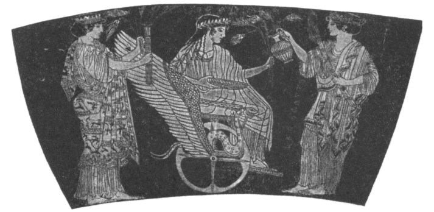
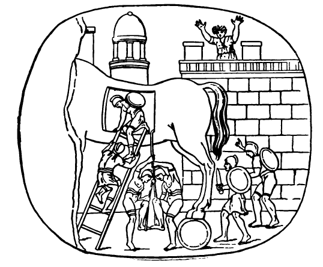

# JULIA: A LATIN READING BOOK 

---

THE MACMILLAN COMPANY 
NEW YORK • BOSTON • CHICAGO • DALLAS 
ATLANTA • SAN FRANCISCO 

MACMILLAN AND CO., Limited 
LONDON • BOMBAY • CALCUTTA • MADRAS 
MELBOURNE 

THE MACMILLAN COMPANY 
OF CANADA, Limited 
TORONTO 

---

Julia

A Latin Reading Book 
Written by 
Maud Reed 
Classical Mistress at Lincoln High School 

With an lntroduction by
Mabel C. Hawes 
Head of the Department of Classical Languages 
High Schools, Washington, D. C. 

New York
THE MACMILLAN COMPANY 
1941 

---

Printed in the United States of America 

All rights reserved—no part of this 
book may be reproduced in any form 
without permission in writing from 
the publisher, except by a reviewer 
who wishes to quote brief passages in 
connection with a review written for 
inclusion in magazine or newspaper. 

Reprinted June, 1924; August, 1924; January, 
1925; May, 1925; August, 1925; May, 1926; 
Deccmber, 1926. May, 1927; June, 1928. 
September, 1929; October, 1934; December, 1935. 
June, 1937 ; November, 1939; March, 1941. 

---

## INTRODUCTION 

American boys and girls could find no more 
delightful companion with whom to spend 
pleasant hours than the little English *Julia*. 
With her they may wander on the seashore, be 
carried off by pirates, and be rescued; with her, 
too, they may listen to the kindly schoolmaster 
as he tells the deathless tales of Greece and Rome. 
Here they may meet, as they should, Romulus 
and Remus, Horatius and Regulus; here they 
may learn, also, of the translation of Romulus 
to the skies, of Bacchus and the pirates, of the 
sacrifice of Iphigeneia, and of the love of Hector 
and Andromache. The selections are well made, 
and while the stories are told with the greatest 
simplicity, they yet achieve a life and literary 
quality that is as far as possible removed from 
the woodenness of the ordinary simplified renderings
Conspicuous among the excellent, for 
sympathy and charm, is the version of the lovely 
tale of Ceres and Proserpina. 

Since the little book accomplishes so well its 
avowed purpose, "to please," Latin teachers 
will welcome it as a valuable ally in the effort 
to interest our children in the treasures of 
Greece and Rome. Professor Dewey has shown us 
that true interest is not a weak surrender to the 
pleasure of the moment but is essential to all 
serious work; and the fact that Latin teachers 
have accepted this principle is evidenced by the 
multiplication of Latin plays, Latin games, and 
stories, Roman motion pictures, and various 
teaching devices that relate Latin to childhood. 
Among the best of such material is *Julia*, a 
veritable Mercury—or shall we say Iris?—with a 
message for Latin beginners when used as a 
class text, for more advanced classes when used 
as supplementary reading, for Latin clubs, and 
for the elect as private reading. 

Mabel C. Hawes. 

Washington, D. C. 

January, 1924. 

---

## PREFACE 

It is sometimes said that in the early stages Latin 
is not an interesting subject, that the pupil's 
interest should lie rather in his own progress 
than in the subject itself. Now in the first place 
it is hard to believe that no matter what the 
study, one's interest should be directed mainly 
toward oneself. Moreover with all that Borne 
means to us in history, with all that Italy, both 
past and present, means to the ordinary educated 
English-speaking person, it seems to me 
that if we cannot make Latin interesting for 
itself and from the very first, it is our own fault. 
It is the gateway into a magic country and can 
be made extremely interesting to the youthful 
student of Latin. 

This little book is intended to be before everything
else, a story book, and its first object is to 
please. The constructions have been made as easy 
as possible, in order to give the child confidence 
from the beginning. Nowadays classes are often 
very large, and if translation is done in class, it is 
difficult to keep up the interest while a complicated 
construction is being puzzled out. If on the other 
hand, the translation is done at home, the confidence, 
and with it the interest, of the child may 
be marred from the first by difficulties that are 
beyond him. 

Rather a large number of words has been used, 
but the looking up of words does not delay a child 
much, and moreover, at that age memory work is 
easy. Also children brought up on a small 
vocabulary are sometimes dismayed when faced 
with a Latin author for the first time. 

Explanations of rules and idioms have not been 
given, because this is so much more easily done by 
the teacher, and it is far better that they should 
form part of the child's memory than that he should 
rely on the written word. The accidence has been 
introduced as gradually as possible—the personal 
pronouns about a third of the way through the 
book, the demonstratives towards the end. Words 
like "alius" have been used at an early stage, but 
only in their regular forms. 

A few passages from Latin poets have been 
introduced, but they can be taken or omitted at 
the teacher's discretion. If the teacher will read 
and translate them, the class will catch the metre 
and have an idea of what is to come. It is as 
though when out for a walk with children one 
should draw attention to some place, visible but 
for the moment inaccessible. Its very distance 
will give it an added interest, and when later it 
can be attempted, it will be greeted as a friend. 

I should like to express my gratitude to Mr. 
W. E. P. Pantin, M.A., of St. Paul's School, for 
kindly helping me with hints and suggestions at 
various stages of the book. 

M. R. 

---

## CONTENTS 

[Iulia](#Iulia) - 1

[Italia](#italia) - 5

[Roma](#roma) - 6

[Ceres et Persephone](#ceres-et-persephone) - 7

[Romulus et Sabinae](#romulus-et-sabinae) - 13

[Mars Romulum in Caelum Vocat](#mars-romulum-in-caelum-vocat) - 15 

[Horatius Puer](#horatius-puer) - 17 

[Bacchus et Piratae](#bacchus-et-piratae) - 19

[Horatius Codes](#horatius-codes) - 22 

[Iphigeneia](#iphigeneia) - 29 

[Cyrus, Croesus, Solon](#cyrus-croesus-solon) - 34 

[Musae et Cicadae](#musae-et-cicadae) - 38 

[Romulus et Remus](#romulus-et-remus) - 40 

[Mettius Curtius](#mettius-curtius) - 46 

[Regulus](#regulus) - 48 

[Hector et Andromache](#hector-et-andromache) - 51 

[Equus Troianus](#equus-troianus) - 55 

[Orpheus et Eurydice](#orpheus-et-eurydice) - 58 

[Vocabulary of New Words in each Section](#vocabulary-of-new-words-in-each-section) - 62 

[Vocabulary of Words used in Quoted Passages](#vocabulary-of-words-used-in-quoted-passages) - 80

[General Vocabulary](#general-vocabulary) - 82

---

Persian Archers. 

Persian men wore elaborate dresses and a great deal of jewellery. 

Notice their earrings and bracelets. 

---

## IULIA

### I 
Iulia puella parva est. Prope oram maritimam 
habitat. Britannia est Iuliae patria. Puellae 
Britannicae oram maritimam amant. Nautas 
quoque amant puellae Britannicae. Iulia est 
filia agricolae et casam parvam habitat. Sed 
Iulia oram maritimam et nautas amat. Nautae 
quoque Iuliam amant. Saepe prope oram maritimam 
Iulia ambulat. Nautarum filiae cum Iulia 
ambulant, et prope oram maritimam saltant. 
Multae rosae sunt prope Iuliae casam. Rosis 
aquam dat Iulia. Saepe Iulia rosas nautis dat. 
Agricola Iuliam non culpat sed laudat, quod 
rosas pulchras nautis dat. Rubrae et albae sunt 
rosae. Saepe Iulia ad nautarum casas rosas pulchras 
portat. Nautae puellam parvam laudant. 

### II
Ad Iuliae casam pirata venit. Rubra est piratae 
tunica, splendidae sunt galea et hasta. Iulia 
prope casae portam stat et piratam spectat; 
piratae hastam et galeam et tunicam rubram amat 
et laudat. Pirata quoque Iuliam et casam et 
rosas laudat. "O Iulia," inquit, "pulchra es 
puella et pulchrae sunt rosae tuae. Navicula mea 
pulchra est. Alta est prora naviculae meae. In 
extrema navicula sto et naviculam guberno. 
Alba est navicula mea; nunc prope oram maritimam 
stat." Tum Iulia cum pirata ad oram 
maritimam ambulat et naviculam albam spectat. 
Iulia et pirata proram naviculae multis rosis ornant. 
Subito pirata puellam in naviculam iactat. Multae 
sunt lacrimae puellae, sed frustra—pirata in extrema
navicula stat et naviculam gubernat. 

### III 
Agricola ad casam venit. Filia parva non 
est in casa. Tum agricola, "Iulia," exclamat, 
"filia mea, ubi es?" Iterum Iuliam vocat, sed 
frustra—nulla est puella. Cena non est in 
mensa parata, nec rosae in mensa sunt. Tum ad 
oram maritimam properat et procul naviculam 
albam spectat. Ad nautarum casas properat. 
Nautarum filiae perterritae, "Cum piratis," inquiunt, 
"est Iulia tua." Magna est ira agricolae. 
Galeam et hastam raptat. Nautae naviculam 
suam agricolae dant. Nautae quoque galeas et 
hastas raptant, et cum agricola ad piratarum 
naviculam properant. Tum agricola piratas vocat;
"Ubi," inquit, "est filia mea?" Piratae, "Filia 
tua," inquiunt, "in navicula nostra est." Tum 
agricola pecuniam multam piratis dat. Piratae 
luliam ad agricolae naviculam portant. 

### IV 
Laeta est Iulia quod iterum casam parvam cum 
agricola habitat. Sed Iulia puella duodecim 
annorum iam est. Itaque agricola filiae suae 
tabulas dat. Pecuniam quoque ludi magistro dat. 
Cotidie puella ad ludum per agros ambulat. Multi
iuvenci in agris sunt, sed impavida est puella. 
Tabulas ad ludum Iulia portat. In tabulis 
litterae multae sunt. Ludi magister luliam laudat 
quod litteras bene cotidie recitat. In ludo multi
pueri, multae puellae cum Iulia sunt. Magister 
ludum bene gubernat. Industriis pueris magister 
libros pulchros dat; pigros malosque pueros 
non laudat sed culpat. Magna est ira magistri
quod pueri pigri litteras non bene recitant. Itaque 
pueri pigri in angulis stant. Multae sunt lacrimae 
puerorum malorum. Itaque pueri industrii sunt 
et litteras bene recitant. Iulia prandium ad 
ludum cotidie portat, quod longa est via. In 
agris prandium est luliae gratum. 

Multas fabulas pueris et puellis magister benignus 
in ludo narrat; nunc de Britannia, nunc de 
longinquis terris fabulas narrat. Gratae pueris 
et puellis sunt fabulae. Nunc igitur in libro non 
solum luliae sed multis etiam pueris et puellis
fabulas narro. 

---

## ITALIA 

### V 
Caeruleum est Italiae caelum. Itali caelum 
caeruleum amant. Britannis quoque caelum 
caeruleum gratum est, sed non saepe Britanniae 
caelum caeruleum est. Italiae agricolae olivas 
et vineas laudant, iuvencis albis agros arant. 
Placidi sunt oculi iuvencorum. Placidi et pulchri
sunt iuvenci. Italiae agricolis grati sunt iuvenci. 
Britannici agricolae non iuvencis sed equis agros 
arant. Validi et pulchri sunt equi magni. In 
Italia clivi multi sunt. Itali in clivis parvis 
oppida aedificant. Oppidani oppida in clivis 
habitant. In campo vineae et olivae sunt—in 
clivis oppida. Per campos viae Romanae sunt. 
Longae et rectae sunt viae Romanae. Oppidani 
olivas et uvas, agricolae pecuniam desiderant. 
Itaque oppidani pecuniam agricolis dant, et per 
vias Romanas agricolae olivas et uvas ad oppida in 
plaustris portant. 

---

## ROMA

### VI 
Olim Romani oppidum parvum habitabant. Nunc 
magna et splendida est Roma; magnae et latae 
sunt oppidi viae. In angulis viarum rosae sunt; 
Romani templis et monumentos vias ornant. 
Olim in Foro Romano templa multa et splendida 
erant. Cotidie viri Romani in Foro ambulabant. 
Albae erant togae virorum, sed rubrae et caeruleae 
et croceae erant pallae feminarum. Arae quoque 
in Foro erant. In aris Romani victimas multas 
Deis Romanis mactabant. Non iam templa sunt 
in Foro Romano. Non iam mactant Romani 
victimas in aris. Sed etiam nunc pulchrum est 
Forum Romanum. Multae sunt ruinae; rosae 
multae inter ruinas sunt. Inter ruinas et rosas 
lacertae parvae properant. Pulchrae et iucundae 
sunt lacertae. Cicadae quoque undique cantant. 
Lacertis et cicadis gratum est caelum caeruleum. 

---

## CERES ET PERSEPHONE

> *That fair field* 
>
>*Of Enna, where Proserpin gathering flowers,* 
>
>*Herself a fairer flower, by gloomy Dis* 
>
>*Was gathered—which cost Ceres all that pain* 
>
>*To seek her through the world.*
>
> Milton.[^1]

### VII 
Nunc unum Deum adorant et Itali et Britanni. 
Sed olim Romani multos deos, multas deas, adorabant. 
De deis Romanis fabulas narrabo. Ceres 
erat dea frumenti; in agris frumentum, in pratis 
herbam curabat. Flavum est frumentum; flavi 
erant Deae capilli. Caerulea erat Deae palla. 
Persephone erat filia Deae. Ceres filiam caram 
vehementer amabat. In insula Sicilia Ceres cum 
filia habitabat. Olim Persephone in pratis errabat. 
Cum puella aliae puellae errabant, nam locus 
herbosus fuit gratus puellis laetis. In prato
herboso puellae saltabant et cantabant. Multae 
rosae, multa lilia, in pratis erant. Lilia alba 
puellas delectabant. Sed Pluto, patruus puellae, 
Deae filiam procul spectavit et statim puellam 
vehementer amavit. Subito equos caeruleos incitavit
et per prata properavit, et puellam perterritam 
raptavit. Tum Persephone, "O Ceres," 
exclamat, "ubi es? Patruus meus filiam tuam ad 
Inferos portat." 

### VIII 
Ceres non in Sicilia erat, sed iam ad insulam 
properavit. Nusquam erat Persephone. Tum 
Dea, irata et perterrita, passis capillis per terras 
errabat. Per clivos altos, per campos latos, per 
silvas et agros, per terras et caelum filiam vocabat. 
Frustra agricolas, frustra lunam et stellas rogabat: 
"Ubi est filia mea?" Sed neque agricolae neque 
luna neque stellae puellam Deae monstraverunt. 
Non iam Deae miserae gratum erat frumentum; 
non iam herba erat in pratis, neque uvae purpureae 
in vineis, neque poma in agris, quod Dea irata 
neque herbam neque vineas neque poma curabat. 
Frustra iuvenci albi agros arabant. Non iam 
cibum in plaustris magnis ad oppida portabant. 

### IX 
Tandem Ceres prope parvam agricolae casam in 
saxo gelido sedebat. Dea maesta diu lacrimabat. 
Tum e casa puella parva ad Deam venit. Puellae 
oculi pleni erant lacrimarum. "Puerum parvum," 
inquit, "habemus. In cunis aeger iacet. Lacrimamus, 
quod aeger est puer." Tum Ceres lacrimas 
suas tenuit, et cum puella ad casam properavit. 
Ibi Metanira filium aegrum in gremio tenebat. 
Filius Metanirae Triptolemus erat. Lacrimabant 
et agricola et Metanira et puella parva, quod non 
valebat puer. Tum Ceres puero osculum dedit, 
et ecce! statim valuit puer. Mirum et divinum 
est osculum Deae. Laeti erant et agricola et 
Metanira et puella. Iam laetus et validus puer 
in cunis dormitabat. Tum Ceres Triptolemum in 
gremio suo tenuit. Dea cum tota familia cenam 
habuit; in mensa erant uvae purpureae et poma 
iucunda. Adhuc ignota erant Italis Graecisque 
et vinum et frumentum. Deae tamen flavae grata 
erat rustica cena. Post cenam in agricolae casa 
Dea manebat et cotidie Triptolemum curabat. 

### X 
Iam luna et stellae in caelo fulgebant. Umbrae 
terras et pontum profundum celabant. Per 
terras viri et feminae animos somno laxabant. 
Sed somnus Metaniram non tenebat; furtim Deam 
cum puero spectabat. Ceres prope pueri cunas 
stabat. Verba mira et divina cantabat. Tum 
puerum in gremio tenuit, et ad focum ambulavit. 
Ecce! Triptolemus in foco inter flammas iacebat; 
sed laetus erat puer; neque focum neque flammas 
timuit. Sed Metanira perterrita, "O fili mi," 
exclamavit, et ad focum properavit. Tum Dea 
irata puerum e flammis raptavit et humi iactavit,
et Metanirae, "O femina," inquit, "stulta et 
scelerata fuisti. Non deus erit Triptolemus, quod 
stultae feminae est filius. Sed in deae gremio 
iacuit; itaque vir magnus erit. Et ego et Persephone,
filia mea, Triptolemum docebimus et 
curabimus. Agricolarum magister erit, nam frumentum
et vinum agricolis monstrabit."

### XI 
Tum Ceres ex agricolae casa ambulavit. Sed 
fleverunt familia et flevit Triptolemus, quod non 
iam in Deae gremio dormitabat. Mane agricola 
viros et feminas loci convocavit, et Deae dicta et 
facta narravit. Deinde viri et feminae saxa multa 
apportaverunt et templum magnum aedificaverunt. 
In templi aris victimas mactaverunt, et Deam 
adoraverunt. Grata erant Deae dona populi, et 
Ceres templum diu habitabat. Interea in aris 
aliorum deorum neque poma neque uvae neque 
rosae iacebant. Non iam herba in pratis, non iam 
poma in agris florebant, quod adhuc Ceres propter 
filiam flebat. Itaque Iuppiter Deae, "Pluto," 
inquit, "filiam tuam habet. Persephone regina 
Inferorum est. Sed Mecurius ad regnum Inferorum 
properabit, et puellam ad templum tuum celeriter 
apportabit." Deinde Mercurius ad Inferos properavit.
Persephone cum viro suo in lecto sedebat. 
Misera erat puella, quod adhuc Deam caram 
desiderabat. Sed Mercurium videbat et laeta fuit. 
"Iterum," inquit, "Deam caram videbo, iterum 
Ceres filiam suam habebit." Tum Pluto verbis 
benignis puellam oravit: "O Persephone, memoriae 
tuae gratus Semper erit Pluto; iterum regina 
Inferorum eris. Nunc caeruleum est caelum, 
iucunda sunt prata, sed mox gelidum erit caelum, 
gelidi erunt et venti et agri. Tum iterum virum 
tuum et regnum Inferorum desiderabis. Vale, 
O cara regina." 

**The Departure of Triptolemus.** 

When Triptolemus grew up, Ceres and Persephone sent him 
through the world in a magic car to teach the arts of agriculture. He holds ears of corn and a cup for wine. It is like the cup held by Croesus. The goddesses hold torches; these 
were used in their worship. 

### XII 
Tum Persephone cum Mercurio e regno Inferorum 
properavit. Mercurius equos validos incitavit, 
et equi per clivos altos, per campos latos libenter 
properaverunt. Tandem Persephone templum 
Deae flavae videbat. Puella laeta verbis laetis 
Deam vocavit. Ceres magno gaudio e templo
evolavit, et filiae carae oscula multa dabat. 
Subito per terras herba in pratis, uvae in vineis 
undique florebant, quod non iam flebant Ceres et 
Persephone. Ceteri quoque dei laeti erant, quod 
agricolae ad templa dona multa apportabant et 
in aris victimas mactabant. 

---

## ROMULUS ET SABINA

### XIII 
Romulus erat Martis filius. Mars erat deus belli 
et armorum. Milites Romani Martem adorabant 
et in Martis aris victimas mactabant. Romulus 
igitur milites et arma vehementer amabat. Urbis 
Romae primus rex erat. Sed viri solum urbem 
habitabant; neque uxores neque sorores habebant. 
Itaque Romulus totum populum convocavit, et
"O cives," inquit, "nullas feminas habemus, sed 
Sabini civitatem finitimam habitant. Sabini 
feminas multas et formosas habent. Sabinos 
igitur cum feminis ad ludos invitabimus, et virgines 
raptabimus." Romani igitur Sabinos ad ludos 
magnos invitaverunt. Pax erat inter Romanos et 
Sabinos. Itaque Sabini ad ludos Romanorum 
libenter properaverunt. Nec scuta nec gladios nec 
hastas apportaverunt. Cum Sabinis virgines 
multae et formosae properaverunt. Sabini ludos 
Romanorum spectaverunt. In mediis ludis 
Romani magna voce subito clamaverunt, et ecce! 
virgines Sabinas raptaverunt et ad casas portaverunt. 
Frustra matres lacrimaverunt, frustra
viros in arma incitaverunt. Romani scuta et 
gladios et hastas habebant; Sabinis nec scuta nec 
gladii nec hastae fuerunt. 

### XIV 
Maesti igitur et irati Sabini ad terram Sabinam 
properaverunt. Per totam hiemem ibi manebant 
et arma diligenter parabant. Via est longa inter 
Romam et terram Sabinam. Sed tandem Sabini, 
iam armati, ante portas urbis Romae stabant.  
"O Romani," inquiunt, "pro filiabus nostris, pro 
sororibus nostris fortiter pugnabimus." Deinde 
Sabinae e casis Romanorum passis capillis evolaverunt;
parvulos portaverunt et patribus fratribusque 
monstraverunt. Patres fratresque suos 
multis lacrimis oraverunt. "Nunc," inquiunt, 
"in casis Romanis laetae et placidae habitamus; 
liberos caros habemus et vehementer amamus; 
et Sabinos et Romanos amamus. Si Romani cum 
Sabinis pugnabunt, Romani Sabinos, Sabini 
Romanos necabunt. Tum Sabinae nec viros nec 
patres nec fratres habebunt. O patres, valete! 
non iam Sabinae sed Romanae semper erimus 
filiae vestrae." 

---

## MARS ROMULUM IN CAELUM VOCAT

### XV 
In angulo Tiberis Campus Martius iacebat. In 
Campo Martio iuvenes Romani corpora diligenter 
exercebant. Ita firma et valida habebant corpora. 
Post ludos in flavis Tiberis undis natabant. Ita 
Tiberis corpora fessa recreabat. 

Hic forte Romulus civibus suis iura dabat; 
bonos cives laudabat; malos cives culpabat. 
Subito fulminis fragor populum perterruit; magni 
de caelo imbres viros feminasque fugaverunt. 
Romulus solum serenus impavidusque manebat; 
Martem patrem in caelo videbat. Tum Mars 
filium verbis benignis vocavit: "Satis," inquit,
"in terris regnavisti; nunc in caelo et in stellis 
cum patre tuo ceterisque dis regnabis. Filium 
meum ad caelum portabo." Tum equos miros 
incitavit. Romulus cum patre ad stellas properavit. 

### XVI 
Caelum iterum serenum erat. Iam Romani in 
Campo Martio iterum ambulabant, sed regem 
nusquam videbant. Mox autem Iulius, iuvenis 
Romanus, per viam Romanam iter ad urbem 
tenebat. Subito a sinistra, magnum et serenum, 
Romulum prope viam videbat. Vehementer 
timuit—capilli in capite horruerunt. Sed Romulus 
verbis benignis, "O Iuli," inquit, "nulla est causa 
timoris. Nunc Quirites numen meum adorabunt 
et Romulum Quirinum vocabunt. Templa et 
aras aedificabunt, et ad aras dona apportabunt. 
Semper artem belli et arma curabunt, et corpora in 
armis diligenter exercebunt. Ita Quirinus Populum 
Romanum servabit." Itaque Iulius Romuli 
dicta populo narravit, et Quirites templum rotundum
aedificaverunt. In templo rotundo Quirini 
numen adorabant. 

---

## HORATIUS PUER

> *carmina non prius*
> 
> *audita Musarum sacerdos*
> 
> *virginibus puerisque canto.[^2]*
> 
>Horace.[^3] 

### XVII 
Fabulam de Horatio, poeta praeclaro, nunc vobis 
narrabo. Apulia regio est Italiae. Multas silvas, 
multos et amoenos campos habet. In pr�atis 
herbosis multi greges, multa equorum boumque 
armenta errant. Hic olim Horatius habitabat, 
parvulus adhuc et matri patrique carus. Forte 
servos, forte patrem matremque fefellit, et solus 
per prata amoena errabat. Grati puero erant 
flores et herba et rura divina. Mox autem puer, 
ludo et erroribus fessus, in valle herbosa iacuit et 
animum somno profundo laxavit. Interea parentes 
solliciti puerum diligenter quaerebant. Et 
parentes et servi vehementer timebant. "Lupi 
saevi," inquiunt, "et ursi silvas incolunt. Lupus 
fortasse puerum etiam nunc crudeliter necat." 
Itaque diu et diligenter puerum quaerebant. 

### XVIII 
Tandem in caelo columbas albas videbant. 
Columbae per caelum undique volabant et folia ad 
locum herbosum portabant. Parentes ad locum 
contenderunt et ecce! Infans in herba placidus 
impavidusque dormitabat; columbae in terra, in 
arboribus passim sedebant; columbae per caelum 
volabant, et parvuli corpus foliis tegebant. Nec 
lupi nec ursi infantem necaverant, quia Musae 
poetam etiam infantem semper conservant. 

Post multos annos Horatius, iam adolescens, 
Romam, magnam urbem, incolebat. Sed divina 
rura et vitam rusticam semper laudabat. Musae 
per multa pericula poetam conservaverunt. 
Horatii carmina per totum orbem terrarum etiam 
nunc nota et praeclara sunt. Vos quoque Horatii 
carmina mox legetis et in memoriae tabulis scribetis. 

---

## BACCHUS ET PIRATAE

>*'Twas Bacchus and his kin!* 
>
>*Like to a moving vintage down they came,* 
>
>*Crown'd with green leaves, and faces all on flame;* 
>
>*All madly dancing through the pleasant valley,* 
>
>*To scare thee, Melancholy!* 
>
>Keats.[^4] 

### XIX 
Inter deos Romanos agricolae non solum Cererem 
sed Bacchum quoque adorabant et in summo honore 
habebant. Bacchus enim vinum hominibus dedit 
et multas artes docuit. Ad Bacchi aras agricolae 
dona multa, et in primis uvas vinumque iucundum, 
ferebant, et aras floribus laetis pampinisque 
ornabant. Deus igitur vites Italicas curabat, et a 
periculo defendebat. Formosus erat Deus, et, 
quod vites amabat, capillos suos pampinis saepe 
ornabat. Nec Italos Graecosque solum docebat, 
sed ad longinquas tenas navigabat, aliisque gentibus 
vinum dabat, artesque rusticas docebat. 

###  XX
Deus, ubi trans mare Aegaeum quondam 
navigabat, ad insulam parvam navem gubernavit, 
et erroribus longis fessus, se in ora maritima 
prostravit et somno placido corpus animumque 
recreabat. Mox autem piratae quoque, mali 
homines, navem ad insulam impulerunt. Ubi 
iuvenem formosum in ora viderunt, tum vero 
magno gaudio, "Ecce!" inquiunt, "non sine 
praeda ad patriam nostram navigabimus. Hominem 
raptabimus et in navem furtim imponemus, 
tum cito cum captivo ad Africam navem 
impellemus. Africae incolae servos desiderant, 
et pecuniam multam nobis dabunt, si nos iuvenem 
tam pulchrum tradiderimus." Tum piratae, mali 
ignavique homines, deum raptaverunt et in navem 
imposuerunt; nec tamen iuvenem fessum e 
somno excitaverunt. 

### XXI
Ubi autem Bacchus e somno se excitavit, et undas 
caeruleas undique vidit, tum nec iratus nec 
perterritus, "Non ego," inquit, "stultos ignavosque 
timeo; mox tamen piratae numen meum 
videbunt et vehementer timebunt." Tum e media 
nave vitis florebat et in altum ascendebat. E
vite rami, e ramis pampini florebant, et de summis 
ramis uvae purpureae pendebant. Non iam candida 
erant vela, sed luce purpurea fulgebant. 

Ubi nautae vitem miram in media nave viderunt, 
tum magno timore Deum spectaverunt; 
capilli in capitibus horruerunt. Subito ex undis 
tigres leonesque saevi in navem ascenderunt et in 
nautas perterritos cucurrerunt. Piratae, terroris 
pleni, e nave in mare se prostraverunt. Deinde 
Iuppiter propter misericordiam homines in delphinas 
convertit. Interea Neptunus vela purpurea 
ventis secundis implevit, et solus sub vitium 
umbra Bacchus ad terras longinquas navigavit. 

---

## HORATIUS CODES

>*It Stands in the Comitium,* 
>
>*Plain for all folk to see;* 
>
>*Horatius in his harness,* 
>
>*Halting upon one knee:* 
>
>*And underneath is written,* 
>
>*In letters all of gold,* 
>
>*How valiantly he kept the bridge* 
>
>*In the brave days of old.* 
>
>Macaulay.[^5]

### XXII 
Romani alterum Horatium memoria tenebant et 
in summo honore habebant. 

Post Romulum sex reges deinceps in urbe 
regnabant. Sed Tarquinius, ultimus regum, superbus 
et crudelis erat. Nec iura bona populo dabat, 
nec civitatem bene gubernabat. Itaque Romani 
Tarquinium et Sextum, Tarquinii filium, crudelem 
ferocemque adolescentem, ex urbe expulerunt.
"Non iam," inquiunt, "Romanis reges erunt.
Cives Romani, non reges, urbem civitatemque 
regent." 

Interea Tarquinius ad Porsennam, omnis 
Etruriae regem, contendit, et omnia narravit. 
Porsenna, "O amice," inquit, "non ferendae sunt 
iniuriae tuae, non ferendae sunt filii tui iniuriae. 
Multi equites, multi pedites mihi sunt. Equites 
peditesque meos omnes convocabo, et cum multis 
militibus te tuumque filium ad urbem sceleratam 
ducemus. Iterum in urbe regnabis." Itaque per 
totam Etruriam, per clivos et agros nuntii contenderunt, 
et ex omnibus vicis Etruscos ad arma 
convocaverunt. Splendida erant arma Etruscorum; 
cristae rubrae in galeis horrebant; scuta 
luce corusca fulgebant. Porsenna cum militibus 
Romam contendit. Per omnes vicos agricolae 
vehementer timebant. Etrusci frumentum casasque 
incenderunt, arbores exciderunt, mulieres 
liberosque necaverunt, multam praedam raptaverunt.

Italian Warrior

### XXIII 
Interea Porsennae facta Romanos non fefellerunt. 
Virgines vestales prope ignem sacrum deos orabant; 
matronae cum liberis suis dana ad templa ferebant; 
senes victimas in aris mactabant; iuvenes in 
Campo Martio se ad arma proeliumque parabant, 
et moenia multo labore firmabant; vigiles in 
moenibus stabant et campos clivosque spectabant. 
Subito vigiles corusca Etruscorum arma procul 
viderunt. Mox inter hostes Porsennam, et Porsennae 
a dextra Sextum, viderunt. Deinde cives 
odii et terroris pleni magna voce clamaverunt et 
animos ad proelium firmaverunt. Sed consules 
timebant, quod pauci erant Romani, multi et 
validi hostes. 

### XXIV 
Hostes ante urbis muros castra posuerunt. 
Castra vallo et fossa firmaverunt. Tum e castris 
excesserunt et moenia Romana oppugnaverunt. 
Fortiter et ferociter pugnabant Romani, sed 
Etrusci validi Romanos paene vicerunt. Iam e 
parte urbis Romanos fugaverant; iam omnia 
trans flumen vicerant. Terroris pleni consules,
"Ecce! "inquiunt, "prope pontem sunt! si 
pontem tenebunt, totam urbem vincent." Tum 
Horatius, vir fortis, "O consules," inquit, "in 
extremo ponte angustus est locus; multi sunt 
hostes, sed pauci solum ibi intrabunt. Vos 
pontem cito excidetis, ego cum duobus amicis 
contra hostes in angusto loco pugnabo. Ita 
omnes pro aris templisque Romanis, pro uxoribus 
liberisque, pro sacris virginibus pugnabimus. Ita 
urbem Romam conservabimus. Quis mecum in 
extremo ponte stabit et contra Etruscos pugnabit ? * 
Tum Lartius, "Ego," inquit, "a dextra stabo, et 
pontem tecum conservabo"; et magna voce 
Herminius, "Ego," inquit, "a sinistra stabo et 
pontem tecum conservabo." 

### XXV 
Tres igitur Romani in angusto loco steterunt. 
Nec Etrusci pugnam detrectaverunt. Tres principes 
contra Romanos procedunt. Superbi et 
splendidi sunt principes; gladiis coruscis in 
Horatium et comites procedunt. Horatius autem 
in hostem fulminis modo ruit, et princeps Etruscus 
magno fragore ad terram cecidit. Lartius 
quoque et Herminius hostes validis hastis vulneraverunt 
et humi prostraverunt. Iterum Etrusci 
milites fortes ferocesque in Romanos miserunt; 
iterum Romani Etruscos necaverunt. Diu et 
acriter pugnabant. Iam multa hostium corpora 
humi iacebant. Etrusci timebant, et Sextum, 
Tarquinii filium, incitaverunt. Sed Sextus quoque 
Horatium timebat et pugnam detrectavit, nec in 
Romanos, tam diros hostes, processit. 

### XXVI 
Cives Romani interea pontem summis viribus 
excidunt. Mox pontem in flumen prosternent. 
Tum Lartius et Herminius hastas in hostem 
iaciunt, et summis viribus per pontem in tutum 
locum ruunt. Horatius autem adhuc in extremo 
ponte stat, et solus in Etruscos ferociter pugnat. 
Romani autem, iam terroris pleni, "O Horati, 
retro," exclamant, "retro—nunc tuta est via; 
mox nullus pons trans flumen erit, et hostes te 
vincent et necabunt." Sed magno fragore pons 
in flumen cecidit, et inter undas spumosas omnia 
ad pontum natabant. 

### XXVII
Horatius iam in hostibus solus manebat. Sed 
adhuc impavidus in fluminis ripa stabat, et Tiberim 
oravit: "O Tiberine pater, te omnes Romani 
adoramus; te patrem vocamus; tu hodie Romani 
militis vitam conservabis, et undis tuis tutum 
portabis." Dixit, et in spumosas Tiberis undas 
desiluit. Multis vulneribus et onere armorum 
fessus, vix in undis spumosis natavit, sed Tiberinus 
pater tam fortem Romanum ad alteram ripam tulit 
et tutum ad cives sollicitos portavit. Magna fuit 
ira Etruscorum, magnum gaudium Romanorum. 
Nomen igitur Horatii inter Romanos et per totum 
orbem terrarum semper erat notum et praeclarum, 
quod pro patria fortiter pugnaverat. Et omnes 
Romani Tiberim flumen semper adorabant, et ad 
fluminis ripas dona libenter ferebant, quia omnium 
Romanorum est pater, et urbem Romam fortemque 
Romanum e ferocibus Etruscis conservavit. 

Amatisne Graecas Romanasque fabulas? Si 
fabulae vos delectant, vos verba mea in tabulis 
scribite, et magistro vestro recitate. Ita fabulas 
praeclaras semper memoria tenebitis. Post paucos 
annos vos, iam adolescentes, multas alias fabulas 
legetis. 

The Poet praises the country life led by the Romans of 
an earlier day : 

>*Hanc olim veteres vitam coluere Sabini,* 
>
>*hanc Remus et frater, sic fortis Etruria crevit* 
>
>*scilicet et rerum facta est pulcherrima Roma,* 
>
>*septemque una sibi muro circumdedit arces.* 
>
>Virgil.[^6] 

---

## IPHIGENEIA [^7]

>*sanguine placastis venios et virgine caesa,* 
>
>*cum primum Iliacas Danai venistis ad oras:* 
>
>Virgil.[^8]

### XXVIII 
In Graecia fratres duo, Agamemnon et Menelaus 
nomine, olim habitabant. Graeci fratres Atridas 
vocabant, quod Atrei filii erant. Agamemnon 
omnium Argivorum rex erat. Menelaus Lacedaemonios 
regebat. Helene, uxor Menelai, praeclara 
et formosa regina, cum viro in regia multos annos 
habitabat. Sed tandem Paris, Troianorum princeps, 
ad hospitium Menelai venit. Perfidus et 
ignavus erat hospes, sed pictis vestimentis, nitidis 
capillis fulgebat. Diu in regia manebat, et gratus 
reginae animo erat hospes formosus. Tandem 
nocte obscura Helenam furtim raptavit et in 
navem imposuit. Vela candida ventis secundis 
dedit, et trans mare ad urbem Troiam properavit. 

### XXIX 
Menelaus, ubi hospitis perfidiam vTdit, ad 
fratrem contendit et omnia narravit. Agamemnon 
ira terribili exclamavit, "Perfidus est Paris; 
perfidum est totum Troianorum genus, sed perfidiae 
stultitiaeque poenas dabunt. Totum exercitum 
meum ad oram maritimam convocabo; equites 
peditesque in naves imponemus, et terra marique 
Troiam oppugnabimus. Ita urbem sceleratam 
excidemus et genus perfidum ad Inferos mittemus. 
Praedam quoque multam nos domum reportabimus. 
Tu quoque Helenam tecum domum ad regiam tuam 
reduces." Agamemnon igitur totum exercitum ad 
portum convocavit. Multi equites multi pedites 
aderant; principes quoque omnes e tota Graecia 
eo convenerunt. Sed venti adversi naves in portu 
diu retinebant. Itaque Agamemnon nuntium ad 
oraculum Delphicum misit, et a Deo responsum 
petivit. Triste et terribile responsum dedit 
Apollo; "Propter iram Diana naves Graecas in 
portu retinet, nec ventos secundos dat. Nunquam 
Graeci ad Asiam navigabunt nisi virginis sanguine 
Deae numen placaverint." 

### XXX 
Rex, ubi oraculi responsum audivit, diu secum 
lacrimabat. "Est mihi domi," inquit, "filia cara, 
Iphigeneia nomine, sedecim annorum puella. Sine 
dubio Diana Iphigeneiam victimam petit. Dira 
et crudelis est Dea; sed non sine dis immortalibus 
ad urbem Troiam navigabimus, et Helenam ex 
urbe perfida domum reportabimus." Nuntium 
igitur ad Clytaemnestram, uxorem suam, misit.
"O Regina," inquit, "filiam nostram ad nuptias 
orna, et cum fidis custodibus ad portum mitte. 
Achilles, vir fortis et praeclarus, virginem in 
matrimonium ducet." Clytaemnestra, ubi regis 
dicta audivit, magno gaudio filiam ad nuptias 
paravit; gemmis pretiosis, vestimentis pictis, 
puellam ornavit, et tandem cum fidis custodibus ad 
portum misit. 

### XXXI 
Itaque magna spe Iphigeneia ad castra Graecorum 
venit. Simul ac reegem vidit, tum cito ad 
patrem cucurrit, et collo caro bracchia candida dedit. 
Sed ubi maestum regis vultum vidit, "Cur," 
inquit, "mi pater, vultu maesto, capite demisso 
filiam tuam salutas? Nonne libenter filiam 
vides?" Tum Agamemnon totam rem filiae 
narravit. Ubi autem Iphigeneia dirum oraculi 
responsum audivit, tum vero gelidus tremor per 
omnes puellae artus cucurrit. Humi se prostravit, 
et patris genua manusque prehendit. Multis 
lacrimis veniam oravit. "Nunquamne," inquit, 
"chorus iuvenum domum ad maritum me ducent? 
Nunquamne liberos dulces videbo et parvulos 
bracchiis meis tenebo, sed innupta ad Manes descendam? 
Sed ubi fatum fixum immotumque sensit, 
tum vero animum ad mortem firmavit et fortem 
nobilemque puellam se praebuit. "Non mortem," 
inquit, "sed ignaviam recuso. Libenter ad Manes 
descendam; morte mea Graecos milites et Graeciam 
patriam conservabo. Non innupta, non sine 
liberis dulcibus ad Inferos descendam. Hades me 
in matrimonium ducet; milites Graeci et Graecia 
patria mihi pro liberis erunt. Ita et Inferi et Superi 
me in summo honore habebunt, quia libenter pro 
patria e vita excessero."

### XXXII 
Dixit, et vultu sereno ad aram processit, et vitam 
cum sanguine fudit. Ubi Graeci, misericordiae et 
amoris pleni, virginem fortem viderunt, ex omnibus 
militibus nemo fere lacrimas retinuit, sed omnes 
gemitum profundum dederunt. 

Graeci igitur, simul ac Dianae numen virginis 
sanguine placaverunt, vela candida vento secundo 
dederunt, et ad Asiae oram navigaverunt. Ibi 
multos annos Troiam vi et armis frustra oppugnabant. 
Tandem, Deorum Immortalium auxilio, 
urbem incenderunt et praedam ingentem domum 
reportaverunt. Helenam quoque Menelaus Spartam 
ad regiam reduxit. 

Nonne nobilem praeclaramque virginem Iphigeneiam 
putatis? Iphigeneiam memoria semper 
tenete, nam pro patria libenter e vita excessit. 
Nonne alii multi pro patria e vita excesserunt? 
Multi et Graeci et Romani et Britanni vitam pro 
patria libenter dediderunt. 

---

## CYRUS, CROESUS, SOLON

### XXXIII 
Olim in Lydia regnabat rex, Croesus nomine, inter 
omnes gentes propter divitias notus. Lydia Asiae 
regio erat, Persiae finitima. Nec procul, trans 
mare Aegaeum, Graeci incolebant. Deos Graecos 
adorabat Croesus, et saepe ad oraculum Delphicum 
dona pretiosissima mittebat; aurum argentumque 
aliasque res pretiosissima mittebat, nam omnium 
regum erat divitissimus. Itaque Graeci Croesum 
amabant, et saepe viatores ad Lydiae oram 
navigabant. Inter viatores forte Solon, vir 
sapientissimus, ad Croesi hospitium venit. Sapientior 
erat quam omnes patriae suae cives. Ubi 
divitias Croesi et omnes res pulcherrimas laudavit, 
tum Croesus, "O hospes," inquit, "nonne me 
omnium hominum beatissimum vocas? Nonne 
ego beatior sum quam omnes patriae tuae cives?"
Sed Solon, "O Croese," respondit, "Hodie sine 
dubio beatus es; olim tamen fortasse curae 
gravissimae te vexabunt. Neminem, adhuc vivum, 
beatum voco."

CROESUS ON THE PYRE. 

Croesus is about to be burned to death. He is pouring out his 
last offering to Apollo. 

### XXXIV 
Post paucos annos Cyrus, Persarum princeps, 
copias in Medorum agros duxit, et totam regionem 
celeriter vicit. Itaque et Mediae et Persiae, 
ingentis regni, rex erat. Croesus, ubi cives Cyri 
facta nuntiaverunt, "Si Cyrus," inquit, "adhuc 
adolescens, tam celeriter Medos superavit, sine 
dubio ego, rex maximus divitissimusque, Cyrum 
superabo." Copias igitur cito collegit et in 
finitimos agros duxit. Sed non bene rem gessit. 
Non diu regis exercitus hostium impetum sustinebat. 
Persae Croesi milites fugaverunt. In Lydiam 
contenderunt et omnia loca ferro et igni vastaverunt; 
homines necaverunt; vicos et frumentum 
incenderunt. Rex perterritus regiam petivit. Eo 
intravit Cyrus. Cyrus, vehementer iratus, "Cur, 
O Croese," rogavit, "sine causa bellum in agros 
meos intulisti? Tu igitur stultitiae tuae poenas 
gravissimas mihi dabis. Servi mei rogum ingentem 
trabibus validis aedificabunt; te in rogum imponent; 
tum te rogumque incendent." 

### XXXV 
Mane igitur servi rogum ingentem paraverunt 
et Croesum eo imposuerunt. Tum Croesus ubi 
calamitatem suam sensit, tristi vultu gemitum ab 
imo pectore dedit, et, Solonis verborum memor, 
"Non falsa," inquit, "Solon, vir sapiens, dixit. 
Ego me omnium hominum beatissimum tot annos 
putabam. Nunc autem nemo per omnes gentes 
miserior est. Superbiae stultitiaeque poenas do." 
Cyrus, ubi Croesi verba audivit, et vultum tristem 
animadvertit, misericordiae plenus, "Et ego," 
inquit, "homo sum. Hodie beatus sum, sed non 
semper fortasse res bene geram. Et ego fortasse 
Veniam a Dis Immortalibus olim petam. Captivum 
igitur vinculis flammisque liberabo." Sed 
iam servi faces lucidas ad trabes porrexerant; 
iam flammae rogum paene cingebant. Croesus 
autem in summo periculo manus ad caelum Deosque 
Immortales porrexit. Apollo imbrem de caelo 
sereno misit, et aquam in rogum effudit. Ita 
Cyrus captivum liberavit, et multos annos Croesum
carum amicum habebat. 

---

## MUSAE ET CICADAE

>*'Tis Apollo comes leading* 
>
>*His choir, the Nine.* 
>
>*—The leader is fairest,* 
>
>*But all are divine.* 
>
>Matthew Arnold.[^9] 

### XXXVI 
Inter montes Graecos vallis iacebat variis floribus 
laeta et omnium rerum fecundissima. De montibus 
aquae frigidae desiliebant, et per campos virides 
fluebant. Multi greges, multa equorum boumque 
armenta in agris clivisque errabant. Vallis montibus 
viridibus undique cingebatur; nulli viatores 
eo intrabant, nec hieme, ubi montes nive candida 
teguntur, nec vere, ubi hirundo arguta nidum sub 
trabibus aedificat. Itaque incolae de rebus externis 
nihil sciebant, sed bene beateque vivebant, 
nec curis sollicitis vexabantur. 

Ad incolas in vallem olim de caelo descenderunt 
Musae. Novem sunt Musae, poetarum carminumque 
deae. A Musis omnes hominum gentes, 
sed in primis poetae, conservantur et docentur. 

### XXXVII 
Musae, simul ac in vallem descenderunt, carmina 
mira et divina cecinerunt. Argutae sunt Musarum 
voces, nec per totum orbem terrarum dulcior est 
sonitus quam cantus Dearum; non tam suaviter 
aves in summis arboribus canunt, ubi vere aera 
cantibus mulcent. 

Miro sonitu delectati sunt incolae. Diu Musae 
canebant; diu incolae, ceterarum rerum immemores, 
stupebant; nec ad cibum nec ad quietem 
tempus capiebant. Multos dies, multas noctes 
Deae canebant, et mane, ubi Aurora croceum 
Tithoni lectum relinquit, et sero, ubi vesper stellas 
in caelum reducit. Ita incolae cenae prandiique 
immemores, mirum sonitum audiebant. Itaque 
propter carminum divinorum amorem indies 
languescebant. 

Tandem Musae incolas iam tenuissimos animadverterunt, 
et misericordiae plenae in cicadas 
virides converterunt. Cicadae igitur, etiam nunc 
carminum divinorum memores, totum diem 
cantant. 

---

## ROMULUS ET REMUS

>*To Romulus* 
>
>*"From sunrise unto sunset* 
>
>*All earth shall hear thy fame:* 
>
>*A glorious city thou shalt build,* 
>
>*And name it by thy name:* 
>
>*And there, unquenched through ages,* 
>
>*Like Vesta's sacred fire,* 
>
>*Shall live the spirit of thy nurse,* 
>
>*The spirit of thy sire."* 
>
>Macaulay.[^10] 

### XXXVIII 
In Foro Romano ruinae sunt templi Vestae rotundi, 
nec procul Virginum Vestalium domus. Hae 
virgines omnium Romanarum sacerrimae putabantur, 
quod ignem sacrum in templo rotundo 
curabant. Hunc ignem Aeneas, Romanorum pater, 
Troia diligentissime apportaverat. Omnium Virginum 
Vestalium notissima erat Rhea Silvia, 
Romuli Remique mater. Haec non Romae sed 
Albae Longae habitabat, nondum enim Roma 
aedificata erat. Aeneas, ubi ad Italiam venit, 
paucos annos in his regionibus habitabat, et 
tandem a Dis Immortalibus ad caelum vocatus 
est. Deinde Ascanius, Aeneae filius, Albam Longam, 
urbem parvam, aedificavit, et ibi multos 
annos laetus regnabat. Post Ascanii mortem, 
alii deinceps reges regnabant. Ex his regibus 
Numitor bene benigneque urbem regebat, et bona 
iura civibus dabat. Sed Numitori frater erat, 
ferox crudelisque vir, Amulius nomine. Hic 
comites copiasque collegit, et contra fratrem 
exercitum duxit. Diu et acriter pugnabant fratres, 
sed Numitoris milites hostium impetum non 
sustinebant, et fuga salutem petiverunt. Itaque 
Numitor e regno a fratre expulsus est. 

### XXXIX 
Amulius igitur urbem iam regebat. Sed Albae 
Longae puella erat, Rhea Silvia nomine, Numitoris 
filia. Hanc puellam timebat Amulius, quod iusti 
regis filia erat, et omnes cives virginem amabant.
"Si huic puellae," inquit, "filius erit, omnes 
cives non me sed puerum iustum regem putabunt. 
Nemo igitur virginem in matrimonium ducet, sed 
ignem sacrum cum virginibus sacris per totam 
vitam curabit." Mars autem regis verba audivit 
et risit. "Non ita," inquit, "rex sceleratus 
fatum vitabit. Ego Rheae Silviae maritus ero; 
mox puellae infantes erunt, filii mei; ubi hi pueri 
adolescentes erunt, tum vero Amulius fatum suum 
sentiet." Nec falsa Deus praedixit. Mox Rhea 
Silvia geminos, Martis filios, in gremio tenebat. 

The Wolf of the Capitol.

### XL 
Amulio, ubi in regia sedebat, cives hanc rem 
nuntiaverunt. Tum vero rex ira et timore vehementer 
commotus est. Itaque servis perterritis,
"Hanc feminam," inquit, "ad Tiberis ripas 
ducite et in undas iacite; perfida mulier perfidiae 
poenas dabit. Geminos quoque ad fluminis ripas 
apportate, sed pueros non ego necabo. Pueros 
in ripa relinquite; lupis fortasse cibum praebebunt." 
Servi igitur Rheam Silviam ad flumen 
duxerunt et in undas iecerunt. Sed Tiberinus 
pater misericordia et amore commotus est. "Mea 
uxor," inquit, "haec puella erit; semper inter 
undas meas tuta et laeta mecum habitabit." 
Itaque Rhea Silvia non necata sed conservata 
est. Post multos annos ubi fluminis undae per 
agros effundebantur, et frumentum vineasque 
prosternebant, tum Romani, "Ecce!" inquiunt,
"etiam nunc iratus est Tiberinus pater, quod nos 
tam crudeliter Rheam Silviam, fluminis uxorem, 
ex urbe expulimus." 

### XLI 
Gemini interea prope fluminis ripam a servis 
relicti erant. Mars autem filiorum non immemor 
erat; lupam ad geminos misit. Lupa, ubi pueros 
vidit, bonam benignamque se praebuit; non enim 
pueros necavit, sed in tutum locum portavit; 
deinde lac geminis, sicut parvulis suis dabat. 
Postea, ubi maiores erant gemini, nec iam lupae 
curam desiderabant, pastores petiverunt, et inter 
pastores diu vitam rusticam agebant. A pastoribus 
Romulus Remusque vocati sunt; nihil autem 
de origine sua sciebant. 

### XLII 
Omnes hos annos Mars filios suos diligenter 
conservabat, et tandem geminis, iam adolescentibus 
omnia monstravit. Tum fratres, propter matris 
avique iniurias irati, "Sine dubio," inquiunt, 
"Amulius harum rerum poenas gravissimas dabit." 
Pastores igitur omnesque agricolas ad arma 
incitaverunt, et cum exercitu rustico ad urbis 
portas contenderunt. Rex quoque copias contra 
Romulum et Remum duxit, sed rem non bene 
gessit. Superatus et necatus est. Tum adolescentes 
avum suum petiverunt, et in regnum 
reduxerunt. Maxime gaudebant oppidani, quod 
iterum Numitorem, iustum regem, Albae Longae 
videbant. 

Postea Romulus urbem sibi aedificavit, et 
Romam, de suo nomine, vocavit. Romani lupam, 
quod Romulum tam diligenter curaverat, semper 
in summo honore habebant. Statuam lupae in 
Capitolio posuerunt. 

Haec statua in Capitolio diu stabat, sed tandem 
fulmine deiecta est. Alia tamen postea in Capitolio 
posita est. Hanc vos quoque fortasse olim 
videbitis. Nec statuam solum sed lupam vivam 
videbitis, nam Romani, urbis suae originis memores, 
etiam nunc lupam vivam in Capitolio habent. 

>*vidimus flavum Tiberim retortis* 
>
>*litore Etrusco violenter undis* 
>
>*ire deiectum monumenta regis* 
>
>*temploque Vestae;* 
>
>*Iliae dum se nimium querenti*
>
>*iactat ultorem.* 
>
>Horace.[^11]

---

## METTIUS CURTIUS 

### XLIII 
Olim in Foro Romano terra discessit, et hiatus 
latus altusque apparuit. Cives omnes saxa plurima 
in hi�atum deiecerunt; hiatus autem nullo modo 
explebatur, sed indies crescebat. Tum cives 
perterriti. "Sine dubio," inquiunt, "Di Immortales 
summam calamitatem Romae praedicunt." 
Itaque Romani e Libris Sibyllinis 
oraculum petiverunt. E Libris Sibyllinis sacerdotes 
responsum mirum civibus nuntiaverunt. 
"Nunquam," inquiunt, "hiatus in Foro Romano 
explebitur, nisi eo omnium rerum pretiosissimam 
Romani deiecerint." Cives igitur ad Forum aurum, 
argentum, gemmas contulerunt, et in hiatum 
deiecerunt. Nihilomagis autem hiatus expletus 
est. Tum Mettius Curtius, eques Romanus. "Una 
res," exclamavit, "Romanis est omnibus aliis 
pretiosior. Nec aurum nec argentum, sed iuvenes 
Romanos, arma Romana, in summo honore habemus. 
Ego iuvenem Romanum, arma Romana, Dis 
Manibus dedico." Tum armis splendidis ornatus, 
equum incitavit et in hiatum desiluit. Statim 
hiatus expletus est, nec postea iterum terra 
discessit. 

---

## REGULUS

### XLIV 
Nulli per totum orbem terrarum cives libentius 
quam Romani se patriae dederunt. 

Alteram fabulam vobis de forti Romano 
narrabo. 

Primo Bello Punico diu Romani a Poenis superabantur, 
quia paucas naves, nec magnum navium 
usum habebant. Sed tandem Romani naves 
optimas aedificaverunt, et Poenos plurimis proeliis 
superaverunt. Itaque Regulum consulem ad 
Africam cum exercitu miserunt. Regulus exercitum 
in Africam terram exposuit. Primo res 
bene gessit; agros ferro et igni vastavit, et magna 
spe Carthaginem contendit. Interea Poeni summis 
viribus copias colligebant, et multa milia peditum 
equitumque in Romanos duxerunt. Acriter pugnabant 
Romani, sed non diu hostium impetum 
sustinebant. Perturbati et fugati sunt. Pauci 
salutem fuga petiverunt, et ad oppidum amicum 
cucurrerunt. Maior pars exercitus aut necati aut 
capti sunt. 

### XLV 
Inter captivos Regulus ipse Carthaginem ductus 
est. Tum summo gaudio Poeni, "Nunc," inquiunt, 
"Romanos vicimus; Romani igitur pacem 
desiderabunt et bonas condiciones ferent. Te, 
Regule, Roman iam mittemus. Tu legati modo 
in Senatum intra—si verbis tuis animos civium 
tuorum ad pacem adduxeris, tu vinculis liberaberis, 
et liber in libera urbe tua habitabis. Sed si 
Romani non ad pacem amicitiamque adducti 
erunt, sed malas condiciones ferent, et Poenos 
odio iraque petent, tu non in urbe tua manebis, sed 
Carthaginem iterum venies, et vinculis mortique 
crudeli te trades." Regulus igitur Poenis fidem 
dedit, et ad patriam celerrime revertit. Sed ubi 
Senatum intravit, non ad pacem amicitiamque 
cives suos adduxit. "Nunc," inquit, "superati 
sunt Romani; malas condiciones ferent Poeni. 
Vos autem meliores fortioresque estis hostibus; 
si igitur bellum summis viribus geretis, et viros 
vos praebebitis, mox vos victores eritis et vestras 
condiciones hostibus feretis. Ego Carthaginem 
navigabo nec fidem violabo. Vos animos ad 
bellum firmate et hostes sub pedibus prosternite. 
Ego nec vincula nec mortem recuso, sed vestro 
amore me dignum praebebo." Deinde Regulus 
fidem non violavit, sed vultu sereno Roma 
discessit et Carthaginem revertit. Ibi vinculis 
mortique se tradidit. 

>*atqui sciebat quae sibi barbarus* 
>
>*tortor pararet; non aliter tamen* 
>
>*dimovit obstantes propinquos* 
>
>*et populum reditus morantem,* 
>
>*quam si clientum longa negotia* 
>
>*diiudicata lite relinqueret,* 
>
>*tendens Venafranos in agros* 
>
>*aut Lacedaemonium Tarentum.* 
>
>Horace.[^12]

---

## HECTOR ET ANDROMACHE

>*He spoke, and stretched his arms to take the child,*
>
>*But back the child upon his nurse's breast*
>
>*Shrank crying, frightened at his father's looks,*
>
>*Fearing the brass and crest of horse's hair*
>
>*Which waved above the helmet terribly.*
>
>*Then out that father dear and mother laughed,*
>
>*And glorious Hector took the helmet off,*
>
>*And laid it gleaming on the ground, and kissed*
>
>*His daring child, and danced him in his arm;*
>
>*And spoke in prayer to Zeus, and all the gods:*
>
>*"Zeu, and ye other gods, oh grant that this*
>
>*My child, like me, may grow the Champion here*
>
>*As good in strength, and rule with might in Troy.*
>
>*That men may say."The boy is better far*
>
>*Than was his sire," when he returns from war,*
>
>*Bearing a gory harness, having slain*
>
>*A foeman, and his mother's heart rejoice"*
>
>*Thus saying, on the hands of his dear wife*
>
>*He laid the child; and she received him back*
>
>*In fragrant bosom, smiling through her tears.*
>
>Charles Kingsley.[^13] 

### XLVI 
Inter Troianos qui tot annos urbem suam contra 
Graecos defendebant, erat Hector, omnium regis 
filiorum fortissimus, et Priamo patri carissimus. 
Hic a civibus suis maxime amabatur et in summo 
honore habebatur. Vehementer a Graecis timebatur, 
ubi ex urbis portis ad proelium ruebat, aut 
ignibus infestis hostium naves vastabat. Cotidie 
Troiani ad arma ab Hectore incitabantur; cotidie 
civium animi ad fortia facta firmabantur. Saepe 
cum Hectore a proelio victores reverterunt. 
Andromache, Hectoris uxor, cum viro filioloque 
in regia habitabat. Nulla ex omnibus Troianis 
mulier magis virum suum amabat, aut viri amore 
dignior erat. Olim Hector, ad proelium ornatus 
e via in regiam venit. Andromache vultu laeto 
virum salutavit et ancillam vocavit, quae filiolum 
in sinu tenebat. Deinde Hector bracchia ad 
puerum porrexit. Sed puer, ubi cristam rubram 
vidit, quae ex patris galea horrebat, perterritus est, 
nec ad patrem venire audebat, sed multis lacrimis 
in ancillae sinu haerebat. Tum vero Hector, vir 
maximus, filio risit, et galeam terribilem humi 
deposuit, et bracchia iterum ad filium porrexit. 
Hic non iam perterritus est, sed risit, et patris collo 
bracchia parvula dedit. 

HECTOR AND ANDROMACHE. 

### XLVII 
Sed Andromache sollicito animo virum his 
verbis culpavit: "O Hector," inquit, "totam 
tuam vitam inter hostes et proelia agis; multi 
sunt hostes, qui te odio iraque petunt, multi 
quorum amicos ad Inferos misisti. E Troianis 
multi iam vulnerati, multi necati sunt. Non 
semper tu ipse vulnera infesta vitabis. Tu igitur 
hodie intra moenia mane, et te tuamque urbem 
conserva. Non enim sine te Troiani urbem contra 
Graecos defendent." Cui Hector respondit, "Hi 
omnes, qui nunc Troiam defendunt, ad me principem 
spectant. Propter meam virtutem custodes 
in moenibus stant, milites ad proelia infesta animo 
forti excedere audent. Si ego proelia detrectabo, 
nee fortem me praebebo, non iam civium amore 
ero dignus. Troiani quoque omnes timidi erunt 
et mox ab hoste vincentur. Deinde Troia vastabitur, 
et vos ad terram alienam in servitutem 
ducemini. Non meum est proelia detrectare, sed 
potius pro patria cadere." Dixit, et oscula filio 
uxorique dedit. Parvulum ancillae tradidit, et 
armis ornatus in viam excessit. Andromache ex 
imo pectore gemitum dedit, et capite demisso 
domum intravit; nam curis sollicitis vexabatur, 
et omnium rerum maxime viri sui mortem timebat. 

>*Torquatus volo parvulus*
>
>*matris e gremio suae*
>
>*porrigens teneras manus*
>
>*dulce rideat ad patrem.*
>
>Catullus.[^14]

---

## EQUUS TROIANUS

>*For well I know, at heart and in my thought,*
>
>*The day will come when Ilios the holy*
>
>*Shall lie in heaps, and Priam, and the folk*
>
>*Of ashen-speared Priam, perish all.*
>
>Charles Kingsley.[^15]

### XLVIII 
Hoc modo Troia tandem capta est. Graeci verbis 
falsis Troianos deceperunt. "O Troiani," inquiunt, 
"in hac terra indies languescimus. Bello 
vulneribusque fessi patriam caram liberosque 
dulces desideramus. Non hic in aliena terra, sed 
domi inter amicos vitam reliquam agere constituimus. 
Iam satis diu bella gessimus; tempus est 
hinc, Deorum Immortalium auxilio, discedere. 
Primum autem Minervae numen dono placabimus. 
Tum illa nos ventis secundis domum reducet."
Deinde Graeci magno labore equum ingentem 
aedificaverunt, cuius latera trabibus validis texerunt. 
Nocte obscura alii deinceps in cava eius 
latera furtim ascenderunt, alii ad naves properaverunt 
et vela candida ventis dederunt. Mane 
decepti sunt Troiani. "Ecce!" inquiunt, "donum 
illud quo Graeci Minervae numen placare constituerunt. 
Domum reverterunt hostes. Nos 
intra moenia monstrum illud ducemus; tum nos 
quoque Dea numine secundo servabit." 

Cives igitur monstrum infestum in urbem 
traxerunt. Iuvenum chorus per vias id duxerunt; 
pueri puellaeque innuptae circum equum saltare 
et canere gaudebant et floribus eum ornare.
"Nunc liberi," inquiunt, "in libera urbe habitamus; 
non iam hostes nos noctes diesque vexant." 

The Wooden Horse. 

### XLIX 
Sed ubi nox umbris profundis terras tegebat, 
Graeci, qui in equo sunt celati, e cavis lateribus 
furtim desiliebant, et facem lucidam comitibus 
monstraverunt. Illi simul ac trans pontum facem 
viderunt, naves rursus ad oram impulerunt. Nulli 
per moenia custodes, nulli in portis vigiles urbem 
defendebant. Per totam urbem cives animos 
fessos somno profundo laxabant. Fluminis modo 
Graeci victores in urbem miseram ruerunt. Omnia 
ferro et igni vastata sunt. Templa domusque 
humi prostrata, iuvenes necati sunt; mulieres ad 
terram alienam in servitutem ductae. 

>*fracti bello fatisque repulsi*
>
>*ductores Danaum, tot iam labentibus annis,*
>
>*instar montis equum divina Palladis arte*
>
>*aedificant.*
>
>*equo ne credite, Teucri.*
>
>*quidquid id est, timeo Danaos et dona ferentes.*
>
>Virgil.[^16]

---

## ORPHEUS ET EURYDICE

>*Orpheus with his lute made Trees*
>
>*And the mountain tops that freeze*
>
>*Bow themselves when he did sing:*
>
>*To his music plants and flowers*
>
>*Ever sprung; as sun and showers*
>
>*There had made a lasting spring,*
>
>Shakespeare (?)[^17] 

### L 
Per omnes gentes praeclarum est Orphei nomen, 
qui omnium poetarum suavissime canebat. Et 
voce arguta et lyra canebat, quo sonitu omnia per 
terras animalia delectabantur. Ille lupos ursosque 
saevosque leones dulci cantu mulcebat; dulcissimum 
erat eis cantum divinum audire. Propter 
carminum amorem flumina inter ripas immota 
stabant, nec iam aquae frigidae ad pontum fluebant. 
Aves, quae in summis arboribus nidos aedificabant, 
laboris immemores circum Orpheum volabant. 
Omnia florum genera sub pedibus eius florebant. 

Uxor erat ei Eurydice nomine, quam maxime 
amabat. Cum ea in pratis nitidis ludere gaudebat. 
Prope Thraciae oram poeta uxorque eius bene 
beateque vivebant. Mox tarnen Eurydice, misera 
puella, morbo tristi languescebat, et ad Inferos 
adhuc iuvenis descendit. Diu Orpheus per totam 
oram solus cum lyra mane seroque errabat, et 
aera cantibus tristibus implebat; non iam agris 
fecundis, non iam laetis iuvenum choris gaudebat. 

Orpheus playing the Lyre. 

Orpheus is wearing Thracian dress, which is more elaborate 
than Greek, but less so than Persian. The fawn is listening to 
the music. 

### LI 
Orpheus tandem ad Manes descendere constituit, 
et saevum Plutonis animum cantu dulci mulcere.
"Fortasse," inquit, "Pluto Persephoneque regina 
voce lyraque mea mulcebuntur, et veniam mihi 
dabunt; fortasse Eurydicen ad virum eius remittent." 
Itaque ad Manes, in regionem tenebrosam 
descendit, unde nemo ad lucem caelumque 
unquam ascenderat. Ibi circum poetam volaverunt 
tenues umbrae eorum qui Superos reliquerant. 
Multae erant umbrae. Matres senesque, 
pueri puellaeque innuptae, quos vulnera infesta 
morbusque tristis ad Inferos miserant, ad poetam 
properaverunt, et carmine miro delectati sunt. 
Orpheus per viam tenebrosam ad regiam venit, 
ubi Hades cum regina in lecto sedebat; tum vero 
voce arguta lyraque cecinit, et ad genua reginae 
se prostravit, et multis lacrimis veniam oravit. 
Illa lacrimis eius cantuque commota est, et,
"Una condicione," inquit," tibi uxorique tuae hoc 
donum dabo. Tu ad Superos statim propera; 
illa post te ad lucem ascendet. Si autem tu oculos 
ad comitem retro reverteris, iterum Eurydice per 
viam tenebrosam descendet; iterum circum 
uxorem tuam tenebrae fundentur." 

### LII
Iam Orpheus magna spe ad Superos ascendebat; 
iam Eurydice post virum ad lucem properabat, 
iam ad extreemas tenebras veniebat. Orpheus, 
verborum reginae immemor, oculos retro ad puellam 
revertit. Tum vero ex imis Inferis fragor ingens 
auditus est. Eurydice, "O Orpheu," inquit,  
"iterum fata crudelia retro me vocant; per artus 
oculosque meos somnus profundus funditur. Vale, 
carissime vir! iterum in noctem tenebrosam 
feror." Dixit, et iam tenuis umbra e manibus viri 
in tenebras fugit. 

>*at cantu commotae Erebi de sedibus imis*
>
>*umbrae ibant tenues simulacraque luce carentum,*
>
>*quam multa in foliis avium se milia condunt,*
>
>*vesper ubi aut hibernus agit de montibus imber,*
>
>*matres atque viri defunctaque corpora vita*
>
>*magnanimum heroum, pueri innuptaeque puellae,*
>
>*inpositique rogis iuvenes ante ora parentum.*
>
>Virgil.[^18]

Haec et alia multa Iulia e benigno ludi magistro 
audiebat. Postea, iam adolescens, ad longinquas 
terras navigavit et ipsa res multas mirasque vidit. 
Vos quoque fortasse ad Italiam Graeciamque olim 
ipsi navigabitis, et illa loca oculis vestris videbitis, 
ubi poetae habitabant, de quibus haec omnia 
narraverunt. 

---

##  VOCABULARY OF NEW WORDS IN EACH SECTION 

Coming eventually...

---

## VOCABULARY OF WORDS USED IN QUOTED PASSAGES

Coming eventually...

---

## GENERAL VOCABULARY 

Coming eventually...

---
## FOOTNOTES

[^1]: Milton in Paradise Lost Book IV lines 268-272.

[^2]: This is real Latin poetry. It is not necessary to the 
story. Ask your teacher to read it to you. 

[^3]: Horace. Carm. III. 1, lines 2-5.

[^4]: John Keats Song of the Indian Maid, from Endymion lines 54-58.

[^5]: From 'Horatius at the Bridge' by Thomas Babington Macaulay. Stanza LXVI.

[^6]: Virgil. Georgics. II. 532-535

[^7]: From this point onwards the marking of long syllables in 
the first and second declensions has in the main been discontinued. 
The long endings in the third declension will be 
marked till the end of Chapter XXXV. 

[^8]: Virgil. Aeneid. II. 116-117

[^9]: Matthew Arnold. Apollo Musagetes. lines 29-32.

[^10]: The Prophecy of Capys from 'Lays of Ancient Rome' by Thomas Babington Macaulay. Stanza XV.

[^11]: Horace. Carm. I. 2, lines 13-18.

[^12]: Horace. Carm. III. 5, lines 49-56.

[^13]: Charles Kingsley. Hypatia Ch. 8.

[^14]: Catullus Carm. 61, lines 216-220.

[^15]: Charles Kingsley Hypatia Ch. 8.

[^16]: Virgil. Aeneid. II. lines 13-16, 48-49.

[^17]: Shakespeare. Orpheus lines 1-6.

[^18]: Virgil. Georgics. IV. lines 471-477.