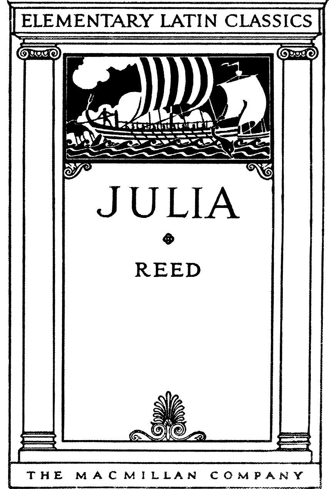
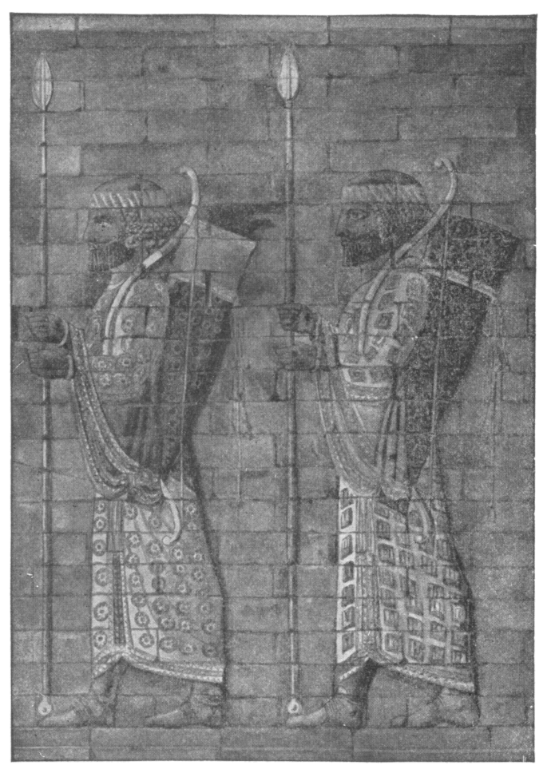
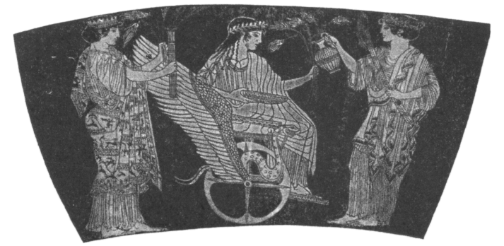
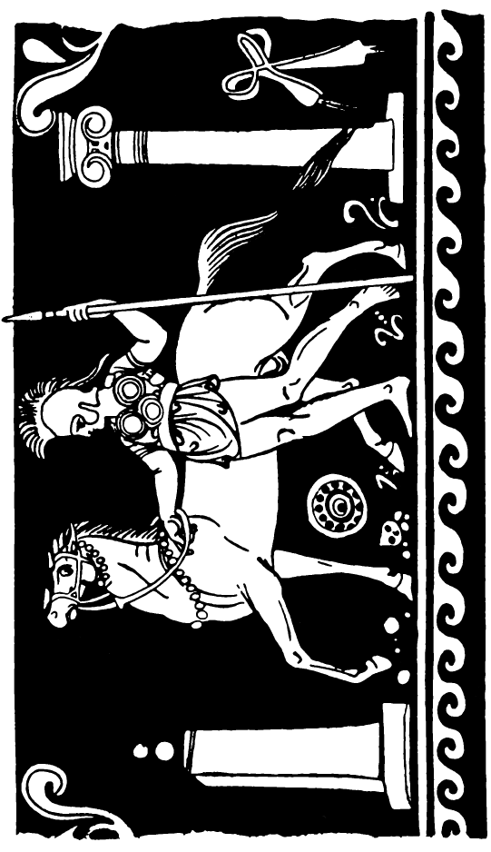
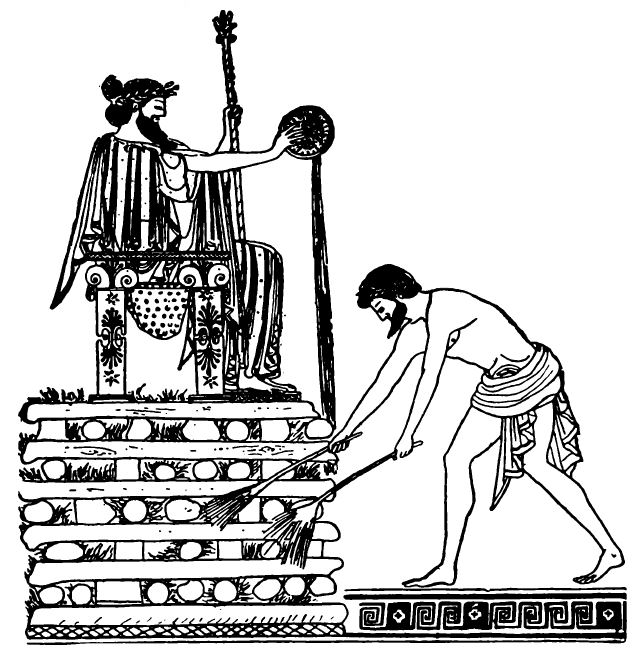
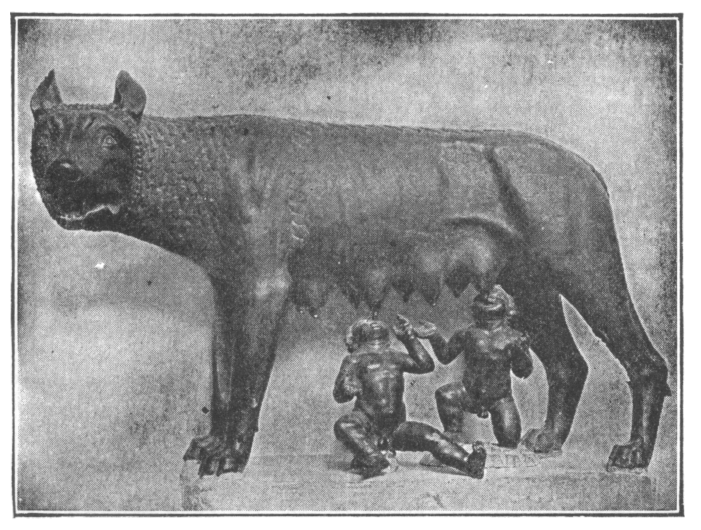
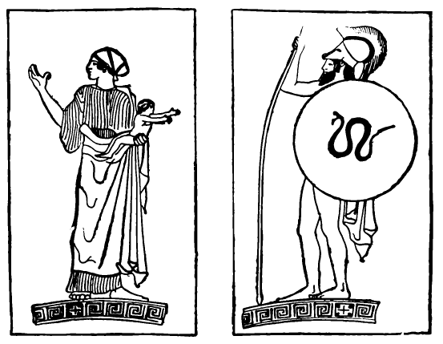
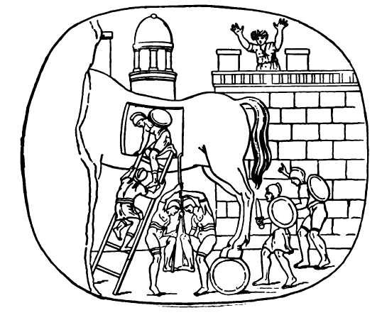
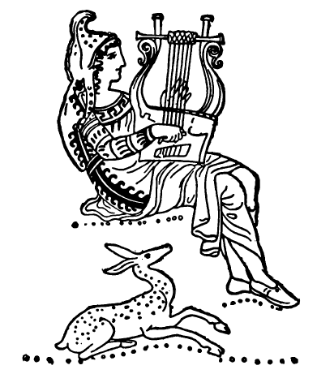

tags: [[Latin Language|Latin]]

# To-Do
- [ ] clean up initial dump
- [ ] create a macron and non-macron version
- [x] create a script to replace macrons with non-macrons that i can use for other books
- [x] fix the contents page
- [ ] updated ToC page to link to headers using Github Markdown spec - in progress
- [x] add all images to appropriate areas
- [ ] add quote sources for all quotes

# Changelog
- [[2022-03-25]] - initial commit; reformatted through story II; cleaned up hyphenated words, ToC, page breaks
- [[2022-03-29]] - added all images; reformatted quotes
- [[2022-03-30]] - corrected common errors in text (punctuation spacing, 0 for O, some common words with macrons)

# Book

# JULIA: A LATIN READING BOOK 

---

THE MACMILLAN COMPANY 
NEW YORK • BOSTON • CHICAGO • DALLAS 
ATLANTA • SAN FRANCISCO 

MACMILLAN AND CO., Limited 
LONDON • BOMBAY • CALCUTTA • MADRAS 
MELBOURNE 

THE MACMILLAN COMPANY 
OF CANADA, Limited 
TORONTO 

---

Julia

A Latin Reading Book 
Written by 
Maud Reed 
Classical Mistress at Lincoln High School 

With an lntroduction by
Mabel C. Hawes 
Head of the Department of Classical Languages 
High Schools, Washington, D. C. 

New York
THE MACMILLAN COMPANY 
1941 

---

Printed in the United States of America 

All rights reserved—no part of this 
book may be reproduced in any form 
without permission in writing from 
the publisher, except by a reviewer 
who wishes to quote brief passages in 
connection with a review written for 
inclusion in magazine or newspaper. 

Reprinted June, 1924; August, 1924; January, 
1925; May, 1925; August, 1925; May, 1926; 
Deccmber, 1926. May, 1927; June, 1928. 
September, 1929; October, 1934; December, 1935. 
June, 1937 ; November, 1939; March, 1941. 

---

## INTRODUCTION 

American boys and girls could find no more 
delightful companion with whom to spend 
pleasant hours than the little English *Julia*. 
With her they may wander on the seashore, be 
carried off by pirates, and be rescued; with her, 
too, they may listen to the kindly schoolmaster 
as he tells the deathless tales of Greece and Rome. 
Here they may meet, as they should, Romulus 
and Remus, Horatius and Regulus; here they 
may learn, also, of the translation of Romulus 
to the skies, of Bacchus and the pirates, of the 
sacrifice of Iphigeneia, and of the love of Hector 
and Andromache. The selections are well made, 
and while the stories are told with the greatest 
simplicity, they yet achieve a life and literary 
quality that is as far as possible removed from 
the woodenness of the ordinary simplified renderings
Conspicuous among the excellent, for 
sympathy and charm, is the version of the lovely 
tale of Ceres and Proserpina. 

Since the little book accomplishes so well its 
avowed purpose, "to please," Latin teachers 
will welcome it as a valuable ally in the effort 
to interest our children in the treasures of 
Greece and Rome. Professor Dewey has shown us 
that true interest is not a weak surrender to the 
pleasure of the moment but is essential to all 
serious work; and the fact that Latin teachers 
have accepted this principle is evidenced by the 
multiplication of Latin plays, Latin games, and 
stories, Roman motion pictures, and various 
teaching devices that relate Latin to childhood. 
Among the best of such material is *Julia*, a 
veritable Mercury—or shall we say Iris?—with a 
message for Latin beginners when used as a 
class text, for more advanced classes when used 
as supplementary reading, for Latin clubs, and 
for the elect as private reading. 

Mabel C. Hawes. 

Washington, D. C. 

January, 1924. 

---

## PREFACE 

It is sometimes said that in the early stages Latin 
is not an interesting subject, that the pupil's 
interest should lie rather in his own progress 
than in the subject itself. Now in the first place 
it is hard to believe that no matter what the 
study, one's interest should be directed mainly 
toward oneself. Moreover with all that Borne 
means to us in history, with all that Italy, both 
past and present, means to the ordinary educated 
English-speaking person, it seems to me 
that if we cannot make Latin interesting for 
itself and from the very first, it is our own fault. 
It is the gateway into a magic country and can 
be made extremely interesting to the youthful 
student of Latin. 

This little book is intended to be before everything
else, a story book, and its first object is to 
please. The constructions have been made as easy 
as possible, in order to give the child confidence 
from the beginning. Nowadays classes are often 
very large, and if translation is done in class, it is 
difficult to keep up the interest while a complicated 
construction is being puzzled out. If on the other 
hand, the translation is done at home, the confidence, 
and with it the interest, of the child may 
be marred from the first by difficulties that are 
beyond him. 

Rather a large number of words has been used, 
but the looking up of words does not delay a child 
much, and moreover, at that age memory work is 
easy. Also children brought up on a small 
vocabulary are sometimes dismayed when faced 
with a Latin author for the first time. 

Explanations of rules and idioms have not been 
given, because this is so much more easily done by 
the teacher, and it is far better that they should 
form part of the child's memory than that he should 
rely on the written word. The accidence has been 
introduced as gradually as possible—the personal 
pronouns about a third of the way through the 
book, the demonstratives towards the end. Words 
like "alius" have been used at an early stage, but 
only in their regular forms. 

A few passages from Latin poets have been 
introduced, but they can be taken or omitted at 
the teacher's discretion. If the teacher will read 
and translate them, the class will catch the metre 
and have an idea of what is to come. It is as 
though when out for a walk with children one 
should draw attention to some place, visible but 
for the moment inaccessible. Its very distance 
will give it an added interest, and when later it 
can be attempted, it will be greeted as a friend. 

I should like to express my gratitude to Mr. 
W. E. P. Pantin, M.A., of St. Paul's School, for 
kindly helping me with hints and suggestions at 
various stages of the book. 

M. R. 

---

## CONTENTS 

[Iūlia](#Iūlia) - 1

[Ītalia](#ītalia) - 5

[Rōma](#rōma) - 6

[Cerēs et Persephonē](#cerēs-et-persephonē) - 7

Rōmulus et Sabīnae - 13

Mars Rōmulum in Caelum Vocat - 15 

Horātius Puer - 17 

Bacchus et Pīrātae - 19

Horātius Codes - 22 

Īphigeneia - 29 

Cȳrus, Croesus, Solōn - 34 

Mūsae et Cicādae - 38 

Rōmulus et Remus - 40 

Mettius Curtius - 46 

Rēgulus - 48 

Hector et Andromachē - 51 

Equus Trōiānus - 55 

Orpheus et Eurydicē - 58 

Vocabulary of New Words in each Section - 62 

Vocabulary of Words used in Quoted Passages - 80

General Vocabulary - 82

---

Persian Archers. 

Persian men wore elaborate dresses and a great deal of jewellery. 
Notice their earrings and bracelets. 

---

## IŪLIA

### I 
Iūlia puella parva est. Prope ōram maritimam 
habitat. Britannia est Iūliae patria. Puellae 
Britannicae ōram maritimam amant. Nautās 
quoque amant puellae Britannicae. Iūlia est 
fīlia agricolae et casam parvam habitat. Sed 
Iūlia ōram maritimam et nautās amat. Nautae 
quoque Iūliam amant. Saepe prope ōram maritimam 
Iūlia ambulat. Nautārum fīliae cum Iūliā 
ambulant, et prope ōram maritimam saltant. 
Multae rosae sunt prope Iūliae casam. Rosīs 
aquam dat Iūlia. Saepe Iūlia rosās nautīs dat. 
Agricola Iūliam nōn culpat sed laudat, quod 
rosās pulchrās nautīs dat. Rubrae et albae sunt 
rosae. Saepe Iūlia ad nautārum casās rosās pulchrās 
portat. Nautae puellam parvam laudant. 

### II
Ad Iūliae casam pīrāta vēnit. Rubra est pīrātae 
tunica, splendidae sunt galea et hasta. Iūlia 
prope casae portam stat et pīrātam spectat; 
pīrātae hastam et galeam et tunicam rubram amat 
et laudat. Pīrāta quoque Iūliam et casam et 
rosās laudat. "O Iūlia," inquit, "pulchra es 
puella et pulchrae sunt rosae tuae. Nāvicula mea 
pulchra est. Alta est prōra nāviculae meae. In 
extrēmā nāviculā sto et nāviculam guberno. 
Alba est nāvicula mea; nunc prope ōram maritimam 
stat." Tum Iūlia cum pīrātā ad ōram 
maritimam ambulat et nāviculam albam spectat. 
Iūlia et pīrāta prōram nāviculae multīs rosīs ornant. 
Subito pīrāta puellam in nāviculam iactat. Multae 
sunt lacrimae puellae, sed frustrā—pīrāta in extrēmā
nāviculā stat et nāviculam gubernat. 

### III 
Agricola ad casam vēnit. Fīlia parva nōn 
est in casā. Tum agricola, "Iūlia," exclāmat, 
"fīlia mea, ubi es?" Iterum Iūliam vocat, sed 
frustrā—nulla est puella. Cēna nōn est in 
mēnsā parāta, nec rosae in mēnsā sunt. Tum ad 
ōram maritimam properat et procul nāviculam 
albam spectat. Ad nautārum casās properat. 
Nautārum fīliae perterritae, "Cum pīrātīs," inquiunt, 
"est Iūlia tua." Magna est īra agricolae. 
Galeam et hastam raptat. Nautae nāviculam 
suam agricolae dant. Nautae quoque galeās et 
hastās raptant, et cum agricolā ad pīrātārum 
nāviculam properant. Tum agricola pīrātās vocat;
"Ubi," inquit, "est fīlia mea? "Pīrātae, "Fīlia 
tua," inquiunt, "in nāviculā nostrā est." Tum 
agricola pecūniam multam pīrātīs dat. Pīrātae 
lūliam ad agricolae nāviculam portant. 

### IV 
Laeta est Iūlia quod iterum casam parvam cum 
agricolā habitat. Sed Iūlia puella duodecim 
annōrum iam est. Itaque agricola fīliae suae 
tabulās dat. Pecūniam quoque lūdī magistrō dat. 
Cotīdiē puella ad lūdum per agrōs ambulat. Multī
iuvencī in agrīs sunt, sed impavida est puella. 
Tabulās ad lūdum Iūlia portat. In tabulīs 
litterae multae sunt. Lūdī magister lūliam laudat 
quod litterās bene cotīdiē recitat. In lūdō multī
puerī, multae puellae cum Iūliā sunt. Magister 
lūdum bene gubernat. Industriīs puerīs magister 
librōs pulchrōs dat; pigrōs malōsque puerōs 
nōn laudat sed culpat. Magna est īra magistrī
quod puerī pigrī litterās nōn bene recitant. Itaque 
puerī pigrī in angulīs stant. Multae sunt lacrimae 
puerōrum malōrum. Itaque puerī industriī sunt 
et litterās bene recitant. Iūlia prandium ad 
lūdum cotīdiē portat, quod longa est via. In 
agrīs prandium est lūliae grātum. 

Multās fābulās puerīs et puellīs magister benignus 
in lūdō narrat; nunc dē Britanniā, nunc dē 
longinquīs terrīs fābulās narrat. Grātae puerīs 
et puellīs sunt fābulae. Nunc igitur in librō nōn 
sōlum lūliae sed multīs etiam puerīs et puellīs
fābulās narro. 

---

## ĪTALIA 

### V 
Caeruleum est Ītaliae caelum. Ītalī caelum 
caeruleum amant. Britannis quoque caelum 
caeruleum grātum est, sed nōn saepe Britanniae 
caelum caeruleum est. Ītaliae agricolae olīvās 
et vīneās laudant, iuvencīs albīs agrōs arant. 
Placidī sunt oculī iuvencōrum. Placidī et pulchrī
sunt iuvencī. Ītaliae agricolīs grātī sunt iuvencī. 
Britannicī agricolae nōn iuvencīs sed equīs agrōs 
arant. Validī et pulchrī sunt equī magnī. In 
Ītaliā clīvī multī sunt. Ītalī in clīvīs parvīs 
oppida aedificant. Oppidānī oppida in clīvīs 
habitant. In campō vīneae et olīvae sunt—in 
clīvīs oppida. Per campōs viae Rōmānae sunt. 
Longae et rectae sunt viae Rōmānae. Oppidānī 
olīvās et ūvās, agricolae pecūniam dēsīderant. 
Itaque oppidānī pecūniam agricolīs dant, et per 
viās Rōmānās agricolae olīvās et ūvās ad oppida in 
plaustrīs portant. 

---

## RŌMA

### VI 
Ōlim Rōmānī oppidum parvum habitābant. Nunc 
magna et splendida est Rōma; magnae et lātae 
sunt oppidī viae. In angulīs viārum rosae sunt; 
Rōmāni templīs et monumentōs viās ornant. 
Ōlim in Forō Rōmānō templa multa et splendida 
erant. Cotīdiē virī Rōmāni in Forō ambulābant. 
Albae erant togae virōrum, sed rubrae et caeruleae 
et croceae erant pallae fēminārum. Ārae quoque 
in Forō erant. In ārīs Rōmānī victimās multās 
Deīs Rōmānīs mactābant. Nōn iam templa sunt 
in Forō Rōmānō. Nōn iam mactant Rōmānī 
victimās in ārīs. Sed etiam nunc pulchrum est 
Forum Rōmānum. Multae sunt ruīnae; rosae 
multae inter ruīnās sunt. Inter ruīnās et rosās 
lacertae parvae properant. Pulchrae et iūcundae 
sunt lacertae. Cicādae quoque undique cantant. 
Lacertīs et cicādis grātum est caelum caeruleum. 

---

## CERĒS ET PERSEPHONĒ

> *That fair field* 
>
>*Of Enna, where Proserpin gathering flowers,* 
>
>*Herself a fairer flower, by gloomy Dis* 
>
>*Was gathered—which cost Ceres all that pain* 
>
>*To seek her through the world.*
>
> Milton.

### VII 
Nunc ūnum Deum adōrant et Ītalī et Britanni. 
Sed ōlim Rōmānī multōs deōs, multās deās, adōrābant. 
De deis Rōmānis fābulās narrābo. Cerēs 
erat dea frūmentī; in agrīs frūmentum, in prātīs 
herbam cūrābat. Flāvum est frūmentum; flāvī 
erant Deae capillī. Caerulea erat Deae palla. 
Persephonē erat fīlia Deae. Cerēs fīliam cāram 
vehementer amābat. In insulā Siciliā Cerēs cum 
fīlīa habitābat. Ōlim Persephonē in prātīs errābat. 
Cum puellā aliae puellae errābant, nam locus 
herbōsus fuit grātus puellīs laetīs. In prātō
herbōsō puellae saltābant et cantābant. Multae 
rosae, multa līlia, in prātīs erant. Līlia alba 
puellās delectābant. Sed Plūto, patruus puellae, 
Deae fīliam procul spectāvit et statim puellam 
vehementer amāvit. Subitō equōs caeruleōs incitāvit
et per prāta properāvit, et puellam perterritam 
raptāvit. Tum Persephonē, "O Cerēs," 
exclāmat, "ubi es? Patruus meus fīliam tuam ad 
Inferōs portat." 

### VIII 
Cerēs nōn in Siciliā erat, sed iam ad insulam 
properāvit. Nusquam erat Persephonē. Tum 
Dea, īrāta et perterrita, passīs capillīs per terrās 
errābat. Per clīvōs altōs, per campōs lātōs, per 
silvās et agrōs, per terrās et caelum fīliam vocābat. 
Frustrā agricolās, frustrā lūnam et stellas rogābat: 
"Ubi est fīlia mea?" Sed neque agricolae neque 
lūna neque stellae puellam Deae monstrāvērunt. 
Nōn iam Deae miserae grātum erat frūmentum; 
nōn iam herba erat in prātīs, neque ūvae purpureae 
in vīneīs, neque pōma in agrīs, quod Dea īrāta 
neque herbam neque vīneās neque pōma cūrābat. 
Frustrā iuvencī albī agrōs arābant. Nōn iam 
cibum in plaustrīs magnīs ad oppida portābant. 

### IX 
Tandem Cerēs prope parvam agricolae casam in 
saxō gelidō sedēbat. Dea maesta diū lacrimābat. 
Tum ē casā puella parva ad Deam vēnit. Puellae 
oculī plenī erant lacrimārum. "Puerum parvum," 
inquit, "habemus. In cūnīs aeger iacet. Lacrimāmus, 
quod aeger est puer." Tum Cerēs lacrimās 
suās tenuit, et cum puellā ad casam properāvit. 
Ibi Metanīra fīlium aegrum in gremiō tenēbat. 
Fīlius Metanīrae Triptolemus erat. Lacrimābant 
et agricola et Metanīra et puella parva, quod nōn 
valēbat puer. Tum Cerēs puerō osculum dedit, 
et ecce! statim valuit puer. Mīrum et dīvīnum 
est osculum Deae. Laetī erant et agricola et 
Metanīra et puella. Iam laetus et validus puer 
in cūnīs dormītābat. Tum Cerēs Triptolemum in 
gremiō suō tenuit. Dea cum tōtā familiā cēnam 
habuit; in mensā erant ūvae purpureae et pōma 
iūcunda. Adhūc ignōta erant Ītalīs Graecīsque 
et vīnum et frūmentum. Deae tamen flāvae grāta 
erat rustica cēna. Post cēnam in agricolae casā 
Dea manēbat et cotīdiē Triptolemum cūrābat. 

### X 
Iam lūna et stellae in caelō fulgēbant. Umbrae 
terrās et pontum profundum cēlābant. Per 
terrās virī et fēminae animōs somnō laxābant. 
Sed somnus Metanīram non tenēbat; furtim Deam 
cum puerō spectābat. Cerēs prope puerī cūnās 
stābat. Verba mīra et dīvīna cantābat. Tum 
puerum in gremiō tenuit, et ad focum ambulāvit. 
Ecce! Triptolemus in focō inter flammās iacēbat; 
sed laetus erat puer; neque focum neque flammās 
timuit. Sed Metanīra perterrita, "O fīlī mī," 
exclāmāvit, et ad focum properāvit. Tum Dea 
īrāta puerum e flammīs raptāvit et humī iactāvit,
et Metanīrae, "O fēmina," inquit, "stulta et 
scelerāta fuistī. Nōn deus erit Triptolemus, quod 
stultae fēminae est fīlius. Sed in deae gremiō 
iacuit; itaque vir magnus erit. Et ego et Persephonē,
fīlia mea, Triptolemum docēbimus et 
cūrābimus. Agricolārum magister erit, nam frūmentum
et vīnum agricolīs monstrābit."

### XI 
Tum Cerēs ex agricolae casā ambulāvit. Sed 
flēvērunt familia et flēvit Triptolemus, quod nōn 
iam in Deae gremiō dormītābat. Māne agricola 
virōs et fēminās locī convocāvit, et Deae dicta et 
facta narrāvit. Deinde virī et fēminae saxa multa 
apportāvērunt et templum magnum aedificāvērunt. 
In templī ārīs victimās mactāvērunt, et Deam 
adōrāvērunt. Grāta erant Deae dōna populī, et 
Cerēs templum diū habitābat. Intereā in ārīs 
aliōrum deōrum neque pōma neque ūvae neque 
rosae iacēbant. Nōn iam herba in prātīs, nōn iam 
pōma in agrīs flōrēbant, quod adhūc Cerēs propter 
fīliam flēbat. Itaque Iuppiter Deae, "Plūto," 
inquit, "fīliam tuam habet. Persephonē rēgīna 
Inferōrum est. Sed Mecurius ad regnum Inferōrum 
properābit, et puellam ad templum tuum celeriter 
apportābit." Deinde Mercurius ad Inferōs properāvit.
Persephonē cum virō suō in lectō sedēbat. 
Misera erat puella, quod adhūc Deam cāram 
dēsīderābat. Sed Mercurium vidēbat et laeta fuit. 
"Iterum," inquit, "Deam cāram vidēbo, iterum 
Cerēs fīliam suam habēbit." Tum Plūto verbīs 
benignīs puellam ōrāvit: "O Persephonē, memoriae 
tuae grātus Semper erit Plūto; iterum rēgīna 
Inferōrum eris. Nunc caeruleum est caelum, 
iūcunda sunt prāta, sed mox gelidum erit caelum, 
gelidī ērunt et ventī et agrī. Tum iterum virum 
tuum et regnum Inferōrum dēsīderābis. Valē, 
Ō cāra rēgīna." 

**The Departure of Triptolemus.** 

When Triptolemus grew up, Ceres and Persephone sent him 
through the world in a magic car to teach the arts of agriculture. He holds ears of corn and a cup for wine. It is like the cup held by Croesus. The goddesses hold torches; these 
were used in their worship. 

### XII 
Tum Persephonē cum Mercuriō ē regnō Inferōrum 
properāvit. Mercurius equōs validōs incitāvit, 
et equī per clīvōs altōs, per campōs lātōs libenter 
properāvērunt. Tandem Persephonē templum 
Deae flāvae vidēbat. Puella laeta verbīs laetīs 
Deam vocāvit. Cerēs magnō gaudiō ē templō
ēvolāvit, et fīliae cārae oscula multa dabat. 
Subitō per terrās herba in prātīs, ūvae in vineīs 
undique flōrēbant, quod nōn iam flēbant Cerēs et 
Persephonē. Cēterī quoque deī laetī erant, quod 
agricolae ad templa dōna multa apportābant et 
in ārīs victimās mactābant. 

---

## RŌMULUS ET SABĪNA

### XIII 
Rōmulus erat Martis fīlius. Mars erat deus belli 
et armōrum. Mīlitēs Rōmāni Martem adōrābant 
et in Martis ārīs victimās mactābant. Rōmulus 
igitur mīlitēs et arma vehementer amābat. Urbis 
Rōmae primus rex erat. Sed virī sōlum urbem 
habitābant; neque uxōrēs neque sorōrēs habēbant. 
Itaque Rōmulus tōtum populum convocāvit, et  "O cives," inquit, "nullās fēminās habēmus, sed 
Sabīnī cīvitātem finitimam habitant. Sabīnī 
fēminās multās et formōsās habent. Sabīnōs 
igitur cum fēminīs ad lūdōs invītābimus, et virginēs 
raptābimus." Rōmāni igitur Sabīnōs ad lūdōs 
magnōs invitāvērunt. Pax erat inter Rōmānos et 
Sabīnōs. Itaque Sabīnī ad lūdōs Rōmānōrum 
libenter properāvērunt. Nec scūta nec gladiōs nec 
hastās apportāvērunt. Cum Sabīnīs virginēs 
multae et formōsae properāvērunt. Sabīnī lūdōs 
Rōmānōrum spectāvērunt. In mediīs lūdīs 
Rōmāni magnā vōce subitō clāmāvērunt, et ecce! 
virginēs Sabīnās raptāvērunt et ad casās portāvērunt. 
Frustrā mātrēs lacrimāvērunt, frustrā
virōs in arma incitāvērunt. Rōmānī scūta et 
gladiōs et hastās habēbant; Sabīnīs nec scūta nec 
gladiī nec hastae fuērunt. 

### XIV 
Maestī igitur et īrātī Sabīnī ad terram Sabīnam 
properāvērunt. Per tōtam hiemem ibi manēbant 
et arma dīligenter parābant. Via est longa inter 
Rōmam et terram Sabīnam. Sed tandem Sabīnī, 
iam armātī, ante portās urbis Rōmae stābant.  
"O Rōmāni," inquiunt, "prō fīliābus nostrīs, prō 
sorōribus nostrīs fortiter pugnābimus." Deinde 
Sabīnae ē casīs Rōmānōrum passīs capillīs evolāvērunt;
parvulōs portāvērunt et patribus frātribusque 
monstrāvērunt. Patrēs frātrēsque suōs 
multīs lacrimīs ōrāverunt. "Nunc," inquiunt, 
"in casīs Rōmānīs laetae et placidae habitāmus; 
līberōs cārōs habēmus et vehementer amāmus; 
et Sabīnōs et Rōmānos amāmus. Sī Rōmānī cum 
Sabīnīs pugnābunt, Rōmāni Sabīnōs, Sabīnī 
Rōmānōs necābunt. Tum Sabīnae nec virōs nec 
patrēs nec frātrēs habēbunt. O patrēs, valēte! 
nōn iam Sabīnae sed Rōmānae semper erimus 
fīliae vestrae." 

---

## MARS RŌMULUM IN CAELUM VOCAT

### XV 
In angulō Tiberis Campus Martius iacēbat. In 
Campō Martiō iuvenēs Rōmānī corpora dīligenter 
exercēbant. Ita firma et valida habēbant corpora. 
Post lūdōs in flāvīs Tiberis undīs natābant. Ita 
Tiberis corpora fessa recreābat. 

Hīc forte Rōmulus cīvibus suīs iūra dabat; 
bonōs cīvēs laudābat; malōs cīvēs culpābat. 
Subito fulminis fragor populum perterruit; magnī 
dē caelō imbrēs virōs fēmināsque fugāvērunt. 
Rōmulus sōlum serēnus impavidusque manēbat; 
Martem patrem in caelō vidēbat. Tum Mars 
fīlium verbīs benignīs vocāvit: "Satis," inquit,
"in terrīs regnāvisti; nunc in caelō et in stellīs 
cum patre tuō cēterīsque dīs regnābis. Fīlium 
meum ad caelum portābo." Tum equōs mīrōs 
incitāvit. Rōmulus cum patre ad stellās properāvit. 

### XVI 
Caelum iterum serēnum erat. Iam Rōmānī in 
Campō Martiō iterum ambulābant, sed rēgem 
nusquam vidēbant. Mox autem Iūlius, iuvenis 
Rōmānus, per viam Rōmānam iter ad urbem 
tenēbat. Subito ā sinistrā, magnum et serēnum, 
Rōmulum prope viam vidēbat. Vehementer 
timuit—capillī in capite horruērunt. Sed Rōmulus 
verbīs benignīs, "O Iūlī," inquit, "nulla est causa 
timōris. Nunc Quirītēs nūmen meum adōrābunt 
et Rōmulum Quirīnum vocābunt. Templa et 
ārās aedificābunt, et ad ārās dōna apportābunt. 
Semper artem bellī et arma cūrābunt, et corpora in 
armīs dīligenter exercēbunt. Ita Quirīnus Populum 
Rōmānum servābit." Itaque Iūlius Rōmulī 
dicta populō narrāvit, et Quirītes templum rotundum
aedificāvērunt. In templō rotundō Quirīnī 
nūmen adōrābant. 
# end p32
---

## HORĀTIUS PUER

> *carmina nōn prius*
> 
> *audīta Mūsārum sacerdōs*
> 
> *virginibus puerisque canto.[^1]*
> 
>Horace. 

### XVII 

F�bulam de Hor�ti�, poet� praecl�r�, nunc v�bis 
narr�bo. Ap�lia regio est Italiae. Mult�s silv�s, 
mult�s et amoen�s camp�s habet. In pr�tls 
herb�sls multi greges, multa equ�rum boumque 
armenta errant. Hīc �lim Hor�tius habitābat, 
parvulus adhūc et m�tri patrique c�rus. Forte 
serv�s, forte patrem m�tremque fefellit, et s�lus 
per pr�ta amoena errābat. Gr�ti puer� erant 
fl�res et herba et r�ra dlvina. Mox autem puer, 
l�d� et err�ribus fessus, in valle herb�s� iacuit et 
animum somn� profund� lax�vit. Intere� par- 
entes solliciti puerum dlligenter quaerēbant. Et 
parentes et servi vehementer timēbant. "Lupi 
saevi," inquiunt, "et ursl silv�s incolunt. Lupus 
fortasse puerum etiam nunc cr�deliter necat." 
Itaque di� et diligenter puerum quaerēbant. 

### XVIII 
Tandem in cael� columb�s alb�s vidēbant. 
Columbae per caelum undique volābant et folia ad 
locum herb�sum portābant. Parentes ad locum 
contendērunt et ecce! Infans in herb� placidus 
impavidusque dormitābat; columbae in terra, in 
arboribus passim sedēbant; columbae per caelum 
volābant, et parvuli corpus foliis tegēbant. Nec 
lupl nec ursl infantem nec�verant, quia M�sae 
poetam etiam infantem semper conservant. 

Post mult�s ann�s Hor�tius, iam adolescens, 
Rōmam, magnam urbem, inc olēbat. Sed dlvina 
r�ra et vi tarn rusticam semper laudabat. M�sae 
per multa pericula poetam conservāvērunt. 
Hor�t� carmina per t�tum orbem terr�rum etiam 
nunc n�ta et praecl�ra sunt. V�s quoque Hor�tii 
carmina mox legetis et in memoriae tabulis scri- 
betis. 

---

## BACCHUS ET PĪRĀTAE

>*'Twas Bacchus and his kin!* 
>
>*Like to a moving vintage down they came,* 
>
>*Crown'd with green leaves, and faces all on flame;* 
>
>*All madly dancing through the pleasant valley,* 
>
>*To scare thee, Melancholy!* 
>
>Keats. 

### XIX 
Inter de�s Rōmānos agricolae nōn s�lum Cererem 
sed Bacchum quoque ad�rābant et in summ� hon�re 
habēbant. Bacchus enim vīnum bominibus dedit 
et mult�s artes docuit. Ad Bacchl �r�s agricolae 
d�na multa, et in primls �v�s vīnumque i�cundum, 
ferēbant, et �r�s fl�ribus laetīs pampinisque 
ornābant. Deus igitur vites Italic�s c�rābat, et � 
perlcul� defendēbat. Form�sus erat Dens, et, 
quod vit es amābat, capill�s su�s pampinls saepe 
ornābat. Nec Ital�s Graec�sque s�lum docēbat, 
sed ad longinqu�s ten�s n�vigābat, aliisque gentibus 
vīnum dabat, artesque rustic�s docēbat. 

###  XX
Deus, ubi trans mare Aegaeum quondam 
n�vigābat, ad insulam parvam n�vem gubern�vit, 
et err�ribus longis fessus, se in �r� maritima 
prostr�vit et somn� placid� corpus animumque 
recreābat. Mox autem plr�tae quoque, mali 
homines, n�vem ad insulam impulērunt. Ubi 
iuvenem form�sum in �r� vidērunt, tum ver� 
magno gaudi�, "Ecce! "inquiunt, "nōn sine 
praed� ad patriam nostram n�vig�bimus. Homi- 
nem rapt�bimus et in n�vem furtim imp�ne- 
mus, tum cito cum captiv� ad �fricam n�vem 
impellemus. �fricae incolae serv�s deslderant, 
et pec�niam multam n�bis d�bunt, si n�s iuvenem 
tarn pulchrum tr�diderimus." Tum plr�tae, mali 
ign�vique ho min es, deum raptāvērunt et in n�vem 
imposuērunt; nec tarnen iuvenem f essum e 
somn� excitāvērunt. 

### XXI
Ubi autem Bacchus e somn� se excit�vit, et und�s 
caerule�s undique vidit, tum nec ir�tus nec 
perterritus, <e Nōn ego," inquit, "stult�s ign�- 
v�sque timeo; mox tarnen plr�tae n�men meum 
videbunt et vehementer timebunt." Tum e medi� 
n�ve vitis fl�rēbat et in altum ascendēbat. Ē
vite r�mi, e r�mis pampini fl�rēbant, et de summ Ts 
r�mis �vae purpureae pendēbant. Nōn iam Can- 
dida erant vela, sed l�ce purpure� fulgēbant. 

Ubi nautae vitem miram in media n�ve vide- 
runt, tum magno tim�re Deum spectāvērunt; 
capilli in capitibus horruērunt. Subito ex undis 
tigres le�nesque saevi in n�vem ascendērunt et in 
naut�s pertemt�s cucurrērunt. Pir�tae, terr�ris 
pleni, e n�ve in mare se prostr� vērunt . Deinde 
luppiter propter misericordiam homines in del- 
phln�s convertit. Intere� Nept�nus vela purpurea 
ventis secundls implevit, et s�lus sub Vitium 
umbr� Bacchus ad terr�s longinqu�s navig�vit. 

---

## HORĀTIUS CODES

>*It Stands in the Comitium,* 
>
>*Plain for all folk to see;* 
>
>*Horatius in his harness,* 
>
>*Halting upon one knee:* 
>
>*And underneath is written,* 
>
>*In letters all of gold,* 
>
>*How valiantly he kept the bridge* 
>
>*In the brave days of old.* 
>
>Macaulay.

### XXII 
Rōmāni alterum Hor�tium memoria tenēbant et 
in summ� hon�re habēbant. 

Post Rōmulum sex reges deinceps in urbe 
regnābant. Sed Tarquinius, ultimus regum, super- 
bus et cr�delis erat. Nec i�ra bona popul� dabat, 
nec civit�tem bene gubernābat. Itaque Rōmāni 
Tarquinium et Sextum, Tarquin� fflium, cr�delem 
fer�cemque adolescentem, ex urbe expulērunt.  "Nōn iam, 5 ' inquiunt, "Rōmānls reges ērunt. 
CSves Rōmāni, nōn reges, urbem civit�temque 
regent." 

Italian Warrior

Intere� Tarquinius ad Porsennam, omnis 
Etr�riae regem, contendit, et omnia narr�vit. 
Porsenna, "O amlce," inquit, "nōn ferendae sunt 
ini�riae tuae, nōn ferendae sunt fīlii tui ini�riae. 
Multi equites, multi pedites mihi sunt. Equites 
peditesque me�s omnes convoc�bo, et cum multis 
militibus te tuumque f�ium ad urbem sceler�tam 
d�cemus. Iterum in urbe regn�bis." Itaque per 
t�tam Etr�riam, per cllv�s et agr�s nunt� con- 
tendērunt, et ex omnibus vicis Etrusc�s ad arma 
convocāvērunt. Splendida erant arma Etrus- 
c�rum; cristae rubrae in galeis horrēbant; sc�ta 
l�ce corusc� fulgēbant. Porsenna cum militibus 
Rōmam contendit. Per omnes vic�s agricolae 
vehementer timēbant. Etruscl fr�mentum cas- 
�sque incendērunt, arbores excidērunt, mulieres 
Kber�sque necāvērunt, multam praedam rap- 
tāvērunt. 

### XXIII 
Intere� Porsennae facta Rōmānos nōn f ef ellērunt. 
Virgines vest�les prope ignem sacrum de�s �rābant; 
m�tr�nae cum Hberis suis d�na ad templa ferēbant; 
senes victim�s in �rls mactābant; iuvenes in 
Camp� Marti� se ad arma proeliumque parābant, 
et moenia mult� lab�re firmābant; vigiles in 
moenibus stābant et camp�s cllv�sque spectābant. 

Subito vigiles corusca Etrusc�rum arma procul 
vidērunt. Mox inter hostes Porsennam, et Por- 
sennae � dextr� Sextum, vidērunt. Deinde cīvēs 
odii et terr�ris pleni magna vōce cl�māvērunt et 
anim�s ad proelium firmāvērunt. Sed consules 
timēbant, quod pauci erant Rōmāni, multi et 
validi hostes. 

### XXIV 
Hostes ante urbis m�r�s castra posuērunt. 
Oastra vall� et foss� firmāvērunt. Tum e castris 
excessērunt et moenia Rōmāna oppugnāvērunt. 
Fortiter et fer�citer pugnābant Rōmāni, sed 
Etruscl validi Rōmānos paene vicērunt. Iam e 
parte urbis Rōmānos fug�verant; iam omnia 
trans fl�men vlcerant. Terr�ris plenl consules,  "Ecce! "inquiunt, "prope pontem sunt! si 
pontem tenebunt, t�tam urbem vincent." Tum 
Hor�tius, vir iortis, "O consules," inquit, "in 
sxtrem� pontey angustus est locus; multi sunt 
hostes, sed palici s�lum ibi intr�bunt. V�s 
pontem cito excidetis, ego cum du�bus amicis 
contr� hostes in angust� loc� pugn�bo. Ita 
omnes pro �ris templisque Rōmānis, pro ux�ribus 
liberisque, pro sacris virginibus pugn�bimus. Ita 
urbem Rōmam conserv�bimus. Quis mecum in 
extrem� ponte st�bit et contr� Etrusc�s pugn�bit ? * 
Tum Lartius, "Ego," inquit, "� dextr� st�bo, et 
pontem tecum conserv�bo "; et magna vōce 
Herminius, "Ego," inquit, "� sinistr� st�bo et 
pontem tecum conserv�bo." 

### XXV 
Tres igitur Rōmāni in angust� loc� stetērunt. 
Nec Etrusci pugnam detrectāvērunt. Tres prin- 
cipes contra Rōmānos pr�cedunt. Superbl et 
splendidl sunt principes; gladiis coruscis in 
Hor�tium et comites pr�cedunt. Hor�tius autem 
in hostem fulminis mod� ruit, et princeps Etrus- 
cus magno frag�re ad terram cecidit. Lartius 
quoque et Herminius hostes validls hastis vulner- 
āvērunt et huml prostrāvērunt. Iterum Etrusci 
mīlitēs fortes fer�cesque in Rōmānos misērunt; 
iterum Rōmāni Etrusc�s necāvērunt. Di� et 
�criter pugnābant. Iam multa hostium corpora 
humi iacēbant. Etrusci timēbant, et Sextum, 
Tarquinii fllium, incitāvērunt. Sed Sextus quoque 
Hor�tium timēbat et pugnam detrect�vit, nec in 
Rōmān�s, tarn diros hostes, pr�cessit. 

### XXVI 
Qves Rōmāni intere� pontem summis virībus 
excidunt. Mox pontem in fl�men prosternent. 
Tum Lartius et Herminius hast�s in hostem 
iaciunt, et summis virībus per pontem in t�tum 
locum ruunt. Hor�tius autem adhūc in extrem� 
ponte stat, et s�lus in Etrusc�s fer�citer pugnat. 
Rōmāni autem, iam terr�ris pleni, "O Hor�ti, 
retr�," excl�mant, "retr� � nunc t�ta est via; 
mox nullus pons trans fl�men erit, et hostes te 
vincent et nec�bunt." Sed magno frag�re pons 
in fl�men cecidit, et inter und �s sp�m�s�s omnia 
ad pontum natābant. 

### XXVII
Hor�tius iam in hostibus s�lus manēbat. Sed 
adhūc impavidus in fl�minis rip� stābat, et Tiberim 
�r�vit : "O Tiberine pater, te omnes Rōmāni 
ad�r�mus; te patrem voc�mus; t� hodie Rōmāni 
militis vltam conserv�bis, et undis tuis t�tum 
port�bis." Dixit, et in sp�m�s�s Tiberis und�s 
desiluit. Multis vulneribus et onere arm�rum 
fessus, vix in undis sp�m�sis nat�vit, sed Tiberinus 
pater tarn f ortem Rōmānum ad alteram ripam tulit 
et t�tum ad cxves sollicit�s port�vit. Magna fuit 
ira Etrusc�rum, magnum gaudium Rōmān�rum. 
N�men igitur Hor�tii inter Rōmān�s et per t�tum 
orbem terr�rum Semper erat n�tum et praecl�rum, 
quod pro patri� fortiter pugn�verat. Et omnes 
Rōmāni Tiberim fl�men semper ad�rābant, et ad 
fl�minis rip�s d�na libenter f erēbant, quia omni um 
Rōmān�rum est pater, et urbem Rōmam f ortemque 
Rōmānum e fer�cibus Etruscis conserv�vit. 

Am�tisne Graec�s Rōmān�sque f�bul�s ? Si 
f�bulae v�s delectant, v�s verba mea in tabulis 
scribite, et magistr� vestr� recit�te. Ita f�bul�s 
praecl�r�s semper memori� tenēbitis. Post pauc�s 
ann�s v�s, iam adolescentes, mult�s ali�s f�bul�s 
legetis. 

The Poet praises the country life led by the Rōmāns of 
an earlier day : 

>*Hanc ōlim veteres vītam coluēre Sabīni,* 
>
>*hanc Remus et frāter, sīc fortis Etrūria crēvit* 
>
>*scīlicet et rērum facta est pulcherrima Rōma,* 
>
>*septemque ūna sibī mūro circumdedit arces.* 
>
>Virgil. 

---

## ĪPHIGENEIA [^2]

>*sanguine plācastis venios et virgine caesā,* 
>
>*cum prīmum Īliacas Danai vēnistis ad ōras:* 
>
>Virgil. 

### XXVIII 
In Graeci� fr�tres duo, Agamemnon et Menel�us 
nomine, �lim habitābant. Graeci fr�tres Atrid�s 
vocābant, quod Atrei fīlii erant. Agamemnon 
omnium Argiv�rum rex erat. Menel�us Lacedae- 
monios regēbat. Helene, uxor Menel�i, praecl�ra 
et form�sa reglna, cum viro in regi� multos annos 
habitābat. Sed tandem Paris, Tr�i�n�rum prin- 
ceps, ad hospitium Menel�i venit. Perfidus et 
ign�vus erat hospes, sed pictis vestimentis, nitidis 
capillis fulgēbat. Diu in regi� manēbat, et gr�tus 
rēgīnae animo erat hospes form�sus. Tandem 
nocte obsc�r� Helenam furtim rapt�vit et in 
n�vem imposuit. Vela Candida ventis secundis 
dedit, et trans mare ad urbem Tr�iam proper�vit. 

### XXIX 
Menel�us, ubi hospitis perfidiam vTdit, ad 
fr�trem contendit et omnia narr�vit. Agamemnon 
ir� terribili excl�m�vit, "Perfidus est Paris; 
perfidum est t�tum Tr�i�n�rum genus, sed perfidiae 
stultitiaeque poenas d�bunt. T�tum exercitum 
meum ad �ram maritimam convoc�bo; equites 
peditesque in n�ves imp�nemus, et terra marique 
Tr�iam oppugn�bimus. Ita urbem sceler�tam 
excldemus et genus perfidum ad Inferos mittemus. 
Praedam quoque multam n�s domum report�bimus. 
T� quoque Helenam tecum domum ad regiam tuam 
red�ces." Agamemnon igitur t�tum exercitum ad 
portum convoc�vit. Multi equites multi pedites 
aderant; principes quoque omnes e t�t� Graeci� 
e� convenērunt. Sed venti adversi n�ves in port� 
diu retinēbant. Itaque Agamemnon nuntium ad 
�r�culum Delphicum mlsit, et � Deo responsum 
petlvit. Triste et terribile responsum dedit 
Apollo; "Propter iram Diana n�ves Graecas in 
port� retinet, nec ventos secundos dat. Nunquam 
Graeci ad Asiam n�vig�bunt nisi virginis sanguine 
Deae n�men pl�c�verint." 

### XXX 
Rex, ubi �r�culi responsum audlvit, di� secum 
lacrimābat. "Est mihi domi," inquit, "fīlia c�ra, 
Iphigeneia nomine, sedecim ann�rum puella. Sine 
dubio Diana Iphigeneiam victimam petit. Dira 
et cr�delis est Dea; sed nōn sine dis immort�libus 
ad urbem Tr�iam n�vig�bimus, et Helenam ex 
urbe perfid� domum report�bimus." Nuntium 
igitur ad Clytaemnestram, ux�rem suam, misit.  "� Regina," inquit, "fīliam nostram ad nuptias 
orn�, et cum fidis cust�dibus ad portum mitte. 
Achilles, vir fortis et praecl�rus, virginem in 
m�trim�mum d�cet." Clytaemnestra, ubi regis 
dicta audlvit, magno gaudio f�iam ad nuptias 
par�vit; gemmis preti�sis, vestlmentis pictis, 
pueUam orn�vit, et tandem cum fidis cust�dibus ad 
portum misit. 

### XXXI 
Itaque magna spe Iphigeneia ad castra Grae- 
c�rum venit. Simul �c regem vidit, tum cito ad 
patrem cucurrit,et collo c�ro bracchia Candida dedit. 
Sed ubi maestum regis vultum vidit, "G�r," 
inquit, "mi pater, vult� maesto, capite demisso 
fīliam tuam sal�t�s ? Nonne libenter fīliam 
vides ? "Tum Agamemnon t�tam rem fīliae 
narr�vit. Ubi autem Iphigeneia dirum �r�culi 
responsum audivit, tum ver� gelidus tremor per 
omnes puellae art�s cucurrit. Humi se prostr�vit, 
et patris genua man�sque prehendit. Multis 
lacrimis veniam �r�vit. "Nunquamne," inquit, 
' ' chorus iuvenum domum ad maritima me d�cent ? 
Nunquamne liberos dulces videbo et parvulos 
bracchiis meis tenebo, sed innupta ad M�nes descen- 
dam ? Sed ubi f�tum fixum imm�tumque sensit, 
tum ver� animum ad mortem firm�vit et fortem 
n�bilemque puellam se praebuit. 4 ' Nōn mortem," 
inquit, "sed ign�viam rec�so. Libenter ad M�nes 
descendam; morte me� Graecos m�ites et Graeciam 
patriam conserv�bo. Nōn innupta, non sine 
liberis dulcibus ad Inferos descendam. Hades me 
in m�trim�nium d�cet; m�ites Graeci et Graecia 
patria mihi pro liberis ērunt. Ita et Inf eri et Superi 
me in summo hon�re habebunt, quia libenter pro 
patri� e vlt� excessero." 

### XXXII 
Dlxit, et vult� sereno ad �ram pr�cessit, et vitam 
cum sanguine f�dit. Ubi Graeci, misericordiae et 
am�ris pleni, virginem fortem vidērunt, ex omnibus 
militibus nemo fere lacrimas retinuit, sed omnes 
gemitum profundum dedērunt. 

Graeci igitur, simul �c Di�nae n�men virginis 
sanguine pl�cāvērunt, vela Candida vento secundo 
dedērunt, et ad Asiae �ram n�vigāvērunt. Ibi 
multos annos Tr�iam vi et armis frustr� oppug- 
nābant. Tandem, De�rum Immort�lium auxilio, 
urbem incendērunt et praedam ingentem domum 
reportāvērunt. Helenam quoque Menel�us Spar- 
tam ad regiam red�xit. 

Nonne n�bilem praecl�ramque virginem Iphi- 
geneiam put�tis ? Iphigeneiam memoria Semper 
tenete, nam pro patri� libenter e vit� excessit. 
N�nne alii multi pro patri� e vit� excessenmt ? 
Multi et Graeci et Rōmāni et Britanni vitam pro 
patri� libenter dedidērunt. 

---

## CȲRUS, CROESUS, SOLŌN

### XXXIII 
�lim in Lydia regnābat rex, Croesus nomine, intcr 
omnes gentes propter dlvitias n�tus. Lydia Asiae 
regio erat, Persiae finitima. Nec procul, trans 
mare Aegaeum, Graeci incolēbant. Deos Graecos 
ad�rābat Croesus, et saepe ad �r�culum Delphicum 
d�na preti�sissima mittēbat; aurum argentumque 
ali�sque res preti�sissima mittēbat, nam omnium 
regum erat dlvitissimus. Itaque Graeci Croesum 
amābant, et saepe vi�t�res ad Lydiae �ram 
n�vigābant. Inter vi�t�res forte Sol�n, vir 
sapientissimus, ad Croesi hospitium venit. Sapi- 
entior erat quam omnes patriae suae clves. Ubi 
dlvitias Croesi et omnes res pulcherrimas laud�vit, 
tum Croesus, "O hospes, ,> inquit, "n�nne me 
omnium hominum be�tissimum voc�s ? N�nne 
ego be�tior sum quam omnes patriae tuae cīvēs ? "
Sed Sol�n, "O Croese," respondit, Hodie sine 
dubio be�tus es; �lim tarnen fortasse c�rae 
gravissimae tē vexābunt. Nēminem, adhūc vīvum, 
beātum voco."

CROESUS ON THE PYRE. 

Croesus is about to be burned to death. He is pouring out his 
last offering to Apollo. 

### XXXIV 
Post paucos annos Cyrus, Pers�rum princeps, 
c�pias in Med�rum agros d�xit, et t�tam regi�nem 
celeriter vicit. Itaque et Mediae et Persiae, 
ingentis regni, rex erat. Croesus, ubi cīvēs Cyri 
facta nuntiāvērunt, "Si Cyrus," inquit, "adh�o 
adolescens, tarn celeriter Medos super�vit, sine 
dubio ego, rex maximus divitissimusque , Cyrum 
super�bo." C�pias igitur cito collegit et in 
finitimos agros d�xit. Sed nōn bene rem gessit. 
Nōn di� regis exercitus hostium impetum sustinēbat. 
Persae Croesi mīlitēs fugāvērunt. In Lydiam 
contendērunt et omnia loca ferro et ign! vast�- 
vērunt; homines necāvērunt; vicos et f r�mentuin 
incendērunt. Rex perterritus regiam petivit. E� 
intr�vit Cyrus. Cyrus, vehementer ir�tus, "C�r, 
O Croese," rog�vit, "sine causa bellum in agros 
meos intulistl ? T� igitur stultitiae tuae poenas 
gravissimas mihi d�bis. Servi mei rogum ingentem 
trabibus validis aedific�bunt; te in rogum im- 
p�nent; tum te rogumque incendent." 

### XXXV 

M�ne igitur servi rogum ingentem parāvērunt 
et Croesum e� imposuērunt. Tum Croesus ubi 
calamit�tem suam sensit, trist! vult� gemitum ab 
imo pectore dedit, et, Sol�nis verb�rum memor, 
 "Nōn falsa," inquit, "Sol�n, vir sapiens, dixit. 
Ego me omni um hominum be�tissimum tot annos 
put�bam. Nunc autem nemo per omnes gentes 
miserior est. Superbiae stultitiaeque poenas do." 
Cyrus, ubi Croesi verba audivit, et vultum tristem 
animadvertit, misericordiae plenus, "Et ego," 
inquit, "homo sum. Hodie be�tus sum, sed nōn 
Semper fortasse res bene geram. Et ego fortasse 
Veniam � Dis Immort�libus �lim petam. Captl- 
vum igitur vinculis flammisque Hber�bo." Sed 
iam servi f aces l�cidas ad trabes porrexerant; 
iam flammae rogum paene cingēbant. Croesus 
autem in summo periculo man�s ad caelum De�sque 
Immort�les porrexit. Apollo imbrem de caelo 
sereno misit, et aquam in rogum eff�dit. Ita 
Cyrus captivum liber�vit, et multos annos CroesuD? 
c�rum amicum habēbat. 

---

## MŪSAE ET CICĀDAE

>*'Tis Apollo comes leading* 
>
>*His choir, the Nine.* 
>
>*—The leader is fairest,* 
>
>*But all are divine.* 
>
>Matthew Arnold. 

### XXXVI 
totER montes Graecos vallis iacēbat variis fl�ribus 
laeta et omnium rerum f ecundissima . De montibus 
aquae frigidae desiliēbant, et per campos virīdes 
fluēbant. Multi greges, multa equ�rum boumque 
armenta in agris clivisque errābant. Vallis monti- 
bus virīdibus undique cingeb�tur; nulli vi�t�res 
e� intrābant, nec hieme, ubi montes nive Candida 
teguntur, nec vere, ubi hirundo arg�ta nidum sub 
trabibus aedificat. Itaque incolae de rebus ex- 
ternis nihil sciēbant, sed bene be�teque vivēbant, 
nec c�ris sollicitis vexābantur. 

Ad incolas in vallem �lim de caelo descendērunt 
M�sae. Novem sunt M�sae, poet�rum carmin- 
umque deae. � M�sis omnes hominum gentes, 
sed in primis poetae, conservantur et docentur. 

### XXXVII 

M�sae, simul �c in vaUem descendērunt, carmina 
mira et divina cecinērunt. Arg�tae sunt M�s�rum 
vōces, nec per t�tum orbem terr�rum dulcior est 
sonitus quam cantus De�rum; nōn tarn su� viter 
aves in summis arboribus canunt, ubi vere �era 
cantibus mulcent. 

Miro sonitu delect�ti sunt incolae. Di� M�sae 
canēbant; di� incolae, ceter�rum rerum imme- 
mores, stupēbant; nec ad cibum nec ad quietem 
tempus capiēbant. Multos dies, multas noctes 
Deae canēbant, et m�ne, ubi Aurora croceum 
Tith�ni lectum relinquit, et ser�, ubi vesper Stellas 
in caelum red�cit. Ita incolae cenae prandilque 
immemores, mirum sonitum audiēbant. Itaque 
propter carminum dlvin�rum am�rem indies 
languescēbant. 

Tandem M�sae incolas iam tenuissimos ani- 
madvertenmt, et misericordiae plenae in cic�das 
rirides convertērunt. Cic�dae igitur, etiam nunc 
carminum dlvin�rum memores, t�tum diem 
cantant. 

---

## RŌMULUS ET REMUS

>*To Romulus* 
>
>*"From sunrise unto sunset* 
>
>*All earth shall hear thy fame:* 
>
>*A glorious city thou shalt build,* 
>
>*And name it by thy name:* 
>
>*And there, unquenched through ages,* 
>
>*Like Vesta's sacred fire,* 
>
>*Shall live the spirit of thy nurse,* 
>
>*The spirit of thy sire."* 
>
>Macaulay. 

### XXXVIII 
In Foro Rōmāno ruinae sunt templi Vestae rotundi, 
nec procul Virginum Vest�lium domus. Hae 
virgines omnium Rōmān�rum sacerrimae put�- 
bantur, quod ignem sacrum in templo rotundo 
c�rābant. Hunc ignem Aeneas, Rōmān�rum pater, 
Tr�i� d�igentissime apport�verat. Omnium Vir- 
ginum Vest�lium n�tissima erat Rhea Silvia, 
Rōmuli Remlque m�ter. Haec nōn Rōmae sed 
Albae Longae habitābat, n�ndum enim Roma 
aedific�ta erat. Aeneas, ubi ad Italiam venit, 
paucos annos in his regi�nibus habitābat, et 
tandem � Dls Immort�libus ad caelum voc�tus 
est. Deinde Ascanius, Aeneae fīlius, Albam Lon- 
gam, urbem parvam, aedific�vit, et ibi multos 
annos laetus regnābat. Post Ascanii mortem, 
alii deinceps reges regnābant. Ex his regibus 
Numitor bene benigneque urbem regēbat, et bona 
iura civibus dabat. Sed Numit�ri fr�ter erat, 
ferox cr�delisque vir, Am�lius nomine. Hic 
comites c�pi�sque collegit, et contra fr�trem 
exercitum d�xit. Di� et �criter pugnābant fr�tres, 
sed Numit�ris mīlitēs hostium impetum nōn 
sustinēbant, et fug� sal�tem petivērunt. Itaque 
Numitor e regno � fr�tre expulsus est. 

### XXXIX 

Am�lius igitur urbem iam regēbat. Sed Albae 
Longae puella erat, Rhea Silvia nomine, Numit�ris 
fīlia. Hanc puellam timēbat Am�lius, quod iusti 
regis f�ia erat, et omnes cīvēs virginem amābant.  "Sl huic puellae, ,> inquit, "fīlius erit, omnes 
cīvēs nōn me sed puerum iustum regem put�bunt. 
Nemo igitur virginem in m�trim�nium d�cet, sed 
ignem sacrum cum virginibus sacris per t�tam 
vlt am c�r�bit." Mars autem regis verba audivit 
et risit. "Nōn ita," inquit, "rex sceler�tus 
f�tum vTt�bit. Ego Rheae Silviae maritus ero; 
mox puellae inf antes ērunt, fīlii mei; ubi hi pueri 
adolescentes ērunt, tum ver� Am�lius f�tum suum 
sentiet." Nec falsa Deus praedixit. Mox Rhea 
Silvia geminos, Martis fīlios, in gremio tenēbat. 

The Wolf of the Capitol.

### XL 

Am�lio, ubi in regia sedēbat, cīvēs hanc rem 
nuntiāvērunt. Tum ver� rex ir� et tim�re vehe- 
menter comm�tus est. Itaque servis perterritis,  "Hanc fēminam," inquit, "ad Tiberis ripas 
d�cite et in undas iacite; perfida mulier perfidiae 
poenas d�bit. Geminos quoque ad fl�minis ripas 
apport�te, sed pueros nōn ego nec�bo. Pueros 
in rip� relinquite; lupis fortasse cibum praebe- 
bunt." Servi igitur Rheam Silviam ad fl�men 
d�xērunt et in undas iecērunt. Sed Tiberinus 
pater misericordi� et am�re comm�tus est. "Mea 
uxor," inquit, "haec puella erit; semper inter 
undas meas t�ta et laeta mecum habit�bit." 
Itaque Rhea Silvia nōn nec�ta sed conserv�ta 
est. Post multos annos ubi fl�minis undae per 
agros effundēbantur, et fr�mentum vine�sque 
prosternēbant, tum Rōmāni, "Ecce! "inquiunt,  "etiam nunc ir�tus est Tiberinus pater, quod n�s 
tarn cr�deliter Rheam Silviam, fl �mini s ux�rem, 
ex urbe expulimus." 

### XLI 

Gemini intere� prope fl�minis ripam � servis 
relicti erant. Mars autem fīli�rum nōn immemor 
erat; lupam ad geminos mlsit. Lupa, ubi pueros 
vidit, bonam benignamque se praebuit; nōn enim 
pueros nec�vit, sed in t�tum locum port�vit; 
deinde lac geminis, sicut parvulis suis dabat. 
Poste�, ubi m�i�res erant gemini, nec iam lupae 
c�ram desiderābant, past�res petlvērunt, et inter 
past�res di� vitam rusticam agēbant. � past�ri- 
bus Rōmulus Remusque voc�ti sunt; nihil autem 
de orfgine su� sciēbant. 

### XLII 

Omnes h�s annos Mars fīlios suos diligenter 
conservābat, et tandem geminis, iam adolescentibus 
omnia monstr�vit. Tum fr�tres, uiopter m�tris 
avique ini�rias Ir�ti." Sine au diu, ' inquiunt, 
 "Am�lius h�rum rerum poenas gravissimas d�bit." 
Past�res igitur omnesque agricolas ad arma 
incit� vērunt , et cum exercit� rustico ad urbis 
portas contendērunt. Rex quoque c�pias contra 
Rōmulum et Remum d�xit, sed rem nōn bene 
gessit. Super�tus et nec�tus est. Tum adoles- 
centes avum suum petlvenmt, et in regnum 
red�xērunt. Maxime gaudēbant oppid�ni, quod 
iterum Numit�rem, iustum regem, Albae Longae 
vidēbant. 

Poste� Rōmulus urbem sibi aedific�vit, et 
Rōmam, de suo nomine, voc�vit. Rōmāni lupam, 
quod Rōmulum tarn diligenter c�r�verat, semper 
in summo hon�re habēbant. Statuam lupae in 
Capit�lio posuērunt. 

Haec statua in Capit�lio di� stābat, sed tandem 
fulmine deiecta est. Alia tarnen poste� in Capi- 
t�lio posita est. Hanc v�s quoque fortasse �lim 
vidēbitis. Nec statuam s�lum sed lupam vivam 
vidēbitis, nam Rōmāni, urbis suae originis memores, 
etiam nunc lupam vivam in Capit�lio habent. 

>*vīdimus flāvum Tiberim retortis* 
>
>*lītore Etrusco violenter undis* 
>
>*īre dēiectum monumenta rēgis* 
>
>*temploque Vestae;* 
>
>*Īliae dum sē nimium querenti*
>
>*iactat ultōrem.* 
>
>HORACE.

---

## METTIUS CURTIUS 

### XLIII 
�lim in Foro Rōmāno terra discessit, et hi�tus 
latus altusque app�ruit. CSves omnes saxa pl�rima 
in hi�tum deiecērunt; hi�tus autem nullo modo 
expleb�tur, sed indies crescēbat. Tum clves 
perterriti." Sine dubio," inquiunt." DI Im- 
mort�les summam calamit�tem Rōmae prae- 
dlcunt." Itaque Rōmāni e Libris Sibyillnis 
�r�culum petlvērunt. E Libris Sibyillnis sacer- 
d�tes responsum mlrum civibus nuntiāvērunt. 
'* Nunquam," inquiimt." hi�tus in Foro Rōmāno 
explēbitur, nisi e� omnium rerum preti�sissimam 
Rōmāni deiecerint. ,, Cives igitur ad Forum aurum, 
argentum, gemmas contulērunt, et in hi�tum 
deiecērunt. Nihil�magis autem hi�tus expletus 
est. Tum Mettius Curtius, eques Rōmānus." �na 
res," excl�m�vit." Rōmānis est omnibus aliis 
preti�sior. Nec aurum nec argentum, sed iuvenes 
Rōmānos, arma Rōmāna, in summo hon�re habe- 
mus. Ego iuvenem Rōmānum, arma Rōmāna, D�s 
M�nibus dedico." Tum armis splendidis orn�tus, 
equum incit�vit et in hi�tum desiluit. Statim 
hi�tus expletus est, nec poste� iterum terra 
discessit� 

---

## RĒGULUS

### XLIV 
Nulli per t�tum orbem terr�rum clves libentius 
quam Rōmāni se patriae dedērunt. 

Alteram f�bulam v�bis de fort! Rōmāno 
narr�bo. 

Primo Bello P�nico di� Rōmāni � Poenis super�- 
bantur, quia paucas n�ves, nec magnum n�vium 
�sum habēbant. Sed tandem Rōmāni n�ves 
optimas aedificāvērunt, et Poenos pl�rimis proeliis 
super āvērunt. Itaque Regulum consulem ad 
�fricam cum exercit� misērunt . Regulus exer- 
citum in �fricam terram exposuit. Primo res 
bene gessit; agros ferro et igni vast�vit, et magn� 
spe Carth�ginem contendit. Intere� Poeni summis 
virībus c�pias colligēbant, et multa mQia peditum 
equitumque in Rōmānos d�xērunt. �criter pugn�- 
bant Rōmāni, sed nōn di� hostium impetum 
sustinēbant. Perturb�ti et fug�ti sunt. Pauci 
sal�tem fug� petlvērunt, et ad oppidum amlcum 
cucurrērunt. M�ior pars exercit�s aut nec�ti aut 
capti sunt. 

### XLV 

Inter captlvos Regulus ipse Carth�ginem ductus 
est. Tum summo gaudio Poeni." Nunc," in- 
quiunt." Rōmānos vicimus; Rōmāni igitur p�cem 
desider�bunt et bonas eondici�nes ferent. Te, 
Regule, Rōman iam mittemus. T� leg�ti mod� 
in Senatum intr� � si verbīs tuis animos clvium 
tu�rum ad p�cem add�xeris, tu vinculis liber�beris, 
et Uber in liber� urbe tu� habit�bis. Sed si 
Rōmāni nōn ad p�cem amlcitiamque adducti 
ērunt, sed malas eondici�nes ferent, et Poenos 
odio ir�que petent, t� nōn in urbe tu� manebis, sed 
Carth�ginem iterum venies, et vinculis mortique 
er�deli te tr�des." Regulus igitur Poenis fidem 
dedit, et ad patriam celerrime revertit. Sed ubi 
Sen�tum intr�vit, nōn ad p�cem amlcitiamque 
elves suos add�xit." Nunc," inquit." super�ti 
sunt Rōmāni; malas eondici�nes ferent Poeni. 
V�s autem meli�res forti�resque estis hostibus; 
si igitur beUum summis virībus geretis, et vires 
v�s praebēbitis, mox v�s viet�res eritis et vestras 
eondici�nes hostibus feretis. Ego Carth�ginem 
n�vig�bo nec fidem viol�bo. V�s animos ad 
bellum firm�te et hostes sub pedibus prosternite. 
Ego nec vincula nec mortem rec�so, sed vestro 
am�re me dignum praebebo." Deinde Regulus 
fidem nōn viol�vit, sed vult� sereno Rōm� 
discessit et Carth�ginem revertit. Ibi vinculis 
mortique se tr�didit. 

>*atqui sciēbat quae sibi barbarus* 
>
>*tortor parāret; non aliter tamen* 
>
>*dīmōvit obstantes propinquos* 
>
>*et populum reditūs morantem,* 
>
>*quam sī clientum longa negōtia* 
>
>*dīiūdicātā līte relinqueret,* 
>
>*tendens Venāfrānos in agros* 
>
>*aut Lacedaemonium Tarentum.* 
>
>HORACE.

---

## HECTOR ET ANDROMACHĒ

>*He spoke, and stretched his arms to take the child,*
>
>*But back the child upon his nurse's breast*
>
>*Shrank crying, frightened at his father's looks,*
>
>*Fearing the brass and crest of horse's hair*
>
>*Which waved above the helmet terribly.*
>
>*Then out that father dear and mother laughed,*
>
>*And glorious Hector took the helmet off,*
>
>*And laid it gleaming on the ground, and kissed*
>
>*His daring child, and danced him in his arm;*
>
>*And spoke in prayer to Zeus, and all the gods:*
>
>*"Zeu, and ye other gods, oh grant that this*
>
>*My child, like me, may grow the Champion here*
>
>*As good in strength, and rule with might in Troy.*
>
>*That men may say."The boy is better far*
>
>*Than was his sire," when he returns from war,*
>
>*Bearing a gory harness, having slain*
>
>*A foeman, and his mother's heart rejoice"*
>
>*Thus saying, on the hands of his dear wife*
>
>*He laid the child; and she received him back*
>
>*In fragrant bosom, smiling through her tears.*
>
>Charles Kingsley. 

### XLVI 
Inter Tr�i�nos qui tot annos urbem suam contra 
Graecos defendēbant, erat Hector, omnium regia 
ffli�rum fortissimus, et Priamo patri c�rissimus. 
Hic � civibus suis maxime am�b�tur et in summo 
hon�re habeb�tur. Vehementer � Graecis time- 
b�tur, ubi ex urbis portis ad proelium ruēbat, aut 
ignibus infestis hostium n�ves vastābat. Cotidie 
Tr�i�ni ad arma ab Hectore incitābantur; cotidie 
civium animi ad fortia facta firmābantur. Saepe 
cum Hectore � proelio vict�res revertērunt. 
Andromache, Hectoris uxor, cum viro fDioloque 
in regia habitābat. Nulla ex omnibus Tr�i�nis 
mulier magis virum suum amābat, aut virī am�re 
dignior erat. �lim Hector, ad prodium ora�kuh 
e via in regiam venit. Andromache vult� laeto 
virum sal�t�vit et ancillam voc�vit, quae f�iolum 
in sin� tenēbat. Deinde Hector bracchia ad 
puerum porrexit. Sed puer, ubi cristam rubram 
vidit, quae ex patris gale� horrēbat, perterritus est, 
nec ad patrem venire audēbat, sed multis lacrimis 
in ancillae sin� haerēbat. Tum ver� Hector, vir 
maximus, fllio risit, et galeam terribilem humi 
deposuit, et bracchia iterum ad fīlium porrexit. 
Hic nōn iam perterritus est, sed risit, et patris collo 
bracchia parvula dedit. 

HECTOR AND ANDROMACHE. 

### XLVII 

Sed Andromache sollicito animo virum his 
verbīs culpa vit."O Hector/' inquit." t�tam 
tuam vitam inter hostes et proelia agis; multi 
sunt hostes, qui te odio ir�que petunt, multi 
qu�rum amlcos ad Inferos misisti . E Tr�i�nis 
multi iam vulner�ti, multi nec�ti sunt. Nōn 
Semper t� ipse vulnera infesta vlt�bis. T� igitur 
hodie intr� moenia mane, et te tuamque urbem 
conserv�. Nōn enim sine te Tr�i�ni urbem contra 
Graecos def endent ." Cui Hector respondit , * * Hl 
omnes, qui nunc Tr�iam defendunt, ad me princi- 
pem spectant. Propter meam virt�tem cust�des 
in moenibus stant, mīlitēs ad proelia infesta animo 
fort! excedere audent. Sl ego proelia detrect�bo, 
nee fortem me praebebo, nōn iam civium am�re 
ero dignus. Tr�i�ni quoque omnes timidi ērunt 
et mox ab hoste vincentur. Deinde Tr�ia vast�- 
bitur, et v�s ad terram alienam in servit�tem 
d�cemini. Nōn meum est proelia detreet�re, sed 
potius pro patri� cadere." Dixit, et oscula fīlio 
ux�rique dedit. Parvulum ancillae tr�didit, et 
armis orn�tus in viam excessit. Andromache ex 
imo pectore gemitum dedit, et capite demisso 
domum intr�vit; nam c�ris sollicitis vex�b�tur, 
et omnium rerum maxime virī sui mortem timēbat. 

>*Torquātus volo parvulus*
>
>*mātris ē gremio suae*
>
>*porrigens teneras manūs*
>
>*dulce rīdeat ad patrem.*
>
>Catullus.

---

## EQUUS TRŌIĀNUS

>*For well I know, at heart and in my thought,*
>
>*The day will come when Ilios the holy*
>
>*Shall lie in heaps, and Priam, and the folk*
>
>*Of ashen-speared Priam, perish all.*
>
>Charles Kingsley. 

### XLVIII 
H�c modo Tr�ia tandem capta est. Graeci verbīs 
falsis Tr�i�nos decepērunt." O Tr�i�ni," in- 
quiunt." in h�c terra indies languescimus. Bello 
vulneri busque fessi patriam c�ram Hber�sque 
dulces deslder�mus. Nōn hlc in alien� terra, sed 
dorn! inter amicos vitam reliquam agere constitui- 
mus. Iam satis di� bella gessimus; tempus est 
hinc, De�rum Immort�lium auxilio, discedere. 
Primum autem Minervae n�men d�no pl�c�bimus. 
Tum illa n�s ventis secundis domum red�cet. ,> 
Deinde Graeci magno lab�re equum ingentem 
aedificāvērunt, c�ius latera trabibus validis tex- 
ērunt. Nocte obsc�r� alii deinceps in cava eius 
latera furtim ascendērunt, alii ad n�ves proper- 
āvērunt et vela Candida ventis dedērunt. M�ne 
decepti sunt Tr�i�ni. ' ' Ecce ." inquiunt." d�num 
illud quo Graeci Minervae n�men pl�c�re con- 
stituērunt. Dornum revertērunt hostes. N�s 
intr� moenia monstrum illud d�cemus; tum n�s 
quoque Dea n�mine secundo se^v�bit. ,, 

Cives igitur monstrum infestum in urbem 
traxērunt. Iuvenum chorus per vias id duxērunt; 
pueri puellaeque innuptae circum equum salt�re 
et canere gaudēbant et fl�ribus eum orn�re.  "Nunc liberi," inquiunt." in liber� urbe habit�- 
mus; nōn iam hostes n�s noctes diesque vexant." 

The Wooden Horse. 

### XLIX 
Sed ubi nox umbris profundis terra s tegēbat, 
Graeci, qui in equo sunt cel�ti, e cavis lateribus 
furtim desiliēbant, et facem l�cidam comitibus 
monstrāvērunt. IUI simul �c trans pontum facem 
vidērunt, n�ves rursus ad �ram impulērunt. Nulli 
per moenia cust�des, nulli in portis vigiles urbem 
defendēbant. Per t�tam urbem cīvēs animos 
fessos somno profundo laxābant. Fl�minis mod� 
Graeci vict�res in urbem miseram ruērunt. Omnia 
ferro et ignl vast�ta sunt. Templa dom�sque 
humi prostr�ta, iuvenes nec�ti sunt; mulieres ad 
terram alienam in servit�tem ductae. 

>*fractī bello fātisque repulsi*
>
>*ductōres Danaūm, tot iam lābentibus annis,*
>
>*instar montis equum dīvīnā Palladis arte*
>
>*aedificant.*
>
>*equo nē crēdite, Teucri.*
>
>*Quidquid id est, timeo Danaos et dōna ferentes.*
>
>Virgil. 

---

## ORPHEUS ET EURYDICĒ

>*Orpheus with his lute made Trees*
>
>*And the mountain tops that freeze*
>
>*Bow themselves when he did sing:*
>
>*To his music plants and flowers*
>
>*Ever sprung; as sun and showers*
>
>*There had made a lasting spring,*
>
>Shakespeare (?) 

### L 
Per omnes gentes praecl�rum est Orphei n�men, 
qui omnium poet�rum s�avissime canēbat. Et 
voce arg�t� et lyr� canēbat, quo sonit� omnia per 
terras anim�lia delectābantur. Ille lupos urs�sque 
saev�sque le�nes dulci cant� mulcēbat; dulcissi- 
mum erat eis cantum divīnum audire. Propter 
carminum am�rem fl�mina inter ripas imm�ta 
stābant, nec iam aquae f rlgidae ad pontum fluēbant. 
Aves, quae in summis arboribus nidos aedificābant, 
lab�ris immemores circum Orpheum volābant. 
Omnia fl�rum genera sub pedibus eius fl�rēbant. 

Uxor erat ei Eurydice nomine, quam maxime 
amābat. Cum e� in pr�tis nitidis l�dere gaudēbat. 
Prope Thr�ciae �ram poeta uxorque eius bene 
be�teque vivēbant. Mox tarnen Eurydice, misera 
puella, morbo trist! languescēbat, et ad Inferos 
adhūc iuvenis descendit. Di� Orpheus per t�tam 
�ram s�lus cum lyr� m�ne ser�que errābat, et 
�era cantibus tristibus implēbat; nōn iam agris 
fecundis, nōn iam laetīs iuvenum choris gaudēbat. 

Orpheus playing the Lyre. 

Orpheus is wearing Thracian dress, which is more elaborate 
than Greek, but less so than Persian. The fawn is listening to 
the music. 

### LI 
Orpheus tandem ad M�nes descendere constituit, 
et saevum Pl�t�nis animum cant� dulci mulcere.  "Fortasse," inquit." Pl�t� Persephonēque reglna 
vōce lyr�que me� mulcebuntur, et veniam mihi 
dabunt; f ortasse Eurydieen ad virum eius re- 
mittent." Itaque ad M�nes, in regi�nem tene- 
br�sam descendit, unde nemo ad l�cem caelumque 
unquam ascenderat. Ibi circum poetam vol- 
āvērunt tenues umbrae e�rum qul Superos re- 
Hquerant. Multae erant umbrae. M�tres senesque, 
pueri puellaeque innuptae, qu�s vulnera infesta 
morbusque tristis ad Inferos mlserant, ad poetam 
proper āvērunt , et carmine mlro delect�ti sunt. 
Orpheus per viam tenebr�sam ad regiam venit, 
ubi Hades cum regin� in lecto sedēbat; tum ver� 
vōce arg�t� lyr�que cecinit, et ad genua reglnae 
se prostr�vit, et multis lacrimis veniam �r�vit. 
Illa lacrimis eius cant�que comm�ta est, et,  "�n� condici�ne , ' ' inquit." tibi ux�rique tuae h�c 
d�num dabo. T� ad Superos statim proper�; 
illa post te ad l�cem ascendet. Sl autem t� oculos 
ad comitem retr� reverteris, iterum Eurydice per 
viam tenebr�sam descendet; iterum circum 
ux�rem tuam tenebrae fundentur." 

### LII
Iam Orpheus magna spe ad Superos ascendēbat; 
iam Eurydice p�st virum ad l�cem properābat, 
iam ad extremas tenebras veniēbat. Orpheus, 
verb�rum rēgīnae immemor, oculos retr� ad puellam 
revertit. Tum ver� ex Imis Inferis fragor ingens 
audltus est. Eurydice." O Orphe�," inquit,  "iterum f�ta cr�delia retr� me vocant; per art�s 
ocul�sque meos somnus profundus funditur. Vale, 
c�rissime virī iterum in noctem tenebr�sam 
feror." Dixit, et iam tenuis umbra e manibus virī 
in tenebras f�git. 

>*at cantū commōtae Erebi dē sēdibus īmis*
>
>*umbrae ībant tenues simulācraque lūce carentum,*
>
>*quam multa in foliis avium sē mllia condunt,*
>
>*vesper ubi aut hībernus agit dē montibus imber,*
>
>*mātres atque virī dēfunctaque corpora vītā*
>
>*magnanimum hērōum, pueri innuptaeque puellae,*
>
>*inpositīque rogis iuvenes ante ōra parentum.*
>
>Virgil. 

Haec et alia multa I�lia e benigno l�di magistro 
audiēbat. Poste�, iam adolescens, ad longinquas 
terras n�vig�vit et ipsa res multas mir�sque vidit. 
V�s quoque fortasse ad Italiam Graeciamque �lim 
ipsi n�vig�bitis, et illa loca oculis vestris vidēbitis, 
ubi poetae habitābant, de quibus haec omnia 
narrāvērunt. 

---

##  VOCABULARY OF NEW WORDS IN EACH SECTION 

i 

ad, prep. gov. acc. � to, towards 
agricola, -ae, ra. � f armer, 
albus, -a, -um � white, 
ambulo, 1 � I walk, 
amo, 1 � I love. 
aqua, -ae, /. � water. 
Britaunia, -ae, /. � Britain. 
Britannicus, -a, -um � British. 

casa, -ae, /.� cottage. 

culpo, 1 � I blame. 
oum, prep. gov. abl. � with 
do, 1, dedi, d�tum � I give 
est � part o." su 
et � and: et . . . et � both . . . and 
fflia, -ae, /. � daughter. 
habito, 1 � I inhabit, live in. 
I�lia, -ae, /. � Julia, 
laudo, 1 � I praise. 
multus, -a, -um � much, many. 
nauta, -ae, ra. � sailor 
U�n � not. 

�ra, -ae,/. � shore: �ra maritima 

sea shore. 

parvus, -a, -u 

� small, little. 

patria, -ae,/. � fatherland, coun 
try. 

porto, 1 � I carry. 

prope, prep. gov. acc. � near. 

puella, � ae, /. 

girl. 

pule her, -ra, -rum � beautiful. 
quod � because. 
quoque � also. 

rosa, -ae, /. � rose, 
ruber, -ra, -rum � red. 
saepe � often. 
salto, 1 � I dance. 
sed � but. 
sunt � part o." su 

1 1 

II 

altus, -a, -um � high, deep. 

es � part o." sum." 

extremus, -a, -um � extreme, 

uttermost. 

02 

VOCABULARY OF NEW WORDS 

63 

frustr� � in vain. 
galea, -ae, /. � helmet. 
guberno, 1 � I govern, steer. 
hasta, -ae, /. � spear. 
iacto, 1 � I throw, toss. 
in, prep. gov. acc. � into, onto. 
in, prep. gov. abl. � in, on. 
inquit � said he. 
iacrima, -ae, /. � tear. 
meus, -a, -um � my. 
n�vicula, -ae, /. � boat. 
nunc � now. 

orno, 1 � I adorn, equip. 
pir�ta, -ae, ra. � pirate. 
porta, -ae, /. � door, gate. 
pr�ra, -ae, /. � prow. 
specto, 1 � I look at, watch. 
splendidus, -a, -um � splendid, 
sto, 1, steti, statu m � I stand, 
subit� � suddenly. 
tum � then. 
tunica, -ae, /. � tunic. 
tuus, -a, -um � thy, your ( slngu - 
lar). 

vfinit � (he) comes. 

III 

cena, - ae, /. � supper. 
excl�mo, 1 � I exclaim. 

inquiunt � said they. 
ira, - ae, /. � anger. 
iterum � again. 
magnus, -a, -um � great. 

mensa, -ae, /. � table. 

nec � and not, nor. 
n ost er, -ra, -rum � our. 
nullus, -a, -um � no. 
par�tus, -a, -um � ready. 
pec�nia, -ae, /. � money. 

perterritus, -a, -um � frightened. 

procul � far. 

propero, 1 � I hasten. 

rapto, 1 � I snatch, seize. 

suus, -a, -um � his, etc. (reflexive 
adjective). 

ubi � where, when. 

voco, 1 � I call. 

IV 

ager, -ri, ra. � field, land. 

augulus, -i, ra. � corner. 
annus, -i, ra. � year. 

bene � well. 

benignus, -a, um � kind. 
cotidie � every day. 

de, prep. gov. abl. � down from, 
concerning. 

duodecim � twelve. 

etiam � even, also. 

f�bula, -ae, /. � story. 

gr�tus, -a, -um � pleasant, wel- 
come. 

iam � now, already: nōn iam � 
no longer. 

igitur � ^therefore. 

impavidus, -a, -um � fearless. 

industrius, -a, -um � industrious, 

m 

64 

JULIA 

itaque � and so. 
iuvencus, -i, m. � bullock. 
laetus, -a, -um � happy. 
Uber, -ri, m. � book. 
littera, -ae, /. � letter. 
longinquus, -a, -um � distant 

Italy. 

Italia, -ae,/. 

Italus, -i, m. 
oculus, -i, m. � eye. 
Oliva, -ae, /. � olive. 
oppid�nus, -i, m. 

Italian. 

townsman� 

longus, -a, -u 
l�dus. -i, 

Ii 

long. 

play, school. 

oppidum, -i, n. � town. 
Placidus, -a, -um � calm. 
plaustrum, -i, n. � waggon 

magister, -ri, m. � teacher, mas- rectus, -a, -um � straight, rights 

ter. 

malus, -a, -um � bad. 
narro, 1 � I narrate, teil. 

Rōmānus, -a, -u 

n 

Rōmān. 

grape 

�va, -ae, /. 

validus, -a, -um � strong 

per, prep. gov. acc,� through, _ M /._ vill eyarcL 

among 

piger, -ra, -rum � lazy. 

prandiu 

puer, -l, m 

-l, n 

lunch, dinner. 

VI 

boy 

�ra, -ae, /. � altar. 

qu 

and 

canto, 1 

I sing. 

recito, 1 � I read aloud, recite. 
s�lum � only. 

tabula, -ae, /. � tablet. 

terra, -ae, /. � earth, land. 

cic�da, -ae, /. � grasshopper. 
croceus, -a, -um � yellow. 

deus, -i, m. 

god. 

via, -ae, /. � road, way, journey 

arket 

V 

aediflco, 1 � I build. 

aro, 1 

I plough. 

Britannus, -i, m. � a Briton 

caelum, -i, n. 

sky. 

caeruleus, -a, -um � blue. 

campus, -l, m. 
clivus, -i, m. 

piain 

fēmina, -ae, /. � woman. 

forum, -i, n. � forum, 
place. 

iuter, prep, gov. acc. � between, 

among. 

i�cundus, -a, -um � pleasant. 
lacerta, -ae, /. � lizard. 
latus, -a, -um � wide, broad. 
acto, 1 � I off er up, slay. 

monumentum, 

n. 

monu 

h�l. 

ment. 

desidero, 1 � I miss, want 

equus, -i, m. 

horse. 

nōn iam � no longer. 
�lim � one day, once upon a 
time. 

VOOABULARY OF NEW WORDS 6� 

palla, -ae, /. � cloak. 

Rōma, - ae, /. � Rome. 

Rōmānus, -i, m. � a Rōmān. 

ruina, -ae, /. � min. 

templum, -i, n. � temple. 

toga, -ae, /. � toga, the dress of 
the Rōmān men. 

u�dique � on every side, f rom all 
�des. 

victima, -ae,/. � victim. 

vir, -i, m. � man, hero, husband. 

VII 

ad�ro, 1 � I worship. 

alias, -a, -ud � another. 
capillus, -i, m. � hair. 

c�rus, -a, -um � dear. 

Cerēs, Cereris, /. � Cerēs, goddess 
of the com. 

c�ro, 1 � I take care of. 

dea, -ae, /. � goddess. 

d�lecto, 1 � I delight. 

erro, 1 � I wander. 

fl�vus, -a, -um � yellow, yellow- 

haired. 
fr�mentum, -i, n. � com. 

herba, -ae, /. � grass. 
herb�sus, -a, -um � grassy. 

incito, 1 � I urge on. 

Inferi, -�rum, m. pl. � The Lower 
World. 

insula, -ae, /. � island. 
l�ium, -i, n. � lily. 

locus, -i, m. � place: pl. � loca. 

uam � for. 

patruus, -i, m � uncle. 
Persephonē, -es, /. � Persephonē, 

daughter of Cerēs. 

Plūto, -�nis, m. � Pluto, king of 
the Underworld. 

pr�tum, -i, n. � meadow. 
Sicilia, -ae, /. � Sicily. 
s tat im � at once. 

�nus, -a, -um � one. 

vehementer � exceedingly, very 
� much. 

VIII 

cibus, -i, m. � food. 
ir�tus, -a, -um � angry. 
l�na, -ae,/. � ^moon. 
miser, -era, -erum � unhappy. 

monatro, 1 � I show. 

neque � and not, nor. 
nusquam � nowhere. 

passus, -a, -um � spread out> 
dishevelled. 

p�mum, -i, n. � fruit, apple. 

purpureus, -a, -um � purple. 
rogo, 1 � I ask. 

silva, -ae, /. � wood, forest. 
Stella, -ae,/. � star. 

IX 

adhūc � still, yet. 
aeger, -ra, -rum � sick. 
c�nae, -�rum, /. pl. � cradle. 
diu � for a long time. 

JULIA 

divinus, -a, -am � divine. 

venit � (he) came. 

dormito, 1 � I sleep. 

, ex, prep. gov. abl. � out of, 
from. 

vinu 

Ii 

-l, n 

wine 

X 

ecc 

behold. 

gelidus, -a, -um � cold. 
Graecus, -i, m. � a Greek 
gremium, -i, n. � lap. 
habeo, 2 � I have, hold, 
iaceo, 2 � I lie. 

ibi � there. 

ign�tus, -a, -u 
lacrimo, 1 � I weep. 

maestus, -a, -am � sad. 

Iteach 

unknown 

animus, -i, m. � mind. 
celo, 1 � I conceal. 

doceo, 2, docui, doctu 
flamma, -ae, /. � flame. 

focus, -i, m. � hearth. 
fulgeo, 2, fulsi � I shine. 
furtim � secretly, stealthily, 
laxo, 1 � I relax, loosen. 
pontus, -i, m. � sea. 

profundus, -a, -u 

maneo, 2, mansd, mansum � I sceler�tus, -a, -um � wicked. 

remain. 

etanira, 

-ae, 

somnus, -i, m. � sleep. 
Metanīra, I stultus, -a, -um � foolish. 

mother of Triptolemus. 
mirus, -a, -um � wonderful. 

osculum, -i, n. 

kiss. 

plenus, -a, -um � f�ll. 

i�ost, prep. gov. acc. � af ter. 

timeo, 2, -ui � I fear. 

umbra, -ae, /. � shade, shadow, 

verbum, -i, n. � word. 

rusticus, -a, -u 

1 1 

rustic, be- 

longing to the country. 

aaxum, -i, n. � rock, stone. 
sedeo, 2, sedi, sessum � I sit 
tarnen � however. 

tande 

Ii 

at last. 

teneo, 2, tenui, tentum � I hold 
t�tus, -a, -um � whole. 

Triptolemus, 

Tripto- 

lemus, the inventor of agri- 
oulture. 

valeo, 2, -ui � I am well. 

XI 

apporto, 1 � I bring, take. 
celeriter � quickly. 
convoco, 1 � I call together. 

deinde � then, next. 

dictum, -i, n. � a saying 

d�num, -i, n. 

gift. 

factum, -i, n. � deed. 

f amilia, - ae, / � household. 
fleo, 2, flevi, fletum � I weep 

fl�reo, 2 � I flourish, flower. 

intere� � meanwh�e. 

VOCABULARY OF NEW WORDS 

67 

Iuppiter Iovis, m. � Jupiter, king I gladius, -i, m. 

word 

of the gods. 
lectus, -i, m. � bed, couch. 

m�ne � in the morning. 

invito, 1 � I invite. 

Mars, Martis, m. � Mars, god of 

war. 

�ter, -ris, /. � mother. � 

memoria, -ae, /. � memory. 

Mercurius, -i,m. � Mercury, mes- 1 medius, -a, -um � middle. 

senger of the gods. 

mox � soon. 

�ro, 1 � I beg, ask for. 
populus, -i, m. � people, nation 

propter, prep. gov. acc. 
count of. 

rēgīna, -ae, /. � queen. 
reg n um, -i, n. � kingdom. 
Semper � always. 
vale, pl. valete � goodbye. 
ventus, -i, m. � wind. 

Video, 2, vidi, vlsum � I see 

ceteri, - ae, - a � the rest. 
evolo, 1 � I fly out. 

gaudium, -i, n. 

joy. 

�benter � willingly, gladly, 

arma, -�ru 

Ii 

71. pl. 

arms 

bellum, -i, n. � war. 
civis, -is, c� Citizen, 
civitas, -�tis, /. � state 
cl�mo, 1 � I shout. 

miles, -itis, c. � soldier. 
pax, p�cis, /. � peace. 
primus, -a, -um � first. 

king. 

rex, regis, m. 

ac_ I Rōmulus, -i, m. � Romulus, the 

founder of Rome. 

Sabīnus, -i, m. � a Sabīne. The 
Sabīnes were neighbours of 
the Rōmāns. 

Sabīnus, -a, -um � Sabīne, 
sc�tum, -i, n. � shielcL 
soror, �ris, /. � sister. 
urbs, urbis, /. 
uxor, -�ris, /. 
virgo, -inis, /. 
vox, v�cis, /. � voice. 

ity. 
wife. 
virgin. 

ante, prep, gov. acc. � before� 
arm�tus, -a, -um � arm ed. 
cito� quickly. 

fortiter � ^bravely. 

fr�te 

-ris, m 

brother. 

hie ms, -emis,/. � winter. 
liberi, -drum, m. pl. � children. 

finitimus, -a, -um � ^neighbour- 1 

Ik�l. 

mg. 

form�sus, -a, -um � beautiful. 

paro, 1 � I prepare. 

parvulus, -a, -um � Utile* 

68 

JULIA 

pater, -ris, m. � father. 

pr�, prep. gov. abl. � for, on be- 
half of . 

pugno, 1 � I fight. 

vester, -ra, -mm � your (plural). 

XV 

corpus, -oris, n. � body. 
diligenter � carefully. 
exerceo, 2 � I exercise. 
fessus, -a, -um � tired. 
firmus, -a, -um � firm, strong. 
forte � by chance. 
fragor, -�ris, m. � crash. 
fugo, 1 � I put to flight. 
f ulmen, -inis, n. � lightning, 

thunderbolt. 

nie � here. 

imber, -ris, ra. � rain, shower. 
ita � so, thus. 

ins, iuris, n. � law, justice. 

iuvenis, -is, c. � a young man or 
woman. 

Martins, -a, -um � belonging to 
Mars: Campus Martius � a 
strip of land near the Tiber, 
where the Rōmāns met. 

nato, 1 � I swim. 
perterreo, 2 � I frighten. 
recreo, 1 � I refresh. 
regno, 1 � I reign. 
satis � enough. 
serSnus, -a, -um� calm. 
Tiberis, -is, ra. � the Tiber, 
unda, - ae, /. � wa ve. 

XVI 

ars, artis, /. � art. 
autem � but. 

caput, capitis, n. � head. 

causa, -ae, /. � cause. 

horreo, 2, -ui � I shudder, bristle. 

iter, itineris, n. � journey. 

I�lius, -i, m. � Julius, a Rōmān. 

n�men, -inis, n. � a divine 
power. 

Quirinus, -i, m. � Quirinus, the 
name of Romulus af ter he was 
deified. 

Quirites, -ium, m. pl. � Quirites, 
a name of the Rōmān People. 

rotundus, -a, -um � round, 
servo, 1 � I save, keep. 

sinistra, -ae, /. � ieft hand: � 
sinistr� � on the left. 

timor, -�ris, m. � fear. 

xvn 

amoenus, -a, -um � pleasant, 
lovely. 

Ap�lia, -ae, /. � Apulia, a dis- 

trict of Italy. 
armentum, -i, n. � herd. 

b�s, bovis, c. � ox. 

cr�deliter � cruelly. 

error, -�ris, m. � wandering. 

fallo, 3, f ef elli, falsum � I deeeive, 

escape the notice of . 

fl�s, fl�ris, m. � flower. 
fortasse � perhaps. 

VOCABULARY OF NEW WORDS 69 

grex, gregis, m 

flock. 

Hor�tius, -i, m. � Horatius, a 
brave Rōmān. 

incolo, 3, -ui � I inhabit, dwell 

in. 

lupus, -i, m. 

wolf. 

parens, -entis, c. � parent. 

poeta, -ae, m. 

poet. 

praecl�rus, -a, -um � splendid, 
famous. 

quaero, 3, -s�vi, -Sit um � I seek, 
look f or. 

regio, -�nis, /. � region, district. 

r�s, r�ris, n. � country. 

saevus, -a, -um � savage, cruel. 

servus, -i, m. � slave. 

sollicitus, -a, -um � anxious. 

s�lus, -a, -um � alone, only. 

M�sae, -�rum, 

nine goddesses. 

n�tus, -a, -u 

famous. 

P i. 

Muses, 

well known, 

Orbis, -is, m. � circle: 

orbis 

terr�rum � the whole world. 
p assi m � e ver ywhere. 
periculum, -i, n. � danger. 
quia � because. 

scribo, 

write. 

scripsi, scripta 

1 1 

I 

tego, 3, texi, tectum � I cover. 

vita, - ae, /. 

life. 

volo, 1 

Ifly. 

ursus, -i, m. 
vallis, -is, /. 

bear. 
valley. 

�, ab, prep. gov. abl. � by, fronu 

ars, artis,/. � ^art. 

Bacchus, -i, m. � Bacchus, the 
god of the vine. 

v�s � you (plural). 

defendo, 

defend. 

-fendi, -fensum � I 

XVIII 

fero, ferre, tuli, l�tum � I bear. 

carry 

adolescens, - entis� young, just gens> gentis> f 

race. 

grown up 

arbor, -oris, /. 

tree. 

Carmen, -mis, n. � song. 
columba, -ae, /. � dove. 
conservo, 1 � I save, protect 
contendo, 3, -tendi, -tentu 

hasten, 
folium, -i, n. 

I 

homo, -inis, c. � a man, human 
being. 

honor, -�ris, m. � ^honour. 
in primis � especially. 
n�vigo, 1 � I sail. 

pampinus, -i, m. 

vine leaf or 

leaf. 

tendril. 

infans, -fantis, c. � infant. 

lego, 3, legi, lectum � I read 

R.J. 

SU 

Hill 

us, -a, -um � highes t. very 

great. 
vitis, -is, /. 

vine. 

F 

7* 

JULIA 

XX 

Aegaeus, -a, -um � Aegaean. 
Africa, -ae, /. � Africa. 

captivus, -i, m. � captive. 

excito, 1 � I arouse. 

ign�vus, -a, -um � cowardly, 
base. 

impello, 3, -puli, -pulsum � I 

impel, drive. 

imp�no, 3, -posui, -positum � I 

put in or on. 

iucola, -ae, c. � inhabitant. 
mare, -is, n. � sea. 
n�vis, -is,/. � ship. 
n�s � we. 

praeda, -ae, /. � plunder. 

prosteruo, 3, -str�vi, -Stratum � 

I prostrate, overthrow. 

quondam � once upon a time. 

se � himself , etc. (reflexive pro- 
nouri). 

si � if. 

sind, prep. gov. abl. � without. 
tarn � so. 

tr�do, 3,-idi, -itum � I hand over. 
trans, prep. gov. acc. � across. 
ver� � indeed. 

XXI 

ascendo, 3, -cendi, -censum � I 

climb. 

Candidus, -a, -um � white, 
converto, 3, -verti, -versum � I 

turn, change. 

curro, 3, cucurri, cursum � I run. 

delphin, -inis, m. � dolphin. 
ego � I. 

impleo, 2, -plevi, -pletum� I fīlL 

leo, le�nis, m. � ^lion. 

lux, l�cis, /. � ^light. 

misericordia, -ae, /. � ^pity. 

Nept�nus, -i, m. � Neptune, god 
of the sea. 

pendeo, 2, pependi, pensum� I 

hang. 

r�mus, -i, m. � branch. 
secundus, -a, -um � favourable. 
terror, -�ris, m. � ^terror. 
tigris, -is, c. � tiger. 
velum, -i, n. � sail. 

XXII 

alter, - er a, erum � ^the other. 

amicus, -i, m. � friend. 
coruscus, -a, -um � flashing. 
crista, -ae, /. � crest. 
cr�delis, -e � cruel. 
deinceps � in turn, 
d�co, 3, du�, ductum � I lead. 

eques,-itis,c. � horseman,knight. 

Etr�ria, -ae, /. � Etruria, a dis- 

trict of Italy. 

Et ruscus, -i, m. � an Etruscan, 
native of Etruria. 

excido, 3, -cidi, -cisum � I cut 

down, destroy. 

expello, 3, -puli, -pulsum� I 

drive out. 

ferendus, -a, -um � bearable, to 

be borne. 

VOCABULARY OF NEW WORDS 

71 

ferox, fer�cis � fierce. 

Hor�tius Codes � Horatius Co- 
des, a brave Rōmān. 

incendo, 3, -cendi, -censum � I 

burn. 

ini�ria, - ae, /. � inj ury , wrong. 
mulier, -eris, /. � woman. 
irantins, -i, ra. � messenger, 
omnis, -e � all, every. 
pedes, -itis, c. � foot soldier. 
Porsenna, -ae, ra. � Porsenna, 

king of Clusium in Etruria. 

rego, 3, rexi, rectum � I rule. 
sex � six. 

Sextus, -i, ra. � Sextus, a Rōmān 
name. 

superbus, -a, -um � proud. 

Tarquinius, -i, ra. � Tarquin, the 
last king of Rome. 

ultimus, -a, -um � last, 
vicus, -i, ra. � village. 

XXIII 

consul, -ulis, ra. � consul, chief 
magistrate at Rome. 

dextra, -ae, /. � right hand: � 
dextr� � on the right. 

flrmo, 1 � I strengthen. 

hostis, -is, c. � enemy. 

ignis, -is, ra. � fire. 

m�trona, -ae, /. � matron. 

moenia, -ium,ft. pl. � town walls. 

odium, -i, n. � hatred. 

pauci, -ae, -a � few. 

proelium, -i, n. � battle. 

sacer, -ra, -rum � sacred. 

senex, senis, c. � an old person. 

Vest�lis, -e � Vestal, belonging 
to Vesta. 

vigil, -ilis, ra. � sentinel. 

XXIV 

angustus, -a, -um � narrow. 
castra, -�rum, n. pl. � camp, 
contra, prep. gov. acc. � against. 

duo, -ae, -o � two. 

excedo, 3, -cessi, -cessum � I go 

out. 

fer�citer � fiercely. 
fl�men, -inis, n. � river. 
fortis, -e � brave. 

fossa, -ae, /. � ditch. 

Hermini us, -i, ra. � Herminius, 
a brave Rōmān. 

intro, 1 � I enter. 

Lartius, -i, ra. � Lartius, a brave 
Rōmān. 

m�rus, -i, ra. � wall. 

oppugno, 1 � I attack. 

paene � almost. 

pars, partis, /. � ^part. 

p�no, 3, posui, positum � I put, 

place. 

pons, pontis, ra. � bridge. 

quis, quis, quid � who ? what ? 

t� � thou, you (singular). 

vallum, -i, n. � rampart. 
Vinco, 3, vici, victum � I conquer. 

72 

JULIA 

achter � keenly. 

cado, 3, cecidi, casum � I fall. 

com es, -itis, c. � companion. 
detrecto, 1 � I shirk, refuse. 
dirus, -a, -um � dreadful. 
hu 

/. � ground: hu ml 

Tiberinus, -i, ra. � the god of the 
river Tiber. 

tuli � pari o." 

fero. 

carcely. 

vulnus, -eris, n. � wound. 

Ii 

the ground 

mitto, 3. misi 

1 1 

ISSU 

II 

I send 

XXVIII 
Agamemnon, -onis, m. 

memnon, king of Argos. 

Aga- 

mod�� af ter the manner of (abl Argivus, -i, m. � Argive, native 

of modus). 

of Argos. 

princeps, -cipis, c. � chief , prince. Atreus, -i, ra. � Atreus, father of 

pr�cedo, 3, -cessi, -cessum � I 

advance, go forward. 

three. 

tri 

vulnero, 1 � I wound. 

Agamemnon and Menelaus. 
Atridae� -�rum, m pl. � sons ol 

Atreus. 

Graecia, -ae, /. � Greece. 
Helene, -es, /. � ^Helen of Troy, 

wife of Menelaus. 
hospes, -itis, c. � guest, host. 
iacio,-ere,-ieci,iactum � I throw. I hospitium, -i, n. � hospitality. 

XXVI 

Xphigeneia, -ae, /. � Iphigeneia, 

daughter of Agamemnon. 
Lacedaemonius, -i, m. � a Lace- 

daemonian, Spartan. 
virībus� wit." all I Menelaus, -i, m. � Menelaus, king 

retr�� back, backward. 

sp�m�sus, -a, -um � foamy. 
t�tus, -a, -um � safe. 
vis, pl. , vires,/. � f orce, strength: 

summis 

one's strength. 

XXVII 

of Sparta. 

nitidus, -a, -um � shining. 

noz, noctis, /. 

night. 

d8silio,4,-sUui, - sultum� I j ump | obsc�rus, -a, -um� dark, dim. 

Paris, -idis, m. � Paris, a prince of 

down. 

dico, 3, dixi, dictum � I say 
hodie � to-day. 
n�men, -inis, n. � name. 

onus, -ens, n. 

b�rden 

ripa, -ae, /. � bank. 

Troy. 

perfldus, -a, -um � treacherous. 

pictus, -a, -um � painted, em 
broidered. 

regia, -ae, /. � palace. 

VOCABULARY OF NEW WORDS 

73 

Tr�ia, -ae, /. � Troy, a town at 
the entrance to the Dardan- 

elles. 

Tr�i�nus, -i, m. � a Trojan. 

venio, 4, veni, ventum � I come. 

red�co, 3, -dnxi, -ductum � I lead 

back, bring back. 

responsum, -i, n. � answer. 
reporto, 1 � I carry back, carry 

off. 

ves�mentum, -i, w. � dress, gar- retineo, 

ment. 

-tinui, -tentum � I 

hold back, restrain. 

sanguis, -inis, m. � blood. 

tristis, -e � sad. 

adsum� Zi&esum� Iampresent. ^ff� ' ae ' /; 
ad versus, -a, -um � adverse, hos- 1 tePri bilis." 

tile. 

Apollo, -inis, m. � Apollo, god of 

the sun. 

Asia, -ae, /. � Asia. 

folly. 
terrible. 

Achilles, 

m. 

Achilles, a 

con venio, 4, -veni, -ventum � I Greek hero, who fought at 

come together. 

Troy. 

hear. 

Delphicus, -a, -um � Delphic, be- audio, 

longing to Delphi. dy taemnestra, -ae,/.� Cly taem- 

Di�na, -ae,/. � ^Diana, goddess of nestra, wif e of Agamemnon. 

hunting and the moon. 

domus, -�s, 

cust�s, -�dis, c. � guard, sentinel 

dorn! � at home. 
e� � thither. 

ezercitus, -�s, m. � army. 
genus, -eris, n. � sort, kind, race 
nisi � unless, except. 
nunqua 

�r�culum, -i, n. � oracle. 
perfldia, -ae, /. � treachery, 
peto, 3, -ivi, -itum � I seek. 
pl�co, 1 � I appease. 
poena, -ae, /. � penalty, punish- 

house, home: dubium, -i, n.� doubt. 

fidus, -a, -u 

II 

gemma, -ae, /.� 

immort�lis, -e � immortal 

faithful. 

j ewel. 

�trim�niu 

nuptiae, -an 

1 1 

tili 

never. 

-l, n 

f.pi 

marriage 
arriage 

preti�sus, -a, -um � ^precious 
sedecim � sixteen. 

art�s, -uum, m. pl. � limbs. 

ment: poenas do� I pay the bracchium, -i, n 

arm. 

penalty. 

portus, -�s, m. � harbour. 

Chorus, -i, m. � band, group 

Collum, -i, n 

neck. 

74 

JULIA 

why. 

simul � at the same time: simul 

ac � as 8oon as. 

de mi ss as, -a, -um � cast down, 
descendo, 3, -scendi, scensnm� 1 1 ^ ! pei ' 

hope. 

go down. 

dulcis, -e � sweet. 

gods. 

e vit� excedo � I die, depart out | tremor, -�ris, 

of lif e. 

f�tum, -i, n. � fate. 
flxus, -a, -um � fixed. 

Superi, -�rum, m. pl. � the people 
above, i.e. the Irving or the 

m. 

tremor. 

trembling, 

genu, -�s, n 

knee. 

venia, -ae, /. � favour, pardon. 
vultus, -�s, m. � f ace, expression. 

Hades � Hades, the god of the 
dead. The realm of the dead. 

ign�via, -ae, /. � cowardice. 

amor, -�ris, m. 
auxilium, -i, n. 

love. 
help. 

imm�tus, -a, -um � motionless, | dedo, 3, dedidi, deditu 
immovable. 

iuuupta, -ae � unwedded. 

Ii 

Igiv�, 

up 

fere 

about, almost. 

M�nes, -ium, m. pl. � departed fuudo, 3, f�di, f�sum � I pour, 

spirits, gods of the dead. 
mauus, �s, /. � hand. 
maritus, -i, m. � husband. 

ors, mortis, /. � death. 

n�bilis, -e � noble, famous. 

gemitus, -�s, m. 

groan 

n�nne � An adverb, showing that 
the question expecte the answer 

ingens, -gentis � huge. 
nemo, -inis, c. � no one. 
puto, 1 � I think. 

Sparta, -ae, /. � Sparta, a town 

in Greece. 

� 

yes 

praebeo, 2 � I shew, furnish, argentum, -i, n. � silver. 

offer. 

aurum, -i, n. 

gold. 

prehendo, 3, -heudi, -heusum � 1 1 be�tus, -a, -um � happy, pros- 

perous. 

Croesus, -i, m. � Croesus, king of 

seize. 

rec�so, 1 � I refuse. 

rSs, rei, /. � thing, affair, 
sal�to, 1 � I greet. 

Lydia. 

c�ra, -ae, /. � care 

sentio, 4, sensi, seusum � I feel, Cyrus, -i, m. � Cyrus, king of 

realize. 

Persia. 

VOCABULARY OF NEW WORDS 75 

divitiae, -�rum, /. pl. � riches. 

gravis, -e � heavy, grievous. 

Lydia, - ae, /. � Lydia, a dis tric t 
of Asia Minor. 

Persia, -ae, /. � Persia. 
quam � than, how. 

respondeo, 2, -di, -sum � I reply. 

sapiens, -entis � wise. 

Sol�c, -�nis, m. � Solon, an 
Athenian. 

vexo, 1 � I trouble, harass. 
vi�tor, -�ris, m. � traveller. 

vivus, -a, -um � alive, living. 

XXXIV 

oolligo, 3, -legi, -lectum � I col- 
lect. 

c�piae, -�rum, /. pl. � forces. 
ferrum, -i, n. � iron, sword. 

gero, 3, gessi, gestum � I carry 
on: rem or res bene gero � I 

succeed. 

impetus, -�s, m. � attack. 

inf er o, -ferre, -tuli, -l�tum � I 

bring into, inflict on. 

maximus, -a,-um � greatest,very 
great. 

Media, -ae,/. � Media, a country 
to the South of the Caspian 
Sea. 

Medi, -�rum, m. pl. � Medes. 
nuntio, 1 � I announce. 
Persae, -�rum, m. pl. � Persians. 
rem bene gero� I succeed. 
rogus, -i, m. � funeral pile. 

supero, 1 � I overcome. 
sustineo, 2, -tinui, -tentum � I 

hold up, sustain. 
trabs, trabis, /. � beam. 
vasto, 1 � I devastate, destroy, 

XXXV 

animadverto, 3, -verti, -versum 

� I notice. 

calamitas, -�tis, /. � calamity. 

cingo, 3, cinxi, cinctum � I Sur- 
round. 

effundo, 3, -f�di, -f�sum � I pour 

out. 

falsus, -a, -um � false. 
fax, facis, /. � torch. 
imus, -a, -um � lowest. 
Uber o, 1 � I set free, 
l�cidus, -a, -um � shining. 
memor, -oris � mindful. 
pectus, -oris, n. � breast, 
porrigo, 3, porrexi, porrectum � 

I Stretch out. 

superbia, -ae, /. � pride. 
tot � so many. 

vinculum, -i, n.� chain, fetter. 

XXXVI 
arg�tus, -a, -um � shrill, clear. 
be�te � happily. 

externus, -a, -um � outside, ex- 

ternal. 

fecundus, -a, -um � fruitful. 
fluo, 3, fluxi, fluxum � I flow, 
frigidus, -a, -um � cold, 

TO 

JULIA 

hirundo, -inis,/. � swallow. 
mons, montis, m. � mountain. 
nidus, -i, m. � nest. 
nihil � nothing, 
nix, nivis, /. � snow. 
novem � nine. 

scio, 4 � I know. 

varias, -a, -um � various, mani- 
fold. 

v5r, veris, n. � spring. 

virīdis, -e � green. 

vivo, 3, vixi, victnm � I live. 

XXXVII 
�er, �eris, m. (acc.: �era) � air. 
Aur�ra, -ae,/. � Aurora, goddess 

of the dawn. 

avis, -is, /. � bird. 

cano, 3, cecini, cantum � I sing. 

cantus, -�s, m, � song. 

capio, capere, cepi, captum � I 

take. 

dies, -ei, m. � day: in dies � from 
day to day. 

immemor, -oris � unmindf ul, f or- 
getful. 

languesco, 3, -ui � I languish, 
faint. 

mulceo, 2, mulsi, mulsum � I 

soothe. 

quies, quietis, /. � rest, quiet. 

relinquo, 3, -liqui, -lictum � I 
leave. 

s5r� � late. 

sonitus, -�s, m. � sound. 

stupeo, 2, -ui � I am amazed. 

su�viter � sweetly. 

tempus, -oris, w. � time. 

tenuis, -e � ^thin. 

Tith�nus, -i, m. � ^Tithonus, hus- 
band of the dawn goddess. 

vesper, -eris, m. � evening. 

XXXVIII 

Aeneas, -ae, m. � Aeneas, a Tro- 
jan prince, who founded the 
Rōmān race. 

Alba Longa, - ae, /. � Alba Longa, 

a city in Latium. 

Am�lius, -i, m. � Amulius, a king 
of Alba Longa. 

Ascanius, -i, m. � Ascanius, the 
son of Aeneas. 

benigne � kindly. 

fuga, -ae, /. � night. 

hic, haec, h�c � this. 

nōn dum � not yet. 

Numitor, -�ris, m. � ^Numitor, a 

king of Alba Longa. 

Remus, -i, m. � Remus, the 
brother of Romulus. 

Rhea Silvia, -ae,/. � Rhea Silvia, 
the mother of Romulus and 
Remus. 

sal�s, -�tis, /. � safety, welfare. 

Vesta, -ae,/. � Vesta, goddess of 
the hearth. 

XXXIX 
gemini, -�rum, m. pl. � twins. 

iustus, -a, -um � just, rightful- 

VOC riULARY 

praedico, 3, -dixi, dictum � I 

foretell. 

rideo, 2, risi, risram � I smile, 

laugh 

vito, 1 � I avoid. 

XL 

commoveo, 2, -m�vi, -m�tum � I 

move. 

XLI 

ago, 3, egi, actum � I lead. 

lac, lactis, n. � milk, 
lupa, - ae, /. � she wolf . 
m�ior, m�ius � greater. 
origo, -inis, /. � origin. 
pastor, -�ris, m. � shepherd. 
mcut � just as. 

XLII 

avus, -i, m. � grandfather. 

Capit�Jium, -i, n. � The Capitol, 
the principal Hill in Rome. 

deiicio, -ere, -ieci, -iectum � I 

throw down. 

gaudeo, 2, g�visus sum � I re- 

1 oice. 
poste� � afterwards. 
statu;*, -ac, /. � statue. 

XLIII 

app�reo, 2, -ui � I appear, be- 

come visible. 

eonfero, -ferre, -tuli, -l�tum � I 

bring together. 

iresco, 3, crevi, cretum � I grow. 
dedico, 1 � I dedicate. 

F NEW WORDS 77 
discedo, 3, -cessi, -cessum � I go 

away, I part asunder. 

ezpleo, 2, -plevi, -pletum � I fīll 

up. 

hi�tus, -�s, m. � ^gap, hole. 

Libri Sibyllini � Sibylline books 
� books of prophecy possessed 
by the Rōmāns. 

modus, -i, m. � manner, method: 
mod� � after the manner of. 

nihil�magis � none the more. 

orn�tus, -a, -um � adorned, 
equipped. 

pl�rimus, -a, -um � very many, 
most. 

sacerd�s, -�tis, c. � priest, priest- 
ess. 

XLIV 

amicus, -a, -um � friendly. 

Carth�g�, -inis, /. � Carthage. 

exp�no, 3, -posui, -positum � I 
put out. 

libeutius � more gladly. 

mille, pl.y milia � a thousand. 

optimus, -a, -um � best, very 
good. 

perturbo, 1 � I confuse. 
Poenus, -i, m. � a Carthaginian. 
prim� � at first. 

P�nicus, -a, -um � Punic, Phoe- 

nician, relating to the Cartha- 
ginians. 

Regulus, -i, m. � Regulus, a 
Rōmān general. 

usus, -�s, m. � use, practice. 

78 

JULIA 

XLV 

add�co, 3, -duxi, -ductum � I 

influence. 

amicitia, -ae, /. � friendship. 

bellum gero � I carry on war. 

conditio, -�nis, /. � term, con- 
dition. 

�des, -ei, /. � faith, promise: 

fidem violo � I break my prom- 
ise. 

ipse, -a, -um � one's seif, 
leg�tus, -i, m. � ambassador. 
�ber, -era, -erum � free, 
melior, -ius � better. 

reverto,3, -verti, -versum � Iturn 
back. In perfect, return. 

sen�tus, -�s, m. � Senate, a gov- 
erning body. 

victor, -�ris � victorioua. 
violo, 1 � I violate. 

XL VI 

ancilla, -ae, /. � handmaid. 
Andromache, -ae, /. � Andro- 

mache, wife of Hector. 

audeo, 2, ausus sum � I dare. 
dep�no, 3, -posui, -positum � I 

put down. 

dignus, -a, -um � worthy (governs 
an abl.). 

fīliolus, -i, m. � little son. 

haereo, 2, haesi, haesum � stick, 
cling. 

Hector, -oris, m. � Hector, the 
bravest of the Trojans. 

infestus, -a, -um � hostile, dam 

gerous. 

magis � more. 

Priamus, -i, m. � Priam, king of 
Troy. 

qui, quae, quod � who, which. 

sinus, -�s, m. � thef oldof a dress, 
the bosom. 

XLVII 

alienus, -a, -um � foreign, be- 
longing to some one eise. 

meum est � it is mine (followed 

by an infinitive). 
potius � ^rather. 
servitus, -�tis, /. � slavery. 
timidus, -a, -um � ^timid, cow- 

ardly, 

virtus, -�tis, /. � virtue, courage. 

XLVIII 
alii . . . alii � some . . . others. 

cavus, -a, -um � ^hollow. 

circum, prep. gov. acc. � round. 

constituo, 3, -ui, -�tum � I de- 

termine. 

decipio, -ere, -cepi, -ceptum � I 

deceive. 
hinc � ^hence, from here. 

Ule, -a, -ud � ^he, she, it; that. 

intra, prep. gov. acc. � within. 
is, ea, id � he, she, it; that. 
labor, -�ris, m. � labour. 
latus, -eris, n. � aide. 
Minerva, -ae, /. � Minerva, god- 

dess of war and handicraft. 

VOCABULARY OF NEW WORDS 

79 

monstrum, -i, n. � monster, por- 1 Orpheus, -i, m., voc., Orphon 

tent. 

Orpheus, a Thracian minstrel. 

pnmu 

Ii 

first. 

pes, pedis, m. 

foot. 

reliqu�s, -a, -u 

1 1 

rema ining 

su � vis, -e � sweet. 

traho, 3, traxi, tractum � I draw, Thr�cia, 

-ae, 

Thrace, 

a 

drag. 

country to the North of 

Greece. 

rursus � again 

LI 

L 

remitto, 3, -misi, -missum � I 

send back. 

animal, -is, n. � animal, living tenebrae,-�rum,/. pl. � darkness. 

thing. 

tenebr�sus, -a, -um � dark. 

Eurydice, -es, /.� Eurydice, wife | U nde� whence. 

of Orpheus. , 

F _ I unauam� ever. 

l�do, 3, l�si, l�sum � I play. 

ljrra, -ae, /. 

lyre. 

III 

morbus, -i, m. � disease. 

fugio, -ere, f�gi, fugitum � 1 tlee 

---

## VOCABULARY OF WORDS USED IN QUOTED PASSAGES

A 

aliter � otherwise. 

an, arcis, /. � citadel. 
at � but 

atque � an d. 
atqui � and yet 

D 

Danai, -�rum, m. pl. � Greeks. 
defunctus, -a, -um � having fin 

ished, f ulfīlled ( governs an abl. ) 
dii�dico, 1 � I judge, decide. 

B 

barbarus, -a, -u 

dimoveo, 2, -m�vi, -m�tn 

move away. 
ductor, -�ris, m. � leader. 

HA 

I 

AM 

barbarous, du 

II 

AM 

while. 

foreign. 

C 

E 

abode of the dcad. 

caedo,3,cecidi,caesum � Istnke, | E u U j' 7 5 
ki�. 

careo, 2, -ni � I lack, am without 

771. 

E rebus, 

the 

F 

(governs an abl.). 

circumdo, 1, -dedi, -d�tum � I 

break . 

Surround. 

cliens, -ntis, c. � client, depend- 
ant. 

colo, 3, -ui, cultum� I cultivate, | her�s, -�is, m. 
pursue. 

condo, 3, -didi, -ditum � I hide. 
credo, 3, -didi, -ditum � I believe, 

f acio, -ere, f eci, factum � I make, 
do. 

frango, 3, fregi, fractu 

I 

H 

hero. 

hibernus, -a, -u 

Ii 

wintry. 

I 

trust (governs a dative). 

cum, conj 

when. 

iacto, 1 � I toss, boast. 
ibant � Imperfect of *'eo 

fr 

I go. 

80 

WORDS USED IN QUOTED PASSAGES 

81 

tlia, -ae, /. � Ilia, a name of Rhea 
Silvia. 

i 

R 

reditus, -�s, m. � return. 

fliacus, -a, -um� belonging to repe Uo, 3, -puli, -pulsum� I 

Ilium, or Troy. 

drive back, repel. 

instar� like (govems a genitive). re torqueo, 2, -si, -tum� I turn 

Ire � infinitive of 

tt 

eo 

�> 

I go. 

back. 

I 

S 

l�bens, -ntis � slipping, gliding. | sc�icet � to be sure, you must 

Iis, litis, /. � strife, lawsuit. 

litus, -oris, n. � shore. 

M 

know. 

sedes, -is, /. � seat, d Welling, 
Septem � seven. 

sie � so, thus. 

magnanimus, -a, -um � great- simulacrum, -i, n. � image, form 

hearted. 

morans, -ntis � delaying. 

N 

negative particle. 

a 

neg�tiu 

Ii 

-l, n 

business, 

nimium � too much. 

T 

Taren tum, -i, n. � ^Tarentu 
town in Southern Italy. 

tendo, 3, tetendi, tentum � I make 

my way 

tener, 

-era, 

-eru 

1 1 

tender, 

O 

obsto, 1, -stiti, -stitum � I hinder 
6s, �ris, n. � moutb, face. 

young 

Teucri, -�rum, m. pl. � ^Trojans 
tortor, -�ris, m. � torturer. 

U 

P 

Pallas, -adis, /. � Pallas, whom 
the Rōmāns called Minerva. 

prius � before. 

ultor, -�ris, m. 

avenger, 

V 

propmquus, -i, m 

relation 

querens, -ntis � complaining 
quidquid � whatever. 

Ven�fr�nus, -a, -um � belonging 

to Venafrum, a town in 
Central Italy. 

vetus, -eris � old. 

violenter � violently. 

volo {irregul�r) � I wish. 

---

## GENERAL VOCABULARY 

A 

�, ab, prep. gov. abl. � by, from 

� dextr� � on the 
fdnistr� � on the left 

ght 

Agamemn�n, -onis, m. 

memnon, king of Argos. 

field, land. 

Aga 

� ager, -n, m 

ago, 3, egi, actum � I lead, drive 

Achill8s,-is,m.� Achilles,aGreek agricola, -ae, m.�i armer. 

hero who fought at Troy. 

�criter � keenly. 

ad, prep, gov. acc. � to, towards. 

-duxi, -ductum � I 

add�co, 

influence. 
adhūc � still, yet. 

adolescens, -entis� young, j ust I ~ affi-� some . others. 

Alba Longa, -ae,/. � ^Alba Longa, 
a city in Latium. 

albus, -a, -um � white. 

alienus, -a, -um � foreign, be- 
longing to someone eise. 

alius, -a, -ud � another: alii ... 

grown up. 
ad�ro, 1 � I worship. 
adsum � like sum � I am present. 

adversus, 

hostile. 

-a, 

-u 

adverse, 

alter, -era, -erum � the other. 
altus, -a, -um � high, deep. 
ambulo, 1 � I walk, 
amicitia, -ae, /. � ^friendship. 

aedifico, 1 � I build. 
Aegaeus, -a, -um � iEgaean. 
aeger, -ra, -rum � sick. 

Aene�s. -ae. m. � Aeneas. a Tro 

amicus, -l, m 

friend. 

amicus, -a, -um � friendly. 
amoenus, -a, -um � pleasant, 

lovely. 

jan prince, who founded the | anio, 1 
Rōmān race. 

�er, �eris, m. acc. �era � air. 

�frica, -ae, /. � Africa. 

I love 

amor, -�ris, m. 

love. 

Am�lius, -i, m. � Amulius, a king 
of Alba Longa. 

82 

GENERAL VOCABULARY 

83 

ancilla, -ae, /. � handmaid. 

Andromache, -ae, /. � Andro- 
mache, wife of Hector. 

angulus, -i, m. � corner. 

angustus, -a, -um � narrow. 

animadverto, 3, -verti, -versum 

� I notice. 

animal, -is, n. � animal, living 
thing. 

animus, -i, m. � mind. 

annus, -i, m. � year. 

ante, prep. gov. acc. � before. 

Apoll�, -inis, m. � Apollo, god of 
the sun. 

app�reo, 2, -ui � I appear, be- 
come visible. 

apporto, 1 � I bring, take. 

Ap�lia, -ae, /. � Apulia, district 
of Italy. 

aqua, -ae, /. � water. 

�ra, -ae, /. � altar. 

arbor, -oris, /. � tree. 
argentum, -i, n. � silver. 

Argfvus, -i, ra. � Argive, nati ve of 
Argos. 

arg�tus, -a, am � shrill, clear. 
arma, -�rum, n. pl. � arms. 
arm�tns, -a, -um � arm ed. 

armentnm, -i, n. � herd. 

aro, 1 � I plough. 
ars, artis,/. � art. 
art�s, -nnm, m. pl. � limbs. 

Ascanins, -i, m. � Ascanius, the 
son of Aeneas. 

ascendo, 3, -cendi, -censum � I 

climb. 

Asia, -ae, /. � ^Asia. 

Atre�s, -i, m. � ^Atreus, father of 
Agamemnon and Menelaus. 

Atridae, -�rnm, m. pl. � sons of 

Atreus. 

audeo, 2, ausus sum � I dare. 

audio, 4 � I hear. 

Aurora, -ae,/. � Aurora, goddess 

of the dawn. 

aurum, -i, n. � gold. 

aut � or: aut . . . aut � either . . . 
or. 

autem � but. 
auzilium, -i, n. � help. 
avis, -is,/. � bird. 
avus, -i, m. � grandfather. 

B 

Bacchus, -i, m. � Bacchus, the 

god of the vine. 
be�te � happily. 

be�tus, -a, -um � happy, prosper- 
ous. 

bellum, -i, w. � war. 
bene � well, 
benigne � kindly. 
benignus, -a, -um � kind. 
bonus, -a, -um � good. 
b�s, bovis, c. � ox. 

bracchium, -i, n. � arm. 
Britannia, -ae, /. � Britain. 
Britannicus, -a, -um � British. 

Britannus, -i, m. � a Briton. 

84 

JULIA 

0 

c�do, 3, cecidi, casum � I fall, 
caelum, -i, n. � sky. 
caer�leus, -a, -um � blue. 
c�lamitas, -�tis, /. � calamity. 
campus, -i, m. � piain. 
Candidus, -a, -um � white, 
c�no, 3, cecini, cantum � I sing, 
canto, 1 � I sing, 
cantus, -�s, m. � song. 
c�pio, c�pere, cepi, captum � I 

take. 

c�pillus, -i, m. � hair. 

Capit�lium, -i, n. � The Capitol, 
the principal hill in Rome. 

captivus, -i, m. � captive. 

c�p�t, capitis, n. � head. 

Carmen, -inis, n. � song. 

Carth�g�, -inis, /. � Carthage. 

o�rus, -a, -um � dear. 
c�sa, -ae, /. � cottage. 
castra, -�rum, n. pl. � camp, 
causa, -ae, /. � cause, 
c�vus, -a, -um � hollow. 

o�leriter � quickly. 
cSlo, 1 � I conceal. 

cena, -ae, /. � supper. 

Cerēs, Cereris,/. � Cerēs, goddess 

of the com. 
ceteri, -ae, -a � the rest. 
Chorus, -i, m. � band, group. 
clbus, -i, m. � food. 
cio�da, -ae. /. � grasshopper. 

cingo, 3, cinxi, cinctum � I Sur- 
round. 

circum, prep. gov. acc. � round. 

cito" � quickly. 

civis, -is, c. � Citizen, 
ci vitas, -�tis,/. � state. 
cl�mo, 1 � I shout. 
clivus, -i, m. � hill. 

Clytaemnestra, -ae,/. � Clytaem- 

nestra, wif e of Agamemnon. 

colligo, 3, -legi, -lectum � I col- 
lect. 

Collum, i,- n. � neck, 
columba, -ae, /. � dove. 
comes, -itis, c. � companion. 

commoveo, 2, -m�vi, -m�tum � 

I move. 

condicio, -�nis, /. � term, con- 
dition. 

confero, -ferre, -tuli, -l�tum � I 

bring together. 
conservo, 1 � I save, protect. 
constituo, 3, -ui, -�tum � I de- 

termine. 

consul, -ulis, m. � consul, chief 
magistrate at Rome. 

contendo, 3, -tendi, -tentum � I 

hasten. 

contra, prep. gov. acc. � against, 
convenio, 4, -veni, -ventum � I 

come together. 

converto, 3, -verti, -versum � I 

turn, change. 
convoco, 1 � I call together. 
c�piae, -�rum* /. pl. � f orces. 

GENERAL VOCABULARY 

85 

corpus, -oris, n. � body. 
coruscus, -a, -um � flashing. 

cotidie � every day. 
cresco, 3, crevi, cretum � I grow. 
crista, -ae, /. � crest. 
croceus, -a, -um � yellow. 
Croesus, -i, m. � Croesus, king of 

Lydia. 

cr�delis, -e � cruel. 
cr�deliter � cruelly. 

culpo, 1 � I blame. 

cum, prep. gov. abl. � with. 

c�uae, -�rum, /. pl. � cradle. 

c�r � why. 

c�ra, -ae, /. � care. 

c�ro, 1 � I Lake care of. 

curro,3, cucurri, cursum � I run. 
cust�s, -�dis, c. � guard, sentinel. 

Cyrus, -i, m. � Cyrus, king of 
Persia. 

D 

de, prep. gov. abl. � down from, 
concerning. 

dea, -ae, /. � goddess- 

decipio, -ere, -cepi, -ceptum � I 

deceive. 
dedico, 1 � I dedicate. 
dedo, 3, dedidi, deditum � I give 

up. 

defendo, 3, -fendi, -fensum � I 

defend. 

deiicio, -ere, -ieci, -iectum � I 

throw down. 

deinceps � in turn. 

B.J. ( 

deinde � tben, next. 

delecto, 1 � I delight. 

Delphi, -�rum, m. pl. � Delphi, 

a town in Greene where there 
was a famous shrine of Apollo. 

Delphicus, -a, -um � Delphic, be- 

longing to Delphi. 

delphin, -inis, m. � dolphin. 
demissus, -a, -um � cast down. 

dep�no, 3, -posui, -positum � I 

put down. 

descendo, 3, -scendi, -scensum � 

I go down, 
desidero, 1 � I miss, want. 

desilio, 4, -silui, -sultum � I 

jump down. 

detrecto, 1 � I shirk, refuse. 

deus, -i, m. � ^god. 

dextra, -ae, /. � right hand: \ 
dextr� � on the right. 

Diana, -ae, /. � Diana, goddess 
of hunting and the moon. 

dico, 3, dixi, dictum � I say. 
dictum, -i, n. � a saying. 

dies, -ei, ?n. � day. 

dignus, -a, -um � worthy {goverru 

an abl. ) . 
diligenter � carefully. 
dirus, -a, -um � dreadful. 
discedo, 3, -cessi, -cessum � I g< 

away, I part asunder. 
diu � a long time. 
dives, -itisi � rieh, 
dfvinus, -a, -um � divine. 
divitiae, -�rum, /. pl. � richea. 

86 

JULIA 

do, 1, dedi, d�tum � I give. I 

doceo, 2, docui, doctum � I teach. 

domus, -�s, /. � home, hoiise: 
d�mi � at home. | 

d�num, -i, n. � gift. I 

dormito, 1 � I sleep. 

d�bium, -i, n. � doubt. 

d�co, 3, d�xi, ductum � I lead. 
dulcis, 8 � sweet. 

duo, -ae, -o � two. 
duodecim � twelve. 

E 

e, ex, prep. gov. abl. � out of 
from. 

ecce � behold. 

effundo, 3, -f�di, f�sum � I poin 
out. 

eg� � I. 

enim � for. 

e� � thither. 

eques,- itis, c. � horseman, knigh t. 

equus, -i, m. � horse. 

erro, 1 � I wander. 

error, -�ris, m. � wandering. 

es � part of sum. 

est � part of sum. 

$t � and, also; et . . . et � both 
... and. 

etiam � even, also. 

Etr�ria, -ae, /. � Etruria, a dis- 

trict of Ttaly. 

Hitruscus, -i, m. � an Etruscan, 
native of Etruria. 

Eur$dice, -es, /. � Eurydice, wife 

of Orpheus. 

ev�lo, 1 � I fly out. 

excedo, 3, -cessi, -cessum � I go 

out. 

e?cido, 3, -cidi, -cisum � I cut 

down, destroy. 
ex cito, 1 � I arouse. 
excl�mo, 1 � I exclaim. 
exerceo, 2 � I exercise. 
exe reit us, -�s, m. � army. 

expe�o. 3, -p�li, pulsum � I drive 

out. 

expieo. 2, -plevi, -pletum � I fīll 
up 

exp�no, 3, -p�sui, -p�situm � I 

put out. 

extern us, -a, -um � outside, ex- 
ternal. 

extremus, -a, -um � extreme, 

uttermost. 

f�b�la, -ae, /. � story. 
factum, -i, n. � deed. 
fallo, 3, fefelli, falsum� I de- 

ceive, escape the notice of. 

falsus, -a, -um � false. 

f�milia, -ae, /. � household. 

f�tum, -i, n. � ^fate. 

fax, facis, /. � torch. 

fecundus, -a, -um � fruitful. 

fēmina, -ae, /. � woman. 

fdre � about. almost. 

ferendus, -a, -um � bearable, to 
be borne. 

GENERAL V�CABULARY 

91 

�ro, ferre, t�li, l�tum � I bear, 

carry, offer. 

fer�citer � fiercely. 
ferox, fer�cis, fierce. 
ferrum, -i, n. � iron, sword. 

fessus, -a, -um � tired. 

fides, -ei, /. � faith, promise: 
fidem vi�lo � I break my pru- 
mise. 

fidus, -a, -um � faithful. 
fīlia, -ae, /. � daughter. 
f�i�lus, -i, m. � little son. 
fīlius, -i, ra. � son. 
flnitimus, - a, -um � neighbouring. 

flrmo, 1 � I strengthen. 

flrmus, -a, -um � firm, strong. 

fixus, -a, -um � fixed. 

flamma, -ae, /. � flame. 

fl�vus, -a, -um � yellow, yellow- 
haired. 

fleo, 2, flevi, fletum � I weep. 

fl�reo, 2 � I flourish, flower. 

fl�s, fl�ris, m. � flower. 

fl�men, -inis, n. � river. 

fluo, 3, fluxi, fluxum � I flow. 

f�cus, -i, ra. � hearth. 

f�lium, -i, n. � leaf. 

form�sus, -a, -um � beautifuL 

fortasse � perhaps. 

forte � by chance. 

fortis, -S � brave. 

fortiter � bravely. 

forum, -i, n. � forum, market 
place. 

fossa, -ae, /. � ditch. 
fr�gor, -�ris, m. � crash. 
fr�ter, -ris, ra. � brother. 
frigidus, -a, -um � cold. 
fr�mentum, -i, n. � com. 
frustr� � in vain. 

f�ga, -ae, /. � night. 

f�gio, -ere, f�gi, f�gitum � I flee. 

f�go, 1 � I put to night. 

fulgeo, 2, fulsi � I shine. 

fulmen, -Inis, n. � lightning, 
thunderbolt. 

fundo, 3, f�di, f�sum � I pour. 

furtim � secretly, stealthily. 

G 

galea, -ae, /. � ^helmet. 

gaudeo, 2, g�visus sum � I re- 

j oice. 

gaudium, -i, w. � ^joy. 

gelidus, -a, -um� cold. 
gemini, -�rum, m. pl. � twins. 
gemitus. -�s, m. � groan. 

gemma, -ae, /. � jewel. 

gens, gentis, /. � race. 

genu, -�s, n. � knee. 

genus, -eris, n. � sort, kind, race. 

gero, 3, gessi, gestum � I carry 
on: rem or res bene gero � I 

succeed. 

gladins, -i, m. � sword. 

Graecia, -ae,/. � Greece. 

Graecus, -i, m. � a Greek. 

Graeeus, -a, -um � Greek. 

88 

FUL1A 

gr�tus, -a, -um � pleasant, wel- 
come. 

gravis, -e � heavy, grievous. 
graviter � heavily, severely. 
gremium, -i, n. � lap. 
grex, gregis, m. � flock, 
guberno, 1 � I govern, 8 teer. 

H 

h&beo, 2 � I have, hold. 

h�bito, 1 � I inhabit, live in. 

Hades � Hades, the god of the 
dead. The realm of the dead. 

haereo, 2, haesi, haesum � I 

stick, cling. 

hasta, -ae, /. � spear. 

Hector, -�ris, m. � Hector, the 
bravest of the Trojans. 

Helene, -es, /. � Helen of Troy, 
wif e of Menelaus. 

herba, -ae, /. � grass. 

herb�sus, -a, -um � grassy. 

Herminius, -i, m. � Herminius, 
a brave Rōmān. 

hi�tus, -�s, m. � gap, hole, 
nie � here. 

nie, haec, h�c � this. 
hie ms, -emis, /. � winter. 
hinc � hence, from here. 

hirundo, -inis, /. � swallow. 
h�die � to-day. 

h�mo, -inis, c. � a man, a human 
being. 

h�nor, -�ris, m. � honour. 

H�r�tius, -i, m. � Horatius, a 

brave Rōmān. 

H�r�tius, -i, m.- � Horace, a 
Rōmān poet. 

horreo, 2, -ui � I shudder, bristle. 

hospes, -itis, c. � guest, host. 

hospitium, -i, n. � hospitality. 

hostis, -is, c. � enemy. 

h�mus, -i, /. � ground: h�mi� 
on the ground. 

I 

i�ceo, 2 � I lie. 

iacio, iacere, ieci, iactum � I 

throw. 

iacto, 1 � I throw, toss. 

iam � now, already: nōn iam � 
no longer. 

ibi � there. 

igitur � therefore. 

ign�via, -ae, /. � cowardice. 

ign�vus, -a, -um � cowardly, 
base. 

ignis, -is, m. � fire. 

ign�tus, -a, -um � unknown. 

ille, -a, -�d � he, she, it: that. 

imber, -ris, m. � rain, shower. 

immemor, -�ris � unmindf ul, for� 
getful. 

immort�lis, -� � immortal. 

imm�tus, -a, -um � motionlesa 
immovable. 

imp�vidus, -a, um � fearless. 

impello, 3, -puli, -pulsum � J 

impel, drive. 

GENERAL VOCABULARY 

89 

impStus, -�s, m. � attack. 
impleo, 2, -plevi, -pletum � I fīll. 
imp�no, 3, p�sui, -p�situm � I 

put in, or on. 

imus, -a, -um � lowest. 

in, prep. gov. acc. � into, on to. 

in, prep. gov. abl. � in, on. 

incendo, 3, -cendi, -censum � I 

burn. 

incito, 1 � I urge on. 

inc�la, -ae, c� inhabitant. 

inc�lo, 3, -ui � I inhabit, dwell 
in. 

indies � from day to day. 
industrius, -a, -u 

industrious. 

infans, -fantis, c. � infant. 

Inferi, -�rum, m. pl. � The Lower 
World. 

mfero, -ferre, -tuli, -l�tum � I 

bring into, inflict on. 

lnfestus, -a, -um � hostile, dan- 
gerous. 

ingens, -gentis � huge. 

ini�ria, -ae, /. � injury, wrong 

innupta, -ae � unwedded. 

inquit � said he. 

inquiunt � said they. 

ins�la, -ae, /. � island. 

Iphigeneia, -ae, /. � Iphigeneia, 

daughter of Agamemnon, 
ipse, -a, -um � one's seil, 
ira, -ae,/. 

anger 

ir�tus, -a, -u 

1 1 

angry. 

is, ea, id � he, she, it: that. 
it� � so, thus. 

It�lia, -ae, /. 

Italy. 

Xt�lus, -i, m. � an Italian. 
Italiens, -a, -um � Italian 

it�qu 

and so. 

Her, itaneris, n. 

j ourney, 

iteru 

1 1 

agam 

i�-cundus, -a, -um � pleasant. 
I�lia, -ae,/. � �Julia, agirFs name. 
I�lius, -i, m.� Julius, a Rōmān. 

IuppUer, I�vis, m. � Jupiter, king 
of the gods. 

ins, iuris, n. � law, justice, 
instus, -a, -um � just, rightful. 

mveneus, -i, m 

bullock. 

i�venis, -is, c, � a young man or 

wo man. 

L 

l�bor, -�ris, m. � labour. 

lac, lactis, n. 

milk. 

L�cSdaem�nius, -i, m. � a Lace� 

daemonian, Spartan. 

toter, prep. gov. acc.� between, Ucertot . ae> ,_ liz&rd . 

among 
intere� � meanwhile. 

intra, prep. gov. acc. � within 

intro, 1 � I enter. 

invito, 1 � I invite. 

l�crima, -ae, /. � tear. 

l�crimo, 1 � I weep. 

laetus, -a, -um � happy. 

languesco, 3, -ui � I languish, 
faint. 

90 

JULIA 

Lartius, -i, m. � Lartius, a brave 
Rōmān. 

l�tus, -�ris, n. � side. 

latus, -a, -u 

II 

wide, broad 

laudo, 1 � I praise. 
laxo, 1 � I relax, looBen. 
lectus, -i, m. � bed, couch. 
leg�tus, -i, m. � ambassador 

M 

macto, 1 � I off er up, slay. 
maestus, -a, -um � sad. 
m�gis � more. 

m�gister, -ri, m. � teacher, mas 
ter. 

II 

m mm 

agnus, -a, -um � great. 

Ii 

l�lus, -a, -u 

1 1 

bad. 

lego, 3, legi, lectu 

Ii 

mmm\ 

I read 

leo, le�nis, m. 

lion. 

m�ne � in the morning. 

m�neo, 2, mansi, mansum � I 

libenter � willingly, gladly. 

remam. 

Uber, 

-ri, 

m. 

book: Libri M�nes, -mm, m. pl. � departed 

Sibyllini � Sfbylline books, 

spirits, gods of the dead. 

books of prophecy possessed | m�nus, -�s, /. � band, 
by the Rōmāns. 

Uber, -era, -eru 

n 

mtmmmm 

free. 

liberi, -�rum, m. pl. � children 
Ubero, 1 � I set free. 

Uli um, -i, n. 

l�y. 

littera, -ae, /. � letter. 
locus, -i, m. � place, pl. 
longinquus, -a, -um � distant. 

l�c� 

longus, -a, -u 

Ii 

long. 

l�cidus, -a, -um � shining. 
l�do, 3, l�si, l�sum � I play 
l�dus, -i, m. � play, school. 

l�na, -ae,/. � moon. 
lupa, -ae, /. � she-wolf� 

l�pus, -i, m. 
lux, l�cis, /. 

wolf. 
light. 

mare, -is, n. � sea. 

m�ritimus, -a, -um � belonging 
to the sea. 

�ritus, -i, m. � husband. 

Mars, Martis, m. � Mars, god of 
war. 

Martins, -a, -um � belonging to 
Mars: Campus Martius � a 

strip of land near the Tiber, 

where the Rōmāns met. 
m�ter, -ris, /. � mother. 

m�trim�nium, -i, n. � marriage. 

m�tr�na, -ae, /. � matron. 

axime � most, very much 

maximus,-a,-um � greatest, very 
great. 

Medi, -�rum, m. pl. � Medes 

Media, -ae,/. � Media, a country 
L^dia, -ae, /.�Lydia, a district I to the South of the Oaspian 

of Asia Minor. 

Yj ra, - ae, /. 

lyre. 

Sea. 

m�dins, -a, -um � middle. 

GENERAL VOCABULARY 

91 

m�m�r, -�ris � mindful. | 
memoria, -ae, /. � memory. 

Menel�us, -i,ra. � Menelaus,king 
of Sparta. 

mensa, -ae, /. � table. 

Merc�rius, -i, m. � Mercury, 
messenger of the gods. 

Metanīra, -ae, /. � Metanīra, 
mother of Triptomenus. 

Mettius Curtius, ~U fn. � Mettius 
Curtius, a Rōmān knight. 

m$us, -a, -um � my: meum est 
� it is mine (followed by an 
infinitive). 

miles, -itis, c. � soldier. 

mille, pl., milia � a thousand. 

Minerva, -ae, /. � Minerva, god- 
dess of war and handicraft. 

* 

nirus, -a, -um � wonderful. 
miser, era, -erum � unhappy. 
misericordia, -ae, /. � pity. 
mitto, 3, misi, missum � I send, 
modo � only. 

modus, -i, m. � manner, method: 
m�d�� after the manner of. 

moenia, -ium, n. pl. � town 
walls. 

mons, montis, m. � mountain. 

monstro, 1 � I show. 

monstrum, -i, n. � monster, por- 
tent. 

m�n�mentum, -i, n. � monu- 
ment. 

morbus, -i, m. � disease. 

mors, mortis,/. � death. 

mox � soon. 

mulceo, 2, mulsi, mulsum � X 

soothe. 

m�lier, -eris,/. � woman. 

multus, -a, -um � much, many. 

m�rus, -i, m. � wall. 

M�sae, -�rum, /. pl. � Muses� 
nine goddesses. 

N 

nam � for. 

narro, 1 � I narrate, telL 

n�to, 1 � I swim. 

nauta, -ae, m. � sailor. 

n�vic�la, -ae, /. � boat. 

n�vigo, 1 � I sail. 

n�vis, -is, /. � ship. 

ne � a particle showing that the 
sentence is a question. 

nec, neque � and not, nor. 

neco, 1 � I kill. 

nem�, -inis, c. � ^no one. 

Nept�nus, -i, m. � Neptune, god 
of the sea. 

nidus, -i, m. � nest. 

nihil � nothing 

nihil �magis � none the more. 

nid � unless, except. 

nitidus, -a, -um � shining. 

nix, nivis,/. � snow. 

n�bilis, -e � noble, famous� 

n�men, -inis, n. � name. 

nōn � not. 

I n�ndum � not yet. 

92 

JULIA 

n�nnS � An adver b showing that 
the question expects the answer  "yes" 

n�s � we. 

noster, -ra, -rnm � our. 

n�tus, -a, -um � well known, 
famous. 

novem � nine. 

nox, noctis, /. � night. 

nullus, -a, -um � no. 

n�men, -inis, n. � a divine power. 

Numitor, �ris, ra. � Numitor, a 
king of Alba Longa. 

nunc � now. 
nunquam � never. 
nuntio, 1 � I announoo. 
nuntius, -i, ra. � messenger, 
nuptiae, -�rum,/.^. � marriage. 
ousquam � nowhere. 

O 

obsc�rus, -a, -um � dark, dim. 

oculus, -i, ra. � eye. 

odium, -i, n. � hatred. 

�lim � one day, once upon a 
time. 

Oliva, -ae, /. � olive. 

omnis, -e � all, every. 

onus, -eris, n b�rden. 

oppid�nus, -i, ra. � a townsman. 
oppidum, -i, n. � town. 

oppugno, 1 � I attack. 

optimus, -a, -um � very good, 
best. 

�r a, -ae, /. � shore: � ra maritima 

-ae, /. � sea shore. 
�r�culum, -i, n. � oracle. 

orbis, -is, ra. � circle: Orbis 
terr�rum � the whole world. 

origo, -inis, /. � origin. 

orn�tus, -a, -um � adorned, 

equipped. 

orno, 1 � I adorn, equip. 

�ro, 1 � I beg, ask for. 

Orpheus, -i, ra. voc. Orpheu � 
Orpheus, a Thracian minstrel. 

osculum, -i, n. � kiss. 

P 

paene � almost. 

palla, -ae, /. � cloak. 

pampinus, -i, m. � a vine leaf or 
tendril. 

par�tus, -a, -um � ready. 
parens, -entis, c. � parent. 

Paris, -idis, ra. � Paris, a prince 
of Troy. 

paro, 1 � I prepare. 

pars, partis, /. � part. 

parvulus, -a, -um � little. 

parvus, -a, -um � small, little. 

passim � everywhere. 

passus, -a, -um � spread out, 
d ishe velled. 

pastor, -�ris, ra. � shepherd. 

pater, -ris, ra. � father. 

patria, -ae,/. � fatherland, coun� 
try. 

patruus, -i, ra. � uncle. 

GENERAL VOCABULARY 

93 

pauci. -ae, -a � few. 

pax, p�cis, j. � peace. 
pectus, -oris, n. � breast, 
pec�nia, -ae, /. � money. 
pedes, -itis, c. � foot soldier. 
pendeo, 2, pependi, pensam � I 

hang. 

per, prep. gov. acc. � through, 

among. 

perfidia, -ae, /. � treachery. 

perfidus, -a, -um � treacherous. 

periculum, -i, n. � danger. 

Persae, -�rum, ra. pl. � Persians. 

Persephonē, -es,/. � Persephonē, 
daughter of Cerēs. 

Persia, -ae, /. � Persia. 
perterreo, 2 � I frighten. 

perterritus, -a, -um � frightened. 
perturbo, 1 � I confuse. 

pes, pedis, ra. 

foot. 

peto, 3, -ivi, -itu 

Ii 

I seek. 

pictus, -a, -um � painted, em- 

broidered. 

piger, -ra, -rum � lazy. 
pir�ta, -ae, ra. � pirate. 
Placidus, -a, -um � calm. 
pl�co, 1 � I appease. 
pl au st rum, -i, n. � waggon. 

plenus, -a, -u 
pl�rimus, -a, -u 

most. 

f�ll. 

II 

very many, 

poena, -ae, /. � penalty, punish- 
ment: poenas do � I pay the 

penalty. 

Poenus, -i, ra. � a Carthaginian. 

poeta, -ae, ra. 

poet. 

p�mum, -i, n. � fruit, apple. 

I put, 

p�no, 3, posui, positu 

place. 

pons, pontis, ra. � bridge. 
pontus, -i, ra. � sea. 
populus, -i, ra. � people, nation 
porrigo, 3, porrexi, porrectum 

I stretch out. 

Porsenna, -ae, ra. � Porsenna, 

king of Clusium in Etruria. 

porta, -ae, /. � door, gate. 
porto, 1 � I carry, 
portus, -�s, ra. � harbour. 
post, prep. gov. acc. � after. 
poste� � afterwards. 
potius � rather. 

praebeo, 2 � I shew, furnish, 

um � splendid, 

I 

off er. 

praecl�rus, *a, 

famous. 

praedico, 3, -dizi, -dictu 

foretell. 

pr aeda, - ae, /. � plunder . 
prandium, -i, n. � lunch, dinner, 
pr�tum, -i, n. � meadow. 

prehendo, 3, -hendi, -hensu 

I seize. 

preti�sus, -a, -u 

II 

mm m 

ii 

precious 

Pluto, -�nis, ra. � Pluto, king of Priamus, 'i, ra. � Priam, king ol 

the Underworld. 

Troy. 

94 

JULIA 

prim� � at first. 

primum � first. 

primus, -a, -um � first. 

in primis � especially. 

prin eps, -cipis, c. � chief , prince. 

pro, prep. gov. abl. � for, on be- 
half of. 

pr�cedo, 3, -cessi, -cessam � I 

advance, go forward. 
pr�c�l � far. 

proelium, -i, n. � battle. 
profundus, -a, -um � deep. 
pr�pe, prep. gov. acc. � near. 

pr�pero, 1 � I hasten. 

propter, prep. gov. acc. � on 
account of. 

pr�ra, -ae, /. � prow. 

prosterno, 3, -str�vi, -Stratum � 

I prostrate, overthrow. 

puella, -ae, /. � girl. 
puer, -i, m. � boy. 

pugna, -ae, /. � battle. 
pugno, 1 � I fight. 

pulcher, -ra, -rum � beautiful. 

P�nicus, -a, -um � Punic, Phoe- 

nician, relating to the Cartha- 
ginians. 

purp�reus, -a, -um � purple. 

p�to, 1 � I think. 

Q 

quaero, 3, -s� vi, -situm � I seek, 

look for. 
quam � than, how. 

-que � and. 

qui, quae, qu�d � who, which. 

qui� � because. 

quies, quietis, /. � rest, quiet. 

Quirinus, -i, m. � Quirinus, the 
name of Romulus alter he was 
deified. 

Quirites, -ium, m. pl. � Quirites, 

a name of the Rōmān People. 
quis, quis, quid � who ? what ? 
qu�d � because. 

quondam � once upon a time. 
quoque � also. 

R 

r�mus, -i, m. � branch. 
rapto, 1 � I snatch, seize. 
recito, 1 � I read aloud, recite, 
recreo, 1 � I refresh. 

rectus, -a, -um � straight, right. 

rec�so, 1 � I refuse. 

red�co, 3, -duzi, -ductum � \ 

lead back, bring back. 

regia, -ae, /. � palace. 

rēgīna, -ae, /. � queen. 

regio, - �nis, /. � region, distriot^ 

regno, 1 � I reign. 

regnum, -i, n. � kingdom. 

rego, 3, rexi, rectum � I rule. 

Regulas, -i, m. � Regulus, a 
Rōmān general. 

relinquo, 3, -liqui, -lictum � I 

leave. 

reliquus, -a, -um � remaining. 
remitto, 3, -misi, -missum � I 

send back 

GENERAL VOCABULARY 

96 

Romas, -i, m. � Remus, the 
brother of Romulus. 

reporto, 1 � I carry back, carry 
off. 

res, rei, /. � thing, �ff air. 
respondeo, 2, -di, -sum � I reply. 
responsum, -i, n. � answer. 
retineo, 2, -tinui, -tentum � I 

hold back, restrain. 

retr� � back, backward, 
reverto, 3, -verti, -versum � I 

turn back. In perfect � re- 
turn. 

rex, regis, m. � king. 

Rhea Silvia, -ae,/.� Rhea Silvia, 
the mother of Romulus and 
Remus. 

rideo, 2, risi, risum � I smile, 
laugh. 

ripa, -ae, /. � bank. 
pogo, 1 � I ask. 

rogus, -i, ra. � funeral-pile. 

Rōma, -ae, /. � Rome. 

Rōmānus, -i, ra. � a Rōmān. 
Rōmānus, -a, -um � Rōmān. 

Rōmulus, -i, m. � Romulus, the 
founder of Rome. 

rosa, -ae, /. � rose. 

rotundus, -a, -um � round. 

ruber, -ra, -rum � red. 

ruina, -ae, /. � ruin. 

ruo, 3, rui, rutum � I rush. 

rursus � again . 

s�s. r�ris, ri. � country. 

rusticus, -a, -um � rustic, be- 
longing to the country. 

S 

S�binus, -i, ra. � a Sabīne. The 
Sabīnes wereneighbours of the 
Rōmāns. 

S�binus, -a, -um � Sabīne, 
s�cer, -ra, -rum � sacred. 

s�cerd�s, -�tis, c. � priest, priest- 
ess. 

saepg � often. 

saevus, -a, -um � savage, cruel. 
salto, 1 � I dance. 

s�l�s, -�tis, /. � safety, welfare. 
s�l�to, 1 � I greet. 
sanguis, -inis, ra. � blood. 

sapiens, -entis � wise. 
s�tis � enough. 
saxum, -i, n. � rock, stone. 
sceler�tus, -a, -um � wicked. 
scio, 4 � I know. 

scribo, 3, scripsi, scriptum � I 

write. 

sc�tum, -i, n. � shield. 

se � himself, etc. Reflexive pro* 
noun. 

secundus, -a, -um � favourable, 
s�d � but. 
sedeeim � sixteen. 

sedeo, 2, sedi, sessum � I sit. 

Semper � always. 

Sen�tus, -�s, m. � Senate, a 
governing body. 

96 

JULIA 

senex, senis, c. � an old person. 
sentio, 4, sensi, sensum � I feel, 

realise. 

serenus, -a, -um � calm. 
ser� � late. 
servitus, -�tis, /. 

servo, 1 � I save, keep. 

slavery, 

servus, -i, m. � slave. 
sex � six. 

Sextus, -i, m. � Sextus, a Rōmān 

name. 

Sicily. 

si � if. 

Sicilia, -ae, /. 

sicut � just as. 

Silva, -ae, /. � wood, forest. 

simul � at the same time: simul 
�c � as soon as. 

Sine, prep. gov. abl. � without. 

sinistra, -ae, /. � left hand: � 
sinistr� � on the left. 

sinus, -�s, m. � the fold of a 
dress, the bosom. 

sollicitns, -a, -um � anxious. 
S�l�n, -�nis, m. � Solon, 

an 

Athenian. 
s�lus, -a, -um � alone, only, 

s�lum � only. 

somnus, -i, m. � sleep. 
s�nitus, -�s, m. � sound. 
s�ror, -�ris, /. � sister. 

splendidus, -a, -um � splendid 
sp�m�sus, -a, -um � foamy. 
statam � at once 

statua, -ae, /. � statue. 
Stella, -ae, /. 

star. 

sto, 1, steti, statu 

II 

I stand 

stultitia, -ae, /. 
stultus, -a, -u 

folly. 
foolish 

stupeo, 2, -ui � I am amazed. 
su�vis, -e � sweet. 
su�viter � sweetly. 
s�bit� � suddenly. 

summus, -a, -um � highest, very 

great. 

sunt � pari o." sum." 

s�perbia, -ae, /. 
s�perbus, -a, -u 

Ii 

pride. 
proud. 

S�peri, -�rum,m. pl. � the people 
above, i.e. the living, or the 
gods. 

s�pero, 1 � I overcome. 
sustineo, 2, -tinui, -tentum � I 

hold up, sustain. 

suus, -a, -u 

Ii 

flexive adjective. 

his, etc. 

Re- 

T 

tabula, -ae, /. � ^tablet 
tarn � so. 

t a men � ho we ver. 

Sparta, -ae, /.�Sparta, a town tandem� at last. 

in Greece. 

specto, 1 � I look at, watch 

spes, spei, /. 

hope. 

Tarquinius, -i, m. � ^Tarquin. the 
last king of Rome. 

tego, 3, texi, tectu 

I cover. 

GENERAL VOCABULARY 

97 

templum, -i, n. � temple. 
tempus, -oris, n. � time. 
tenebrae, -�rum, /. pl. � dark- 

ness. 

tenebr�sus, -a, -um � dark. 

teneo, 2, tenui, tentum � I hold. 

tenuis, -e � thin. 

terra, -ae,/. � earth, land. 

terribilis, e � terrible. 

terror, -�ris, m. � terror. 

Thr�cia, -ae, /. � Thrace, a 
country to the North of 
Greece. 

Thr�cius, -a, -um � Thracian. 
Tiberinus, -i, m. � the god of the 

River Tiber. 

Tiberis, -is, m. � the Tiber. 

tigris, -is, c. � tiger. 

timeo, 2, -ui � I fear. 

timidus, -a, -um� timid, cow- 
ardly. 

timor, -�ris, m. � fear. 

nth�nus, -i, ra. � Tithonus, hus- 
band of the dawn goddess. 

toga, -ae, /. � toga, the dress of 

the Rōmān men. 
tot � so many. 

t�tus, -a, -um � whole. 

trabs, trabis, /. � beam. 

tr�do,3, -idi, -itum � I hand over. 

traho, 3, Iraxi. tractum � I draw, 
drog. 

trans, prep. gov. acc. � aeross. 

tremor, -�ris, m. � tremhling, 
tremor. 

tres � three. 

Triptolemus, -i, m. � Triptolc 
mus, the inventor of agri 
culture. 

tristis, e � sad. 

Tr�ia, -ae, /. � Troy, a town a^ 
the entrance to the Darda- 
nelles. 

Tr�i�nus, -i, m. � a Trojan. 
Tr�i�nus, -a, -um � Trojan, 
t� � thou, you (fiingular). 
tum � then. 

tunica, -ae, /. � tunic. 
t�tus, -a, -um � ^safe. 

t�us, -a, -um � thy, your (Singu- 
lar). 

� 

�bi � where, when. 
ul�mus, -a, -um � last, 
umbra, -ae, /. � shade, shadow. 
unda, -ae,/. � wave. 
unde � whence. 

undique � on every side, from 

all sides. 

unquam � ever. 
�nus, -a, -um� one. 
urbs, urbis, /. � city. 
ursus, -i, m. � ^bear. 
usus, -�s, m. � usr r ^actice. 
�va, -ae, /. � grape. 
uzor, -�ris, /. � wile. 

V 

V�le, pl, V�let� � goodbye. 

v�leo, 2, -ui � I am weli. 

JULIA 

v�lidus, -a, -um � strong. 

vallis, -is,/. � valley. 

vallum, -i, n. � rampart. 

v�rius, -a, -um � various, mani- 
fold. 

vasto, 1 � I devastate, destroy. 

vehementer � exceedingly, very 
much. 

veium, -i, n. � sail. 

venia, -ae, /. � favour, pardon. 

venio, 4, veui, ventum � I come. 

venit � comes. 

venit � came. 

ventus, -i, m. � wind. 

ver, veris, n. � spring. 

verbum, -i, n. � word. 

v�r� � indeed. 

vesper, -eris, m. � evening. 

Vesta, -ae, /. � Vesta, goddess of 

the hearth. 

vest�lis, e" � Vestal, belonging to 
Vesta. 

vester, -ra, -rum � your (plurcU). 

vestimentum, -i, n. � dress, gar- 
ment. 

vexo, 1 � I trouble, harass. 
via, -ae, /. � road, way, journey. 
vi�tor, -�ris, m. � traveller. 
victima, -ae, /. � victim. 
Victor^ -oris, m. � victor. 

victor, -�ris � victorioua. 

vicus, -i, m. � village. 

video, 2, vidi, Visum � I see. 

vigil, -ilis, m. � sentinel. 

Vinco, 3, vici, victum � I conquef. 

vinculum, -i, n. � chain, fetter. 

vinea, -ae, /. � vineyard. 

vīnum, -i, n. � wine. 

vi�lo, 1 � I violate. 

vir, -i, m. � man, hero, husband. 

virgo, -inis, /. � virgin. 

virīdis, $ � green. 

virtus, -�tis,/. � virtue, courage. 

vis, pl. , vires, /. � force, strength: 

summis virībus � with all 
one's might. 

vita, -ae, /. � lifo. 

vitis, -is, /. � vine. 

vito, 1 � I avoid. 

vivo, 3, v�ri, victum � I live, 
vivus, -a, -um � alive, living. 

vix � ^scarcely. 
v�co, 1 � I call, 
v�lo, 1 � I fly. 
v�s � you (pl). 
vox, v�cis, /. � voice. 
vulnero, 1 � I wound. 

vulnus, -Sris, n. � wound, 
vultus, -�s, m. � face, expressio�j 

## FOOTNOTES

[^1]: This is real Latin poetry. It is not necessary to the 
story. Ask your teacher to read it to you. 

[^2]: From this point onwards the marking of long syllables in 
the first and second declensions has in the main been discontinued. 
The long endings in the third declension will be 
marked till the end of Chapter XXXV. 
