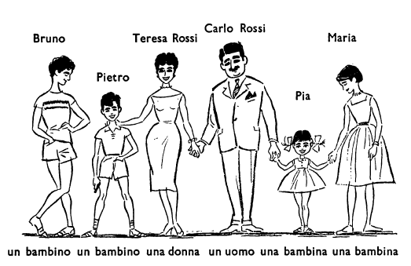
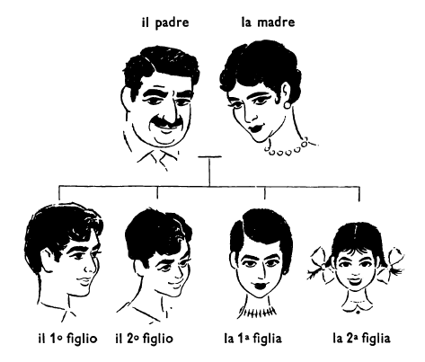

---
title: "L'Italiano Secondo il Metodo Natura"
author: Arthur M. Jensen
date: 1962
lang: it
cover-image: "../images/cover.png"
...

## Capitolo uno (1): LA FAMIGLIA ROSSI

Carlo Rossi è un uomo. Teresa Rossi è una donna.[^1.1] Bruno è un bambino. Pietro è un bambino. Maria è una bambina. Anche Pia è una bambina.[^1.2] Bruno e Pietro sono due bambini.[^1.3] Maria e Pia sono due bambine.[^1.4]

È un bambino Pietro? Sì, Pietro è un bambino. Anche Bruno è un bambino. È una bambina Maria? Sì, Maria è una bambina. Sono bambini Bruno e Pietro? Sì, Bruno e Pietro sono bambini. Sono bambine Maria e Pia? Sì, Maria e Pia sono bambine. È un bambino Carlo Rossi? No, Carlo Rossi non è un bambino; è un uomo.[^1.5] È una bambina Teresa Rossi? No, Teresa Rossi non è una bambina; è una donna.[^1.6]

Un bambino e una bambina sono due bambini. Due bambini e una bambina sono tre bambini.[^1.7] Anche un bambino e due bambine sono tre bambini.[^1.8] Bruno, Pietro, Maria e Pia sono quattro bambini.[^1.9] Carlo e Teresa Rossi,[^1.10] Bruno, Pietro, Maria e Pia sono una famiglia: la famiglia Rossi. Carlo Rossi è il padre. Teresa Rossi è la madre. Bruno è il primo figlio, Pietro è il secondo figlio.[^1.12] I due figli sono Bruno e Pietro. Maria è la prima figlia, Pia è la seconda[^1.14] figlia.[^1.11] Le due figlie sono Maria e Pia.[^1.13]

Bruno Rossi è figlio di Carlo Rossi. Anche Pietro Rossi è figlio di Carlo Rossi. I due bambini, Bruno e Pietro, sono figli di Carlo Rossi. Il primo figlio di Carlo Rossi è Bruno, il  secondo figlio è Pietro. Bruno e Pietro sono figli anche di Teresa Rossi: i due bambini sono figli di Carlo e Teresa Rossi.

Maria è figlia di Carlo Rossi. Anche Pia è figlia di Carlos Rossi. Le due bambine, Maria e Pia, sono figlie di Carlo Rossi. La prima figlia di Carlo Rossi è Maria, la seconda figlia è Pia. Maria e Pia sono figlie anche di Teresa Rossi: le due bambine sono figlie di Carlo e Teresa Rossi.

Quanti sono i figli di Carlo Rossi? I figli di Carlo Rossi sono due. Quante sono le figlie?[^1.15] Anche le figlie sono due. Carlo Rossi ha due figli e due figlie. Due figli e due figlie sono quattro figli.[^1.16] Quanti figli ha Carlo Rossi? Carlo Rossi ha quattro figli: Bruno, Pietro, Maria e Pia. Quanti figli e quante figlie? Due figli e due figlie. Quanti figli hanno Carlo e Teresa Rossi? Carlo e Teresa Rossi hanno quattro figli.[^1.17] I quattro bambini, Bruno, Pietro, Maria e Pia, sono figli di Carlo e Teresa Rossi.

Carlo Rossi è il padre di Bruno, di Pietro, di Maria e di Pia. Teresa Rossi è la madre di Bruno, di Pietro, di Maria e di Pia. Chi sono i due figli di Carlo e Teresa Rossi? Sono Bruno e Pietro.[^1.18] Chi sono le due figlie di Carlo e Teresa Rossi? Sono Maria e Pia.[^1.19] Chi è il primo figlio, Bruno o Pietro? È Bruno. Chi è la seconda figlia, Maria o Pia?[^1.20] È Pia. Chi è il padre di Bruno? È Carlo Rossi. E chi è la madre di Bruno? È Teresa Rossi.

Bruno è il fratello di Pietro. Pietro è il fratello di Bruno. Bruno e Pietro sono fratelli. Maria è la sorella di Pia. Pia è la sorella di Maria. Maria e Pia sono sorelle. Maria e Pia sono le sorelle di Bruno e Pietro. Bruno e Pietro sono i fratelli di Maria e Pia.

Quanti fratelli ha Maria? Ha due fratelli.[^1.21] Quanti fratelli ha Bruno, uno o due? Bruno ha un fratello. Chi è il fratello di Bruno? Il fratello di Bruno è Pietro. Quante sorelle ha Pia, una o due?[^1.22] Pia ha una sorella. Chi è la sorella di Pia? La sorella di Pia è Maria. Quante sorelle ha Pietro, due o tre? Ha due sorelle.[^1.23] Pietro e Maria sono fratello e sorella. Quanti fratelli hanno Maria e Pia? Hanno due fratelli.[^1.24] Chi sono i due fratelli di Maria e Pia? Sono Bruno e Pietro. Bruno è fratello di Maria e Pia. Anche Pietro è fratello di Maria e Pia. Quante sorelle hanno Bruno e Pietro? Bruno e Pietro hanno due sorelle. Chi sono le due sorelle di Bruno e Pietro? Sono Maria e Pia. Maria è sorella di Bruno e Pietro. Anche Pia è sorella di Bruno e Pietro. I quattro bambini sono fratelli e sorelle.

Carlo Rossi è il marito di Teresa Rossi. Teresa Rossi è la moglie di Carlo Rossi. Carlo e Teresa Rossi sono marito e moglie. Quanti figli e quante figlie hanno Carlo e Teresa Rossi? Hanno due figli e due figlie.[^1.25] Carlo e Teresa Rossi sono i genitori di Bruno, Pietro, Maria e Pia. I genitori sono il padre e la madre.[^1.26] Chi è il marito di Teresa Rossi? È Carlo Rossi. Chi è la moglie di Carlo Rossi? È Teresa Rossi.

Chi sono Bruno e Pietro? Sono i figli di Carlo e Teresa Rossi. Chi sono Maria e Pia? Sono le figlie di Carlo e Teresa Rossi. Carlo e Teresa Rossi sono i gentiori di Bruno e di Pietro. Carlo e Teresa Rossi sono anche i genitori di Maria e di Pia. Il padre, la madre, i due figli e le due figlie sono una famiglia.

Chi è Carlo Rossi? È il marito di Teresa Rossi e il padre di Bruno, Pietro, Maria e Pia. Chi è Teresa Rossi? È la moglie di Carlo Rossi e la madre di Bruno, Pietro, Maria e Pia. Ha un fratello Bruno? Sì, Bruno ha un fratello. Ha fratelli Maria? Sì, Maria ha due fratelli. Ha due sorelle Maria? No, Maria non ha due sorelle; ha una sorella e due fratelli.

### ESERCIZIO A.

**un, una, il, la, i, le**

Carlo Rossi è --- uomo. La moglie di Carlo Rossi è --- donna. Bruno è --- bambino. Pia è --- bambina. Chi è --- padre di Maria? E chi è --- madre di Maria? --- genitori di Maria sono Carlo e Teresa Rossi. Maria è --- sorella di Pia. Pietro è --- fratello di Bruno. Bruno e Pietro sono --- fratelli di Pia. Pia e Maria sono --- sorelle di Bruno.

**bambino, bambina, bambini, bambine**

Il fratell-- di Bruno è Pietro. Carlo Rossi ha quattro figl--. Bruno, Pietro, Maria e Pia sono quattro bambin--. La sorell-- di Pia è Maria. Pia e Maria sono figli-- di Carlo Rossi. Bruno ha due sorell--, Pia ha due fratell--.

**è, ha, sono, hanno**

Carlo Rossi --- il marito di Teresa Rossi. Carlo e Teresa Rossi --- quattro figli. Bruno --- un fratello e due sorelle. Pia e Maria --- due fratelli. I fratelli di Pia --- Bruno e Pietro. Pietro --- il fratello di Bruno.

### ESERCIZIO B.

Pietro è un ---. Pia è una ---. Teresa Rossi è una ---. I --- (4) bambini e i genitori sono una ---. Pietro è --- di Carlo --- Teresa Rossi. Pia è --- di Carlo e Teresa Rossi. Carlo e Teresa Rossi hanno quattro ---. Pia ha due --- e una ---. Carlo e Teresa Rossi sono i --- di Pietro. Carlo Rossi è il --- e Teresa Rossi è la --- di Pietro. Carlo Rossi è il --- di Teresa Rossi e Teresa Rossi è la --- di Carlo Rossi. Carlo Rossi è un ---. Pietro ha --- (2) sorelle. Pietro, Bruno e Pia sono --- (3) bambini. Pia è la --- (2nd) figlia di Carlo Rossi. Bruno è il --- (1st) figlio di Carlo Rossi. Bruno è fratello --- Pia. --- Pietro è fratello di Pia.

### ESERCIZIO C.

Quanti sono i fratelli di Pia?

Chi è il padre di Pia?

Chi è la moglie di Carlo Rossi?

Quante figlie hanno Carlo e Teresa Rossi?

Chi sono le figlie di Carlo e Teresa Rossi?

Quanti figli ha Teresa Rossi?

Ha due sorelle Pia?

È fratello di Bruno Pietro?

È una bambina Maria?

Hanno tre figlie Carlo e Teresa Rossi?

[^1.1]: **un** uomo

	**una** donna

[^1.2]: **un** bambino

	**una** bambina

[^1.3]: Bruno **è**...

	Bruno e Pietro **sono**...

[^1.4]: un (1) bambin**o**

	due (2) bambin**i**

	una (1) bambin**a**

	due (2) bambin**e**

[^1.5]: è : Carlo Rossi è

[^1.6]: è : Teressa Rossi è

[^1.7]: tre = 3

[^1.8]: bambin**i** e bambin**e** = bambin**i**

[^1.9]: quattro = 4

[^1.10]: Carlo e Teresa Rossi = Carlo Rossi e Teresa Rossi

[^1.11]: **il** padre **la** madre

	**il** filgio **la** figlia

[^1.12]: primo = 1°

	secondo = 2°

[^1.13]: **il** figli**o** **la** figli**a**

	**i** figl**i** **le** figli**e**

[^1.14]: **il** prim**o**

	**la** prim**a**

	**il** second**o**

	**la** second**a**

[^1.15]: quant**i** figl**i**?

	quant**e** figli**e**?

[^1.16]: figl**i** e figli**e** = figl**i**

[^1.17]: Carlo Rossi **ha**...

	Carlo e Teresa Rossi **hanno**...

[^1.18]: sono : i due figli sono

[^1.19]: sono : le due figlie sono

[^1.20]: chi è...?

	chi sono...?

[^1.21]: ha : Maria ha

[^1.22]: 1 = uno, una

	2 = due

	3 = tre

	4 = quattro

[^1.23]: ha : Pietro ha

[^1.24]: hanno : Maria e Pia hanno

[^1.25]: hanno : Carlo e Teresa Rossi hanno

[^1.26]: i genitori = il padre e la madre

 

<!--stackedit_data:
eyJoaXN0b3J5IjpbLTIxMTkxNDI1NzksLTIwOTg2NDc5MjEsMT
Q3MzMxNzk1NSwtNDAyODE3MTk1LC0xNDM0OTEwOTM2LC0xMjY2
MjgwNjY3LC00MTIxMDk3MjldfQ==
-->