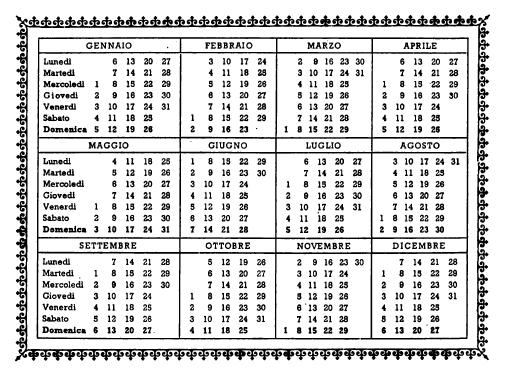

## Capitolo quattro (4): L'ANNO

Gennaio è un mese. Anche dicembre è un mese. Dodici mesi si chiamano un anno. Gennaio è il primo mese dell'anno. Dicembre è l'ultimo mese dell'anno. I dodici mesi dell'anno sono: gennaio, febbraio, marzo, aprile, maggio, giugno, luglio, agosto, settembre, ottobre, novembre e dicembre.

Quanti mesi ci sono in un anno? In un anno ci sono dodici mesi. «Dodici» è un numero. I numeri, da uno a dodici, sono: uno, due, tre, quattro, cinque, sei, sette, otto, nove, dieci, undici e dodici.

Qual è l'ultimo mese dell'anno? L'ultimo mese dell'anno è dicembre. Il primo mese dell'anno è gennaio. Il secondo e il terzo mese sono febbraio e marzo. Aprile è il quarto mese, maggio è il quinto e giugno è il sesto. Il settimo mese dell'anno è luglio, l'ottavo è agosto e il nono è settembre. Ottobre è il decimo mese, novembre è l'undicesimo e dicembre è il dodicesimo e ultimo mese dell'anno. 

Pietro è un bambino di dieci anni: Pietro ha dieci anni. E Bruno, quanti anni ha? Bruno ha quindici anni. Bruno è più grande di Pietro. Bruno è il più grande dei due fratelli. Maria è una bambina di tredici anni: Maria ha tredici anni. E Pia, quanti anni ha? Pia ha solo cinque anni: Pia è più piccola di Maria; Pia è la più piccola delle due sorelle.

Il mese di aprile ha trenta giorni, e il mese di maggio ha trentun giorni. Maggio è più lungo di aprile, aprile è meno lungo di maggio. Settembre è meno lungo di ottobre, e novembre è meno lungo di dicembre. Febbraio ha solo ventotto o ventinove giorni. Febbraio è più corto di gennaio, di marzo e degli altri mesis dell'anno: febbraio è il più corto dei dodici mesi dell'anno. In un mese ci sono quattro settimane. E in una settimana ci sono sette giorni. Come si chiamano i sette giorni della settimana? I sette giorni della settimana si chiamano: lunedì, martedì, mercoledì, giovedì, venerdì, sabato e domenica. Qual è il primo giorno della settimana? Il primo giorno è lunedì. E qual è l'ultimo? Il settimo e ultimo giorno della settimana è la domenica. Il primo giorno dell'anno è il primo gennaio. L'anno comincia il primo gennaio. Il secondo giorno dell'anno è il due gennaio e il terzo è il tre gennaio. Qual è il settimo giorno di luglio? È il sette luglio. Qual è il ventesimo giorno di marzo? È il venti marzo. E qual è il trentesimo e ultimo giorno di novembre? È il trenta novembre. Quando finisce l'anno? L'anno finisce il trentun dicembre. Quante settimane ci sono in un anno? Ci sono cinquantadue settimane. E quanti giorni? Ci sono trecentosessantacinque o trecentosessantasei giorni. Due settimane sono quattordici giorni. Tre mesi sono novanta giorni.

Marzo, aprile e maggio sono i mesi della primavera. La primavera è una stagione. L'anno ha quattro stagioni, e la primavera è la prima. La seconda delle stagioni è l'estate. I mesi dell'estate sono giugno, luglio e agosto. L'estate comincia in giugno e finisce in settembre. Settembre, ottobre e novembre sono i mesi della terza stagione dell'anno: l'autunno. L'autunno comincia in settembre e finisce in dicembre. La quarta e ultima stagione è l'inverno. I mesi dell'inverno sono dicembre, gennaio e febbraio.

L'anno dura trecentosessantacinque o trecentosessantasei giorni: dal primo gennaio al trentun dicembre. Quanti mesi dura una stagione? Una stagione dura tre mesi. La primavera dura dal mese di marzo al mese di giugno. L'estate dura dagli ultimi giorni di giugno agli ultimi di settembre. La primavera comincia in marzo, e l'estate comincia in giugno.

I Rossi non stanno a Roma tutto l'anno: in luglio, agosto e settembre non stanno a Roma, ma ad Ostia. I Rossi stanno a Roma in autunno, in primavera e d'inverno. Ma d'estate stanno a Ostia. I Rossi stanno ad Ostia dai primi giorni di luglio agli ultimi di settembre o ai primi di ottobre. Anche i Benelli stanno a Ostia d'estate. I Rossi vanno da Roma ad Ostia il primo o il due luglio e stanno ad Ostia tutta l'estate. Anche la famiglia Benelli va ad Ostia il primo o il due luglio e sta ad Ostia tutta l'estate. E gli altri mesi dell'anno, dove stanno i Benelli e i Rossi? Gli altri mesi dell'anno stanno a Roma. La signorina Emilia Rossi va ad Ostia anche lei il primo luglio? No; lei non va ad Ostia.

Il padre del signor Rossi, il signor Giuseppe Rossi, ha ottantadue anni. Ottantadue anni sono molti: il signor Giuseppe Rossi è vecchio. Un uomo che ha molti anni è vecchio. Una donna che ha molti anni è vecchia. La signora Teresa Rossi non è vecchia. Teresa Rossi ha solo trentacinque anni: è una donna giovane, non vecchia. Una donna che non ha molti anni è giovane. Anche Carlo Rossi è giovane, ma meno giovane di sua moglie: Carlo Rossi ha quarantadue anni. Il padre di Teresa Rossi, il signor Gherardo Brunotti, è vecchio anche lui, ma meno vecchio del signor Giuseppe Rossi. Giuseppe Rossi ha ottantadue anni, Gherardo Brunotti ha solo settantatré anni. Carlo e Teresa Rossi sono giovani, ma Teresa Rossi è più giovane di suo marito. Lui ha quarantadue anni, lei solo trentacinque. I padri dei genitori sono vecchi, ma Giuseppe Rossi è più vecchio di Gherardo Brunotti. Il primo ha ottantadue anni, l'altro ha settantatré.

Qual è il più vecchio dei due nonni? Il più vecchio dei due nonni è il signor Giuseppe Rossi. E qual è il più giovane dei due genitori? La più giovane dei due è la madre. Il meno vecchio dei due nonni qual è? Il meno vecchio è il signor Gherardo Brunotti.

### ESERCIZIO A.

vecchio

più vecchio/a, il più vecchio, la più vecchia

meno vecchio/a, il meno vecchio, la meno vecchia

Il signor Gherardo Brunotti è vecchio, ma il signor Giuseppe Rossi è --- vecchio: il signor Gherardo Brunotti è --- --- vecchio dei due nonni. Parigi è --- --- grande città di Francia. Parigi è --- grande di Roma. Pia e Pietro sono piccoli, ma Pietro è --- piccolo di Pia: Pietro è --- --- piccolo dei due. Pia è --- --- piccola dei quattro bambini, Bruno è --- --- grande. Il Po è --- lungo del Tevere, il Po è --- --- lungo dei fiumi italiani. Anche l'Adige è --- corto del Po. Carlo e Teresa Rossi sono giovani, ma Carlo Rossi è --- giovane di Teresa Rossi. Carlo Rossi è --- --- giovane dei due genitori.

### ESERCIZIO B.

In un --- ci sono dodici ---: gennaio, ---, ---, ---, ---, ---, ---, ---, ---, ---, ---, ---. Il --- mese è gennaio, l'--- è dicembre. «Tre» è un ---. I --- da uno a dodici sono: ---, ---, ---, ---, ---, ---, ---, ---, ---, ---, --- e ---. Il primo mese dell'anno è ---. Il --- è febbraio. Il --- è mazro, il --- è aprile, il --- è maggio. Il --- e il --- sono giugno e luglio, l'--- e il --- sono agosto e settembre, il --- e l'--- sono ottobre e novembre. Il --- è dicembre. I mesi hanno --- (30) o --- (31) giorni. Febbraio ha --- (28) o --- (29) giorni. In una --- ci sono --- (7) giorni. I giorni della --- sono: ---, ---, ---, ---, ---, --- e ---.

L'anno --- il --- gennaio e --- il --- dicembre. In un anno ci sono --- (365) o --- (366) giorni. Ci sono anche quattro ---. Le quattro --- dell'anno sono: la ---, l'---, l'--- e l'---. Una stagione --- tre mesi. L'anno dura --- primo gennaio --- trentun dicembre. I Rossi --- ad Ostia il primo luglio e stanno ad Ostia --- l'estate. --- autunno, ---'inverno e --- primavera i Rossi stanno a Roma.

### ESERCIZIO C.

Quanti e quali sono i mesi dell'anno?

Quante e quali sono le stagioni?

Qual è il più corto dei dodici mesi? 

Quanti giorni ha il più corto die mesi?

Quanti gionri sono tre mesi?

Quando comincia e quando finisce l'anno? 

Dei due nonni, chi è il più vecchio?

Quanti anni hanno Carlo e Teresa Rossi?

Qual è il più giovane dei quattro bambini?

 

<!--stackedit_data:
eyJoaXN0b3J5IjpbLTkxMjIyOTQ5MywxODk0NDI1MDA4LC02Nz
ExNTA4NjldfQ==
-->