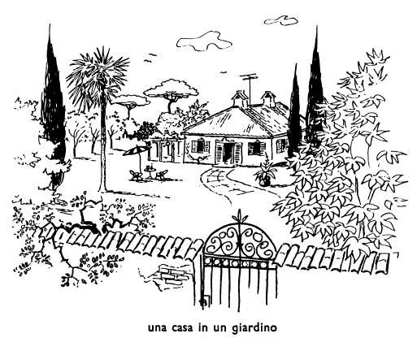

## Capitolo cinque (5): LE STAGIONI

A Roma, i Rossi stanno in una casa grande, ma ad Ostia la famiglia Rossi ha una casa piccola in un gran giardino. I Rossi non stanno nella loro casa di Ostia tutti i mesi dell'anno, ma solo in luglio, agosto e settembre. Nel gran giardino dei Rossi ci sono molti alberi. Non tutti gli alberi sono alti: alcuni alberi sono alti, altri sono bassi. E la casa, è alta o bassa? La casa è alta, ma meno alta degli alberi più grandi. Tutti gli alberi del giardino sono più alti del signor Rossi, e alcuni sono anche più alti della casa.

Quanti mesi stanno ad Ostia i Rossi? Ci stanno tre mesi. Quando vanno ad Ostia? Ci vanno il primo luglio e ci stanno tutta l'estate. E i Benelli, quando vanno a Ostia? Ci vanno d'estate anche loro e ci stanno dai primi giorni di luglio ai primi di ottobre.

Nel gran giardino della casa ci sono molti alberi e ci sono anche molte rose. La rosa è un fiore. Ci sono altri fiori nel giardino? Sì. Nei giardini d'Italia ci sono molti fiori in primavera e d'estate. E c'è anche molta erba nel giardino. C'è più erba d'estate che d'inverno. D'inverno, nel giardino non ci sono fiori e c'è solo poca erba. D'inverno, in Italia, non c'è molte sole, e quando c'è poco sole non ci sono molti fiori nei giardini.

Ci sono molte rose nel giardino in luglio? No, in luglio ci sono poche rose in Italia. E d'inverno? D'inverno non ci sono rose. In primavera, anche gli alberi hanno molti fiori. E d'estate hanno anche molte foglie. Ma d'inverno gli alberi non hanno né fiori né foglie.

Quando ci sono più fiori, in autunno o d'estate? Ci sono più fiori d'estate. Però ci sono fiori anche in autunno. C'è molta erba d'inverno? No, d'inverno c'è poca erba. C'è poco sole in luglio, in Italia? No, in luglio c'è molto sole in Italia.

Lìerba è verde, e in primavera e d'estate anche le foglie degli alberi sono verdi. Ma in autunno, nel mese di novembre, le foglie degli alberi non sono verdi. Però l'erba è verde anche in autunno e d'inverno. L'erba è verde tutto l'anno. Il verde è il colore dell'erba ed è anche il colore delle foglie degli alberi in primavera e d'estate. I fiori non sono verdi. Di che colore sono? I fiori sono di molti altri colori. Ci sono fiori di tutti i colori. In che stagione sono verdi le foglie degli alberi? Sono verdi in primavera e d'estate. In che stagione ci sono rose nel giardino? Ci sono delle rose in primavera e d'estate. Nelle ultime settimane della primavera ci sono molte rose. Ci sono molte rose dalle ultime settimane della primavera alle prime settimane dell'estate. Di che colore sono le foglie degli alberi? Sono verdi. Però non sono verdi tutto l'anno, ma solo in primavera e d'estate nelle prime settimane dell'autunno. E l'erba, è verde tutto l'anno? Sì, è verde tutto l'anno. Però, d'inverno, non c'è molta erba. D'inverno c'è poca erba.

Anche le rose hanno delle foglie? Sì, hanno delle foglie anche le rose. E di che colore sono le foglie delle rose? Sono verdi, come le foglie degli alberi. Gli alberi hanno molti rami. Su molti rami, in primavera, ci sono dei fiori. E sui rami di molti alberi ci sono anche dei frutti. Ci sono molti frutti d'estate e in autunno. La mela è un frutto. Anche la pera è un frutto. Nel giardino dei Rossi ci sono molte pere e molte mele. La mela è un frutto di agosto e settembre. Anche la pera è un frutto di agosto e settembre.

Un altro frutto italian è la ciliegia. Di che colore sono le ciliege? Le ciliege sono rosse. Anche molte rose sono rosse, come le ciliege. Però non tutte le rose sono rosse. Molte rose sono gialle, come i limoni. Il giallo è il colore dei limoni. Il verde, il rosso, il giallo sono colori. I Rossi hanno molte rose rosse e molte rose gialle. Nel giardino dei Rossi non ci sono limoni. Ci sono mele, pere ed altri frutti, ma limoni no. Nei giardini di Roma---e di Ostia---ci sono pochi limoni. Ma nell'isola di Sicilia ci sono molti limoni, e ci sono anche degli aranci. L'arancio è un frutto. In Sicilia, ci sono dei limoni e degli aranci in tutte le stagioni. Ci sono limoni e aranci negli altri paesi dell'Europa? Sì, ma non in tutti i paesi dell'Europa.

Cosa c'è sui rami degli alberi in primavera? Ci sono dei fiori. E ci sono anche delle foglie; ci sono molti fiori e molte foglie. Gli alberi hanno delle foglie dalla primavera all'autunno; dall'inverno all primavera non ci sono né foglie né frutti sugli alberi. Ma d'estate ci sono molti frutti sugli alberi. In che mesi ci sono delle pere in Italia? Ci sono in agosto e in settembre. In che stagione ci sono degli aranci in Italia? Ci sono d'estate e in autunno, ma in Sicilia anche d'inverno e in primavera.

### ESERCIZIO A.

un limone, un arancio, una pera, dei limoni, degli aranci, delle pere

Nel giardino del signor Rossi, d'estate, ci sono --- fiori di tutti i colori. I Rossi hanno --- rose gialle e --- rose rosse. In che mesi hanno --- frutti i Rossi nel loro giardino? Hanno --- frutti (--- mele, --- pere e altri frutti) da luglio a ottobre. I Rossi hanno anche --- ciliege. Hanno --- aranci e --- limoni? No. Quando hanno --- foglie gli alberi? Hanno --- foglie dalla primavera all'autunno.

del, nel, al, dal

Carlo è il nome --- dignor Rossi. il nome --- signora Rossi è Teresa. I nomi --- bambini sono Burno e Pietro, e i nomi --- bambine sono Pia e Maria. L'Italia è la patria --- italiani. La prima stagione --- anno è la primavera. L'anno dura --- primo gennaio --- trentun dicembre. I Rossi stanno ad Ostia --- primi giorni di luglio --- ultimi di settembre o --- primi di ottobre. --- giardino del signor Rossi ci sono molti fiori. I Rossi hanno delle rose --- ultime settimane --- primavera --- prime settimane --- estate. I Rossi non stanno --- loro casa di Ostia tutto l'anno. --- giardini di Roma ci sono pochi limoni. --- isola di Capri ci sono molti limoni d'estate. Anche --- altri paesi --- Europa ci sono limoni, come in Italia, ma non in tutti.

### ESERCIZIO B.

La --- dei Rossi ad Ostia è in un gran ---. I Rossi non --- stanno --- i mesi dell'anno, ma solo nei mesi dell'estate. Nel giardino ci sono molti ---, alcuni sono più --- della casa, alri più della casa. I Rossi hanno molte --- rosse e gialle e molti altri ---. Nel giardino c'è anche molta ---. D'inverno, non c'è molta erba. D'estate gli alberi hanno molte --- verdi, ma in autunno le --- degli alberi non sono verdi. I limoni non sono verdi, ma ---, e le ciliege sono ---. Molte rose sono gialle, --- i limoni, altre sono rosse, come le ---. --- molti rami, d'estate, ci sono dei ---. Il limone è un ---. Altri --- sono l'---, la --- e la ---.

### ESERCIZIO C.

Quanti mesi stanno ad Ostia i Rossi?

Tutti gli alberi sono più alti della casa?

Cos'è la rosa?

Cosa sono la pera e la mela?

C'è più erba d'estate o d'inverno?

Di che colore sono l'erba, i limoni, le ciliege?

Quando ci sono delle rose nel giardino?

Ci sono dei limoni in tutti i paesi dell'Europa?

 

<!--stackedit_data:
eyJoaXN0b3J5IjpbMTE2NDc1NTEwNSw0NDQxODExOTAsLTExNT
EyMDE5MV19
-->