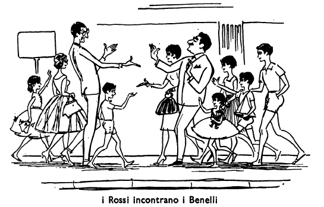
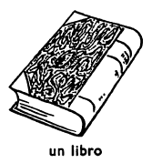
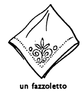
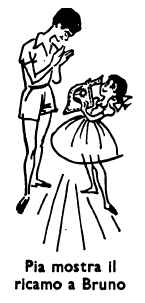
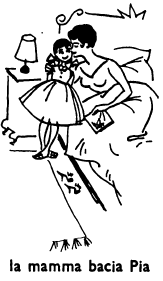
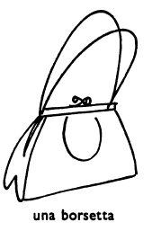

## Capitolo nove (9): IL COMPLEANNO

Oggi è il cinque aprile, e Teresa Rossi ha trentasei anni. Ieri, quattro aprile, Teresa Rossi non aveva ancora trentasei anni, ma oggi, cinque aprile, sì. Oggi è il compleanno della signor Rossi. Il compleanno del signor Rossi è il sei luglio. Il sei luglio Carlo Rossi avrà quarantatré anni.

Oggi non è la mamma che sveglia i bambini, perché quando è il suo compleanno Teresa Rossi non si sveglia alle sei, ma alle sette. Questa mattina è Pia che alle sei e mezzo si alza e chiama sua sorella: «Mariuccia!». Questa volta Maria la sente e domanda: «Che cosa c'è, Pia? Perché non è la mamma che mi sveglia?» Pia risponde: «Non è la mamma che ti sveglia, perché oggi è il compleanno della mamma». Maria: «Dormono ancora? Ma è già tardi: sono le sette meno venti! Fra venti minuti la mamma sarà sveglia».

Cosa fanno allora le due bambine? Vanno nella camera dei due fratelli e chiamano «Bruno! Pietro!». Prima, i due fratelli non rispondono alle loro sorelle, perché dormono e non le sentono; ma poi, quando le bambine chiamano ancora una volta, Bruno si sveglia e domanda: «Che cosa c'è?». Pia: «È il compleanno della mamma e tu dormi ancora!». Bruno: «Ma io non dormo! Io sono sveglio!». Pia: «E Pietro?». Pietro: «Aah...». Pia: «Tu non sei sveglio, Pietro!». «Sì; sono sveglio. Ma perché non è la mamma che ci sveglia oggi?». maria: «Non è lei che vi sveglia perché oggi è il suo compleanno.» Allora i due fratelli si alzano anche loro, perché è molto tardi. Poi Bruno domanda a Maria: «Chi va prima nella stanza da bagno? Ci vai tu o vi vado io?». Maria: «Ci vado io con Pia. Alle sette meno cinque, i quattro bambini sono tutti nella camera delle sorelle, e Bruno dice: «Io ho questo libro per la mamma»; poi domanda: «E tu che cos'hai, Pietro?». Pietro: «Anch'io ho un libro! E voi, bambine? Che cosa avete voi per la mamma?». Maria: «Noi abbiamo questi fiori. E poi abbiamo un fazzoletto e un ricamo». (Maria fa ogni anno un ricamo per la mamma). Pietro: «Chi ha fatto questo ricamo? L'hai fatto tu, Maria?». Maria: «Sì, l'ho fatto io». E Maria mostra il ricamo al suo fratellino. Pietro allora dice a Maria: «È molto bello!»; poi domanda: «L'hai fatto da sola?». Maria: «Sì, l'ho fatto da sola». Poi Pia mostra il ricamo a Bruno, e anche lui dice che il ricamo è molto bello. «Anche i fiori che hai per la mamma sono molto belli», dicono Bruno e Pietro a Maria. Anche la piccola Pia mostra agli altri ciò che ha per la mamma, a Bruno dice alla sua sorellina che anche ciò che ha lei per la mamma è molto bello. Poi, i quattro bambini entrano nella camera dei genitori.

La sveglia non ha ancora suonato e la signora Rossi dorme. Quando i bambini entrano, svegliano la loro mamma: «Mammina! Mammina!». E adesso la signora Rossi è sveglia e domanda: «Che cosa c'è?». «C'è che è il tuo compleanno, mammina!», dice Bruno, e gli altri dicono: «Molti auguri per il tuo compleanno, mammina!». Poi, Pia dà il suo fazzolettino alla sua mamma e dice ancora una volta: «Molti auguri, mammina!». La signora Rossi prende il fazzoletto dalla mano di Pia e dice: «Grazie, Pia! Com'è bello il tuo regalo! Sei una buona bambina!», e bacia la sua bambina.

Poi è Pietro che dice alla mamma: «Auguri, mammina!» e le dà il suo regalo: un bel libro. «Grazie, Pietruccio! Anche tu sei un buon bambino!», dice la signora Rossi a Pietro; prende ciò che le dà suo figlio e lo bacia anche lui. Dopo Pietro è Bruno che dice «auguri» alla mamma e le dà il suo regalo. La signora Teresa gli dice grazie come agli altri, e gli dice che anche il suo regalo è molto bello e che anche lui è molto buono. Poi lo bacia, come ha baciato Pia e Pietro.

L'ultima è Maria. «Buon compleanno, mammina! Auguri!», dice la bambina; bacia la sua mammina e le dà i suoi regali: i bei fiori e il ricamo. «Grazie, Mariuccia! Com'è bello questo ricamo! E come sono belli questi fiori!», le dice la mamma e poi anche lei le domanda; «L'hai fatto tu, questo bel ricamo?». «Sì, mammina, l'ho fatto da sola», le risponde Maria. E la mamma le dice che anche lei è una bambina molto buona. «Siete tutti e quattro dei buoni bambini!»

Mentre i bambini danno i loro regali alla signora Rossi, il signor Rossi, che i bambini hanno svegliato, si alza anche lui e dà a Teresa Rossi il suo regalo. Il regalo di Carlo Rossi è il più bello di tutti; una bella borsetta di Firenze. È molto bella, però la mamma dice che anche il regaluccio di Pia, il fazzolettino bianco, è molto bello.

«E adesso». dice la signora Rossi quando ha detto grazie a tutti e cinque e ha baciato anche suo marito, «adesso mi alzo anch'io, mi lavo e mi vesto!». «Prima ti lavi tu, poi mi lavo io mentre tu ti vesti», dice suo marito. Poi dice ai bambini: «E voi? Fate colazione mentre la mamma ed io ci laviamo e ci vestiamo?». «Sì, papà», dice Bruno, «mentre tu e la mamma vi lavate e vi vestite, noi facciamo colazione. Ma Pia dice: «No, io adesso non faccio colazione!». Teresa Rossi: «E perché non fai colazione anche tu, Pia?». Pia: «Perché io faccio colazione con voi due!».

Un'ora dopo, i Rossi hanno fatto colazione e vanno in città. In via Veneto i Rossi incontrano i Benelli: i genitori, Emma e Gino, e i due bambini, Giovanni e Lucia, cugino e cugina dei bambini Rossi. «Teresa! buon giorno!», dice Emma Benelli alla signora Rossi.

«Buon giorno, Carlo!», dice poi al fratello. Suo marito pure dice buon giorno ai Rossi, e i Rossi rispondono: «Buon giorno!». Quando tutti hanno detto buon giorno a tutti, Carlo Rossi domanda dove vanno i Benelli: «Dove andate voi?». Emma: «Noi andiamo dove andate voi.». Carlo Rossi: «Allora andiamo tutti al Corso». (Il Corso è una delle più belle vie di Roma). Pietro domanda a suo cugino, Giovanni Benelli: «Quanti siamo adesso?». Giovanni risponde: «Voi siete in sei e noi siamo in quattro». Pia: «Allora siamo in dieci!». Mentre le due famiglie vanno al Corso, Maria e Pia raccontano ai loro cugini ciò che hanno fatto prima della colazione. «Oggi è il compleanno della mamma», dice Pia. Lucia: «L'ha detto il papà ieri sera». Poi, a Teresa Rossi: «Molti auguri, zia Teresa!». Teresa Rossi: «Grazie, Lucia!». Lucia, a Pia: «Che cosa le hai dato, alla zia Teresa?». Pia: «Le ho dato un bel fazzolettino bianco per la borsetta che le ha dato il papà». Lucia: «E tu, Maria, che cosa hai regalato alla zia Teresa?». Maria: «Io le ho regalato dei bei fiori e un ricamo che ho fatto io, da sola». Pia: «Ed è molto, molto bello!». Giovanni: «E tu, Pietro, che cosa le hai regalato?». Pietro: «Io? Le ho regalato un libro». Bruno: «Io pure. Le abbiamo dato un libro tutti e due». Poi, Maria racconta a sua cugina che lei e gli altri erano già sveglia alle sei e mezzo: «E voi?». Lucia: «Noi? Non prima delle sette e un quarto, come le altre mattine». Poi Lucia domanda: «Maria, com'è la borsetta che lo zio Carlo ha dato alla zia Teresa?». Maria: «È una borsetta di Firenze: bianca e nera». Lucia: «Bianca e nera? È bella, no?». Maria: «Sì, molto bella». E fino al Corso, Maria racconta a sua cugina com'è la borsetta della mamma.

### ESERCIZIO A.

**sono, sei, è, siamo, siete, sono**

Pia: «Maria, --- sveglia?». Maria: «Sì, --- sveglia. --- svegli Bruno e Pietro?». Pia: «No, solo noi due --- sveglie». Pia e Maria: «Bruno e Pietro, --- svegli?». Bruno: «Io sì, --- sveglio, ma Pietro non --- ancora sveglio».

**ho, hai, ha, abbiamo, avete, hanno**

Pietro: «Che cos' --- per la mamma, Bruno?». Bruno: «--- un libro». Pietro: «Allora --- un libro per la mamma tutti e due». Bruno: «E voi, Pia e Maria, che cos' --- per la mamma?». Maria dice che lei --- un ricamo. Pia --- un fazzolettino e le due sorelle --- anche dei bei fiori.

**vado, vai, va, andiamo, andate, vanno**

Maria: «Adesso io --- nella stanza da bagno. Ci --- anche tu, Pia?». Pia dice che anche lei --- nella stanza da bagno. I fratelli ci --- dopo le bambine. In via Veneto, Carlo Rossi domanda i Benelli: «Dove --- voi?». Emma Benneli: «Noi --- dove --- voi!».

**faccio, fai, fa, facciamo, fate, fanno**

A che ora --- colazione i Rossi? La famiglia Rossi --- colazione alle otto. Bruno, a Giovanni: «Tu a che ora --- colazione la domenica?». Giovanni: «La domenica --- colazione alle otto e mezzo. E voi, a che ora --- colazione la domenica?». Bruno: «--- colazione anche noi alle otto e mezzo la domenica».

| io | tu | lui | noi | voi | loro |
|-------------|-------------|-------------|----------------|---------------|---------------|
| (mi) lav-o | (ti) lav-i | (si) lav-a | (ci) lav-iamo | (vi) lav-ate | (si) lav-ano |
| (mi) vest-o | (ti) vest-i | (si) vest-e | (ci) vest-iamo | (vi) vest-ite | (si) vest-ono |

Maria va nella stanza da bagno e lav-- Pia. Prima si lav-- le bambine, poi i fratelli. Teresa Rossi: «Maria, lav.. tu Pia oggi?». Maria: «Sì, oggi la lav-- io». Maria, a Bruno e Pietro: «Vi lav-- prima, oggi?». Bruno e Pietro: «No, oggi voi vi lav-- prima, poi noi ci lav--». Bruno: «Adesso, io mi vest--, mentre tu ti lav--, Pietro». Maria non vest-- Pietro. Pietro, Bruno e Maria si vest-- da soli. Carlo Rossi, ai bambini: «Cosa fate voi mentre la mamma ed io ci vest--?». I bambini: «Mentre tu e la mamma vi vest--, noi facciamo colazione».

### ESERCIZIO B.

Oggi è il --- di Teresa Rossi. Alle sei e mezzo Pia chiama sua sorella: «---!». Prima, Maria non --- Pia. Allora Pia chiama ancora, e --- volta Maria si sveglia e ---: «Che cosa c'è, Pia?». Pia ---: «C'è --- oggi è il compleanno della mamma». Poi le due bambine vanno nella --- dei due fratelli. Pia: «Bruno, --- ancora o sei sveglio?». Bruno: «Non --- più!».

Maria: «--- ho dei bei --- per la mamma, e ---, Bruno e Pietro, che cos'avete per la mamma?». Bruno: «--- abbiamo dei libri. E ---, Pia, che cos'hai?». Pia: «Io ho un --- bianco. E Maria ha un bel ---». Il ricamo di Maria è molto ---, e i suoi fori pure sono molto ---. Pia --- il suo regalo alla mamma, e la mamma --- il fazzoletto e le dice: «---, Pia! Sei una --- bambina!». Poi Teresa Rossi --- la sua bambina. Il --- di Bruno è un bel libro. Teresa Rossi --- la dice grazie anche a lui. Poi, Maria dà alla mamma i suoi --- fiori e il suo ricamo, e la mamma --- dice grazie anche a ---. Il regalo di Carlo Rossi è una bella --- di Firenze.

Quando i Rossi sono in via Veneto, --- i Benelli. Giovanni e Lucia sono il --- e la --- dei bambini. Maria e Pia --- ai loro cugini --- che hanno fatto prima della colazione.

### ESERCIZIO C.

Giovanni, a Maria: «*Cos'hai dato alla mamma?*».
--- Maria: «Io ho dato un ricamo alla mamma».

Giovanni, a Bruno e a Pietro: «E voi, ....?».
--- Bruno e Pietro: «Noi le abbiamo dato dei libri».

Maria, a Pia, che la sveglia: «Perché ....?».
--- Pia: «Non è la mamma che ti sveglia perché oggi è il suo compleanno».

Pietro a Maria: «.... ricamo?».
--- Maria: «Sì, l'ho fatto io».

Carlo Rossi ai Benelli: «....?».
--- Emma Benelli: «Noi andiamo dove andata voi».

Maria, a Lucia: «....?».
--- Lucia: «Giovanni era già sveglio alle sette e un quarto».

Lucia, a Maria: «....?».
--- Maria: «È una bella borsetta di Firenze, bianca e nera».

Bruno, alle sorelle: «....?».
--- Le bambine: «C'è che è il compleanno della mamma!».

Sono già svegli i due fratelli alle sei e mezzo?

Che cos'hanno i quattro bambini per la loro mamma?

Chi ha fatto il regalo di Maria?

Che cosa dice Teresa Rossi a Pia quando Pia le dà il suo regalo?

E cosa dice a Bruno quando lui le dà il suo regalo?

Che cosa fanno i bambini mentre i loro genitori si lavano e si vestono?

Chi sono Giovanni e Lucia Benelli?

<!---
Footnotes
-->

 

<!--stackedit_data:
eyJoaXN0b3J5IjpbMjA5MDEwMjIzNCwzODM0MjQ2MjEsLTE4OD
k0OTc2MjIsLTU4MTU4MTM5OSwxMzQzOTkwOTMyLDU4NDM3NzEx
MSwxMDg3NTQ4NTA0LDQyNTY5MzYxMSwxNzAyMTUxNTc2LC0yND
kyMDYxNywxMjIwMDUyNDcxLDg3MTc3NDYwOCwtMjAzODk3OTEz
LDk3NDk2NzkyLDEyNzEyNjc0OTgsMTA0Njc5MzkzNF19
-->