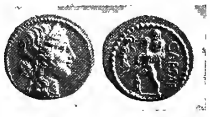

# Pro Patria: A Latin Story for Beginners

--- 

Prof. E. A. Sonneschein, D. Litt.

---

---

PRO PATRIA: A LATIN STORY
FOR BEGINNERS, BEING A
SEQUEL TO 'ORA MARITIMA,'
WITH GRAMMAR AND EXERCISES
BY E. A. SONNENSCHEIN, D.LITT.,
OXON., PROFESSOR IN THE UNIVERSITY 
OF BIRMINGHAM

>*Qui procul hinc*, the legend's writ,
>
>The frontier grave is far away,
>
>*Qui ante diem periit*;
>
>*Sed miles, sed pro patria*.
>
> Henry Newbolt;
> 
> 'Clifton Chapel.'

LONDON
SWAN SONNENSCHEIN & CO., LIMD
NEW YORK: THE MACMILLAN CO.
1910

---

First Issue, 1903; Reprinted 1907
Reprinted 1910.

---

## Preface

The idea on which my *Ora Maritima* and its sequel, the present
volume, are based, is that an interesting narrative may be a
better vehicle for teaching the elements of a language than a
collection of isolated grammar sentences, provided that the
interesting narrative is so constructed and graduated as to
constitute in itself a basis for the systematic study of grammar. My object, then, has been to write a book which should not only appeal to the minds of pupils through the interest of its subject matter, but also form as complete a grammatical ladder as the driest of dry exercise books. *Omne tulit punctum qui miscuit utile dulci*.

In carrying out this programme for *Pro Patria* I have adhered
to the ideal which I set up for myself in *Ora Maritima*, that
the Latin text should be 'classical in form, but modern in
setting.' The scene is laid in a country house on the coast of
Kent, and afterwards at Winchester, and the time of the action
is the period from September 1899 to June 1900. I have thus
been enabled to give unity of action to the two parts into which the narrative falls. The first part is taken up with a study of Roman Britain in connexion with a visit to Richborough Castle; the second with the Boer War, the first news of which arrives soon after the conclusion of the summer holidays. It is my hope that my young readers may find in the first part a more vivid picture of the condition of Britain under the Romans than is contained in most school histories of England; and in the treatment of the Boer War I have endeavoured to bring out its
dramatic interest and heroic incidents. Party politics are, of
course, kept out of view.

The amount of grammar covered by *Pro Patria*[^1] may seem
to some teachers disproportionately small; and, no doubt,
if it had been my object simply to teach grammar, I might
have made the text shorter. But a long experience in teaching
Latin to pupils of very various ages and stages has made me
sceptical as to the value of a skin-deep knowledge of grammar.
It is one thing to learn declensions and conjugations out of a
grammar or from grammar sentences, and quite another thing
to know them as they appear in actual life. How many boys
and girls leave school without having acquired any real mastery
even of the simplest kind of Latin or the power of making
any practical use of the grammatical facts which they have so
laboriously learned! That is the sort of educational result
on which the present outcry against Latin in schools is
largely based. The great mistake seems to be that the elementary stages of learning are turned into a purely grammatical discipline and that the grammar is hurried over before the study of the language proper and the literature are commenced. Declensions and conjugations learned in this fashion find no real lodgment in the mind; or, at best, the outcome of the tedious process is that the pupil 'holds the parts in his hand,' but misses 'the spirit that binds them together.'[^2] It is against this abstract method of teaching that *Ora Maritima* and *Pro Patria* are a protest. It has been my object to write for the use of the beginner a 'real book,' which shall have a literary as well as a linguistic interest of its own, and from which the pupil shall gain something more than a bowing acquaintance with Nouns and Verbs. I have, therefore, not shunned repetitions; and I have deliberately aimed at providing a certain mass of easy Latin from which he may acquire the habit of reading, as distinct from construing, Latin. If, at the end of two[^3] years' work, the pupil has acquired this, together with the fundamentals of Latin grammar, he will have spent his time to some purpose, and will be in a position to begin the study of a classical author and of the more difficult parts of the grammar with some hope of a happy issue. Or if, on the other hand, he drops the study of Latin at this point, he will still have acquired a working knowledge of the language up to a certain level. This is an aspect of the matter on which I desire to lay some stress. There are many schools, or modern sides of schools, in which only a limited amount of time can be devoted to Latin; and the problem is how can that time be spent so as to produce the most profitable result. It is my hope that the present book may contribute to the solution of this problem.

It is not my intention that an equal amount of time and
attention should be bestowed on all the sections of the text.
Some of them (marked with a †) are unnecessary from the purely
grammatical point of view; they exist for the purpose of carrying on the story and providing material for rapid reading; and where time presses they may be translated by the teacher to
the class. The exercises and conversations are intended to be
used as the needs of particular classes may demand. For translation into Latin alternative passages are given, from
which the teacher may select what best suits his purpose. Some
of them may be worked on paper, some *viva voce*, some may be
omitted altogether. I have thought it better to give too much
rather than too little.

One of my young friends who was learning from this book
made a criticism of it which will probably pass through the
minds of other readers. "The Romans," he said, "knew nothing
of South Africa." Exactly; but it is possible that the best
way to learn an ancient language is to study it as written at the present day in connexion with a subject matter which is familiar or easily intelligible to the modern reader. This is, of course, only a means to an end; but there are many ends which are better attained indirectly than directly.

I have ventured on some novelties in the realm of grammar
teaching, among which the use of the term 'Injunctive,' side
by side with 'Subjunctive,' calls for a word of explanation.
The new term expresses the fundamental idea of what is commonly called the 'Subjunctive Mood'; it is the mood of desire,
and should be introduced to the pupil in the first instance in
connexion with sentences like 'God save the King!'[^4] For such
meanings the term Subjunctive is quite inappropriate, and a
fruitful source of error; it comes in, however, so soon as the
mood appears in a subordinate clause. And if the pupil subsequently abandons the term *Injunctive* altogether, it will nevertheless have served its purpose in introducing him to a right conception of the mood—a conception which will serve him in good stead afterwards.

My best thanks are due to Dr. J. E. Sandys, Public Orator
in the University of Cambridge, for permission to quote some
verses which originally appeared in his Latin speeches to the
University,[^5] and for his great kindness in reading my proof
sheets of the text and making many valuable suggestions.

EAS.

THE UNIVERSITY, BIRMINGHAM,
*July*, 1903.

*Note to the New Issue*.—No changes have been made in the
present issue, with the exception of the correction of a few misprints and the addition of a Summary of Grammatical Rules
(pp. 182 ff.)

---

## Contents

I. [Mensis September.](#i-mensis-september)  
§ 1. Adjectives Of 3rd Declension in *—, is, e*

II. [Britannia Liberata.](#ii-britannia-liberata)  
§ 2. *is, ea, id*—Singular Number

III. [Cunobelinus.](#iii-cunobelinus)  
§§ 3, 4. *ei, eae, ea*—Plural Number

IV. [Caractacus.](#iv-caractacus6)  
§ 5. *eius* and *suus, a, um* contrasted  
§ 6. *ipse, ipsa, ipsum*

V. [Boadicea.](#v-boadicea7)  
§§ 7—9. *ille, illa, illud*

VI. [Britannia Pacata.](#vi-britannia-pacata)  
§§ 10—13. *hic, haec, hoc*

VII. [Pax Romana.](#vii-pax-romana)  
§ 14. Comparatives of Adjectives  
§ 15. Superlatives of Adjectives  
§§ 16, 17. Passive Voice of 1st Conjugation; Present, Past Imperfect and Future Tenses

VIII. [Castellum Rutupinum.](#viii-castellum-rutupinum)  
§ 18. Questions and Exclamations  
§ 19. *qui, quae, quod* and *quis, quid*—in questions  
§§ 20, 21. *qui, quae, quod* in clauses which are not questions  
§ 22. 2nd Conjugation; Present, Past Imperf. and Future, Active  
§ 23. 4th Declension and Passives of 2nd Conjugation

IX. [Angli et Saxones.](#ix-angli-et-saxones)  
§§ 24—26. 2nd Conjugation; Perfect Stem, Active  
§ 27. Perfect, Pluperfect and Future Perfect Passive—how expressed  
§§§ 28—3O. 5th Declension

X. [Res Africanae.](#x-res-africanae)  
§ 31. Recapitulation of Verbs  
§ 32. 3rd Conjugation; Present, Active and Passive

XI. [Origo Reipublicae Africanae.](#xi-origo-reipublicae-africanae)  
§§ 33—35. 3rd Conjugation; Past Imperfect, Active and Passive, together with Imperative Active

XII. [Initium Belli.](#xii-initium-belli)  
§ 36. 3rd Conjugation; Future, Active and Passive  
§ 37. 3rd Conj.; Perfect Stems Active formed with *s*  
§ 38. 3rd Conj.; Perfect Stems Active formed without any suffix  
§ 39. 3rd Conj.; Perfect, Pluperfect and Fut. Perf. Passive

XIII. [Milites Reginae.](#xiii-milites-reginae)  
§ 40. 4th Conj.; Present, Active and Passive  
§ 41. 4th Conj.; Past Imperfect and Future, Active and Passive  
§ 42. 4th Conj.; Perfect Stem Active

XIV. [Tria Oppida Obsessa.](#xiv-tria-oppida-obsessa)  
§ 43. Verbs in *io* with Infinitive in *ere*—Present, Past Imperfect and Future, Active And Passive

XV. [Victoriae et Clades Britannicae.](#xv-victoriae-et-clades-britannicae)  
§§ 44—47. Same Verbs Continued, with Perfect Stems Active

XVI. [Foedus Nominis Britannici.](#xvi-foedus-nominis-britannici)  
§ 48. Present Injunctive of *sum*  
§ 49. Present Injunctive of 1st Conjugation

XVII. [Post Tenebras Lux.](#xvii-post-tenebras-lux)  
§ 50. Present Subjunctive of *sum* and 1st Conj.

XVIII. [Adamantopolis Obsidione Liberata.](#xviii-adamantopolis-obsidione-liberata)  
§ 51. Pres. Subj. of *sum* and 1st Conj.—continued  
§ 52. Present Injunctive and Subjunctive of the other Conjugations

XIX. [Dies Maiubensis.](#xix-dies-maiubensis)  
§ 53. Past Imperfect Subjunctive of *sum*  
§§ 54, 55. Past Imperfect Subj. of the four Conjugations

XX. [Pax Britannica.](#xx-pax-britannica)  
§ 56. Recapitulation

[Preparations.](#preparations)

[Exercises And Conversations.](#exercises--conversations)

[God Save The King In Latin (Arranged For Singing).](#domine-salvum-fac-regem)

[Latin-English Vocabulary.](#latin-english-vocabulary)

[English-Latin Vocabulary.](#english-latin-vocabulary)

[Summary of Grammatical Rules.](#summary-of-rules)

---

PRO PATRIA
 
---

---
 
## COMMENTARII DE VITA MEA AD DUBRAS ANNO MDCCCXCIX.

### I. Mensis September.

(Adjectives of Third Declension in *—, is, e.*)

1. Kalendae sunt hodie Septembres. Primus
mensis feriarum elapsus est, et scholae instant. Nam
ante finem mensis Septembris apud magistrum
meum ero. Et per ultimam partem feriarum necesse
est libris duas horas cotidie dare. Sic imperat patruus
meus. Mane igitur plerumque lectito. Patruus
autem mihi librum Taciti de vita Agricolae, ducis
celebris Romanorum, dedit. Multa insunt de Britannia 
nostra antiqua. Vita Agricolae multum me
delectat. Nonnullis tamen in locis difficilis est et
obscura. Sed animo alacri lectito, quia patruus meus
difficilia et obscura explicat, et tabulis pictis
aedificiorum, armorum, nummorum, viarum illustrat.
Ubi aliquid in Vita Agricolae deest, ibi patruus
meus capita ex Annalibus Taciti vel ex Historia
Anglica recitat. Amici mei, Marcus et Alexander,
interdum adsunt dum recitat. Nam saepe nos
visitant. Post prandium plerumque ambulamus,
vel ludo trigonali operam damus, vel in mari
natamus.

---

### II. Britannia Liberata.
(*is, ea, id.*—Singular Number.)

2. Gaius Iulius Caesar, postquam copias suas
pedestres et equestres ex Britannia in Galliam transportavit,
nihil amplius de Britannis cogitavit. Ab
incolis litoris meridiani victoriam reportaverat, ad
flumen Tamesam penetraverat, oppidum  Cassivellauni
expugnaverat, magnum numerum captivorum 
in servitutem venumdederat, tributum
Britannis imperaverat. Id ei satis erat. Sed
Britanniam non revera debellaverat, nec victoria
eius magna fuerat. Tacitus eum non magnam
victoriam reportavisse in capite tertio decimo Vitae
Agricolae affirmat. "Divus Tulius" inquit "Britanniam 
Romanis monstravit, sed non debellavit."
Britanni autem viri animo forti erant. Tributum
et servitutem non tolerabant. Et Romanis post
tempora C. Iulii Caesaris longa oblivio erat Britanniae. 
Nam per multos annos bellum domesticum 
civitatem Romanam vexavit. Post finem
eius belli Romani Augustum principem creaverunt.
Ei Britannia non curae erat. Nec principes secundus
et tertius, Tiberius et Caligula, insulam nostram
intraverunt; quamquam Caligula de ea intranda
cogitavit.

---

### III. Cunobelinus.
(*es, eae, ea*—Plural Number.)

3. Itaque per centum fere annos reges Britannici 
vel reginae Britannicae in Britannia regnaverunt, 
nec Romani Britannos bello vexaverunt.
In numero eorum regum erat Cunobelinus. Is
revera "Britannorum rex" erat: sic eum Suetonius,
scriptor Romanus, nominat. Nam quamquam non
omnes gentes Britannicae ei subiectae erant, tamen
magnam partem gentium Britanniae mediterraneae
et meridianae in unum regnum consociaverat.
Caput earum gentium Camulodunum erat. Exstant
hodie nummi Cunobelini; in eis nomen regis vel
litteras nonnullas eius nominis lectitare possumus:

exstant quoque nummi patris eius Tasciovani et
fratris eius Epaticci. Cunobelimus multos annos
regnavit ; eo fere tempore rex Britannorum erat
cum Tiberius et Caligula principes Romanorum
erant. Ei ab anno quarto decimo ad annum primum
et quadragesimum post Christum natum imperio
Romano praeerant. Iesus Christus natus erat
dum Augustus princeps erat: morti datus erat
dum Tiberius imperitabat, ut Tacitus in capite
quarto et quadragesimo libri quinti decimi Annalium
commemorat. Inter filios Cunobelini erant Caractacus 
et Togodumnus.

† 4. Is rex magnus et bonus erat, atque defensor
acer libertatis Britannicae. Sed Romani tantum
regem tolerare non poterant. Itaque de nova
expeditione contra Britanniam cogitabant. Poetae
Romani eius aetatis insulam nostram et incolas
eius saepe commemorant. Horatius eos "feros"
et "remotos" et "intactos" (id est "non debellatos"
vel "liberos") nominat: Vergilius eos "toto
orbe terrarum divisos" (id est "separatos") vocat.
Mare eos ab aliis partibus orbis terrarum separabat;
et libertas eis cara erat. Pro aris et focis suis
contra Romanos magna virtute pugnaverant, atque
hostibus Romanorum in bello Gallico auxilia
subministraverant. Itaque Romani libertatem
eorum non tolerabant.

---

### IV. Caractacus.[^6]

(*eius* and *suus, a, um* contrasted.)

† 5. Post mortem Cunobelini, Claudius, quartus
princeps Romanorum, expeditionem contra Britannos 
paravit. Consilium eius erat totam Britanniam 
debellare et cum imperio Romano consociare. 
Itaque anno tertio et quadragesimo uni
ex ducibus suis, Aulo Plautio, magnum numerum
copiarum pedestrium et equestrium mandavit.
Eae meridianam partem insulae nostrae facile
occupaverunt. Oppidum Camulodunum expugnaverunt, 
ubi Romani post paucos annos coloniam
veteranorum collocaverunt. Ea prima urbs Romana
in Britannia fuit. Propter victoriam a Britannis
reportatam princeps Romanus filio suo nomen
Britannico dedit. Filius eius priore anno natus
erat. Sed Britanni nondum debellati erant. In
silvas montesque Cambriae se occultaverunt, ubi
duae gentes bellicosae, Ordovices et Silures, per
septem annos contra Romanos fortiter bellaverunt.
Copiis Britannicis Caractacus, filius Cunobelini,
praeerat. Nomen eius per totam Britanniam celebre
erat. Non facile erat eas gentes Cambriae debellare.
Reliquiae castrorum Romanorum Viroconii, Devae,
Iscae hodie exstant. Sed legiones Romanae tandem
victrices fuerunt, et Silures Ordovicesque magno
proelio superaverunt. Deinde ducem eorum audacem
et insignem Romam captivum deportaverunt.

---

(*ipse, ipsa, ipsum.*)

6. Nomen Caractaci iam per totam Italiam
celebre erat; nam victoriam Romanorum per
novem annos retardaverat. Et omnes homines
cupidi erant regem Britannorum ipsum spectandi.
Itaque Claudius populum ad grande spectaculum
convocavit. "Magna multitudo captivorum Britannicorum 
una cum Caractaco ipso et uxore fratribusque 
eius in catenis aderant. Tum ceteri captivi
veniam principis imploraverunt. Sed Caractacus ipse
animum audacem et vere Britannicum praestitit.
Ante oculos principis ipsius collocatus "Rex sum"
inquit "et a regibus claris oriundus: fuerunt mihi
viri, equi, arma. Non mirum est si contra vos
Romanos pro libertate pugnavi. Vos toti orbi
terrarum imperitandi cupidi estis; sed nobis
Britannis non mos est servitutem tolerare. Mortem
non formido." Tum princeps propter admirationem
tantae audaciae veniam libertatemque Caractaco
ipsi et uxori fratribusque eius dedit. Sic Tacitus
in capite septimo et tricesimo libri duodecimi
Annalium narrat.

---

### V. Boadicea.[^7]

(*ille, illa, illud*)

7. Anno post Christum natum primo et sexagesimo 
Britanni rebellaverunt. Suetonius Paulinus,
unus ex ducibus Neronis, quinti principis. Romanorum,
Britanniae tum praeerat. Ille in Monam
insulam penetravit, ubi magnum numerum Druidarum 
trucidavit, et fana eorum vastavit. Sed dum
ille in Cambria abest, Iceni cum Cassis et Trinobantibus
aliisque gentibus Britannicis se contra Romanos
consociant. Non mirum est si Britanni coloniam
illam Camulodunum, ubi veterani illi Romani
collocati erant, non amabant. Nam veterani eos
omnibus iniuriis vexabant. Uxores liberosque
eorum in servitutem deportabant. Viros ipsos
ignavos et servos vocabant. Oppidum iam viis et
aedificiis Romanis ornaverant, sed muris non firmaverant. 
Inter illa aedificia templum "Divi Claudii"
erat; nam principem mortuum Romani pro deo
adorabant. Et in illo templo simulacrum Victoriae
collocatum erat.

8. Itaque Boadicea, regina illa audax Icenorum, 
inter ordines Britannicos in essedo suo equitans,
Britannos suos ad rebellionem incitavit. "Auscultate" 
inquit "Iceni et Cassi; auscultate Coritani,
Trinobantes! Di nostri nobis victoriam, illis cladem
mortemque parant! Ecce, colonia Camulodunum
defensoribus nudata est! Copiae Romanae in
finibus Ordovicum longe absunt, ubi fana Druidarum
vastant. Coloniam illam, ubi pauci tantum veterani
cum uxoribus liberisque suis habitant, facile erit
expugnare. Illos nulla patria ad virtutem incitat;
nos patria et penates, nos libertas ad arma vocat.
Atque di ipsi nobis omen victoriae et imperii dederunt. 
Nam simulacrum illud Victoriae praecipitaverunt. 
Et Druidae alia portenta nuntiant. Terrae
adhuc ignotae Britannis aliquando subiectae erunt.
Ubi Caesares numquam steterunt, ibi filii nostri
vel filii filiorum imperitabunt. Vos coloniam illam
crudelem expugnate! Templum dei illius falsi
cremate! Viros, feminas, liberos trucidate! Illud
est consilium feminae. Num vos viri minus fortes
eritis?"

† 9. Britanni ad arma volant. Coloniam Camulodunum 
expugnant; templum illud Claudii, ubi
veterani se occultaverant, cremant. Interea
Suetonius ex insula Mona cum decem milibus
virorum ad Tamesam properavit. Nam Londinium,
quamquam nondum colonia Romana erat, tamen
iam tum copia mercatorum et navigiorum celebre
erat. Sic Tacitus in capite tertio et tricesimo libri
quarti decimi Annalium affirmiat. Sed urbem ex
clade servare non poterat. Britanni Londinium
et Verulamium oppugnant, septuaginta milia,
Romanorum trucidant, ingentem praedam captant.
Suetonius suos prope silvam collocaverat, et se ad
proelium parabat. Britanni Romanos numero
virorum multum superabant, et exspectatione
victoriae triumphabant. Sed pauci illi Romani
magnam victoriam reportaverunt; Britanni contra
legiones Romanas stare non poterant, quia Romani
eos pondere armorum et scientia belli multum superabant. 
In illo proelio Romani octoginta milia
virorum et feminarum trucidaverunt; nam Britanni
feminas suas in vehiculis apportaverant, proelii
spectandi causa. Boadicea ipsa se morti dedit.

### VI. Britannia pacata

(*hic, haec, hoc.*)

10. Hic fuit finis rebellionis Boadiceae. Sed
Romani nondum totam insulam pacaverant. Nam
Britannia provincia turbulenta erat, ut Tacitus
affirmat; et Britanni occidentales et septentrionales
victoriam Romanorum adhuc retardabant. Totam
insulam pacare consilium erat Vespasiani, noni
principis Romanorum. Itaque anno duodeoctogesimo 
post Christum natum Iulio Agricolae summum 
imperium legionum Britannicarum mandavit.
Huius viri clari vitam Tacitus narravit. Uxor
Taciti filia Agricolae erat. Hunc virum Tacitus
magnopere amabat, et memoriam eius monumento
pulchro consecravit: monumentum est liber ille
de vita eius. Vir iustus, humanus, clemens erat,
si testimonium Taciti verum est.

11. Primo anno imperii sui Agricola in Cambria 
bellavit, ubi magnam victoriam ab Ordovicibus
reportavit. Hanc gentem fere totam trucidavit,
si Tacitus vera affirmat. Tum insulam Monam
occupavit. Naves ei deerant; sed sub signis
Romanis nonnullae cohortes Batavorum militabant.
Hi periti erant natandi, et trans fretum nataverunt.
Tertio anno Agricola contra Brigantes aliasque
gentes septentrionales Britanniae bellavit. Sexto
anno classem comparavit. Dum haec oram maritimam 
Caledoniae explorat, ipse cum copiis pedestribus 
et equestribus per Devam et Luguvallium
in Caledoniam usque ad Clotam et Bodotriam
penetrat. Totam regionem castellis firmat. Sed
Caledonii trans Clotam et Bodotriam, velut in
alteram insulam, se congregant. Proximo anno
Romani in partes interiores Caledoniae penetrent.
Ibi, prope Montem Graupium, dux Caledonius,
Galgacus vel Calgacus nomine, suos ad proelium
his verbis incitat.

12. "Haec pugna, ut spero, causa, libertatis
perpetuae toti Britanniae erit. Nobis Caledonibus
servitus adhuc ignota est. Hi montes, hae silvae,
haec maria nobis libertatem dederunt. Sed nunc
in hunc angulum remotum Britanniae Romani
penetraverunt. Adsunt, velut lupi saevi; nec
Oriens nec Occidens eos satiavit. Ne mare quidem
nostrum a periculo classis, Romanae tutum est.
Terra marique hanc insulam oppugnant. Itaque
nullam veniam exspectate, si illi in hoc proelio victoriam
reportaverint. Vos ipsos et uxores
liberosque vestros trucidabunt vel in servitutem
deportabunt; et cum totam terram vastaverint,
solitudinem pacem vocabunt. Sed nondum 'pacata'
est haec Caledonia. Iceni et Trinobantes Coloniam
Romanam expugnaverunt et cremaverunt. Femina
facinoris illius praeclari dux erat. Num vos, viri
Caledonii, minus fortes eritis? Hodie pacem
illam Romanam a vobis ipsis et uxoribus liberisque
vestris propulsate. Patria ipsa vos ad pugnam et
victoriam vocat!"

† 13. Interea Agricola quoque suos in hunc
modum ad proelium incitat. "Hic septimus
est annus, milites, postquam Ordovices debellavistis. 
Hodie a Caledonibus victoriam reportate.
Hi se in silvis montibusque suis adhuc occultaverunt; 
hos, homines ignavos, facile in fugam
dabitis." Et signum pugnandi dedit. Tres
legiones Romanae et undecim milia auxiliorum in
campo lato stabant: Caledones in collibus suos collocaverant.
Primo Caledones missilia Romanorum
vitabant. Et ipsi multa missilia in Romanos
iactabant. Sed tandem cohortes illae Batavorum
ad colles appropinquaverunt, et Caledones ex loco
propulsaverunt. Nam hi iustum proelium tolerare
non poterant. Interea equites auxiliorum eos
velut indagine circumdederant. Decem milia
trucidaverunt vel vulneraverunt. Nonnulli ex
Caledonibus uxores liberosque suos ipsi morti
dederunt. Nox finis fuit trucidationis. Postridie
atrox spectaculum erat: corpora inhumata, casae
crematae, silentium, solitudo.

---

### VII. Pax Romana.

(*Comparatives of Adjectives.*)

14. Postquam hoc caput in vita Agricolae
lectitavimus, patruus meus "Haec narrat Tacitus 
ipse" inquit: "sed si testimonium eius verum
est, nullus victor Romanus humanior, nullus clementior 
fuit quam Iulius Agricola. Nulla autem
provincia turbulentior fuerat quam Britannia.
Nulli hostes Romanorum fortiores, nulli audaciores
fuerant quam Britanni et Caledones et gentes
Cambriae. Quis ex omnibus Romanis se iustiorem
in hostes debellatos praestitit, quis clementiorem,
quis minus saevum et crudelem, quam Agricola?
Sed quid inhumanius, quid saevius est quam
bellum? Atque nulli hostes in bello crudeliores
fuerunt quam Romani. Nihil minus clemens erat
quam hostes debellatos in servitutem deportare.
Nam mors pulchra minus misera est quam servitus.
Omnibus hominibus vita cara est; sed viris liberis
libertas carior est quam vita. Atque nulli homines
unquam acriores defensores libertatis suae fuerunt
quam Britanni. Nihil pulchrius existimabant
quam libertatem, nihil miserius quam servitutem."

(*Superlatives of Adjectives.*)

15. "Omnia bella saeva et inhumana sunt.
Omnium autem bellorum saevissima et inhumanissima 
fuerunt bella illa temporibus antiquis
contra gentes barbaras pugnata. Romani hostes
crudelissimi plerumque fuerunt. Sed quid utilius
fuit toti orbi terrarum quam imperium Romanum?
Et imperio Romano nullum maius periculum erat
quam rebelliones populorum barbarorum. Pax
illa Romana etiam populis subiectis utilissima
fuit. Homines feros et inhumanos a studio bellandi 
ad vitam humaniorem et ad litteras, artes,
scientias revocavit. Romani Britanniam viis optimis 
et aedificiis pulcherrimis celeberrimisque, templis,
basilicis, foris, villis, ludis litterariis, ornaverunt.
In ludis litterariis filii principum Britannicorum
linguae Latinae operam dabant. Itaque Britanni
iram iniuriasque suas paulatim oblivioni dabant.
Libertatis suae defensores fortissimi et acerrimi
fuerant. Sed tributum Romanum tolerabant, si
iniuriae aberant. Multae hodie exstant in Britannia 
reliquiae aedificiorum illorum Romanorum.
Callevae Atrebatum reliquias pulcherrimas basilicae;
fori, templi, amphitheatri, balnearum, murorum
spectavi; et in insula Vecti exstant pavimenta
tessellata villae Romanae, primo saeculo post
Christum natum aedificatae. Sed iam ante tempora
Agricolae nonnullae ex gentibus Britannicis mediocriter 
humanae fuerant. Incolas Cantii Caesar in
libro quinto Belli Gallici 'omnium Britannorum
humanissimos' vocat."

(*Passive Voice of 1st Conjugation—Present, Past Imperf.,
Future.*)

16. Medius erat mensis September cum patruus
meus haec de Britannia Romana explicavit. Marcus 
et Alexander tum aderant: nam pridie Dubris
adventaverant et apud nos pernoctaverant. Et
patruo meo necesse erat eis de rebellione Galgaci et
Caledonum narrare. Nam historia patriae suae
magnopere delectantur. Tum ille "Nonne recte"
inquit "Agricola a Tacito laudatur? Nam ab
aliis imperatoribus Romanis oppida expugnabantur,
agri vastabantur, nationes barbarae debellabantur;
sed Agricola Britannos non solum debellavit sed
etiam ad vitam humaniorem revocavit." Et
Alexander "Magnopere delector" inquit "si victor
iustus et clemens fuit. Sed num hic vir omnia illa
aedificia Romana aedificavit?" Et ille "Britannia 
per quattuor saecula aedificiis Romanis
ornabatur. Multae ex illis reliquiis posterioris
aetatis sunt."

17. Tum Marcus "Num filii principum Britannicorum 
studio linguae Latinae delectabantur?"
inquit. Et ille "Filii Britannorum antiquorum
animo acri et impigro erant; linguae Latinae
libenter operam dabant. Agricola eos aptiores esse
ad studia litterarum affirmabat quam Gallorum
pueros. Et Martialis, poeta Romanus illius
aetatis, Britannos carmina sua cantavisse affirmat.
Vos hodierni pila et folle delectamini." Et ego
"Nonne tu ipse, patrue mi patruissime, corporis
certaminibus delectaris? Magna est scientia
pilam dextra laevaque captare." Et ille "Adulescentulus" 
inquit "illa scientia satis delectabor." Nos
cachinnamus. Nam patruus meus ludo trigonali
magnopere delectatur. Tu, mi patrue, huius ludi
peritissimus es:

>Nec tibi mobilitas minor est, si forte volantem
>
>Aut geminare pilam iuvat aut revocare cadentem

ut est apud poetam Romanum. Mutato nomine de
te, patrue, fabula narratur.

---

### VIII. Castellum Rutupinum.

(*Questions and Exclamations.*)

† 18. Postridie inter ientaculum amita mea
"Caelum hodie serenissimum est" inquit: "cur
non Rutupias hodie ambulatis?" Et ego "Cur
non tu quoque, amita, et Lydia nobiscum ambulatis?"
"Nimis longa est via" inquit. Sed
patruus meus "Vehiculo commeare potestis. Quota
hora nunc est?" Et illa "Nondum tertia hora
est." Tum ille "Quinta hora in viam vos date:
ante nos Rutupias adventabitis. Cum ruinas castelli
spectaverimus, omnes in vehiculo una domum properabimus." 
Tum Lydia "Quantopere delectabor
si ruinas Castelli Rutupini aliquando spectare
potero!" Et amitae meae propositum gratissimum 
erat. "Sed nonne melius erit" inquit "in
castello cenare? Nam sic non necesse erit domum
festinare." Tum nos pueri exclamavimus: "Euge
optime! prandium nobiscum portabimus; post
prandium ruinas castelli visitabimus. Deinde in
castello cenabimus. Sic erit!" Et amita mea
"Quando in viam vos dabitis?" inquit. Et nos
"Statim sine mora" inquimus.

(*qui, quae, quod and quis, quid—in questions.*)

19. Inter viam Marcus patruum meum de victoria 
illa a Caledonibus reportata interrogavit.

*Marcus.*—Quis fuit ille Galgacus? Num rex
antiquus Scotorum fuit?

*Patruus meus*—Nulli Scoti eo tempore in
Caledonia erant. Nondum in Caledoniam migraverant.

*M.*—Quid igitur erat nomen incolarum Caledoniae, 
si non Scoti erant?

*P.*—Caledonia eo tempore a Pictis aliisque
gentibus Caledoniis habitabatur.

*M.*—Qui erant Picti?

*P.*—Difficilis est quaestio. De origine Pictorum
viri docti disputant.

*M.*—Quo tempore Scoti in Caledoniam migraverunt?

*P.*—Quinto saeculo post Christum natum.

*M.*—Qua ex terra migraverunt?

*P.*—Ex Hibernia eos in Caledoniam migravisse
scriptores historici affirmant.

*M.*—Quem igitur primum regem: Scotorum
fuisse affirmant?

*P.*—Fergus primus rex Scotorum nominatur.

*M.*—Cuius partis Caledoniae rex fuit?

*P.*—Partis meridianae.

*M.*—Itaque, Galgacus fortasse Pictus fuit.

*P.*—Fortasse; sed nihil de eo notum est.

(*qui, quae, quod—in clauses which are not questions.*)

20. Tum Alexander "Caledonia" inquit "ut
spero, nunquam subiecta fuit Romanis: nam
maiores mei ex Caledonia oriundi sunt." Nos
cachinnamus. Et patruus meus "Caledones per
quattuor illa saecula saepe rebellaverunt, et Romanos
bello vexaverunt. Itaque necesse fuit Hadriano,
qui secundo saeculo post Christum natum princeps
Romanorum fuit, magnum illud vallum inter
Luguvalium et Pontem Aelium vel Segedunum
aedificare; cuius reliquiae hodie spectantur. Et
Antoninus Pius, qui post eum princeps fuit, alterum
vallum in ipsa Caledonia inter Clotam et Bodotriam
aedificavit: cui nomen hodiernum est *Graham's
Dyke*. Initio tertii saeculi Septimius Severus, quem
Romani paucis annis ante principem creaverant,
maximam expeditionem contra Caledones comparavit; 
postea autem ipse aegrotavit et Eburaci
exspiravit. Quo anno quinquaginta milia Romanorum 
a Caledonibus trucidata fuisse narrantur."
Tum Alexander exclamat "Euge, optime! O si sic
omnes!"

† 21. Et patruus meus "Tune, Alexander"
inquit "Pictus es?" Et ille "Scotus sum" inquit.
Et patruus meus "Sed non Celtica origine es: nam
nomen tuum et fratris tui Germanicum est. Picti
et Scoti illi qui in Caledoniam migraverunt Celtae
erant." Et ille "Nonne toti insulae nostrae nomen
est Britanniae? Nonne omnes Britanni sumus?
Et patruus meus "Ita est" inquit; "nomen Britanniae 
a Britannis oriundum est. Sed nos ipsi ex
multis et diversis nationibus oriundi sumus. Maxima 
pars Anglorum et Scotorum hodiernorum Germanica 
origine sunt." Tum ego "Parentes mei"
inquam "Celtica origine sunt; nam nomen nostrum
Celticum est." Sed patruus meus "Tu, Antoni, in
Africa Meridiana natus es; itaque Africanus es!"
Et ego "Africa Meridiana pars imperii Britannici
est; itaque Britannus sum." Et ille "Ita est"
inquit; "ubi libertas, ibi patria est."
 
(*Second Conjugation—Present, Past Imperfect, Future, Active.*)

22. Sed iam prope finem ambulationis nostrae
eramus, cum Alexander "Ecce, Rutupias video!"
inquit. Et castellum non procul aberat. Amita
mea et Lydia, quae ante nos adventaverant, cum nos
vident, "Salvete!" inquiunt; "gaudemus quod
ad tempus adestis. Sed nonne fatigati estis?" Et
patruus meus sic respondet: "Bene nos habemus.
Sed nos non pigebit hic paulum sedere et prandio
nos recreare. Hinc castellum in oculis habebimus.
Videtisne ruinas? Ut aetas omnia delet!" Illae
rident; nam revera fatigati eramus. Castellum
Rutupinum, tertio saeculo a Romanis aedificatum,
in promunturio litoris situm est. Hodie procul a
mari iacet; sed temporibus Romanorum totus
campus, qui nunc inter castellum et oram maritimam
iacet, pars maris erat. Post prandium ad castellum
ipsum ambulavimus. Ruinae praeclarae sunt. Pars
murorum lateribus Romanis aedificata est; sed
multis locis deleti sunt. Murus qui ad septentriones
spectat quadringentos quadraginta pedes longus est,
viginti vel triginta pedes altus. Sed quondam
maiorem altitudinem habebat; nam fundamenta
murorum alte sub terra iacent. In angulis murorum
fundamenta turrium vides.

(*Fourth Declension and Passives of Second Conjugation.*)

23. Temporibus antiquis portus celeber hic
erat, cui nomen erat Portui Rutupino; naves ex
Gallia in Britanniam navigantes ad hunc portum
plerumque applicabantur. Nam omnium portuum
Britannicorum hic optimus erat. Castelum in
litore portus stabat. Intra muros castelli est area
lata. In media area fundamentum aedificii antiqui
vides, quod formam crucis habet. Hodie 'Crux
Sancti Augustini' vocatur, sed temporibus Romanis
fundamentum phari erat, ut custos castelli affirmavit.
Sub hac cruce est aedificium subterraneum, quattuor
et quadraginta passus longum; quod intravimus.
Cereos in manu tenebamus, quos custos dederat;
nam locus obscurus erat. Ab hoc aedificio cuniculus,
in formam quadratam excavatus, sub magnam
partem areae pertinet. Dum per cuniculum ambulamus, 
amita mea "Cui erat usui hic cuniculus?"
inquit. Et custos sic respondet: "Piget me quod
de usu cuniculi nihil affirmare possum. Usui fortasse
erat, si castellum obsidebatur: ecce puteus altus, ex
a quo aqua praeberi poterat." Postquam haec spectavimus, 
iterum circum muros ambulavimus, Dum
ad dextrum cornu castelli stamus, patruus meus
nobis reliquias amphitheatri Romani monstravit,
quod non procul aberat. Magna multitudo nummorum 
Romanorum in castello servantur; ex quibus
unum mihi custos venumdedit. Tum custodem
valere iubemus, et ad cenam properamus.

---

### IX. Angli et Saxones.
(*Second Conjugation—Perfect Stem, Active.*)

24. Inter cenam nos pueri "Quis hoc castellum
delevit?" inquimus. Et patruus meus "De fortuna 
castelli nihil constat" inquit; "aetas fortasse
muros delevit. Sed vos mihi respondete. Cuius
nomen hic praecipuo honore habetur?" Aqua
haerebat: nihil habuimus respondere. Et amita
mea "Nonne memoria tenetis?" inquit. Tum
Lydia, quae librum de historia Anglica in manibus
nuper habuerat, "Angli et Saxones" inquit "in
hunc angulum Cantii cursum tenuerunt." Et ille
"Verum est" inquit; "nam anno quadringentesimo
quadragesimo nono Hengistus et Horsa ad insulam
Tanatim, quae tum revera insula erat, naves suas
applicaverunt. Locus ipse duo tantum vel tria
passuum a castello Rutupino iacet." Tum
illa "Nonne ab angulo Cantii Angli nomen suum
habuerunt?" Nos pueri risimus. Sed amita mea
"Sic nuper affirmavit vir doctus. Atque nomen
ipsum Cantii nihil aliud significat quam promunturium 
vel angulum." Tum patruus meus "Sed
Tacitus populum Germaniae Inferioris commemorat
qui nomen habebat Anglorum; pars Sueborum
erant." Et Lydia "Fortasse in angulo Germaniae
habitabant" inquit. Et ille "In paeninsula Cimbrica 
revera habitavisse affirmantur; et duo illa
verba 'angulus' et 'Cantium' Germanica sunt."

† 25. "Sed de Hengisto et Horsa" inquit
"non cogitabam cum interrogavi. Quis alius vir
clarus hic praecipuo honore habetur?" Aqua
iterum haesit: nos nihil respondimus. Sed ille
"Abhinc annos duos saecula tredecim fuerant,
ex quo Sanctus Augustinus, nuntius verbi divini,
cum parva manu ministrorum fidorum huc cursum
tenuit. Nam anno quingentesimio nonagesimo septimo 
post Christum natum Gregorius Primus, pontifex 
Romanus, Augustinum notitiam Dei veri in
Anglia docere iusserat. Itaque Augustinus ex Gallia
in Britanniam navigavit, et navem suam ad insulam
Tanatim applicavit. Eo tempore Aedilberctus rex
Cantii erat, qui uxorem Christianam, nomine Berctam, 
habebat, filiam regis Francorum. Itaque rex
Christianis benignus fuit, atque Duroverni, in capite
regni sui, eis domum praebuit."

† 26. Tum amita mea: "Sed antequam rex
Christianis domum praebuit, sermonem cum eis
habuit, dum in clivo gramineo sedebant, unde urbem
Durovernum procul videre poterant. Vel, ut nonnulli 
libri historici affirmant, Christiani ad ipsos
muros Casteli Rutupini navem suam applicaverant, 
et per fenestram castelli cum rege sermonem
habuerunt. Nam eo tempore aqua portus Rutupini
usque ad muros castelli pertinebat. Rex Christianis
in hunc modum respondisse narratur. *Pulchra sunt
verba et promissa vestra; sed nova sunt et incerta;
nec deos antiquos, quos per multos annos ego et populus
meus adovavimus, oblivioni dare possumus. Sed, quia
ex terra peregrina huc cursum tenuistis, et in animo
habetis ea docere quae vera esse existimatis, non prohibebo 
vos in regno meo manere et notitiam Dei vestri
docere. Itaque domum vobis Duroverni praebebo.* Et
basilicam Sancti Martini eis dedit."

(*Perfect, Pluperfect and Future Perfect Passive—how expressed.*)

27. Tum nos "Christiani igitur fuerant in
Britannia iam ante adventum Sancti Augustini?"
inquimus. Et ille "Fuerant" inquit; "nam basilicae 
a Christianis Britannicis iam temporibus Romanis
aedificatae erant, quarum reliquias vos Dubris
vidistis et ego Callevae vidi. Post principatum
Neronis multi Christiani in imperio Romano fuerunt;
nam anno primo et sexagesimo post Christum natum
Sanctus Paulus Romam captivus deportatus est.
Et uxor illius Auli Plautii, qui iam aetate principis
Claudii Britanniae praefuit, Christiana fuisse exis-
timatur. Nam 'superstitionis peregrinae' accusata
est. Nomen ei fuit Pomponiae Graecinae. Sed
Angli et Saxones, qui multos deos adorabant, basilicas
Christianas plerumque deleverant. Basilica
autem Sancti Martini, quae Duroverni erat, non
omnino deleta erat. Durovernum igitur intraverunt
nuntii illi verbi divini, crucem argenteam et simulacrum
Christi in manibus tenentes, et carmen
sacrum cantantes: *Iram tuam ab hac urbe et a domo
tua sancta remove, o Deus; quia peccavimus: alleluia!*
Sic Beda, vir venerabilis, narrat."

(*Fifth Declension.*)

28. Et amita mea: "Cur non illud in memoriam revocas,
quod animum pontificis illius Gregorii
misericordia Anglorum commoverat? Nam multis
annis ante in foro Romano quondam fuit; cum
pueros nonnullos facie pulchra, oculis caeruleis,
capilis flavis vidit. Misericordia commotus est:
nam illi pueri servi erant et venumdabantur. Itaque
mercatores, quorum in manu pueri erant, sic inter-
rogavit: "Quae est patria eorum?" inquit. Et
mercatores "Ex Anglia sunt" inquiunt, "cuius
incolae huius faciei sunt." Tum Gregorius "Num
Christiani sunt?" "Non sunt" inquiunt. Et ille
"Heu!" inquit; "quam pulchra est facies eorum?"
quos Rex Tenebrarum ministros habet!" Deinde
alia interrogavit: "Quid est nomen gentis eorum?"
inquit. Responderunt eos esse Anglos. Et ille
"Recte!" inquit; "nam angelicam faciem habent:
non Anglos sed Angelos eos vocari oportet. Sed
quid est nomen illius partis Angliae in qua habitabant?"
"Deira vocatur, quae pars Northumbriae
est" inquiunt. Sed ille "Recte!" inquit; "nam
de ira Dei ad fidem revocandi sunt." Postremo
"Quis est rex illius partis Angliae?" inquit. "Aella
vocatur" inquiunt. Tum "Alleluia!" inquit; "nam
dies adventat cum carmen omnium carminum
optimum in Anglia cantabitur!"

† 29. Sed finis diei illius belli iam adventabat
et necesse erat domum properare. Intra semihoram
vehiculum paratum erat, et in viam nos dedimus.
Dum in vehiculo sedebamus, muros castelli luna
plena illustratos vidimus. Pulchrum erat spectaculum. 
Mox domi eramus. Nos pueri longo di
fatigati et semisomni eramus. "Non pigebit vos"
inquit amita mea "ad lectum properare?"" Ea
nocte Marcus et Alexander apud nos manserunt.
Postridie Dubras redambulaverunt.

† 30. Hodie iam quinque dies post Idus Septembres 
elapsi sunt, et dies ille ater appropinquat
qui ultimus feriarum erit. Omnium dierum ille
tristissimus est qui finis est feriarum. Nam triste
est verbum 'vale,' cum scholae instant. Intra
paucos dies patruum meum et amitam meam et
Lydiam valere iubebo. Quam bellae fuerunt feriae
a mane usque ad vesperum! Quae mutatio rerum
instat! Pauci erunt dies feriati, multi profesti.

>Ille profestus erit, per quem tria verba silentur:
>
>Et qui festus erit, mane profestus erat.

Nam tribus illis verbis tres res significantur quae
pueris carissimae sunt—pila, follis, trigon.

---

COMMENTARII DE VITA MEA
AD VENTAM BELGARUM
ANNIS MDCCCXCIX ET MDCCCC.

### X. Res Africanae.

(*Recapitulation of Verbs.*)

† 31. Kalendae sunt hodie Octobres. Apud
magistrum meum iam septem dies sum. Qui, cum
me vidit, "Salve" inquit; "ut vales?  Fueruntne
tibi feriae prosperae?" Et ego "Satis recte"
inquam. Et ille "Ubi fuisti per ferias?" "In
Cantio fui" inquam "apud patruum meum, qui
te salvere iubet." "Num quid novi" inquit "inter
ferias vidisti?" "Castellum Rutupinum" inquam
"vidi: mecum una fuerunt Marcus et Alexander."
"Recte" inquit; "num ostreas illic natas gustavistis?"
"Nullas gustavimus" inquam; "sed
cur interrogas?" "Quia temporibus antiquis
ostreae Rutupinae praeclarae fuerunt" inquit.
Et ego ridens "Piget me" inquam "quod mihi
ante hunc diem nihil de re notum fuit." Tum ille
"Num pater tuus" inquit "tibi ex Africa Meridiana
litteras nuper dedit?" "Non dedit" inquam. Et
ille "Magna discordia est" inquit "inter Ministrum
nostrum qui Coloniis praeest et Patruum Paulum,
ut vocatur, cui cognomen est *Krüger*: is praefectus
est Reipublicae Africanae Batavorum."

(*Third Conjugation—Present, Active and Passive.*)

32. Tum ego "Quae est causa, quaeso, discordiae?" 
Et ille "Longum est dicere. Sed inter
Britannos et colonos Batavos qui regionem trans
Vahalem sitam colunt, multae fuerunt causae discordiarum. 
Nunc de peregrinis, qui Rempublicam
Africanam incolunt, disputatur. De hac re litterae
a Ministro nostro ad Patruum Paulum et ab hoc
ad illum iam per multos menses mittuntur. Sed
aquam perdimus: currit hora. Patruus Paulus in
hunc modum scribit: 'Peregrinos illos?' inquit 'in
civitatem non admitto, quia nimis multi sunt, et
quia non boni cives erunt' Et re vera plures sunt
numero quam cives Batavi. 'Tantam multitudinem' 
inquit 'in qua sunt non solum Britanni sed
etiam Americani, Germani, Francogalli, Helvetii,
Iudaei, ceteri, in civitatem admittere non possum.'
Sed Minister noster sic dicit: 'Oportet eos admitti: 
nam nos Britanni peregrinos, qui in Coloniam
nostram migrant, omnes in civitatem admittimus.
Cur igitur Britanni qui in rempublicam vestram
migrant in civitatem non admittuntur?' Sed
Patruus Paulus 'Haec omnia ad Britanniam non
pertinent,' inquit: 'Britannos res suas curare
oportet.' Difficilis est quaestio. Sed maxima causa
irae est quod Batavi peregrinos iniuriis contumeliisque 
vexant; ignavos vocant, quibus usus armorum
denegatus est."

---

### XI. Origo Reipublicae Africanae.
(*Third Conjugation—Past Imperfect, Active and Passive.*)

33. Postridie nos pueri, qui classis quartae
discipuli sumus, magistrum de origine Reipublicae
Africanae Batavorum interrogavimus. "Qui sunt
illi coloni?" inquimus; "quid significat nomen
ipsum Boer?" Et ille "Coloni illi Africani" inquit
"originem suam a Batavis Europaeis ducunt.
Nomen Boer lingua Batava nihil aliud significat
quam 'agricolam' vel 'colonum'. Caesar 'insulam
Batavorum' in libro quarto Belli Gallici commemorat. 
Ea insula inter Rhenum et Vahalem
iacebat: nam Rhenus, ubi in Oceanum influebat,
in duo flumina dividebatur, sicut nunc quoque
dividitur, quorum unum Vahalis nominabatur.
Insulae quae inter haec flumina iacebant 'a nationibus 
feris barbarisque' incolebantur, ut Caesar
dicit. Martialis, poeta Romanus, eos homines
magnis et robustis membris, capillis flavis vel rufis
fuisse dicit. Tacitus Batavos omnium nationum
Germaniae Inferioris fortissimos fuisse dicit; ex
interioribus partibus Germaniae propter discordiam
domesticam migraverant. Insula eorum pars imperii 
Romani erat; sed Batavi acerrimi defensores
libertatis suae fuerunt. Tributum Romanum non
tolerabant."

(*Imperative Active of the Third Conjugation.*)

34. "Itaque, ut Tacitus dicit, 'manebat honor
et antiquae societatis insigne.' Vos pueri capita
undetricesimum Germaniae et duodecimum libri
quarti Historiarum legite. In usum proeliorum
reservabantur, et in exercitibus Romanis militabant.
Periti erant natandi. Cohors Batavorum, quae in
exercitu Agricolae militabat, quondam trans fretum
in Monam insulam natavit.

† Nos Britanni quoque originem nostram praecipue 
a populis Germanicis ducimus: nam Angli et
Saxones, qui quinto saeculo in Britanniam infundebantur, nationes Germaniae Inferioris erant. Et
iam ante tempora C. Iuli Caesaris multi Germani
in Britanniam meridianam migraverant: nam
Belgas Germanica origine fuisse Caesar dicit, et a
Belgis Venta Belgarum nomen suum ducit. Itaque
nos Britanni cognati sumus colonorum Batavorum.
Origine et nos et illi Germani sumus: animo quoque
germanos esse nos oportet. Nam nomen Germanorum 
nihil aliud significat quam 'fratres.' Multum
valet communio sanguinis."

† 35. "Batavi, qui regionem trans Vahalem sitam
incolunt, Coloniam nostram Africanam quondam
incolebant. Sed abhinc annos quinque et sexaginta
magna discordia erat; et Batavi trans flumen illud
Africanum migraverunt, quod ex flumine Europaeo
Vahalem nominaverunt, et novam rempublicam sub
principatu et patrocinio Britannico condiderunt,
cui nomen Reipublicae Africanae dederunt. Ex
quo tempore multae discordiae fuerunt inter nos et
illos colonos. Abhinc annos duodeviginti bellum
fuit, in quo Batavi victoriam a parvo exercitu
Britannico in colle Maiuba reportaverunt. Qua
ex re magnos sibi spiritus in re militari sumunt.
Dicunt se Britannos bello vincere et in mare pellere
posse. Haec somnia sunt; sed periculum est belli
domestici. Nam multi ex Batavis qui Coloniam
nostram incolunt novis rebus student. Scoietatem
quandam condiderunt cui nomen est Societati
Africanae; cuius consilium est omnes Batavos qui
Africam Meridianam incolunt in unam Rempublicam 
Batavaram consociare. Nobis Britannis necesse
est principatum. nostrum totius Africae Meridianae
obtinere, et imperium Britannicum, tantis laboribus
conditum, defendere."

---

### XII. Initium Belli.

(*Third Conjugation—Future, Active and Passive.*)

36. Magnum periculum belli esse magister noster
dicit. "In litteris" inquit "quas praefectus Britannicus 
nuper ex Terra Natali dedit, Batavi magnas
copias conscribere nuntiantur. Nos duodecim tantum 
milia militum in Terra Natali habemus; in
exercitu Batavorum multo plures sunt. Copias
maiores mox  mittemus, coloniae defendendae
causa; sed si Batavi exercitum suum in Terram
Natalem ducent, quid prohibebit eos totam coloniam
percurrere, dum copiae nostrae in mari erunt?
Magnum exercitum in India habemus; sed is ad
hoc bellum non mittetur." Sic dicit magister noster.
Sed nos pueri bellum non formidamus. Colonias
nostras 'robur et aes triplex' navium longarum
Britannicarum defendet. 'Etiam atque etiam
pugnabimus et vincemus' ut est in carmine nostro
Anglico. Britannia est domina undarum. Si
bellum erit, pater meus ex Colonia litteras ad me
mox mittet, ut spero. Litteras quas scribet ad
patruum meum mittam; nam eas libenter leget.
Postea has et alias litteras colligam et in commentarios 
meos exscribam. En litterarum ipsarum
exemplum!

(*Third Conjugation—Perfect Stems Active, formed with s.*)

37. PATRUUS ANTONIO SUO SALUTEM DICIT.
Si vales, bene est; ego valeo. Ex Africa semper
aliquid novi! Sic dicebant Graeci, et hodie quoque
verum est. Nam Batavi summa audacia ad nos
litteras ultimas miserunt, in quibus bellum nobis
indixerunt, nisi copias nostras, quae in coloniis
nostris Africanis quaeque adhuc in mari sunt, intra
diem deduxerimus. O audaciam singularem Stephani 
Joannis Pauli, qui praefectus Reipublicae
Africanae est! Nos nihil respondebimus; nullas
copias deducemus; immo maiores mittemus. Quae
est causa tantae audaciae, tantae stultitiae? Sed
bellum non parvum erit. Batavi sexaginta milia
virorum habebunt. Nam Orangia, cui nomen est
Liberae Civitati, se cum Republica Africana consociavit, 
et magnam multitudinem virorum ad
bellum promisit. Mirum est quod haec civitas
nobis bellum indixit. Nam nulla causa discordiae
est inter nos et Orangiam. Amita tua tibi multam
salutem dicit. Cura te diligenter. Vale. Die
quinto ante Idus Octobres scripsi.

(*Third Conjugation—Perfect Stems Active, formed without any
suffix.*)

38. PATER FILIO SUO SALUTEM PLURIMAM DICIT.[^8]
Si vales, bene est; ego et mater tua valemus.

> 'Africa terribili tremit horrida terra tumultu.'

Num versum illum poetae antiqui legisti? Hodie
quoque dici potest. Duobus in proeliis hostes vicimus, 
et Terram Natalem, ut poteramus, defendimus.
Primam victoriam die tertio decimo ante Kalendas
Novembres ad Collem Talanam reportavimus, qui
in angulo Terrae Natalis situs est. Hostes copias
suas in collem collegerant; sed duae cohortes Hibernicae 
et una Anglica impigre procucurrerunt et
hostes ex colle pepulerunt. Sed legatus Britannicus, 
graviter vulneratus, post proelium exspiravit.
Postridie alter exercitus Britannicus hostes ad
Saltum Cervinum, inter Collem Talanam et Castra
Mariana situm, vicit. Batavi tum quoque in montibus
stabant; per totum diem et nostri et hostes fortissime 
pugnaverunt; sub vesperum tres cohortes
Anglorum et Scotorum una cum manu equitum
Africanorum levis armaturae montes ascenderunt et
hostes in fugam dederunt. Batavi duo tormenta
amiserunt una cum vexillo in quo erat insigne Reipublicae
Batavae Consociatae. Vale, mi carissime,
et scribe mox ad nos. Haec ex Colonia die
septimo ante Kalendas Novembres scripsi.

(*Third Conjugation—Perfect, Pluperfect, Fut. Perf., Passive.*)

39. PATER FILIO SUO SALUTEM.[^9]
S.V.B.E.E.V. Has litteras, mi fili, non libenter
leges. Nam de fortuna mutata dicam. Nostri
post victorias illas, de quibus in prioribus litteris
scripsi, loca obtinere non poterant. Itaque
copiae nostrae reductae sunt et circum Castra
Mariana collectae; ubi die tricesimo mensis Octobris
proelium ante oppidum commissum est. Quo in
proelio nostri laboraverunt. Sed opportune accidit
quod nonnulla tormenta navalia, quae classiarii
nostri in ipso tempore apportaverant, nostris
auxilio fuerunt. Post proelium autem magnum incommodum
nuntiatum est. Nam proxima nocte
duae cohortes nostrorum in collem, qui ad septentriones 
situs est, missae erant, loci occupandi
causa. Sed in itinere mulis, qui tormenta nostra
trahebant, terror subito incidit, et omnes velut
furore acti in fugam se dederunt, arma virosque in
tenebris praecipitantes. Postridie mane nostri se
in loco iniquo esse viderunt: ab hostibus undique
circumdati erant. Fortiter sed frustra se defenderunt, 
et tandem coacti sunt se dedere. Haec
Nonis Novembribus scripsi.

---

### XIII. Milites Reginae.
(*Fourth Conjugation—Present, Active and Passive.*)

40. Hodie dies est tertius mensis Novembris.
Nos pueri multa de bello audimus. Veniunt fere
cotidie litterae ab amicis nostris, quae magno
studio leguntur et custodiuntur. Magnopere nos
delectat de 'Militibus Reginae' audire et cantare.
Hodie magister noster, postquam in scholam venit
"Audite, pueri," inquit "quod in actis diurnis
legi. Batavi copias nostras circumdederunt.
Castra Mariana duodecim milia nostrorum custodiunt. 
Sed non facile erit oppidum munire. In
campo iacet, quem colles undique circumdant.
In collibus Batavi tormenta sua magna posuerunt,
unde missilia omnis generis in oppidum effundere
poterunt. Numero nostros multum superant.
Sed quinquaginta milia virorum in Africam
Meridianam nuper emisimus."

(*Fourth Conjugation—Past Imperfect and Future, Active and
Passive.*)

41. "Sed cur non multo ante" inquit "bellum
paravimus? Nam proverbium est 'in pace
bellum para.'' Crebri nuntii de periculo belli veniebant.
Batavos enim bellum per multos annos
parare audiebamus: urbes suas muniebant, milites
ex omnibus partibus Europae conscribebant. Sed
nos nihil paravimus. Nesciebamus enim periculum
verum esse. Nunc scimus: sed num sero scimus?
Magnum exercitum nuper emisimus: sed quando
in Africam Meridianam adveniet ? Num ante adventum 
exercitus nostri de aliis victoriis Batavorum
audiemus? Quis Terram Natalem a Batavis
custodiet, dum exercitus noster in mari erit? Nam
sex milia milium passuum sunt inter nos et Promunturium 
Spei Bonae. Hostibus autem tota
regio ubi pugnabitur, omnia vada omnium fluminum 
nota sunt."

(*Fourth Conjugation—Perfect Stem Active.*)

42. Hodie, qui est dies decimus mensis Novembris, 
de adventu in Africam Meridianam unius ex
magnis illis navibus, quae 'Castella' nominantur,
audivimus. A portu nostro Anglico ad Promunturium 
Spei Bonae intra viginti dies navigaverat.
Heri advenit, et statim ad Portum Natalem missa
est, quo intra paucos dies perveniet. Sed Castra
Mariana ducenta fere milia passuum a Portu
Natali distant. In illa autem navi est una cohors
eorum qui patriam vocantem audiverunt. Imperator
noster, cui cognomen est *Buller*, pridie Kalendas
Novembres advenerat. Interea nostri Castra
Mariana fortiter custodiverunt. Ea loca quae muniri
poterant muniverunt. Opportune vero accidit quod
tormenta illa navalia, quae ad proelium ante
oppidum commissum in ipso tempore advenerunt,
nunc in oppido sunt.

---

### XIV. Tria Oppida Obsessa.

(*Verbs in io with Infinitive in ere—Present, Past Imperfect
and Future, Active and Passive.])

43. MATER FILIO SUO SALUTEM PLURIMAM.
S.V.B.E. Nos valemus. Has litteras, quas
Nonis Decembribus scribebam, tu, mi Antoni, non
ante ferias Natales accipies: et omnia quae scribere
poteram, iam. ante adventum litterarum mearum
audiveris. Sed pauca verba ad te mittere cupiebam.
Cur tam diu nihil litterarum a te? Ut vales? Quid
tu et condiscipuli tui, Marcus et Alexander, inter
ferias facietis? Mox a te litteras accipiemus, ut
spero. Nos magnum dolorem ex bello capimus.
Batavi Castra Mariana iam plus quam triginta dies
obsident. Oppidum capere magnopere cupiunt,
et fortasse capient. Noctes diesque missilia omnis
generis in oppidum iaciunt, et impetus in nostros
faciunt. Nostri autem quid facere possunt? Deficit
cibus, deficit aqua. Vix somnum capere possunt.
Necesse est eis cuniculos et puteos in terra fodere.
Eo se recipiunt si tormenta Batavorum audiuntur;
sed pauci tormentis interficiuntur. Sic litterae,
quae per columbas mittuntur, nuntiant. Et duo
alia oppida Britannica, Adamantopolis et Statio
Bechuanarum, a Batavis obsidentur. Tu vero
mox rescribe. Etiam atque etiam vale.

---

### XV. Victoriae et Clades Britannicae.

(*Verbs in io with Infinitive in ere—Perfect Stems.*)

44. *Idibus Decembribus scriptum*. Intra hos
viginti dies de tribus victoriis atque duabus
cladibus Britannicis nuntium accepimus. Exercitus 
Britannicus, in quo octo milia virorum erant,
per fines Orangiae iter faciebat, Adamantopolim
obsidione liberandi causa. Via per campos latos
et apertos ducebat; sed nonnullis in locis tumuli
erant, quos necesse erat superare. Hos Batavi,
velut aquilae nidos suos, insederant, et viam
custodiebant. Sed nostri impetus in eos fortissime
fecerunt, tumulos ceperunt, hostes in fugam coniecerunt. 
Quibus in proeliis, ad Montem Bellum et
Lacum Gramineum pugnatis, Custodes Regales et
classiarii nostri praecipuam laudem reportaverunt.
Inde iter ad Flumen Turbulentum inceperunt.
Dux autem Batavus, cui nomen est *Cronje*, in ripis
fluminis magnas fossas puteosque foderat, in
quibus copias suas et tormenta occultaverat. Ibi
per totum diem acerrime pugnatum est. Batavi
circiter quingentos ex nostris interfecerunt vel
vulneraverunt. Tandem nostri impetum in sinistram 
partem fluminis fecerunt, et se traiecerunt.
Tum Batavi se ex proelio receperunt.

† 45. Haec victoria die duodetricesimo mensis Novembris 
reportata est. De qua patruus meus mihi
haec scripsit:—"Victoria nostris non magno usui
erat, quia hostibus instare non poterant. Nam
legatus Britannicus nullos equites habebat. Pedites 
nostri ad huiusmodi bellum minus apti sunt.
Batavis, sicut Britannis antiquis, non mos est iusto
proelio pugnare. Equites eorum arma peditum portant 
et pedibus pugnare possunt. Itaque mobilitatem 
equitum, stabilitatem peditum in proeliis praestant."—Exercitus noster iam viginti tantum milia
passuum ab oppido obsesso aberat. Sed inter castra
nostra et Adamantopolim mons erat, Macrifontium
nomine, quem necesse erat superare. Legatus noster 
quattuor cohortes Caledonum praemisit, loci
occupandi causa. Sed Batavus suos in fossis, quas
ante montem foderat, in insidiis posuerat. De magna
clade Britannica accepta in actis diurnis haec legi.

† 46. "Silentio noctis per tenebras et imbrem
Caledones agmine quadrato ad locum iter faciunt.
Subito aer ignibus tonitruque tremit; hostis autem
nusquam conspicitur. Sed ex omnibus fossis imber
mortifer missilium in ordines nostros effunditur,
et puncto temporis ducenti vel trecenti ex viris
illis fortissimis una cum legato mortui vel vulnerati
iacuerunt. Nostri in insidias inciderant. In tenebris
autem nullus erat usus oculorum; nec imperia in
tanto tumultu audiri vel accipi poterant. Ordines
igitur nostri perturbati et confusi sunt; arma virique,
alius super altum, praecipitabantur: non proelium
sed trucidatio fuit. Nostri ex loco mortifero, ut
poterant, se receperunt, vel viam per medios hostes
facere contenderunt. Plus quam septingentos viros
ex quattuor illis cohortibus amisimus." Haec
clades mane diei undecimi mensis Decembris
accepta est. Pridie alia clades Britannica ex Colonia
nuntiata erat. Alius exercitus Britannicus ad
Montem Procellarum in insidias inciderat, et victus
erat. Nihil eorum quae apud nos agebantur hostibus 
ignotum erat. Nam exploratores omnia
indicaverant.

† 47. Feriae Natales adventant. Intra tres dies
apud patruum meum ero. Dulce domum! Sed feriae
non hilarae erunt. Nam de tertia clade, in Terra
Natali accepta, acta diurna haec nuntiant:—"Magnus 
ille exercitus Britannicus, cui imperator noster
praeest, plus quam viginti milia virorum numero,
Castra Mariana obsidioneliberare contendebat. Inter
nostros et oppidum fluebat Tugela, quem Batavi occupaverant 
et in ripis fossas suas mortiferas foderant.
Mane diei quinti decimi mensis Decembris imperator
noster quattuor legiones suas ad proelium eduxit.
Caelum caeruleum et serenum erat; magnus calor
solis. Legio Hibernica, quae in sinistro cornu erat, ad
ripas fluminis fortissime appropinquavit; sed postquam
quingentos vel sescentos viros amiserunt, se
recipere coacti sunt. In dextro cornu tormenta
nostra defensoribus nudata sunt; quorum decem
ab hostibus capta sunt, postquam ei qui tormentis
ministrabant paene omnes interfecti sunt. Sed
duo ex tormentis parva manus nostrorum e loco
mortifero recepit. Facinus pulcherrimum fuit. In
ea manu fuit adulescens egregiae spei, nomine
*Roberts*." Fuit: nam is quoque, graviter vulneratus,
postero die exspiravit. In eo proelio mille ducentos 
viros amisimus.

---

### XVI. Foedus Nominis Britannici.

(*Present Injunctive of sum.*)

48. Hodie Dies Natalis est Christi. Ante paucos
dies novus imperator Britannicus ad Promunturium
Spei Bonae navigavit. De quo patruus meus haec
dixit:—"In hoc viro summa est scientia belli,
clarissima virtus, egregia fortuna. Magnum sibi
quondam nomen in India fecit; nunc senex est,
septem et sexaginta annos natus. Et pater est
illius adulescentis qui ad Tugelam cecidit dum
facinus pulchrum et periculosum facit. Pater
mortem filii sui deplorat; sed patriam ipsam vocantem 
audivit. Sit ei iter prosperum! Sit in
illo nomine Spei Bonae omen rerum prosperarum!
Nam nomen est omen, ut poeta Romanus dixit.
Quondam Promunturium Procellarum vocabatur.
Exercitui maximo ducentorum milium virorum
praeerit. Numquam post hominum memoriam
tantus exercitus trans mare transportatus est
quantum nunc emisimus. Quod reipublicae nostra
prosit!"

(*Present Injunctive of First Conjugation.*)

49. Postridie patruus meus haec ex actis diurni
recitavit:—"Ex Africa Meridiana nihil novi. Se
magnitudo populi Britannici prope admirabilior in
rebus adversis quam in prosperis fuit. Opus magni
laboris erit, tot atque tam validos hostes vincere.
Sed etiam atque etiam pugnemus, donec vicerimus.
Deus nobis fortunam det! Ne desperemus!
Festinemus lente, sicut Fabius ille Maximus fecit,
de quo poeta Romanus haec scripsit:

> Unus homo nobis cunctando restituit rem.

Hoc bellum Britanniam, matrem tot filiarum
egregiarum, cum coloniis suis in unius et maioris
Et corpus consociavit.

> Una dum Regina nostra est, unus in Reginam amor,
> 
> Unum foedus omnis esto nominis Britannici!

Sic una voce exclamat Maior illa Britannia,
cui sol numquam occidit. Coloniae autem nostrae
liberae maximam sibi laudem esse iudicant, dicere
posse:

> Filia matris in domo,
> 
> Domina sum tamen domi.

Tu, Canada, duo milia filiorum tuorum misisti.
Vos, Coloniae Australienses, cum Nova Zelanda et
Tasmania octo milia misistis. Tu, Terra Natalis,
quae filia Britanniae natu minima es, quinque
milia dedisti. Quam vera sunt verba Horatii!

> Caelum non animum mutant qui trans mare currunt.

Et in Britannia ipsa magna multitudo voluntariorum 
nomina sua dederunt. Deus salvam praestet
Reginam!"

---

### XVII. Post Tenebras Lux.

(*Present Subjunctive of sum and First Conjugation.*)

50. Initium est novi anni. Batavos piget
Castra Mariana iam duos menses obsidere; nostros
quoque obsideri piget. Hostes igitur operam dant
ut oppidum vi expugnent, et diem constituunt quo
impetum in Caesaris Castra dent, quae ad meridiei
oppidi iacent. De qua re patruus meus haec
recitavit:—"Silentio noctis pedibusque nudis
collem ascendere incipiunt. Sed Mancunienses
nostri ad arma volant. Ad decimam horam diei
pugnatur, quo tempore tantus imber cadit, ut sol
nebulis obscuretur. Tum impetum tam acrem in
Batavos faciunt ut eos propulsent et castra salva
praestent. Pulcherrimum erat facinus. Sed in
oppido summa inopia est, ut litterae, quae per
columbas mittuntur, nuntiant. Cibus carissimus
est; nuli iam boves, nullae oves, nulli porci in
oppido sunt. Carne equina victitant. Multi
homines aegrotant; sed ubi nullae vaccae sunt, lac
deest. Gallinae denariis viginti constant, duodecim 
ova triginta denariis, cetera grandi pretio.
Navis aeria nonnumquam ex oppido emittitur, ut
quae apud hostes aguntur explorentur. Ex qua
nostri feminas Batavas cum festo ornatu nonnumquam 
vident, quae via ferrata apportantur, ut
obsidionem spectent." Navis aeria ita facta est
ut ad terram applicetur, si necesse sit. Nam cum
aere plena est, in caelum ascendit; cum aer emittitur, 
descendit.

---

### XVIII. Adamantopolis Obsidione Liberata.

† 51. *Die septimo decimo mensis Februari scriptum*.
Magnum hodie gaudium per totam Britanniam 
est. Nam Adamantopolis obsidione liberata
est! Imperator novus vincere scit. Initio mensis
Februarii Caledones emittit, qui ab oriente impetum 
in Batavos dent; interea quinque milibus
equitum Anglorum et Australiensium imperat, ut
ab occidente ad oppidum obsessum equitent.
Itaque, dum Batavus cum Caledonibus proelium
committit, equites noctu iter incipiunt. Per tres
dies calorem solis et pulverem tolerant; multi viri
et equi calore et labore interficiuntur. Tandem die
quinto decimo mensis Februarii incolae oppidi
pulverem solito densiorem in campis latis et apertis
conspiciunt. Equites ad oppidum appropinquant.
Sed vestimenta eorum incolis oppidi ignota erant.
Itaque ei qui in statione ante oppidum erant
"Salvi sitis!" inquiunt; "sed qui estis? unde
venitis?" Et equites "Ex Australia venimus"
inquiunt "ut oppidum vestrum obsidione liberemus" 
"Deo sit gratia" inquiunt illi; "nam
obsidionem iam per tres menses toleravimus."—
Omen est in illo nomine Adamantopolis. Nam
'adamanta movere' proverbium est.

(*Present Injunctive and Subjunctive of other Conjugations.*)

52. AMITA ANTONIO SUO MULTAM SALUTEM DICIT.
S.V.B.E.E.V. Litterae tuae me magnopere
delectaverunt. De Adamantopoli obsidione liberata
nos quoque gaudio triumphamus. In imperatore
nulla est mora. Num acta diurna legis? Noster
quinque et viginti milia virorum emisit, qui Batavum 
a meridiana parte oppugnent, dum equites illi
qui Adamantopolim obsidione liberaverunt eum a
septentrionibus itinere prohibeant. Sed videat
imperator noster ne quid detrimenti respublica
capiat! Animo anxia sum. Nam dies ille Maiubensis 
appropinquat, quo abhinc annos undeviginti
coloni illi Batavi exercitum Britannicum vicerunt.
Dies erat septimus et vicesimus mensis Februarii.
Deus omen avertat! Deus prohibeat ne hic dies
nobis iterum ater sit! Det ut hoc anno nos
hostes vincamus! Patruus tuus rogat ut tibi suis
verbis salutem dicam. Tu cura ut valeas. Haec
ego die vicesimo mensis Februarii scripsi.

---

### XIX. Dies Maiubensis.
(*Past Imperfect Subjunctive of sum.*)

53. Kalendae sunt hodie Martiae. Victoria per
totum imperium Britannicum conclamatur! Nam
duas magnas victorias a Batavis reportavimus.
In finibus Orangiae noster veuit, vidit, vicit. Batavus 
castra sua ad Montem Equinum moverat, ubi in
ripis. Fluminis Turbulenti fossas cuniculosque more
suo foderat, in quibus sui tuti essent. Ibi noster
eum velut indagine circumdedit, ne evadere posset.
Batavi se per decem dies fortissime defenderunt, sed
frustra. Nostri quoque fossas contra fossas Batavorum 
foderunt; has ita cotidie propius moverunt,
ut tandem septingentos tautum passus a fossis Batavorum
abessent. Postremo duae centuriae Canadensium 
noctu etiam propius appropinquaverunt,
et ibi novas fossas foderunt. Tum Batavus salutem
desperavit, et postridie se cum toto exercitu suo
dedidit. Dies erat Maiubensis. Quattuor milia
captivorum in Coloniam missi sunt. Regina nostra
populo Canadensi litteras misit, in quibus admirationem 
tantae virtutis significat, et mortem tot
virorum fortium deplorat. De imperatore nostro
Marcus hunc versum scripsit:

> Unus homo nobis properaudo restituit rem.

(*Past Imperfect Subjunctive of First, Second, Third, and
Fourth Conjugations.*)

54. Altera victoria eius diei in Terra Natali
reportata est, ubi Fabius ille noster operam
dabat ut Castra Mariana obsidione liberaret. Bis
iam flumen Tugelam traiecerat, ut hostes loco moveret 
et viam ad oppidum obsessum faceret. Sed bis
coactus erat ut suos reduceret. De quibus expeditionibus
patruus meus ad me haec scripsit:—
"Via trans montes tam altos et difficiles ducebat,
ut pauci multos itinere facile prohiberent. Sed
nostri per tres menses tantam virtutem praestiterunt, 
ut calorem, pruinam, imbrem, inopiam,
vulnera, mortem aequo atque hilaro animo tolerarent, 
montes altissimos ascenderent, loca iniquissima 
caperent, omnem vim et impetum belli sustinerent. 
Haec facilia ex difficillimis magnitudo
animi reddidit; ut omnes homines de tanta fortitudine 
cum admiratione audirent, iudicarentque
nullos milites umquam fortius sanguinem suum
pro patria profudisse. Et quamquam ter frustra
contenderant, ut hostes ex illis montibus pellerent,
tamen audacia vere Britannica constituerunt ut
etiam atque etiam pugnarent, donec vincerent."

† 55. Et vicerunt. Nam postquam die altero
et vicesimo mensis Februarii legio Hibernica flumen
ab oriente traiecit, ut collem Petreium, in quo
Batavi stabant, caperet, die septimo et vicesimo
totus exercitus Britannicus traiecit et cum Batavis
proelium commisit. Tam acriter pugnatum est ut
ex nostris mille sescenti viri amitterentur. Tandem
sub noctem colles illos omnes cepimus et hostes in
fugam coniecimus. Postero die manus equitum
Britannicorum in oppidum, iam quattuor menses
obsessum, equitavit. Magnum erat gaudium et
obsessorum et eorum qui oppidum obsidione
liberaverant. Et maius fortasse est gaudium
totius imperii Britannici. O diem pulchrum, quo
per virtutem militum nostrorum et oppido illi
obsesso et patriae nova lux affulsit! Nobis pueris
propter duas illas victorias dies feriatus datus est,
quo scholis liberi essemus. Noctu schola nostra
ignibus festis illustrata est; et magistri et pueri
insignia triumphalia in memoriam Montis Equini
et Castrorum Marianorum fabricata gerebant.

---

### XX. Pax Britannica.
† 56. PATER FILIO SUO CARISSIMO SALUTEM.
Hodie, mi fili, tibi longas litteras scribere in
animo habeo. Plus quam tres menses sunt ex quo
exercitus Batavus ad Montem Equinum captus est,
et copiae nostrae victrices Florifontium, caput
Orangiae, intraverunt. Nunc vexillum Britannicum 
Praetoriae, in ipso capite Reipublicae
Africanae, salutavimus. Vos, qui in Britannia
habitatis, gaudere scio. Sed quanto gaudio nos,
qui per tot annos hunc diem exspectavimus,
triumphare putatis? Narrabo tibi: abhinc annos
undeviginti, post cladem illam Maiubensem,
Britanni, qui Praetoriae habitabant, vexillum
Britannicum velut mortuum humaverunt. In
monumento inscriptum est 'In memoriam vexilli
Britannici carissimi, quod anno millesimo octingentesimo
octogesimo primo vita decessit, quattuor 
annos natum. Resurgam.' Resurrexit.
Hodie omnia plena sunt laetitiae. Statio illa
Bechuanarum, quae per septem menses obsidionem 
tanta fortitudine, animo tam hilaro sustinuerat, 
obsidione liberata est. Tibi, dux fortissime, 
qui oppidum prospere defendisti, gratias
agimus maximas. Bene vertat, quod agas!
Floreat Domus Carthusiana, in qua educatus es!

Sed eos quoque memoria teneamus, qui pro
patria pugnantes vitam exspiraverunt: Solum
Africanum Britanniae et coloniarum Britannicarum 
commune sepulchrum est. Monumentum
in memoriam filii imperatoris nostri ad Tugelam,
factum nuper vidi: in quo haec verba sunt—

IN MEMORIAM 

FREDERICI HUGONIS SHERSTON ROBERTS

QUI DIE XVIII ANTE KAL. IAN. A. S. MDCCCXCIX VULNUS MORTIFERUM
ACCEPIT

DUM FACINUS EGREGIUM ET AUDAX FACIT

PROPTER QUOD CRUCIS VICTORIANAE DECUS MERUIT,

AD TUGELAM POSTRIDIE EXSPIRAVIT.

Vita eius brevis sed non imperfecta fuit. Nam
quid pulchrius est quam pro patria pugnantem
vitam exspirare? Tu, mi fili, exemplum tantae
virtutis memoria tene. Ab his et huiusmodi viris
imperium Britannicum conditum est et conservabitur. 
Floreat Etona, ubi adulescens ille
fortissimus educatus est!

Quid est imperium Britannicum? Societas
populorum et nationum, quae communione beneficiorum
officiorumque continetur. Bella enim pro
sociis coloniisque sumuntur et geruntur; coloniae
pro Britannia, communi omnium Britannorum
parente, sanguinem suum profundere paratae sunt.
Nam principatus Britannicus imperium et libertatem, 
res quondam inter se contrarias, consociat.
Itaque illud patrocinium orbis terrarum verius
quam imperium nominati oportet. Videamus, mi
fili, ne, ut maioribus nostris pulcherrimum fuit
tantam nobis gloriam imperii tradere, sic nobis
turpissimum sit id quod accepimus obtinere et
conservare non posse. Illud vero imperii nostri
firmissimum fundamentum est quod victos in
civitatem admittere possumus. Ianua nostra
omnibus aperta est. Batavis, igitur, sicut aliis
populis victis, civibus Britannicis esse licet. Ex
hostibus socii aliquando fuerint, ut speramus; quo
tempore hanc sibi quisque maximam laudem
iudicabit, ut de se dicere possit 'Civis Britannicus
sum,'' et de Britannia—

> Fecisti patriam diversis gentibus unam!

Nam quae Claudianus, poeta Romanus, de urbe
Roma scripsit, ea etiam verius de Britannia dicere
licet;—

> Haec est, in gremium victos quae sola recepit,
> 
> Humanumque genus communi nomine fovit,
> 
> Matris non dominae ritu; civesque vocavit
> 
> Quos domuit, nexuque pio longinqua revinxit.
> 
> Huius pacificis debemus moribus omnes
> 
> Quod cuncti gens una sumus.

Nos, igitur, hodie, sicut olim Camillus ille
Romanus, templum Concordiae consecremus, in
quo haec verba inscribantur: PACI ET LIBERTATI
RESTITUTAE.

> Bellavimus; esto.
> 
> Sed cecidere odia, et tristes mors obruit iras.

Tu vero, fili mi carissime, bene vale, et me
ama. Scripsi Nonis Iuniis, Anno Salutis MDCCCC.

---

## PREPARATIONS.

*Maybe one day...*

---

## EXERCISES & CONVERSATIONS.

*Maybe one day...*

---

## DOMINE SALVUM FAC REGEM.

(A Latin version of "God save the King," arranged for singing.)*

Vivat Rex optimus!  
Fac nobis, o Deus,  
Regem salvum.  
Illi sit gloria,  
Laus et victoria;  
Tu semper sospita  
Regem nostrum.  

Exsurgas, o Deus,  
Hostes ut dissipes,  
Et pessum des.  
Vindex sis fraudium  
Tu nobis omnium;  
Spem nostram, Te Deum  
Imploramus.  

Tu Regi munera  
Da quae sint optima;  
Late regnet.  
Leges defendito,  
Ut semper gaudio  
Cantemus publico,  
Salvus sit Rex.  

The metre of this Latin version is the same as that of the original: and its quantities correspond to those of the musical notes of the familiar tune.

---

## Latin-English Vocabulary

*Maybe one day...*

--- 

## English-Latin Vocabulary

*Maybe one day...*

--- 

## Summary of Rules

*Maybe one day...*
 
---

## Footnotes
[^1]: The point from which *Pro Patria* starts is that which is reached in *Ora Maritima*, and the pupil is carried on to the end of the regular accidence.

[^2]: *Dann hat er die Teile in seiner Hand;*
	*Fehlt, leider! nur das geistige Band.*
	—Goethe, *Faust*.

[^3]: It is intended that *Ora Maritima* and *Pro Patria* shall occupy one year each.

[^4]: See Preparations §§ 48, 49, 50.

[^5]: These are acknowledged in their places in the "Preparations."

[^6]: Tacitus ducem Silurum *Caratacum* (non *Caractacum*) vocat.

[^7]: Tacitus reginam Icenorum *Boudiccam* (non *Boadiceam*) vocat.

[^8]: Hae litterae Idibus Novembribus in Angliam redditae sunt.

[^9]: Litterae die tertio et vicesimo mensis Novembris redditae.