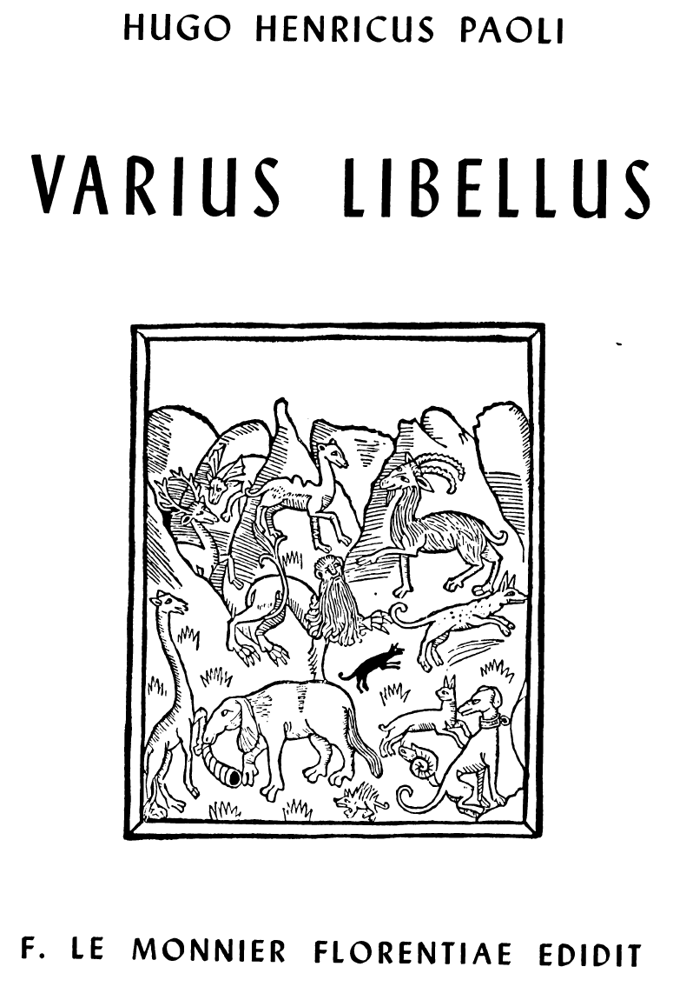

# Varius Libellus

---

HUGO HENRICUS PAOLI

VARIUS LIBELLUS

F. LE MONNIER FLORENTIAE EDIDIT

---

HUGO HENRICUS PAOLI

VARIUS LIBELLUS

ad usum scholarum redactus

a PETRO BERNARDINI

lepidis imaginibus exornatus

F. LE MONNIER FLORENTIAE EDIDIT A. D. MCMLXI

---

L'illustrazione della. copertina riproduce un'incisione di Bartolommeo

---

## Table of Contents

- [Table of Contents](#table-of-contents)
- [FABELLAE](#fabellae)
  - [I. - ASINUS, BOS, MERCATOR PRAEDIVES](#i---asinus-bos-mercator-praedives)
  - [II. - DE EQUO PROMETHEUM CULPANTE](#ii---de-equo-prometheum-culpante)
  - [III. - DE REGIS FILIA PULCHERRIMA](#iii---de-regis-filia-pulcherrima)
- [COLLOQUIA](#colloquia)
  - [COLLOQUIUM I (De haedo et lupo)](#colloquium-i-de-haedo-et-lupo)
  - [COLLOQUIUM II (De Cynegeri virtute)](#colloquium-ii-de-cynegeri-virtute)
  - [COLLOQUIUM III (De duobus anguibus)](#colloquium-iii-de-duobus-anguibus)
  - [COLLOQUIUM IV (Marius et Cimbricus servus)](#colloquium-iv-marius-et-cimbricus-servus)
  - [COLLOQUIUM V (De animalibus)](#colloquium-v-de-animalibus)
  - [COLLOQUIUM VI (Malus quidam discipulus)](#colloquium-vi-malus-quidam-discipulus)
  - [COLLOQUIUM VII (Discipulorum rixa)](#colloquium-vii-discipulorum-rixa)
  - [COLLOQUIUM VIII (De novis verbis Latine fingendis)](#colloquium-viii-de-novis-verbis-latine-fingendis)
- [INDORUM PROVERBIA](#indorum-proverbia)

---

## FABELLAE

### I. - ASINUS, BOS, MERCATOR PRAEDIVES

Fuit olim. Bagdadii, celebri Persarum in urbe et opulenta, praedives
quidam mercator, qui, cum diu ac feliciter
maria omnia negotiaturus percurrisset, magnam sibi pecuniam
paraverat, splendidam domum exstruxerat, latos agros
coemerat. Servi illi abunde erant, lauta supellex, lecti cibi,
exquisitissima vina. Nihil deerat earum rerum quae laetum
hominem ac beatum faciunt. Singulari insuper virtute deae
cuiusdam beneficio praeditus erat; namque animalium linguam tam bene
intellegebat ut, quicquid illa suo quaeque
sermone loquebantur, sic auribus animoque perciperet, tamquam si
disserentibus hominibus adesset. Nihil illi in occulto
erat quod inter beluas ageretur: noverat enim quid de singulis rebus
et canis suus domesticus et feles et simiae et cameli sentirent; quos
sermones secum haberent et aves in
arboribus et locustae in herba et inter saxa serpentes; atque etiam
quid clamitarent gallinae, cum stomachosis raucisque
conviciis in gallinario streperent
ac rixarentur. Sed dea eadem,
quae tanto illum beneficio adfecerat, severissime admonuerat,
ne cui unquam quicquam proderet, quod ex animalibus locquentibus audisset: capital id illi futurum.

Cum igitur quadam die mercator ad stabulum adsideret, ubi bos atque
asinus iuxta pascebantur, asinum sic bovem compellantem audivit.

«Magna est, amice, stultitia tua. Quam vitam agis, miser: ut tristem,
ut laboriosam! A primo mane usque ad vesperum iugo premeris, aratrum
trahis, ad plaustrum gravibus ponderibus oneratum adligaris; si
paulum interdum
consistis, stimulo incitaris; minis insuper voceque aspera te
bubulcus increpitat, perpetuis semper durisque fractum laboribus.
Postquam vero occidente sole praesaepe repetis,
qua mercede, cedo, quo cibo magnam illam atque utilem
operam tuam villicus remuneratur? Aridus tibi feni manipulus
adponitur, vel id tantum exsiccatarum fabarum, quod pugno capi
potest: pessimum quidem fabarum genus (vidi ipse, scito, bene notavi) tibi
reservatur, quod et inutile est serendo,
et sus ipsa in suili fastidiosa aspernatur. Confer te mecum: quantis
in lautitiis vivam considera;
qui, nisi forte dominus iter facere statuerit, perpetuo in otio
aetatem ago: largo cibo pascor, lavor cotidie et scobina ac
strigili diligenter confricor, quo nitidior fiam. Quis mihi non
invideat? Asinum homines fratrem suum putare dicas, a
quo, mihi crede, id tantum differunt, quod e diversa matre
sint nati. Tu vero, si natura tua callidior esset, longe aliter
habereris. Fac, quaeso, qui tu es, me esse; visne, optime,
cognoscere quid agerem ipse?». Verbum illud «ipse» sic
asinus pronuntiavit, ut tumidus totus fieret; magnam enim
sui confidentiam ostendebat, oculo altero nictabatur; diceres illum
talia addere velle: «Asinus ego, nobilis ac vetus
asinorum progenies, excelsum quoddam animal, naturae
opus praestantissimum».

«Ego, sic puta, si casu quodam bos factus essem, magnis
viribus meis fretus adpositum illum cibum, qui me non deceret,
intactum relinquerem, calcitrosus fierem, ungulis et
cornibus resisterem, iugum iactarem. Ne multis: omnia experirer, dum
et famuli et dominus ipse ea, quae mihi deberetur, observantia me
colere coepissent. Sed tu, satis intellexi, quem fortem ac robustum
natura fecit, stupiditate
ipse tua premeris, ideoque contemneris, quod sortem miseram et
accipis et sustines. Iure igitur minimi haberis».

Bovis animum asini verba
penitus moverunt, quod res ipsa
statim ostendit; nam, cum postridie eius diei bubulcus ad
praesaepe accessisset, ubi bovem ad aratrum
adligare conatus est, qua sibi cum belua res
esset haud dubie intellexit. Mugiebat bos, spiritum e naribus
minaciter efflabat, cornibus nitebatur, obliquis calcibus se
tutabatur: immanem feram diceres,
non bovem. Adpositas vero fabas ita aspernatus est,
ut ne illas quidem tangeret, quamquam nescio quid in ventre
suadebat, ne nimis pertinaciter cibo illo abstineret.

Mirabantur omnes; at dominus, quem tantae mutationis
causa non latebat:

«Aegrotat certe, inquit; miseret me illius; ne cunctemini,
famuli, bovem diligenter curare: faba, quae optima sit, illi
adponatur, bonum fenum, lectissimumque furfur; idque bene madens,
advertite, bene subactum. Illud in primis praecipio, ut eum quiescere
sinatis, cui, superiorum dierum laboribus defatigato, otio atque
inertia opus est. Ad aratrum vero
asinum adligate; cur semper ille ab omni opere cessat? Discat
tandem, pigerrimum animal, quos labores res rustica poscit,
eos cum bove aequa lege dividere. Nimis iamdiu haec ratio in
valuit, ut, cum universi animantes miseram
aetatem agant, unus asinus bene beateque
vivat atque omnium obsequio fruatur».

Famuli domini iussa properaverunt. Bos
quiescit; asinus, obtorta cervice actus ac
baculo interdum male mulcatus, aratrum
iniquissimo animo trahit.

Insequenti die mercator, magna motus
exspectatione quinam illius rei exitus esset
futurus, primo mane stabulum ingressus est.
Ac primum asinum secum ipsum flebiliter
querentem audivit:

«Heu, me miserum! quam saepe sapientem ipsa sapientia
fallit! Fatendum est: asini interdum tanta stultitia se gerunt, ut
germanos homines illos credas. Sed nulla tanta est
calamitas, cui magni ingenii animal, asinus, mederi non possit. Scio
quid faciendum sit».

Quae postquam tacito quodam murmure primis labiis
pronuntiavit, clara voce ad bovem conversus:

«Infelix animal!, inquit; magnum tibi malum instare certo
scio; audivi enim dominum nostrum, dum sic lanium adloquitur:
'Nescio quo morbo bos meus est adfectus; cibum
fastidit, languescit; stomachosius idem se gerit, ac diritatem
quandam ostendit; illum mactari iussi. Quam pinguis
sit, vides: in aliquot dies nihil erit timendum, ne nos caro
deficiat'. Talia ille statuit, heu! Peribis, miser. Vale. Ipse
vero, sint mihi testes di deaeque omnes, quorum nos asini
in tutela vivimus, tam boni, tam placidi socii numquam
obliviscar».

Sic asinus; simulatisque lacrimis fictum eftundebat maerorem.

Tum dominus: «Vater est asinus meus, inquit; quam
bene callet!»; atque magna cachinnatione exagitari subito
coepit.

Forte mercatoris uxor aderat, quae, mulier cum esset,
importuna semper curiositate sollicitabatur; tum vero, cum
risu tam immoderato illum concuti videret, tam effusae
hilaritatis causam rogare instantissime coepit.

Imprudens ille: «Quis enim, inquit, risu abstineat, si
talia asinum loquentem audierit?».

At illa: «Quidnam tandem locutus est?».

Sensit mercator temere se ea verba iecisse, ac diu obnubilata fronte
reticuit. At mulier primum labellum ducere,
deinde molliter virum suum rogare, permulcere, nullis blanditiis
abstinere; cum tamen nihil hac via proficeret, tum
vocem asperam tollere, imperiose se gerere; verbis eadem
doctissimis uti, mirum unde petitis: velle
sese rem bene compertam habere; hanc
esse primam connubii legem, ut ne quid
alter alteram celet; arcana neminem proditurum, uni si uxori
suae ea aperuerit,
quacum iure matrimonii omnium humanarum ac divinarum rerum in
consortio
vivere sit necesse. Haec omnia erecto collo, fixo ac severo obtutu
pronuntiabat: sic
Pythiam oracula edidisse credimus.

Denique, cum idem semper percontando
moleste urgeret ac premeret, mercator tandem:

«Ne amplius, mulier, quaesieris, inquit;
nefas mihi esse scito, si cui aperiam quid
ipse audierim».

«Loquere, tamen; sic volo; piget me, ut bene nosti,
saepius quod semel dixi iterare».

Cui ille paulisper cunctatus:

«Frustra rogas, inquit; si locutus ero, moriar statim.
Desine tandem tam pertinaci animo
id ex me quaerere, quod mihi proferre
non licet».

At magis illa suscensuit, virumque
suum convicus ac maledictis consectari coepit:

«Mendax es, vir pessime, uxoremque
tuam vix ferenda superbia contemnis».

Longum est enarrare quam multa
mercatoris uxor experta sit, ut asini
verba sibi vir proderet; omnes illa
artes adhibuit quibus mulieres uti solent,
si quid sibi proposuerint, quod
quacumque ratione adsequi deliberatum statutumque habeant. Sic enim
natura mulierum animos finxit, ut, quamquam summa est in illis
levitas, nulla tamen in re contumacius perstent, quam cum aliquid
perverse agant.

Postquam enim viri animum obduruisse intellexit, nec
quicquam illum, nec preces, aut minas, aut blandimenta
auribus accipere, infelicem uxorem agere coepit: cibo abstinebat,
conclave se negabat relicturam, diemque totum incompto capillo,
sordida, hirsuta, squalenti facie in lacrimis
ac maerore fluere sinebat. Ita ut
tandem mercator: «Peream igitur,
exclamaverit, potius quam talia cotidie
patiar»; uxorique renuntiari
iussit se morem illi gerere paratum
esse.

Talia dicentem forte gallus in
gallinario audivit, qui sic canem
adlocutus est:

«Stultos homines, inquit, multos
equidem vidi; domino tamen nostro stultiorem neminem; vere illum
furiosum ac mente captum dicas, qui in
eam usque vecordiam processerit, ut vitam relinquere malit,
quam maritalia iura, ut fas est, exercere. Gallinis ipse meis
sic imperito, ut, quicquid dixi, vel etiam nutu tantum praecepi,
statim illae facessant. Metu feminae coercentur, vi domantur, utpote
quae bonas artes vel morum
facilitatem pro animi infirmitate ducant. Dominus ego si essem, non
verbis ac persuasione
rem agerem, sed baculo. An ignoras quid veteres sapientes de hac re
statuerint? Asinos,
tympana, feminas crebro qui pulsat, bene ille,
ut aiunt, baculo utitur. Verberibus mulieres,
non blandimentis aut mellitis voculis leniores
fiunt. Sed, video, eximiam gallorum indolem
natura hominibus negavit».

Sic ait, ac bene sibi placens longum ac laetissimum edidit «kikiriki».

Mercator non longe aberat, nec verba illa irrita ceciderunt.
Quid multa? Nulla mora interposita, gallo spectante
atque alis plaudente, famulis imperavit ut baculum sibi
statim adferrent. Quo arrepto, minaci vultu thalamum ingressus est.

Quem ubi primum ancillae advenientem conspexerunt
intentis oculis, obdurata facie baculumque manu horribliter
quatientem, magnus statim clamor ortus est, magna
ac miserabilis eiulatio; diffugere miserae, quiritare, pectora
sibi plangere. Nihil ille movetur, sed uxorem intuens: «Visne,
optima femina, inquit, quid asinus me audiente dixerit bene
scire?».

Ac subito saeva verbera ita insonare coeperunt, ut conclave totum
concuteretur. Frustra mulier virum exorare conatur; frustra clamitat,
singultit, rabie ac dolore tota agitatur, dum lacrimas fundit,
preces, minas, contumelias miscet. Baculum rem suam facit. Haec vero
interdum audiebantur:

«Quam indigne vapulo, heu! Nec quisquam infelici mihi
subvenit».

«Habes quod merita es».

«Necas verberibus, sceleste: oh, malum facinus! Moriar,
misella».

«Quid ad me, mulier? Susque deque».

Ac deinde:

«Mitior fiam».

«Cuinam id persuadeas? An me putas muliebrem fallaciam prorsus ignorare?».

«Morem tibi geram».

«Credamne? mulier es: pestiferum genus mulieres, et
perfidum et contumax. En, accipe et haec!».

Postremo, infelix, verberibus fracta, cum partem nullam
in dorso gereret, quae non vibicibus liveret, umeri tumefacti
rubescerent passique capilli fugere conantem horrendam facerent et
miserabilem, eo tandem adducta est, ut
diceret:

«Nihil amplius quaeram de asino; iuro me verbum nullum de hac re in
posterum facturam; linguam coercebo, curiositatem totam deponam. Et
vir mihi eris et dominus.
Mulierem me esse fateor, infirmius quiddam: ignosce mihi.
Peccavi equidem; sine tamen te exorari».

Tum demum mulieris verba asperum viri animum flectunt. Baculum ille
seposuit, pax inter coniuges rediit.

Tradunt veteres Persarum annales, unde lepidam hanc
fabellam sumpsimus, nihil unquam posterius illorum coniugum
concordiam turbasse; quiete eos et iucunde usque
ad extremam senectutem vixisse; baculum vero in remotissimo aedium
angulo inter mures et araneas non sine quadam tristitia iners
consenuisse.

Fabula haec tria docet: minimam saepe adhibitam prudentiam magnas
calamitates prohibere; illud etiam: nihil
bonas artes apud mulieres valere, quae quidem nisi vapulando rectos
mores discere nequeant; postremum denique,
quod tertium et maximum est, homines, nisi deo quodam
auxiliante, plus quam asinos sapere fas non esse.

### II. - DE EQUO PROMETHEUM CULPANTE

Tradunt Iovem quondam edixisse ut singula animantium genera
praestituta die ad se congregarentur. Velle sese,
adstante Prometheo, viventes greges coram recensere, quo
diligentius procreatoris opus inspiceret atque vel collaudaret vel,
si quid ille in animalibus fingendis deliquisset, locus
esset emendandi. Latam quandam planitiem raris consitam
arboribus, nonnumquam etiam confragosis locis interruptam designavit,
utpote quae ad id aptissima videretur: eo
omnibus conveniendum erat.

Die dicta convocati animantes aderant variaque arte virtutes suas
ostentabant atque, id ipsum cum facerent, erat
in illis naturalis quaedam delectatio: rictabant leopardi, rugiebant
leones, audacissimo saltu corpora interdum tollentes;
suavi voce canebant aves summosque arborum ramos circumvolitantes
pinnarum nitorem in lucem proferebant; placide anates in parvo lacu
innatabant; gaudebant oves bene
pexa vellera exhibere, cornua tauri, caudas vulpes, dentes
apri, plumas pavones, longas pilosasque aures asini. Graviter
incedebat elephantus magnitudine corporis iure superbiens. Ipsae
serpentes sinuosis flexibus arenam describendo,
frequentibus editis sibilis linguisque bisulcis saepe iactatis,
se venditare conabantur.

Eo homo etiam se contulerat cum femina sua; sed contemptui omnibus
atque irrisioni erat. Illum tarde gradientem cervi et lepores
despiciebant, cornibus atque ungulis
carentem boves, volandi inscium aves, infirmis dentibus ac
parum validis unguibus praeditum leones, nuda mollique
cute tectum ursi atque elephanti, se alteri velleribus suis iactantes, alteri bene duratis coris. Mirari se psittacus aiebat
quod homo, quamquam vocis sonum aptius ederet ac distinctius quam
cetera animalia, eo praeclaro naturae munere
ad id tantum uteretur, ut de se uno usque ad fastidium
praedicaret. Simius vero, dum cauda celsioribus ramis arbors
advolvitur ac pendulus in aere huc illuc convicia fundit, clamitans
ex omnibus quaerebat, quidnam causae esset
cur, cum apud omnia animalia mares feminis firmiter imperitarent, vir
unus idem non posset.

Despectus homo, sed nobilitatis suae bene conscius bilem
tacitus concoquebat, nihil id eius uxore curante, quae
amoenissimum lacum nacta molliter in ripis adsidebat seque
interdum in aquarum speculo mirabatur, corde suo tacita
gaudens quod tam pulcra facies sibi contigisset.

Diceres tamen animalibus omnibus condicionem suam
satis probari, nec quicquam illa, quod quidem ad se pertineret, in
Promethei vituperationem adducere. At furore quodam agebatur equus,
opificemque suum, tamquam si magna
iniuria esset adfectus, obliquis oculis intuebatur; flere interdum,
suspiria ducere, iniquum animum pluribus modis efferre. Quem
Iuppiter, ubi tam graviter commotum animadvertit, appropinquare
iussit rogavitque
simul quare tanta ille ira exacerbaretur ac sic efferatus fureret.

Tum ille: «Rogitas, hominum deorumque pater? Nonne vides quanta
elegantia et velocitate delphinus in
mari iuveniliter ludens naves celerrimas nando superet atque cursu et
saliendo argenteis squamis nitentibus corporis venustatem
exhibeat? Ut magnifice et quasi regaliter elephantus incedat,
patiens idem animal ac
fortissimum? Aquilarum conformationem ac figuram considera: tutae
illae in summis montium  cacuminibus
nidificant ac, validissimis
alis praeditae, tamquam aeria
navigia nubes tranant, procellas contemnunt, in caelestia
spatia dominantur; ipsae
acerrimis oculis praedam vel
procul volantem adspiciunt, unguibus deprehendunt ac laniant, rostro
necant, pastum pullis suis futuram. Quid de
testudine dicam una cum domo sua ambulante, contra omnium animalium
insidias naturali clipeo undique tecta?
Quid de rhinocerote, quem acutum cornu ipsumque corporis pondus
terribilem facit atque invictum? Adspice, Iuppiter, quam varium,
quam amoenum sit avium genus; quanta
celeritate hirundines, quibus nihil ingeniosius Prometheus
commentus est, vacuum aera laetae atque alacres percurrant: dum
vibrantibus alis ac stridula voce sursum deorsum vagantur, nullum
certum iter secutae, sed cursum perpetuo inflectentes, viventium
sagittarum simillimae nunc
sublimia petunt, nunc hominum tecta radunt, ita ut, cum
ineunte autumno illae, ut adsolent, in diversas terras transmigraverunt, caelum, vel vespertina serenitate, mutum atque
omni varietate carens torpescere videatur. Simius ipse, perpetua
vivens inlaetitia, agili ac pernici corpore fretus, summos arborum
ramos nullo labore adtingens paene infinta libertate
fruitur, ac mira quadam petulantia in omnnes
iocatur. Quotquot animalia sunt, nihil
est quod illa iure desiderent. Mirarisne igitur
me indigne habitum dolere ac queri,
quod Prometheus, artifex ille egregius, cum
in singulis animantibus fingendis dilgentissime
elaboraverit, in me uno opus imperfectum
ac prope mancum reliquerit? An potes tu, iustissimum
numen, tantam iniquitatem non improbare? Id te
pati aequum est? Sed pateris, Iuppiter; hoc video et doleo:
adeo me contemnendum putas. At cur?

«Asinum mihi forsitan, ut iamdiu suspicor, anteponas;
quanam, quaeso, de causa? An quod rudendo ac calcitrando
omnium animos in se convertere studet atque, ne quis se
ignorare dicat, iter suum grandioribus stercoris globulis
spargit ac distinguit, viamque totam tam belle decorando
subsultim procedit? At quod animal, Iuppiter! Prudentiam
vocat baculo tantum parere ac philosophorum more quovis
cibo contentum esse. Putidam ille vanitatem humilitatis
specie obtegit; nunc vero, ut audio, asinorum academiam
instituere meditatur, ut, si quis asinino ingenio ceteris asinis
longe anteierit, maximis ille apud asinos honoribus fruatur.

«An hominem me pluris facis? hominem illum, qui (referre
pudet!), dum tigridem crudelitate, vulpem dolis, lupum
rapacitate, cuniculum ignavia aemulatur, si bene illius naturam
consideraveris, asini est simillimus? Diceris illius sollertia
summopere delectari; at qui sit, bene ipse novi. Nonne
vides, pater, quam stulte, quam ridicule se gerat? Verbis
gaudet, inani garrulitate delectatur seque universi mundi
dominum profitetur esse, ob id unum quod sermone sit praeditus.
Homine nihil infirmius in terris exstitisse arbitror,
quem sic natura formavit, ut et frigora horreret, et aestivis
caloribus extenuaretur et innumerabilibus morbis circumventus saepe
languesceret. Animo idem parum valet: mortis metu laborat,
superstitionibus transversus agitur ac miser
fit, invidia maceratur, quod malum ceteris animantibus paene ignotum
est; vitiis vero suis adeo indulget, ut exquisitas
voluptates inexpleto animo expetat hauriatque. Praeterea,
quo nihil turpius videri potest, dum foris iactantior ac gloriarum
plenus incedit, intra domesticos parietes, omni deposita adrogantia,
femineis imperiis demisse, ne dicam suppliciter, paret.

«Perfidus ac fraudulentus amicos prodere, socios circumvenire,
dolis ac fallaciis familiarium pecuniam ad se trahere
obstinato animo semper quaerit. Hae sunt illius virtutes,
quibus gloriatur, quas ostentat, tamquam si magni ingenii
indicia sint vel summae sagacitatis.

«Quid, quod insimiles suos rabido semper odio rapitur
perpetuisque inrixis versatur? Nullum animal, unum si hominem
exceperis, eo usque
insanit, ut bella per se ipsa
diligat; ferae immanesque
beluae aut fame aut defendendi sui necessitate aut
amore feminarum vel prolis
tutela ad caedem trahuntur: bene pasti leones etiam
agnis parcunt; tigres, satiato ventre, tamquam
languidae feles otiosi dormitant;
vipera, nisi eam pede presseris, quiescit nec cuiquam
venenati dentis morsum ultro minatur. At homo sponte necat, sanguine
gaudet, armorum fragore exstimulatur, odiorumque concitamenta in
semetipso libens exasperat. Artem
ille interficiendi repperit et diuturno studio semper coluit;
huc omnes animi vires intendit, neque unquam tantopere
sibi placet, quam si nova atque exquisita mortis instrumenta
ad terrorem et internecionem similium suorum callidus invenerit.
Nihil ei tantae est curae; nefarius ille ex aliorum
caede sceleratam quandam capit voluptatem. Impium et
ferum et exsecrabile animal Prometheus finxit cum hominem creavit.

«Hunc tamen divina mente praeditum esse voluisti; huic
tantum ingenii datum est, ut sidera numeraret, oceanum peragraret,
urbes aedificaret, artibus idem ac mercaturis repertis omnibus orbis
terrarum bonis frueretur; ut cibus cotidianus, neque is vulgaris,
numquam eum deficeret, et aqua
abundaret, et frigora pelleret. Ipsa fulgura ad utilitatem
suam aliquando flectet, neque tu ignoras, cui fata in aperto
sint; innumerabiles voces ita per aera errantes, ut nullo
sensu percipi possint, scite captabit ac distinctas audiet.
Quid plura? Quem nunc aves ob volandi inscitiam irrident,
alis olim non suis super nubes volabit montiumque iuga,
aquilarum regna, sublimis despiciet. Tantum, Iuppiter, huic
naturae monstro dedisti! Me, contra, generosum animal,
Prometheus, postquam fingendum suscepit, intermissa opera,
neque absolutum neque exactum reliquit».

Tum Iuppiter: «Miror, inquit, equidem te condicionem
tuam tam iniquo animo ferre. Loquere tamen; nam, si quid
emendandum in natura tua conspexero, nihil est cur quod
desit non addam, quod vitiosum sit non corrigam».

Laetatus est equus atque: «Celeritati meae, inquit, Iuppiter, id
obstat, quod crura nec satis longa sunt, nec gracilia satis. Lecti
cibi necessitas atque sitis impatientia operae meae utilitatem
imminuunt. Hominem tergore gerere
iamdiu didici; pudet me tamen adligatis ephippiis semper
premi, quae agaso cingulis et fibulis recalcitranti atque anhelanti
mihi cotidie aptat. Quantulum erat longiora mihi crura
largiri, naturalia ephippia addere! Cur autem venter meus
tam multa postulat? Cur sitim ferre parum valeo?»

«Adde quod nescio qui terror sublatet in animo meo
atque occulta perpetuaque anxietate me suspensum tenet.
Qui belli discrimina fortissime
obire soleam, neque armorum
tumultum reformidem, quin
etiam hostium impetum, vulnerum atrocitatem, plagarum
ictus elato animo excipiam,
minimis idem de causis pavore
lymphatus praeceps agor. Saepe
enim vel foliorum strepitus, vel leviter commota saepes,
vel linteolum album in herba expansum eo usque mentem
meam perturbant, ut insana fuga in quodvis obstaculum
caecus incurram, meque equitemque meum in perniciem
traham. Deme, precor, Iuppiter, hanc terroris nubem, neve
patiaris nobile animal tam vacuae formidini obnoxium esse.
Me fortem semper fortiter facere aequum est».

Postquam equus finem loquendi fecit, diu Iuppiter cogitabundus
reticuit. At tandem:

«Vide, sis, inquit, ne quid temere contra te ipse petas;
cito spectabis inquam speciem et figuram te sim conversurus,
si preces tuas exaudiero».

Statimque tantum sibi luti adferri iussit, quantum manus caperet; quo
accepto, divina quaedam verba demisso
capite immurmuravit. Nec mora ulla: camelus creatus est.
Piger ille, pilis horridus, longumque collum lentus incurvans, ubi
primum vitales auras hausit, diductis labiis absonum quendam gemitum
emisit, ita ut undique magna omnium cachinnatio
orta sit. Tum luppiter, equum adlocutus:

«Ecce, optime, inquit, quod in animal
mutari vis. Quae optas, camelus
factus habebis omnia: nonne belua ista
exilibus cruribus praedita est? Nonne
naturalia ephippia in dorso ipsa gerit? Scito etiam nullum
animal tam parvo cibo contentum fore, sitim nullum, vel
in aridis ardentibusque arenis, tolerantius laturum. Vanos
illos terrores, quibus tu interdum exagitaris, prorsus ignorat.
Mitis est camelus et utilis et patiens. Adnuas tantum
oportet, camelus fies».

Fremere equus, frigidoque tremore toto corpore corripi;
nec verbum ullum proferre. Nam, ubi primum deforme illud
animal adspexit, horrore atque odio quodam captus diu
obmutuit. Cum vero vocem rumpere valuit:

«Apage, inquit, Iuppiter, foedum istud monstrum, ne
diutius id naturae dedecus intueri cogar. Erravi, fateor,
meque temeritatis meae paenitet pigetque; stultus ac levis
condicionem meam non recte aspernatus sum, nec iam quicquam habeo,
cur Prometheo neglegentiam obiciam. Falso
illum culpavi. Id unum te rogo, ut posthac quibus inregionibus equus
vivere soleat, inde camelus absit. Alias ille plagas incolat, sub
alio caelo versetur, longinquis in terris servitutem suam hominibus
praestet. Semper enim, conspecto
camelo, torpore hebetabor ac viribus frangar».

Adnuit Iuppiter, camelumque deserta in loca relegavit;
laeta prata, agros, hominum urbes equo reliquit.

Aiunt equum etiam nunc, si forte camelum adspexerit,
tremere per omnes artus atque horrescere. Pristinae stultitiae
suae profecto reminiscitur.

Nonne quod equus fecit, id nimis saepe ab ipsis hominibus
fieri solet, quotienscumque illi, contemptis bonis quae natura
dedit, multa et prava exoptant, sibique ob id unum ea profutura
credunt quod illis ipsi careant? Id nos fabella admonitos vult. Docet
eadem quam simili facie et praeclara
et turpia se exhibere consueverint, quam saepe equum quaerenti
camelus obveniat. Ipsos homines hac fabella describi
fateamur necesse est. Nos enim generosam equi naturam in
animis nostris inesse credimus, latentem camelum non videmus, cuius,
dum turpitudinem referimus, patientia caremus.
Circumit tamen veritas, suoque in speculo nos veram hominis effigiem
vel invitos spectare cogit: pilosa crura nobis, defornem faciem,
obscenum ac gibberosum dorsum repercussa imagine obicit exprobratque.
Sed nostra nos inanitas
falsis nominibus ludere docet, ac temere nobis ipsis blandiri,
cum ignaviam nostram prudentiam vocamus, fraudem calliditatem,
avaritiam parsimoniam, tum praesertim cum intolerabili iactantia ac
levitate superbiam et ferinam rabiem
magni animi appellatione obtegimus.

### III. - DE REGIS FILIA PULCHERRIMA

Regiam puellam quattuor adulescentuli, summo genere
orti, misere perditeque amabant.

Par omnibus nobilitas, forma, ingenium, virtus in armis,
iuventutis decus; pari in puellam amore deperibant;
pari studio illius connubium exoptabant. Quae, cum diu,
cui nuberet, dubia atque incerta fuisset, gravi morbo correpta
paucis diebus periit.

Postquam autem, perfectis exsequiis, corpus mortuae virginis
in rogo est impositum flammisque involutum ardere
coepit, unus ex illis adulescentulis inignem periturus se
proiecit, ut, quandoquidem spem nuptiarum mors ademisset,
uno dumtaxat eodemque monumento cum puella conderetur.

Ubi vero omnia combusta sunt flammaeque resederunt,
alter illorum iuvenum, cineribus dihgentissime collectis,
splendidum mortuae puellae sepulcrum exstruxit, idque
area circumdedit pretiosis arboribus exquisitisque floribus
consita, quam summa diligentia ac pietate cotidie colebat,
multoque aquarum rore, multis lacrimis perfundebat.

Tertius vero adulescentulus statim peregre profectus est,
ceterisque curis posthabitis totum orbem terrarum curribus
et navibus pervagabatur, studiosissime quaerens num vestigando
et perscrutando omnia remedium aliquod invenire
posset, quo adhibito puella ad vitam revocaretur.

Unus tantum ex quattuor, quamquam et ipse gravi maerore adficiebatur,
seu quod blandius puellam amaverat, sive
eo quod tribus illis, ut suspicari licet, sapientor erat, nullum
amoris pietatisve documentum edidit: domi mansit, lacrimis temperavit, negotia sua gessit.

Accidit vero ut ille, qui eo animo in externis regionibus
peregrinabatur, ut regis filiae
vitam redderet, ignotum quoddam Indiae
oppidulum casu ingressus id tandem remedium inveniret, quod
diuturno labore requirere non desierat: pulvis erat magicus, mira
efficacia, vel adversus mortem praestantissimus:
«pimpirimpinus» appellabatur.

Forte eum pulverem mercator, illius regionis incola, dum
in longinquas terras nullo comite iter facit, in ipsa via
temere effusum nactus
erat, tantoque fortunae
munere vehementer gavisus
cupide exspectabat, si quis illum magna
pecunia accipere vellet.
Non cunctatus est adulescentulus ingenti pretio
oblatum medicamentum
emere; deinde, nulla
mora interposita, reditum parare coepit.

Domum ergo quam
celerrime reversus, penates suos tandem revisit,
pulverem secum adferens, quo nihil pretiosius aiunt
in his terris inveniri posse. Ne multis: puellae sepulcrum
adiit statimque vim pulveris experiri constituit. Quid tum?
O rem mirandam! Terra movetur; sepulcrum nutat, dehiscit,
corruit; urna ipsa recluditur, patefit; cineres animantur:
dicto citius mortua virgo atque una amans ille miserrimus,
qui iisdem flammis consumptus eodem monumento, permixtis
cineribus, conditus erat, incredibili omnium gaudio
ad vitam redditi sunt.

Sed rursus, ut sunt adulescentuli inamando obstinati,
lis magna orta est, quis puellam uxorem duceret, quam suam
quisque fieri cupiebat. Neque longe res aberat ab armis et
sanguine, atroxque certamen exarsurum erat, nisi puellae
pater, rex idem summa prudentia praeditus, adulescentulis
persuasisset, ut sapientissimum quendam senem adirent ab
eoque ea lege sententiam acciperent, ut quicquid ille statuisset,
ratum omnes haberent. Placuit consilium, atque arctissimo
se iureiurando obligaverunt nihil quemquam contra
senis illius sententiam ausurum. Qui quidem, cum diu multumque
rem consideravisset, haec fertur edidisse:

«Qui pulveris virtute puellam ad vitam revocavit, cum
patris munere functus sit (pater est enim quicumque mortali
homini vitam tribuit), patris loco est habendus. Desistat
igitur puellae nuptias
adpetere: parentes a liberorum connubio leges
omnes arcent et humanae et divinae.

«Qui vero eiusdem
patris opera et consilio
una cum illa revixit,
frater est: fratri sororem nubere nefas.

«Qui, sepulcro
exstructo, aream diligenter consitam adsidue coluit,
servi ille operam virgini navavit, non sponsi. Regiam puellam apud
servum collocare et lex vetat et mores non patiuntur.

«Quid contra impediverit quominus unus ille qui, amissa
puella, sibi morem gessit, res suas non neglexit, mortuos
lacere iussit, cum neque pater sit neque frater neque servus,
domum virginem ducat? Huic uni igitur rex filiam suam
despondeat oportet».

Omnes consenserunt sapientem illum rem optime diiudicasse,
sanctissimeque iusiurandum servaverunt.

Haec fabula monet ne nimis in re ulla, si quid cupimus,
desudemus, cum fortuna, ut multis ex rebus colligi potest,
plerumque soleat neglegentioribus favere.

## COLLOQUIA

### COLLOQUIUM I (De haedo et lupo)

*Magister.* — Exsurge,
Paule; quaere in libello
scholastico tuo eam fabellam
quae inscribitur: De haedo et lupo.

*Paulus.* — Inveni illam. Quid tum?

*Magister.* — Eam fabellam
recita, elata voce, ac
tam plane, tam distincte,
ut omnes condiscipuli tui
audire possint. Ceteri discipuli, dum Paulus recitat, clauso
libello quid in fabella enarratum sit intellegere conentur.

*Paulus.* — (*Cito ac confuso ore recitans*): «Haedus, quem
derelictum a grege, lupus persequebatur....».

*Magister.* — Ohe! Nimis submisse loqueris, litteras vero
neglegentius exprimis. Quomodo illi quod recitas intellegant?
Verba ita exprimas oportet, ut singulas litteras elate
ac nulla obscuritate enunties. Rursus ergo incipe.

*Paulus.* — Recte suades: experiar: «Haedus, quem derelictum
a grege lupus persequebatur, conversus ad illum:
'O lupe, inquit, quoniam video me tuum cibum futurum,
ne iniucunde moriar, cane tibiis, ut saltem'. Cum autem et
lupus tibiis caneret et haedus saltaret, canes audiverunt statimque
lupum persecuti sunt. Tum lupus: 'Merito, inquit,
haec mihi fiunt; oportebat enim me, cocus cum essem, tibi-
cinem non agere'».

*Magister.* — (*Ad alium discipulum conversus*):
Audivisti, Petre, quod Paulus recitavit?

*Petrus.* — Audivi equidem, ac libentissime;
nam iucunda ea fabula est
et recte nos admonet.

Magister. — Quidnam admonet?

*Petrus.* — Periculosum esse artem, quam
non didiceris, exercere.

*Magister.* — Optime. Quid vero in ea
fabella narratur?

*Petrus.* — Haec fere.
Haedus, cum insequentem lupum nullo modo effugere posset,
illum rogavit ut tibiis caneret, quo ipse iucundius moreretur.
Lupus igitur illi, ut morituro, morem gessit. At
canes audiverunt, quod quidem fore haedus speraverat;
adcurrerunt, lupusque fugere coactus est.

*Magister.* — Recte; conside. (*Ad alium discipulum conversus*):
Visne, Carole, eandem rem alius verbis exponere?

*Carolus.* — Utique. Lupus haedum insequebatur. Qui
quidem, cum nullam viam salutis sibi videret superesse,
lupum ut tibiis caneret oravit, ne
ipse iniucunde, ut aiebat, moreretur.
Adnuit lupus, tibiisque canere bs
coepit; at canes venatici, cantu excitati,
ipsum lupum insecuti sunt.
Tum fera, haedo dimisso, infugam
est conversa.

*Magister.* — Quid tum lupus exclamavit?

*Carolus.* — «Oportebat me, coquus
cum essem, tibicinem non agere».

*Magister.* — Quid aliud ex hac fabula colligi potest?

*Carolus.* — Nil adiciendum puto.

*Magister.* — (*Omnes discipulos adlocutus*): Nemo quicquam
respondebit?

*Unus ex illis.* — Ipse, si licet.

*Magister.* — Dic, age.

*Discipulus.* — Fabella de haedo et lupo illud etiam docet,
fieri nonnumquam ut, qui viribus vincuntur, fortiores calliditate
superent; ideoque corporis vires, si prudentia absit,
null utilitati esse. Tibiarum enim cantum canes venaticos
excitaturum haedus probe intellexerat, lupus minime suspicatus est.

*Magister.* — Rectissime conclusisti. Conside.

### COLLOQUIUM II (De Cynegeri virtute)

*Magister.* — Huc ades, Valeri, ex libello tuo quid Cynegirus
egerit recita.

*Valerius.* — «Cynegiri, militis Atheniensis, gloria magnis
scriptorum laudibus celebrata est, qui in pugna Marathonia,
post proeli innumeras caedes cum fugientes hostes ad naves
egisset, onustam navem dextera manu tenuit nec prius
dimisit quam manum amitteret; tum quoque, amputata
dextra, navem sinistra comprehendit, quam et ipsam cum
amisisset, ad postremum morsu navem detinuit».

*Magister.* — Idem verbis tuis enarra.

*Valerius.* — Cynegirus Atheniensis apud Marathona fortissime
pugnavit; fugientes hostes ad naves insecutus est; navem
unam manu detinere conatus est. Deinde, cum hostes
utramque manum illi amputassent, dentibus.

*Magister.* — Quid de hac re sentis?

*Valerius.* — Quod vix credibile est, fidem habere nequit.

*Magister.* — Sed constat Cynegirum illum strenuum audacemque
in proelio fuisse.

*Valerius.* — Fuerit sane; at hominem onustam navem
dentibus detinentem quis unquam vidit?

*Magister.* — Quis Cynegirus fuit?

*Valerius.* — Aeschyli frater.

*Magister.* — Unde scis?

*Valerius.* — Ex adnotationibus, quibus liber noster est
instructus.

*Magister.* — Quis Aeschylus?

*Valerius.* — Tragoediarum scriptor clarissimus, qui et ipse
apud Marathona fortiter pugnavit.

*Magister.* — Quo anno apud Marathona pugnatum est?

*Valerius.* — Anno quadringentesimo nonagesimo ante Chr. n.

*Magister.* — Recte; conside.

### COLLOQUIUM III (De duobus anguibus)

*Magister.* — Legistine, Fabulle, narratiunculam de amore
coniugali, quam Italice convertendam adsignavi?

*Fabullus.* — Legi.

*Magister.* — Quid Tiberio Graccho evenit?

*Fabullus.* — Duos angues domi deprehendit.

*Magister.* — Quid postea fecit?

*Fabullus.* — Haruspicem adiit, eumque consuluit.

*Magister.* — Quid ille?

*Fabullus.* — Respondit, si mas dimissus esset, Tiberii uxorem
perituram; si femina, ipsi Tiberio mortem instare.

*Magister.* — Quomodo, hoc responso
audito, Tiberius se gessit?

*Fabullus.* — Feminam dimitti iussit.

*Magister.* — Clarum igitur exemplum amoris coniugalis edidit.

*Fabullus.* — At non aliter illi faciendum erat.

*Magister.* — Quomodo dicis?

*Fabullus.* — An debuit ille, mare dimisso feminaque necata,
uxorem ipse suam interficere?

*Magister.* — (*Ridet*). In hoc tamen laudandus est, quod
pro salute uxoris suam ipsius vitam spreverit. Nunc totam
narrationem expone.

*Fabullus.* — (*Celerrime*). Tiberius Gracchus duos angues,
marem et feminam, deprehendit. Haruspicem....

*Magister.* — (*Manu ut deststat imperat*). Nihil prorsus intellego;
tanta est enim tua celeritas in dicendo. Dixi sescenties: articulatim
verba proferenda sunt, clare, distincte, non
sine aliqua gravitate, cui nil tantum obest quam pronuntiandi
concitatio. Narrationem igitur de integro resume, sed
pressius loquere.

*Fabullus.* — «Ti. Gracchus, anguibus domi suae mare ac
femina deprehensis, certior factus ab haruspice mare dimisso
uxori eius, femina ipsi celerem obitum instare, salutarem coniugi
potius quam sibi partem augurii secutus, marem necari, feminam
dimitti iussit, sustinuitque in conspectu suo
se ipsum interitu serpentis occidi».

*Magister.* — Nunc id ipsum verbis tuis enarres velim.

*Fabullus.* — Cum Tiberius Gracchus duos angues, marem et feminam,
deprehendisset, haruspicem consuluit. Ille,
re explorata: «Mare dimisso, ait, mors uxori tuae impendet: dimissa
femina, tibi». Tiberius statim marem necari iussit.

*Magister.* — Probo, conside.

### COLLOQUIUM IV (Marius et Cimbricus servus)

*Magister.* — Exsurge, Gai. Recita ex libro tuo narratiunculam de
Mario et Cimbrico servo; sed non, ut plerumque
in ludis fit, incondito quodam murmure aut (quod contrarium est
vitium, sed aeque improbandum) nimis intente instanterque
pronuntiando, voce quam decet editiore, tamquam si incontione potius
quam in ludo quis loquatur. Apte,
sapienter dicendum est, pausis notatis, voce, prout res postulat,
nunc intenta, nunc remissa, ut ipsa sonorum varietate sententia plane
colligatur.

*Gaius.* — «Marius post sextum consulatum annumque
septuagesimum nudus ac limo obrutus, oculis tantummodo
ac naribus eminentibus, extractus
arundineto circa paludem Maricae,
in quam fugiens consectantes Sullae
equites se abdiderat, iniecto in collum
loro, incarcerem perductus est.
Ad quem interficiendum missus est
cum gladio servus publicus, natione
Germanus, qui forte ab eo imperatore
bello Cimbrico captus erat; ille
vero ut agnovit Manum, magno
eiulatu exprimens indignationem casus
tanti viri, abiecto gladio, profugit e carcere».

*Magister.* — Recte, puer. Nunc
velim ea quae recitasti verbis tuis
exponere coneris.

*Gaius.* — Marius, cum Sullae equites
fugeret, in palude delituit. Deprehensus est atque in
carcerem abductus. Ad eum interficiendum servus publicus,
natione Germanus, missus est. Ille vero, qui bello Cimbrico
captus erat, Marium agnovit atque, abiecto gladio, e
carcere profugit.

*Magister.* — Elegantius poteras; sed nusquam errasti; in
ludis id primum est. Nunc vero Marius ille qui fuerit scire
cupio.

*Gaius.* — Magnus Romanorum imperator. Bellum Iugurthinum
confecit; Cimbros Teutonosque gravissima clade
reppulit; magnam illorum multitudinem concidit, maximo
periculo Italiam liberavit. Memini superiore anno tecum in
Eutropii *Breviario* nos legisse natum illum agresti loco, hirtum
atque horridum vitaque sanctum, quantum bello optimum,
tantum pace pessimum fuisse.

*Magister.* — Ipsa Eutropi verba sunt; nihil desideratur.

*Gaius.* — Memoriter enim didici; saepius enim nos admonuisti
ut, si quid in Latino sermone proficere vellemus,
quam plurima memoriae mandaremus.

*Magister.* — Nec quicquam aliud instantius commendaverim.
At cur Eutropius Marium pace pessimum iudicet
non video.

*Gaius.* — Nulli tale iudicium aptius congruit; nam cum
eo tempore duae factiones cives Romanos distinerent, Marius,
populari causa suscepta, victoriam plebis superbe
atque atrociter exercuit. Adversariorum factionem oppressit,
principes eorum qui optimatium causae favebant in proscriptorum
numerum rettulit, caedibus, luctu, terrore totam
Italiam implevit.

*Magister.* — Probissime. Conside.

### COLLOQUIUM V (De animalibus)

*Magister.* — Cras unusquisque vestrum ea quae de animalibus in libro
vestro leguntur, Italice conversa ac nitide
exscripta mihi tradet. Id pro penso erit. Aliquot capitula
sunt; brevia, neque ea difficilia. Quin etiam spero iucundum vobis
fore tam multa de animalibus cognoscere. At cavetote ne omnia
credatis; multa a veri similitudine absunt;
nonnulla vero falsa et commenticia ibi commemorantur, pravae vulgi
opiniones.

*Discipulus.* — Quid igitur opus est ea nos discere, quae
a vero aversa sunt?

*Magister.* — Dicam; qui antiquitatis notitiam adfectat, eum
illud etiam pervestigare atque exquirere oportet, quae veteres
homines crediderint, vel si contra veritatem crediderint. An
ignoras Dantem nostrum solem circa terram circumferri falso
putasse? Quod qui non noverit, putasne Dantis illum carmina
probe intellegere posse? Nunc, quoniam de animalibus
mentio incidit, quaero ex vobis quae inter animalia maximae
hominibus utilitati esse putetis.

*Discipulus.* — Ante omnia bovem; nam et agros arat et
currum trahit et agricolis in. omnibus operibus est adiumento. Idem
carnibus suis cibum optimum praebet, corioque, quo tegitur,
calceamentis materiam suppeditat. Eius
femina, quae vacca vocatur, lac bubulum dat, quod hominibus gratum ac
salubre alimentum est, pueris vero et
aegrotis et senibus paene necessarium; eorum victus enim
maxime in lacte consistit.

*Discipulus alter.* — Si de carnis suavitate disserere oportet,
iniquum est nullam de porco mentionem facere; quam
multis enim deliciis suilla caro hominum mensas instruit!
Si quis gutturi ac ventri indulgere solet, paene innumerabiles
voluptates capit ex illa; nihil exquisitius aut tam
varium natura gulosis viris obtulit, nihil delicatius.

*Magister.* — Iure id addidisti. Etiam veteres scriptores
suillae carnis suavitatem laudibus efferunt; quin etiam
Plinius ille, quo nullus curiosior naturaliuum
rerum indagator exstitit,
quinquaginta sapores aetatis suae
coquos in carne suilla invenisse refert.
At dic: ubi caro vitulina ac bovina venit?

*Discipulus.* — Apud lanium.

*Magister.* — Ubi veneunt et pernae, et farcimina suillae
carnis ut lucanicae, isicia, botuli?

*Discipulus.* — Apud salsamentarium.

*Magister.* — Recte; sed ad bovem revertamur; quis ex
corio calceos efficit curatque ut ad pedes habiles aptique sint?

*Discipulus.* — Sutor.

*Magister.* — Ubinam?

*Discipulus.* — In sutrina.

*Magister.* — Quis boum tergora subigit coriumque perficit?

*Discipulus.* — Coriarius.

*Magister.* — Quod animal post bovem utilius?

*Discipulus.* — Ovis.

*Magister.* — Quasnam utilhtates ex ove percipimus?

*Discipulus.* — Ovis villi lanam praebent;
ipsa cotidie ad mulctram venit
ex eiusque lacte caseus optimus fit.
Agnis quoque quos illa parit pro cibo
utimur.

*Discipulus alter.* — Sic igitur ea munera pensamus! Lanam illa et caseum
suppeditat, nos tanti beneficii memores illius prolem iugulamus atque comedirnus. Malum genus
homines, semper beneficiorum acceptorum immemor!

*Magister.* — Tace, philosophe, atque, si libet, oleribus vescere.
Vel potius dic: quibus modis lana tractatur, ut ad
quotidianos usus sufficiat?

*Discipulus.* — Ante omnia lana nendo in filum ducitur.
Nebant olim ancillae, aniculae; quibusdam locis mulieres
omnes; colu et fusis nebant, lanae pensa instamina ducentes.
Nostris vero temporibus hominum industria nendi operam
a mulieribus ad machinas transtulit.

*Magister.* — Bene habet; sic pergito.

*Discipulus.* — Lanae staminibus texturae conficiuntur,
quibus utimur vel corporis tegumentis vel lectorum stragulis.

*Magister.* — Ubi lanae texuntur?

*Discipulus.* — A textoribus vel a textricibus in textrinis.

*Magister.* — Quid haec vox significat, *textrinum*?

*Discipulus.* — Duplicem vim habet: nam et locum, ubi
lana texitur, significat et artem ipsam texendi.

*Magister.* — Suntne alia animalia quae hominum commoditatibus inserviant?

*Discipulus.* — Sunt profecto, eaque complura. Canis in
primis, qui ob fidelitatem obsequiumque amicus hominis appellatur.Nullum animal in officio persolvendo constantius est: aedes ille custodit, greges servat, venatoribus etiam
atque aucupibus tantae utilitati est, ut,
nisi canis operam suam tam strenue homini
navaret, nulla ars venatoria esset,
nullum aucupium.

*Magister.* — Scisne quid venatio ab aucupio differat?

*Discipulus.* — Ante equidem ignorabam; sed memini te
nuper dicere aves captare aucupium esse, lepores vero maioresque
feras insectari eam esse venationem.

*Magister.* — Probissime; pergito.

*Discipulus.* — Longum est usus omnes persequi, quos animalia ad
humanam vitam adferunt; ut asini, patientissimum
genus, ad onera ferenda maxime idoneum; ut bombyces,
qui bombycem pariunt, unde sericae (vel bombycinae) vestes
parantur; ut apes, quae mel colligunt atque condunt; ut,
si volumus, feles etiam, quae mures insectatur atque domos
obscenis illis hospitibus purgat.

*Discipulus tertius.* — (*Submisse*). Feles mea,
fateor, nihil aliud
agit nisi lac sorbet, dormitat,
stertit. Carnem illa quidem, si occasio
detur, arripit voratque; muribus
vero parcit. Credo eam cum illis pacem sempiternam
pepigisse.

*Magister.* - De animalibus hodie sat diximus; ad aliam
rem transeamus.

### COLLOQUIUM VI (Malus quidam discipulus)

LA M agn1stexr. � Publium
] E hodie interrogabimus.
HT Phaedri fabellam, quam
| her ltalice convertimus,
n - tu, Publi, memoriter, ut
| J) praecepi, recitabis. De ra-
� e xS na rupta agebatur, quae,
NM Lov� 2H dum bovis magnitudinem
NSQNE Jj J/ | consequi vult, nimis rugo-
922 "v sam cutem intendendo, ut
EAE poeta ait, �rupto iacuit
; "D: : I! corpore � An versus illos
de NS edidicisti
bs e SN ! Publius. � (Emungit
nares ; lacet).
*Magister.* � Praeclare responsum!
Publius. � & vis, incipiam.
Magister. � Quidni? id ipsum volo. Distincte atque
clare profer.
Publsus. � (Biss terque balbutit): � In prato quondam.... �.
Magister. � Nil aliud? Exspecto quae sequuntur.
Publius. � (Caput scabit; tandem. haesitante hngua  pro-
nuntiat): �In prato quondam.... �.
Magister. � Siccine satis? Perge.
Publius. � Facerem, sed.... nil memini.
Magister. � An potest quisquam quae numquam didice-
rt meminisse? Quod nil reminisceris, voluntatis vitium est,
non memoriae.
Publius. - Nescio quid nunc memoriae officit; sed expe-
riar: �In prato quondam.... rana... conspexit bovem.... �;
dixiigitur:... � conspexit bovem.... �. (4d quendam conversus,
submissa voce): Subice, quaeso. (D�storquet oculos; digitis
significat ut aliquas sibi subvenaat).

Magister. - �n putas me quid submisse dicas non audire,
manusque tuas non videre? Cur potius non fateris pensum,
quod accepisti, te neglexisse ?

Pubitus. � Fateor; sed me reprehendere noli: valetudine
impeditus sum.

Magsster. � Credam?

Publius. � Totum diem heri ex capite laboravi.

Magister. � Cur te mentiri suspicer?^ Cedo tamen libel-
lum tuum, ut inspiciam quomodo
praeterita pensa emendaveris.

Publius. �- Domi libellum re-
liqui. (Ut

Magister. � Haec quidem
summa neglegentia est. Quid ? si � y] p 7/ L
miles eris, armis te instruere obli- a (
VIsCeris ?. N Zw. c- 74

Publius. � Peccavi, fateor;
sed libellus meus atramenti ma- C!
culis scatebat; exscribere in ani- Gm
mo erat; ignoscas.

Magister. � lgnoscam; audi
tamen. Desidiosus es, puer; offi- P V ] L | V e
cla scholastica semper neglegis.

Quinque iam menses hunc ludum i�requentas et me audis,
sed quidnam ex verbis meis profeceris nondum video. Id
unum scis, plorare; nam, postquam pagellam scholasticam
pessimis notis distinctam accepisti, tum, ecce, puellarum
more eiulas: profluvium est lacrimarum; tragoedia mera.
Negas ea omnia tua culpa fieri; mala fata incusas et prae-
ceptorum severitatem et magnum viae clamorem, ad quam
ludus spectat. Coniurant omnia in te, miselle. Tu innocens
es, diligens, attentus, discipulorum optimus. Redi nunc ad
4. " PAoL1, Varius libellus,
� 46 �
scamnum tuum; cras iterum interrogaberis; hodie, ut pol-
licitus sum, tibi ignoscam, ut scias numquam seram esse
paenitentiam, si quem in ludo pigritiae suae taedere coe-
perit. Sed memento magnam quidem esse magistrorum be-
nignitatem, non illam tamen infinitam. I quam citissime.

### COLLOQUIUM VII (Discipulorum rixa)

Magister. - Rogat me per famulum praeses ut illum sta-
tim conveniam. Spero vos, me absente, quietos fore; non
diu abero. Tu, Gai, qui classi ob diligentiam praepositus es,
condiscipulos tuos regendos susceperis; iura disciplinae, tam-
quam si magister sis, exerceto. (Ab).

Undique submassa murmura audvuntur ; buellae statim ala-
criter, ut adsolent, confabular vncipyunt ; hic ridet, alle blum-
bum acu; monnull: oscitant. Ius, discipulorum besswmus,
brachium. [ule carpit; hac aegre vocem bremat..

Gawus. � St! Vos oro ut silentium teneatis; si quid tur-
babitur, ipsum me magister reprehendet.

LDascipulus quidam. � Iure id precatur.

LDascipulus alter. � (Ad Gavwum). Dic potius: � Quousque
tandem patientia mea abutemini? �. Mihi crede, nobilius
sonat.

Ius. � (Gavum brocaciter antuens). Salve, magister op-
time; magister et domine, salve.

Gaius. � (Radens). Et te salvere iubeo; sed tace.

Tus. � Dic mihi, doctissime: licetne paululum exire?

Gawws. � Non licet.

Ius. � Sed necessitas quaedam impellit ut exeam.

Gaius. � Credo; sed cito magister revertetur; tum, si ille
permiserit, exibis. Nunc tace.

litus. � (Cantitat, manus sw agtans, velut si cithara
[udat).

Vice magistri fungitur;
Gerit quatitque ferulam;
Discipulis imperitat,
Formidulosus omnibus.
� 48 �
Adspectu venerabilis,
Quamvis pusillo corpore,
27 Infirmo quamvis latere,
^. S Pallente quamvis facie.
Y z Magistri sedem occupat;
Magistri tenet cathedram.
O casus iucundissimus!
(Cachinnat)
S ^ Asellos regit.... asinus.
T | T V G Fadent omnes ; unus. Valerius
jrontem. contrahi, el. capite nutat.
lI12tus. � Cur, Valeri, me ca-
nente abnuis? Novi mores tuos; oboedientior es quam decet.
o5cholasticam modestiam nimis servas; ludi disciplinam ultra
modum amas. Sed ficta est atque adsimulata ista tua virtus,
fictum istud disciplinae studium. Omnium inobsequio vivis,
miserrime. Magistro adsentaris; praesidem cernuus, obtorto
collo oculisque demissis, tamquam supplex, adloqueris; ip-
sum ludi famulum catelli more
adularis. Atqui boni discipuli p
munera haec tria sunt: discipli- (
nam odisse, magistros contem- ^
nere, aliena pensa exscribere. 9 32s !
(Fdet alaquas ; ceteri yndagnantur ). A^ �
Discipulus quidam. � Visne CN, �
tacere? [aedet nos omnes im- pA
portunae istius loquacitatis.
I ullius. � Patere; stultus est. N
Qui stultus nascitur, stulte lo-
quitur, stulte agit, insuaque stul-
titia involutus, tamquam sus in I V | a | V -
coeno, vivit. Dies veniet: stulte
peribit. In ludo iste nil proficit; mente parum validus cum
sit, lingua tantum valet, mirae loquacitatis adulescentulus.
Ceterum nescit quot digitos in manu habeat.
� 49 �

Titus. � Heus tu! Quid submurmuras? Quid me vana
ista garrulitate incessis ? Audivi equidem quid diceres. Stul-
tus ego? Tu, credo, unus sapis. Mirum quantum! Poeta es;
id quis ignorat? Tamquam Musarum adflatu instinctus in-
tueris; sollemniter incedis; capillos insuper innumerabiles
seris. Capillos dixi? Silva est potius; eaque tam densa, quam
ne Orpheus quidem, collega ille tuus, lyrae cantu deduceret.
Sed audi me, pupule, audi, bellissime: timeo, vehementer
timeo � quid? -, ne incondita ista silva incolas plurimos
alat. (Cachinnat).

Gai4us. � Finem tandem facito protervis istis dictis; nisi
conticueris, famulum arcessam magistrumque per illum orabo
ut statim redeat.

Iulhus. Ego vero ne magistrum quidem exspectabo,
at, si verbum amplius addideris, colaphum tibi impingam.
Reminiscere: hi mei versus sunt, haec carmina cano.

I1tus. � O Parnasi decus, o caput Musis pediculisque di-
lectum, credisne te unum manus habere? Pugnis tam bene
utor quam lingua: experire, vapulabis.

Iullus. � Tu potius: en, accipe! (Os 9/IA contundat).

I1tus. � Accipe et tu. (Pugnwum qn. Iulia caput ympiangit).

Graws ium oritur tumultus el buellarum quwiatio ; con-
clave totum clamoribus bersonat; qu omnibus scamnas turba-
(ur. De improviso magister n. lymine vnssstens. conspacitur :
magnum fi sWentwm.

Magister. � Optime! laudo; ita scilicet ludi disciplina
servatur. (Cathedram 4nscendit ; sedet). Considite. Tu, Gai,
famulum voca. Praesidem ille cum duobus istis belligeran-
tibus adeat. Tu illos comitabere; rem omnem diligentissime
enarrabis; quod ubi feceris, statim redito.

I4tus, Tullius, Gavus exeunt. �

M agister. � (Obducta fronte dau tacet ; dein- S�
de Caesarem adloquitur): Tu, Caesar, pygmaeo- i:
rum narratiunculam, quod pensuni heri acce- V
pistis, liberius expone. x

Caesar. � Pygmaei ternis mensibus expe- x
ditionem contra grues faciunt. �Insident arie-  * |
� 580 �
tibus vel capris; sagittis bellum gerunt. Ova pullosque ar-
ripiunt, quibus utuntur pro cibo. Pinnis putaminibusque
admixto luto casulas aedificant.

Magister. � Probe rem exposuisti. In hoc tamen errasti,
quod verbum :n6sideni pronuntians secundam syllabam per-
peram aculsti; at prima acuenda erat: �nsident pronuntian-
dum est, non 206s�dent!

Gaius. � le orat praeses ut discipulis recites quae ille
in his classis commentarus scripsit. (Commentarios borrigit).

Magtster. � (Recitat).

� Titus, quod, absente magistro, ludi disciplinam turba-
verit, condiscipulos irriserit, remque ad rixam perduxerit,
quinque dies a ludo abesto.

� Tullius, quod lacessitus nimis acriter responderit, prior-
que vi usus sit, tres dies a ludo abesto. |

�Neuter rursus in ludum admittetur, nisi pater, vel is
qui patris munere fungitur, eum comitetur.

� Cum redierint, severe a magistro admonendi sunt, ni se
emendaverint, fore ut maioribus poenis plectantur �.

Magister. � (Graphio commentarios signat; charta. bibula
exsiccat ; famulo reddit). 9c fiet.

�(CE
LS XC]
Cw

### COLLOQUIUM VIII (De novis verbis Latine fingendis)

Discipulus. � Libenter, magister, hunc tibi libellum tra-
diderim, quem nuper, festis Paschae diebus, domi otiosus
composui. Ineptiae sunt, fateor; sed, nescio quomodo, tan-
topere me delectant, ut quid de toto hoc genere sentias scire
vehementer cupiam.

Magister. � Haud sane intellego quidnam inlibello tuo
scripseris; ostende, quaeso. $i consilium quaeris, quantum
in me est, non gravate tibi adero. Meum enim officium est
et docendi et admonendi.

Discipulus. � Vide, igitur. Haec interdum mihi cogitatio
incidit, quod quidem plerisque accidisse suspicor, quam
multa nostrae aetatis homines reppererint, quae antiquitati
penitus ignota fuerunt. Quae si veteres illi scriptores patrio
sermone significare vellent, quibus verbis uterentur? Id igi-
tur expertus sum, si qua nostrae aetatis verba, quae recen-
tissima essent, recte Latine converti possent.

Magister. - Ede exemplum.

LDascipulus. � Audi. Eam tabernam, quam saepe ingre-
dimur, ut stantes fabae Arabicae sucum ducere, vel cer-
visiae poculum haurire possimus, ut nos barbarico verbo
(prosunt enim et verba externa, si brevitas illa commendet)
bar ' appellamus, tabernam botoriam Latine dicendam puto.
Probasne ?

Magister. � Minime.

LDascipulus. � Cur?

Magister. � Erras enim et vehementer tu, cum credas
nullas potorias tabernas veteribus fuisse. Nil apud illos tam
frequens, tam usitatum fuit. Graeco nomine Zhermopolia vo-
cabant. Idem igitur fuit apud Graecos et Romanos /Aermo-
� 52 �
solium quod ' bay ' apud nos. Quod cum ita sit, quid attinet
nova vocabula fingere? Nisi forte libeat in antiquorum no-
minum locum recentiores locutiones temere subicere, ita ut
pro /heatro ' spectandi locus ' dicatur,
pro b:bhotheca ' aedificium librorum
e armaria adservans ', pro Aave�tra ' sa-
7 gittarum custodia '. Quo quid stultius

fingi potest ?
zz Dascipulus. - At multa sunt, quibus

C ei veteres procul dubio caruerunt.

im C Magister. � Certe; cedo igitur li-

( N N bellum, ut diligenter inspiciam. Vel po-

j| 2 ( | tius, ipse recita.

x CM Discipulus. � � Sigaro �, nicotintana
folia inbacis formam convoluta. Pro-
basne?

Magister. - Non satis; nam tu, dum
�sigaro � Latine reddere conaris, Ilia-
dem paene scripsisti. Quam multis verbis enim usus es ut
rem unam significares! �n credas, si apud Romanos mos
hic invaluisset, ut, tabaci fumum sugerent. hac, ut ita di-
cam, periphrasi usuros fuisse? In novis vocabulis fingendis
nimis longae verborum circuitiones vitandae sunt. Simplici-
tate est opus, quae praecipua virtus habetur in loquendo.
Ut melius Antonius Bacci, qui vir singulari doctrina ac pe-
ritia id sibi proposuit ut, quae vocabula Romanis prorsus
ignota nostra tempora postulant, ea Latine redderet, � si-
garo � �orale tabacum vocavit!

LDascibulus. � ' Bicicletta" bicyciula, bota.

Magister. - Utrumque vocabulum probo; alterum enim
Aloisius Graziani eleganti atque vulgatissimo carmine sanxit
et quasi publico iure fecit, alterum Maurus Ricci lepidis
quibusdam versiculis. Perge, quaeso.

Discipulus. � ' Andare in bicicletta ' boota ire, incedere.

Magister. � Falso! Nam re quid esset, sescenties dixi:
pedes incedendo vel ambulando alternare, gradum gradui ad-
dere, id illud est quod recte :xe dixeris. Quisquis vero vehiculo
� 83 �
fertur, sive navem conscendit, sive currum agit, vel birotae
insidet, velitur ile, non i. Hoc loco igitur libellum tuum
sic emendes oportet: birota vehi. Nunc recita quae sequuntur.

Discipulus. � ' La radio" radvophonum, ' Automobile '
autocinetum.

-� g

Magister. � Ficta ista verba sunt; neque tamen dam-
nanda mihi videntur. Nam quid opus est per verborum
ambitum recentiora inventa significare, cum
Graeco sermone multa quae nostrae aetatis �� -��
sint ita exprimere possimus ut singulis ver- (^ E
bis singulae res significentur? 5o gy,

Dascipulus. � ' Gelato di panna montata j- i4
nivea lac�s flors sorbilio. d ;

Discipulus alter. � (Submassa voce). Sor- Y - 4 f
bere malo quam Latine conversam audire. SM ^5

Discipulus. � ' Cartoni. animati ^ veventes
Wnagines, ' Commissione di esami di 5tato '
septemvii discipulis bublace vudtcandas. /

Discipula quaedam. � Quod di avertant!

M agister. � St! Condiscipulum loquentem v
interpellare non licet.

DAsctpula. � lgnosce, quaeso; sed, nescio |
cur, verba illa timorem quendam in animum L
meum iniciunt. 2

Magister. (Subridens). � Si quis dili-
genter in studia incubuerit, nihil ilh a iudicibus est ti-
mendum.
Discipula. � 91c aiunt; sed...
Magister. - Visne aliquando, puella, linguam tuam con-
tinere ?
(Ad discipulum conversus). � At tu quae sequuntur recita.
Discipulus. � ' Portalettere ' Publtcus tabellarius, ' Cara-
mella ' concretum saccharon, * Pianola ' machinale cymbalum,
* Partita di calcio" fedibus folltculo ludenttum. certamen.
Magister. � Iam satis est. Nunc probe intellexi quid tibi
proposueris. Cedo libellum; domi legam. Cras tibi adnota-
tionibus instructum restituam.
Discipulus. � (Libellum tradat).
Magister. - Ingenium tuum admiror, diligentiam laudo;
vocabula ipsa probo acumine quodam et mentis sollertia re-
perta. Sed illud te monitum volo: vereor,
K puer, ne nimis et temporis et laboris insu-
d.i f ecsoc- !!" mas in opere vano; nam quae praeterita
� m /6 aetate nulla erant, nomen iis addere arbi-
" v trium est. locus est iste puerilis, res vete-
| ribus prorsus ignotas velle ipsorum voca-
bulis significare. $i Latinum sermonem
diligis, si proavorum nostrorum lingua
tantopere tibi cordi est, si magnam hanc
laudem adfectas (quam, fateor, et ipse
EZ semper concupivi, atque utinam vel mini-
mam partem sim consecutus!), ut omnes
te dicant in Latino sermone non mediocriter esse versa-
tum, sperne, suavissime, vanam istam exercitationem: in-
sulsum quiddam est, mihi crede, nil nisi temporis impen-
dium. Ciceronem legito.

## INDORUM PROVERBIA

I. Aliud divitis iter est, aliud sapientis.
2. Silentium ignorantiae ornamentum est.
3. Oua ex parte pluit, ea umbellam opponito.
QR OZ
A v
// MS
CN E
E AN
win
E CZ
A | N
ms
M. 2Dcec � Nl
4. 91 discipulus errat, magister culpatur.
5. stulto libri quid prosunt? quid speculum caeco*
6. Defosso auro nemo utitur. ;
7. Qui male calceatus est, viam male esse stratam que-
ritur.
� 8985 �
8. Latranti hyaenae leo non uira-
scitur.
E 9. Umbram suam nemo unquam
transiluit.
W IO. Dant saepe humiles quod magni
| recusant: sitientes ma-
ris aquam spernimus,
V fonticulum quaerimus.
II. Rex in finibus
suis venerationem ha-
rA NM bet, sapiens ubique.
OQ I2. Tardo gradu
QS f� Fortuna advenit, celeri
cursu discedit.
I3. Cito venter impletur, animus numquam.
I4. Ne dies inutilis praetereat, aliquid cotidie legendum
est, aliquid incipiendum, aliquid donandum.
I5. sine socio nihil prospere geritur: quis ambulet
pede uno?
IOC. Fortibus ne obstiteris: nubes ventum sequitur.
I7. Summa est stultitia alieno
Iudicio iudicare. S
IS. Ignavorum verba, ut testudi- KA ON
! ! L� el. jo
nis collum, modo emittuntur, modo A,
recedunt. s m a
IQ9A. Bonum quaerenti fausta om- A
nia succedunt.
20. Morere potius quam virtutem deseras; ignem imi-
tare, qui potest exstingui, frigescere non potest.
21. Qui multa superbus negavit, multa suppliciter pe-
tere cogetur.
22. Prudentiam, doctrinam, sollertiam fur nemo ademit.
23. Citius oceanus quam verus amor coercebitur.
24. Di non gladio feriunt; quem illi oderunt, mentem oc-
caecando perdunt.
25. Fit ut aut hominem pecunia deserat, aut homo pe-
cuniam.
26. Frustra pauper ditior fieri la- -.
borat: nummi nummis capiuntur, ut lS
elephantis elephanti. s $i

27. Neque vir malus Ssenescente
aetate mitescit neque cucumis rectus x �
propter maturitatem dulcescit. NV PA

28. Senescentis hominis capilh, gi y
dentes, oculi, aures consenescunt: una ( v
animi cupiditas senescere nequit. d.

.29. Varius bucularum est color,

sed album lac; multae sunt hominum virtutes, veritas un�.
30. Generosus animus adamante durior est, flore delicatior.
31. Lychnus tenebras vorat ; fun-
Mss cos RR. gos idem, fuliginem, fumum parit.
ANN. � uo quisque cibo vescitur, talem

E 2.4 �z &. progeniem habet.
GE MP  QEDER 32. Quod fieri nequit timendum
3 ie � 4) non est; nemini unquam bis caput
iesu p I obtruncatum est aut ter manus ab-

ON rox ce scisa.

33. Miris quibusdam catenis spe
homines vinciuntur, qua impediti currunt, soluti iacent.

34. In summo tantum rerum discrimine quid valeat ami-
cus discitur, quid uxor, quid servus, quid ani-
mus ipse noster. �.

35. Misera ac ridenda vanitas est: cornix h
coram cycnis et pavonibus molliter saltare "
non erubescit. 1

"TN did ^ .vu*c
V "P y 5 v e wv �
Y "
y AN / / N / 6 / .
NJ
SN "" SY �VYmE
ZA / � zx j� /� , Sun
� 60 �

36. Vilescit cycnus graculis immixtus, inter hyaenas leo,
inter asinos equus, vir sapiens in turba indoctorum.

37. lmprobos beneficio adficere idem est ac si inaere
aedifices, in vento pingas, inaqua scribas.

38. Qui flecti nequit, magna illi pericula obeunda sunt ;

. erectas arbores lignator caedit, distortas ne-
glegit.

30. Virus serpentes indente gerunt, equi-
nae muscae in capite, in cauda scorpiones;
pravi hominis animus veneno inficitur totus:
merum ille venenum est.

40. Improborum testimonia culpae suspi-
cionem non delent; qui vestem limosa aqua lavat, vestis
maculas non purgat.

41. Improbus, dum alis noceat, vitam ipsam spernit.
Prandenti tibi musca in cibum incidit, gaudetque moriens
quod te vomentem videt.

42. Dolor non eodem impetu ignavos �(s
homines petit atque nobiles: frigora
pedes citius quam oculos mordent.

43. Dignitate magister decem prae- QUBN
ceptoribus praestat, centum magistris
pater, mater cuivis.

44. Sic avarum pecunia iuvat, ut ci-
tharae cantus surdum, ridentes virgines
caecum, florea serta mortuum.

45. Elephantos compedibus adstrictos adspice, domitos
angues, sapientes viros paupertate oppressos: quid fata pos-
sint inde considerato.

46. Ut manus corpori sponte subveniunt, ut cilia oculis,
Sic amicus amico morem gerere ne cunctetur.

47. Fortis neglegenter pugnans infirmo cuivis succumbit.

495. Nescio quid veneni vitam nostram tamquam malam
arborem inficit; duo tamen suavissimi fructus inde perci-
piuntur: poetarum carmina et bonorum sermones.

49. Qui iniuste agit, semetipsum non diligit; nam quic-
quid mali in alios commiseris, patiaris ipse necesse est.
� 6ry �
D
2):
V v
d)
ZI o ;
P
$ ( AN Zl ^n | TA
V : ^ CN q T�T 7
�� yov
- 4 7 u el /N . �
"lexounp (^^ -. o
" 4 Ze
OS. 32D

50. Septem hi excitandi non sunt, si dormiant: anguis,
rex, tigris, senex, puer, alienus canis, stultus.

51. summa utitur perfidia qui alius ac sit viris bonis vi-
deri cupit; iure illum sui ipsius furem :
vocabis. t

52. lalis est qui neque gaudet ne- ;
que donat, qualis follis inoficina fabri � 77
ferrari: spirat ille quidem, J
non vivit. � X

53. Sol surgit rubescens,
rubescens occidit; vir magnus idem semper est etin  [(
rebus secundis et in adversis.

54. Ita fortunae confidendum est, ut, si quid con- J
cupiveris, summis id viribus adsequi coneris: leporum 4
mos non est dormientis leonis in ore cubilia sua facere. � $

55. Stultum hominem, si simplex erit, miserare; si ^
malus, metue.

s. - PaOrI, Varius libellus.
� 62 �
56. Potentioribus
�N hominibus servire
quidnam sit quae-
j V M. M rs? Idem est ac s
u p^ gladium lingas, si
hol leonem vel tigridem
m7 amplexeris, si labia
cg tua serpentibus oscu-
landa porrexeris.

57. Improborum
indolem frustra corrigere conaris; nemo eo usque in arte
culinaria provectus est, ut ipso curante bene coctum al-
lium suave oleat.

58. Velut lychnus in ampulla absconditus, importuna
eruditio nihil iuvat, si mentis acies deerit.

50. Aqua guttatim decidens magnam ampullam implet ;
hac lege et pecunia crescit et doctrina et virtus.

6o. Hominum indolem praecepta non mutant. Quidam
canis caudam ut corrigeret, vacuo in calamo insertam sex
menses coercuit: nihil. tamen
egit.

or. Haec sapientia monet: A
primum, ne quid unquam in-
ciplas; deinde, si quid susce-
peris, ut ad exitum perducas.

62. Avis, dum longinquam N
praedam acerrimis oculis ad- J�����N n
spicit, iuxta adpositum |a- t
queum non vidit, innexoque
pede libertatem amisit. lo

603. Gaudium post dolorem ( )

Iucundius; qui in sole aestua-
vit, libentissime arboris um-
bram sequitur.

64. Mors viventes aufert, mortuos praeterit; infamia et
viventibus et mortuis nullo discrimine adhaeret.

65. Silva tigridem servat, tigris silvam: e silva egres-
� 63 �

sus tigris interficitur; caeditur silva p
quam tigres non incolunt. 99,

606. Summae levitatis est, do- "a"u-w� 6 B2".

. ;,4eoep9^9o0o09?

mum alienam non vocatum ingredi, ex ut
plura nullo rogante loqui, semetip- a S
sum laudibus efferre ceterisque ma- /f �,
ledicere. �

67. Quem bonorum societas non
ad summum perduxit? Aquae gutta, si in loti folio rese-
dit, margaritae imitatur splendorem.

68. Si aedium tuarum limen inimicus tuus tetigerit, id
unum cogita, sanctum esse hospitis caput et inviolatum: ar-
bor ne illum quidem a foliorum umbra prohibet, qui securi
armatus ad se caedendam venerit.

69. Hic citharae cantus, illic ploratus ac feminarum eiu-
latio; hic docti disse-
runt, illic ebrii rixan-

L3. tur; decens hic puella,
VAT anus illc senectute
2 e SAAN confecta. Haec rerum
! N natura utrum ambro-
�$ e sia an veneno confl�la-
| | | | LL ta sit prorsus non 1in-
C tellego.
f Lz 70. Arboris ramu-
sculo obtectus mollis
NV � hyacinthus latebat; tu-
u- tus erat, at numquam
/ ventus illum osculatus
CK ^J | est, apis nulla sucum
7� ex eius calyce duxit:
cito demisso capite de-
floruit.

/1. �quam fluvius vehit, neque bibit; fructus arbores
gerunt, neque comedunt; segetes nubes alit, neque consu-
mit: semper bonorum divitiae aliis prosunt.

/2. Quae beneficia in bonos contuleris, proderunt; quae
in malos, peribunt; gignitur lac
/ in buculis] ex herba; ex lacte in

anguibus gignitur venenum.
zT 73. Homines malos, ut spi-

�I . .
RS nas, duobus modis cavebis: vel
- j S * Si calceis obteras, vel si procul
EE A QR vites.
E ^ bon 74. Splendente luna nullus
odor e floribus efflatur; iacent
illi ac nocturno gelu conclusi languescunt. Frustra luna nata
est; tristis in caelo errat.

75. In. homine virtutibus egregio vitium, quod unum
erat, maledicus quidam carpsit. Aper in hortuli lacu loto-
rum flores spernit, limum quaerit.

76. Patriam sine iactura relinquere a
vir magnus postet, tenues ac pusilli
non possunt; mare margaritae dese-
runt, ut in regali diademate splende- SJ �
scant; ranae, si e lacu evaserunt, ab : Y
esurientibus graculis comeduntur.

77. Ganges ipse, sacratissimus am-
nis, postquam in mare influit, salse-
dine inficitur; vir sapiens pestiferam malorum contagionem
semper vitato.

78. Sine sole dies, sine magnanimitate potentia, sine de-
core excellentia, sine dignitate facundia, sine lotorum flori-

bus lacus, sine liberis familia omni iucun-
ditate carent.
70. Acus, quae recta est, disiuncta sar-
! cit ; forficula, quae curva, coniuncta dividit.
399 Enc discas oportet derecto itinere pergere,
Cj exas vias spernere. |
80. Uxor bona vultum semper hilarem
gerat, res domesticas curet, aedium supellectilem diligenter
servet, pecuniae parcat.

8I. le si calamitas adflixerit, infimus quivis homo facile

contumelus obruet: proterva est enim ignavia et stultitia
contumax: item ranunculi, si for- zi
te elephantus inpaludem incidit A
caenoque submersus haesit, il- PB
lius capiti insultant ac temere glo- c
riantur. -
82. Cui filius, servus, uxor mo-
rem gerunt, non multum fpossi-
deat licet, dum satis ei sint quae habet, beatissimus est ille
existimandus.
83. Varius de mulieribus est sermo. Dicunt ali:

Quicquid viros librorum sapientia docuit, id mulie-

ribus sponte natura dedit.

Mulierem ne flore quidem verberare decet.

Alu contra:

Hac lege sapiens fies: si multitudinem tamquam ser-
pentes vites, si alienum cibum tamquam mortiferum ve-
nenum, tamquam diabolorum turbam mulieres.

Qu
/
ul
- C.
C
"a D
^ "7 )
Ao^ m
9� e
$37 NI
2 ^, NS
A c (
ESNCC / A
Ul 3 4 | C 4, -
. 99 JA: T
ANS
FERRI n
No mE , * LR
� 66 �
Semper mulier alia dicit ac sentit, alia facit ac dixit,
Oui dolose vixit mulier renascitur.

84. Qui poetarum carmina eo animo legis ut, si quid illi
deliquerint, id tantum malevolus notes, idem facis quod mu-
scarum turba; quid enim muscae, vel in pulcherrimo cor-
pore, praeter vulnera cernunt?

85. Benignitas vel advenas conciliat, malus animus et
amicos extraneos facit: febrim odimus, quae incorpore no-

stro sponte nata est; gratum nobis adfertur
remedium procul ortum insilvis.

86. Graculus niger est et cuculus niger;
quid differunt? Ver adsit: graculus graculus
erit, cuculus cuculus.

67. Liberis quos parentes verberaverint,
discipulis quos magister punierit, auro quod

malleolus feriendo in laminas duxerit, nihil praestabilius
est interris.

68. Bonum virum qui vituperat semetipsum foedat, ut
si cinerem in altum proieceris, cito in caput tuum turpiter
casurum.

89. Quod cuique fata minantur, nemo effugere valet.
Laqueum cerva abrupit, ex insid�s evasit, discissa retia
eluctata est, ardentis silvae
flammas undique circumstre- �
pentes effugit, rapidum mi�na- pas
cemque amnem tranavit, celeri nca
cursu venatorum sagittas vita- 0
vit, ipsos praeteriit. Quid tum? 4^ 7
In puteum delapsa perit.

9o. Sandalu lignum vel adsi-
due contritum suave quiddam
olet; sacchari calamus, licet il-
jum minutatim seces, nativam |
dulcedinem retinet, qua imbutus sponte edentibus blandi-
tur; aurum in ignem proice: nigrescere nescit. Sic magnus
viri nobilis animus in ipsa morte non mutatur.

91. Quid maledici homines non carpunt? Te, si modestus
eris, stultum vocabunt; si probus, callidum; si deos adsidue
colas, simulatorem; si huius mundi vanitates spreveris,
dementem; iidem si comiter te cum omnibus agentem
viderint, tamquam pusillum quendam
irridebunt; fortem indolem tuam adrogantiam
vel fastidium esse dicent, eloquentiam
loquacitatem, laborum tolerantiam
animi infirmitatem.

92. Bonorum societas improbos meliores
reddit, nec tamen societas malorum
bonos homines corrumpit. Florum
odor ipsum vas fictile circumtundit
in quo illi creverunt; num flores testam olent?

93. Arbor virens fructibus suis aves multas satiaverat,
locumque iisdem dederat, ubi inter folia securae ac placidae
dormirent. Eradicatam tandem fluvius rapuit, undisque mi-
serrime iactatam caenoque involutam trahebat.
Quid illae ? Spectabant
lentae quiescebantque.

94. Si sacerdos ac rex
una ambulantes tibi obviam
fiant, quorum alter
decimum annum agat, alter
centesimum, te patrem
cum filio vidisse reputa.
Pater uter? Sacerdos.

95. Languet sine pugna virtus, sed dubiis in
rebus quid possit ostendit: numquam aloes lignum suavius olet, quam si illud in ignem proieceris.

96. Speculum adsidue contritum splendescit; ne mens
obtundatur, doctrina cotidie excolenda est.

97. Doctrina qui perverse utitur, lac matris in venenum convertit.

98. Asinos et porcos quid cibi lectissimi
iuvant? Quid margaritarum monilia cervos?
Quid lampas caecum vel fidium cantus surdum?
Quid ebrios homines docti librorum
commentarii?

99. Libri nihil docent, si hominis animus
ignoretur.

100. Sapientium animos occasio mutat;
unus calamus, qui vacuus est et corde caret,
immutari nescit.

101. Inimicos tuos superare numquam
valebis, nisi par illis virtute eris; ferrum
limatur ferro, margaritae adamante pertorantur.

102. Nihil fata sponte possunt, sed ipsis hominibus adiuvantibus
implentur. An putas cuiquam currentes bigas
agere licere, altera si rota desit?

103. Canem vel equum si verberaveris, minimus dolor
plagam sequetur. Quid si asinos?

104. Amor dolorem parit; nam quicquid dilexisti, amittendum est.

105. Lignum ligno in mari immenso occurrit: colliduntur,
discedunt, procul errant. Quid aliud hominibus in vita
evenire putas?

106. Perfidus homo et anguem improbitate vincit; hic
suo tempore mordet, ille semper.

107. Horae cedunt, dies occidunt, tempus delabitur;
unde orti sumus eo revertimur. Vita tamquam amnis fluit,
neque homo hominem curat.

108. Et dies et noctes cursu perpetuo fluunt hominumque
vitam secum silentio rapiunt.

109. Cito nubis umbra evanescit; cito litoris arena, quam
maris unda adluerit, disicitur ac dissipatur; neque diutius
iuventus aut divitiae manent. Fallax somnium vita est, vacuum
quiddam nocturnis tenebris circumfusum; si quid in
illa me consecuturum speravero, quis me stultior?

110. Quid vitae voluptas est? Quo tandem pacto gaudemus?
Psittacum in felis ungues proicimus, cervam ad
leonis fauces admovemus, equum uri cornibus opponimus.

